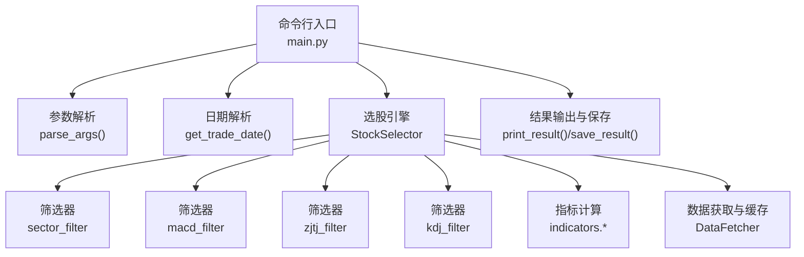
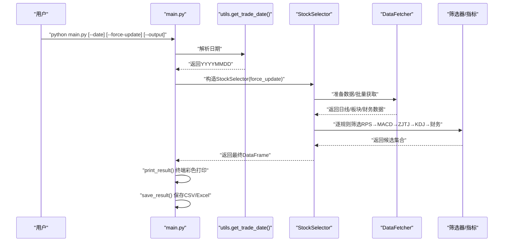
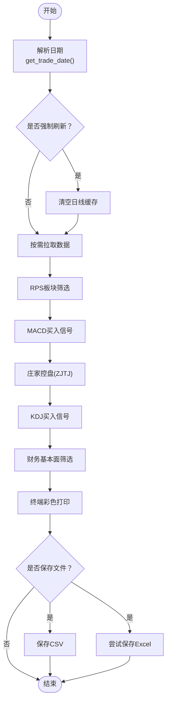
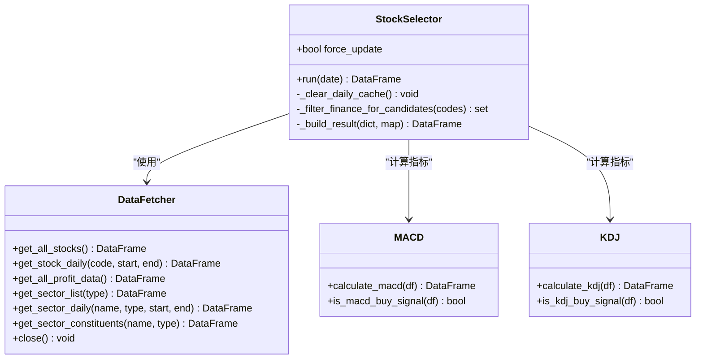
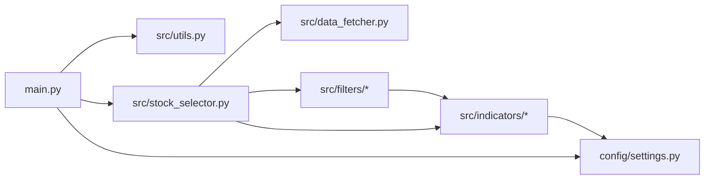

# 命令行接口使用

<cite>
**本文引用的文件**
- [main.py](file://main.py)
- [config/settings.py](file://config/settings.py)
- [src/utils.py](file://src/utils.py)
- [src/stock_selector.py](file://src/stock_selector.py)
- [src/data_fetcher.py](file://src/data_fetcher.py)
- [src/filters/sector_filter.py](file://src/filters/sector_filter.py)
- [src/filters/macd_filter.py](file://src/filters/macd_filter.py)
- [src/filters/zjtj_filter.py](file://src/filters/zjtj_filter.py)
- [src/filters/kdj_filter.py](file://src/filters/kdj_filter.py)
- [src/indicators/macd.py](file://src/indicators/macd.py)
- [src/indicators/kdj.py](file://src/indicators/kdj.py)
- [requirements.txt](file://requirements.txt)
</cite>

## 目录
1. [简介](#简介)
2. [项目结构](#项目结构)
3. [核心组件](#核心组件)
4. [架构总览](#架构总览)
5. [详细组件分析](#详细组件分析)
6. [依赖分析](#依赖分析)
7. [性能考虑](#性能考虑)
8. [故障排查指南](#故障排查指南)
9. [结论](#结论)
10. [附录](#附录)

## 简介
本文件面向A股智能选股系统的命令行使用者，围绕入口脚本 main.py 的命令行参数进行系统性说明，涵盖参数功能、使用示例、参数优先级与相互影响、错误处理与异常、批量执行与自动化脚本建议，以及输出格式与结果解读方法。通过本指南，您可以快速掌握如何在不同业务场景下正确使用命令行参数，并将其集成到自动化任务中。

## 项目结构
- 入口脚本：main.py
- 配置参数：config/settings.py
- 工具函数：src/utils.py
- 选股引擎：src/stock_selector.py
- 数据获取与缓存：src/data_fetcher.py
- 筛选器与指标：src/filters/* 与 src/indicators/*

图表来源
- [main.py:29-52](file://main.py#L29-L52)
- [src/utils.py:33-53](file://src/utils.py#L33-L53)
- [src/stock_selector.py:45-185](file://src/stock_selector.py#L45-L185)
- [src/data_fetcher.py:140-164](file://src/data_fetcher.py#L140-L164)

章节来源
- [main.py:112-156](file://main.py#L112-L156)
- [config/settings.py:21-31](file://config/settings.py#L21-L31)

## 核心组件
- 命令行参数
  - --date：指定选股日期，YYYYMMDD格式；未指定时默认当天（若为周末则回退到最近工作日）
  - --force-update：强制刷新数据（忽略日线缓存），适用于需要重新拉取最新行情或修复缓存问题
  - --output：指定输出文件路径（CSV格式），未指定时使用配置的默认输出目录与命名规则
- 日期解析与回退策略
  - get_trade_date() 支持显式日期校验与默认日期回退（周末回退至周五）
- 选股流程与输出
  - StockSelector.run() 执行漏斗式五步筛选，输出到终端并保存为CSV/Excel（若安装openpyxl）

章节来源
- [main.py:29-52](file://main.py#L29-L52)
- [src/utils.py:33-53](file://src/utils.py#L33-L53)
- [src/stock_selector.py:45-185](file://src/stock_selector.py#L45-L185)
- [config/settings.py:21-26](file://config/settings.py#L21-L26)

## 架构总览
以下序列图展示了从命令行到结果输出的关键调用链：

图表来源
- [main.py:112-156](file://main.py#L112-L156)
- [src/utils.py:33-53](file://src/utils.py#L33-L53)
- [src/stock_selector.py:45-185](file://src/stock_selector.py#L45-L185)
- [src/data_fetcher.py:205-225](file://src/data_fetcher.py#L205-L225)

## 详细组件分析

### 命令行参数详解与使用示例
- --date
  - 功能：指定选股日期，YYYYMMDD格式
  - 行为：若未提供，则默认当天；若当天为周末，则自动回退到最近工作日（周五）
  - 示例：
    - 指定具体日期：python main.py --date 20250101
    - 使用默认日期（当天，若为周末则回退）：python main.py
- --force-update
  - 功能：强制刷新数据（忽略日线缓存）
  - 行为：启动时清空日线相关缓存表，后续从源头重新拉取数据
  - 示例：python main.py --force-update
- --output
  - 功能：指定输出文件路径（CSV格式）
  - 行为：若未指定，使用配置的默认输出目录与命名规则生成文件名
  - 示例：python main.py --output result.csv

参数优先级与相互影响
- 日期解析优先于其他步骤：--date 优先于默认日期；--force-update 与 --output 不影响日期解析
- --force-update 与数据获取阶段强关联：开启后会清空日线缓存并触发重新拉取
- --output 仅影响保存行为：即使无结果也会保存空文件，便于确认执行状态

章节来源
- [main.py:29-52](file://main.py#L29-L52)
- [src/utils.py:33-53](file://src/utils.py#L33-L53)
- [src/stock_selector.py:35-43](file://src/stock_selector.py#L35-L43)
- [config/settings.py:21-26](file://config/settings.py#L21-L26)

### 错误处理与异常情况
- 日期错误
  - 现象：--date 格式不合法
  - 处理：打印红色错误信息并退出（非零退出码）
- 网络异常
  - 现象：数据拉取过程中连接失败
  - 处理：打印红色提示并退出（非零退出码）
- 用户中断
  - 现象：Ctrl+C 中断
  - 处理：打印黄色提示并正常退出（零退出码）
- Excel导出可选依赖
  - 现象：未安装openpyxl
  - 处理：跳过Excel导出并提示

章节来源
- [main.py:117-144](file://main.py#L117-L144)
- [requirements.txt:1-5](file://requirements.txt#L1-L5)

### 输出格式与结果解读
- 终端输出
  - 日期标题、结果数量、对齐的文本表格（包含代码、名称、板块、DIF、DEA、MACD、K、D、J、控盘度）
- 文件输出
  - CSV：始终保存；文件名规则见“默认输出”
  - Excel：若安装openpyxl则同时导出xlsx；否则跳过并提示
- 默认输出
  - 输出目录：配置项 OUTPUT_PATH
  - 文件名：result_YYYYMMDD.csv

章节来源
- [main.py:55-82](file://main.py#L55-L82)
- [main.py:84-110](file://main.py#L84-L110)
- [config/settings.py:21-26](file://config/settings.py#L21-L26)

### 选股流程与参数联动
- 流程概览（漏斗式五步）
  - 步骤1：板块RPS筛选（基于概念板块）
  - 步骤2：MACD买入信号筛选
  - 步骤3：庄家控盘（ZJTJ）筛选
  - 步骤4：KDJ买入信号筛选
  - 步骤5：财务基本面筛选（净利润连续增长与复合增速）
- 关键参数影响点
  - --date：决定历史数据范围与板块/个股行情区间
  - --force-update：影响日线缓存与重新拉取
  - --output：影响最终文件保存位置

图表来源
- [src/stock_selector.py:45-185](file://src/stock_selector.py#L45-L185)
- [src/utils.py:33-53](file://src/utils.py#L33-L53)
- [main.py:112-156](file://main.py#L112-L156)

章节来源
- [src/stock_selector.py:45-185](file://src/stock_selector.py#L45-L185)
- [src/filters/sector_filter.py:11-73](file://src/filters/sector_filter.py#L11-L73)
- [src/filters/macd_filter.py:9-46](file://src/filters/macd_filter.py#L9-L46)
- [src/filters/zjtj_filter.py:9-46](file://src/filters/zjtj_filter.py#L9-L46)
- [src/filters/kdj_filter.py:9-51](file://src/filters/kdj_filter.py#L9-L51)
- [src/indicators/macd.py:13-33](file://src/indicators/macd.py#L13-L33)
- [src/indicators/kdj.py:45-76](file://src/indicators/kdj.py#L45-L76)

### 类与模块关系（代码级）

图表来源
- [src/stock_selector.py:21-310](file://src/stock_selector.py#L21-L310)
- [src/data_fetcher.py:140-608](file://src/data_fetcher.py#L140-L608)
- [src/indicators/macd.py:13-67](file://src/indicators/macd.py#L13-L67)
- [src/indicators/kdj.py:45-110](file://src/indicators/kdj.py#L45-L110)

## 依赖分析
- 外部依赖
  - akshare：行情与财务数据源
  - pandas/numpy：数据处理
  - openpyxl：Excel导出（可选）
  - colorama：终端彩色输出
- 内部模块耦合
  - main.py 依赖 utils、stock_selector、config.settings
  - stock_selector 依赖 data_fetcher、filters、indicators、config.settings
  - filters 依赖 indicators 与 data_fetcher
  - indicators 依赖 config.settings

图表来源
- [main.py:18-22](file://main.py#L18-L22)
- [src/stock_selector.py:4-16](file://src/stock_selector.py#L4-L16)
- [src/filters/__init__.py:1-6](file://src/filters/__init__.py#L1-L6)
- [src/indicators/__init__.py:1-5](file://src/indicators/__init__.py#L1-L5)

章节来源
- [requirements.txt:1-5](file://requirements.txt#L1-L5)
- [main.py:18-22](file://main.py#L18-L22)
- [src/stock_selector.py:4-16](file://src/stock_selector.py#L4-L16)

## 性能考虑
- 缓存与增量更新
  - DataFetcher 对日线、板块、财务数据均采用SQLite缓存；支持增量更新，减少重复拉取
- 请求重试与节流
  - 统一的重试与延迟机制，降低被限频风险
- 选股流程优化
  - 漏斗式筛选逐步缩小候选集，提升整体效率
- 输出性能
  - CSV导出为必选项；Excel导出依赖openpyxl，缺失时会跳过并提示

章节来源
- [src/data_fetcher.py:263-345](file://src/data_fetcher.py#L263-L345)
- [src/data_fetcher.py:478-555](file://src/data_fetcher.py#L478-L555)
- [src/stock_selector.py:191-256](file://src/stock_selector.py#L191-L256)

## 故障排查指南
- 日期格式错误
  - 现象：提示日期格式错误并退出
  - 处理：确保使用YYYYMMDD格式
- 网络连接异常
  - 现象：网络错误提示并退出
  - 处理：检查网络连通性后重试
- 用户中断
  - 现象：Ctrl+C后优雅退出
  - 处理：无需额外操作
- Excel导出失败
  - 现象：提示openpyxl未安装或导出失败
  - 处理：安装openpyxl或忽略Excel导出

章节来源
- [main.py:117-144](file://main.py#L117-L144)

## 结论
通过合理使用 --date、--force-update、--output 三个参数，您可以灵活地控制选股日期、数据刷新策略与输出位置。结合漏斗式筛选流程与缓存机制，系统能够在保证准确性的同时兼顾性能。建议在自动化脚本中固定日期、启用强制刷新以确保数据新鲜度，并根据需要指定输出路径以便统一归档。

## 附录

### 常用命令组合示例
- 默认执行（当天，若为周末回退）
  - python main.py
- 指定日期执行
  - python main.py --date 20250101
- 强制刷新数据
  - python main.py --force-update
- 指定输出路径
  - python main.py --output result.csv
- 组合使用
  - python main.py --date 20250101 --force-update --output result.csv

### 自动化脚本编写建议
- 固定日期：在定时任务中明确指定 --date，避免周末回退带来的不确定性
- 强制刷新：在需要修复缓存或验证数据时启用 --force-update
- 输出归档：通过 --output 指定稳定路径，便于后续分析与比对
- 错误处理：捕获非零退出码并记录日志，必要时重试
- 依赖管理：确保 openpyxl 可用以获得Excel输出能力

章节来源
- [main.py:112-156](file://main.py#L112-L156)
- [config/settings.py:21-26](file://config/settings.py#L21-L26)