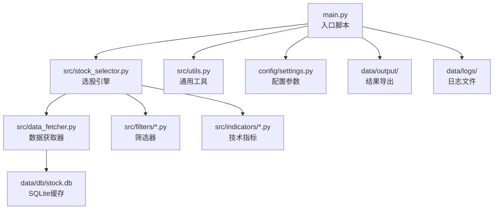
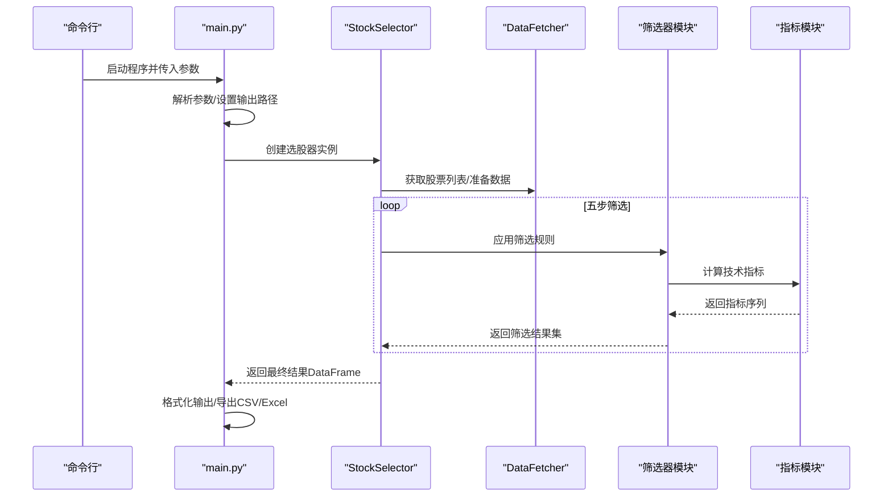
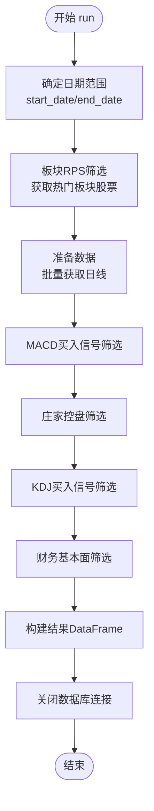
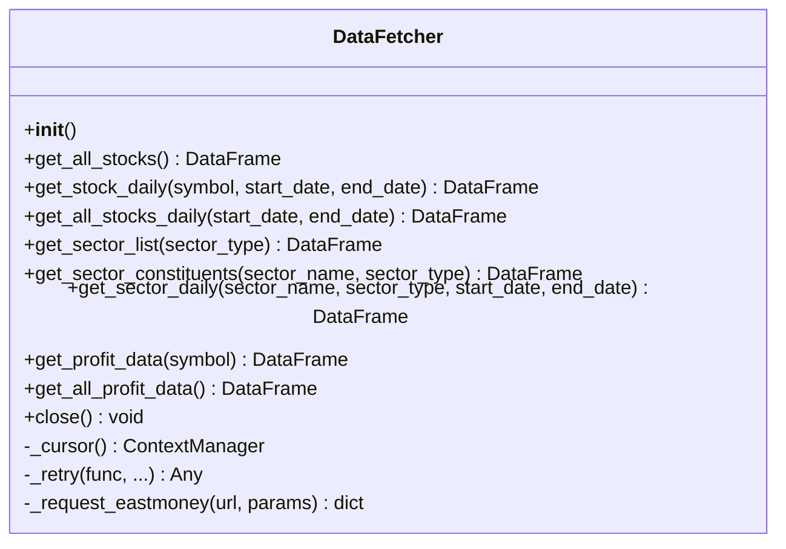
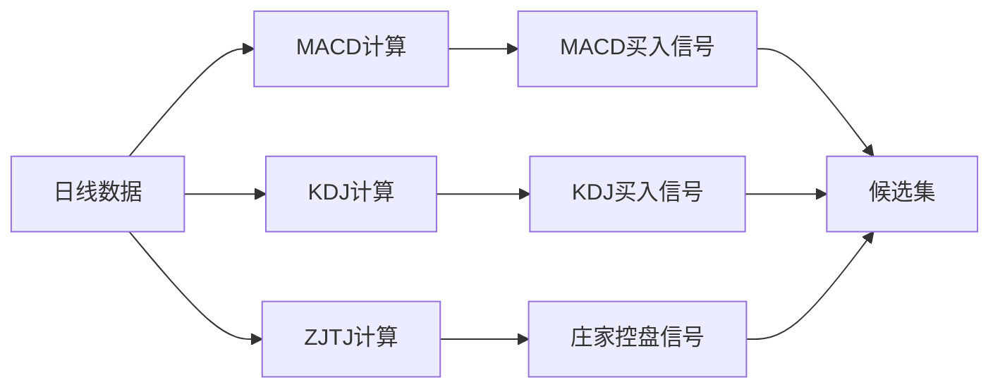
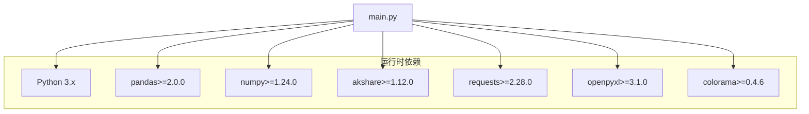

# 代码贡献指南

<cite>
**本文档引用的文件**
- [main.py](file://main.py)
- [requirements.txt](file://requirements.txt)
- [config/settings.py](file://config/settings.py)
- [src/utils.py](file://src/utils.py)
- [src/stock_selector.py](file://src/stock_selector.py)
- [src/data_fetcher.py](file://src/data_fetcher.py)
- [src/filters/macd_filter.py](file://src/filters/macd_filter.py)
- [src/indicators/macd.py](file://src/indicators/macd.py)
- [src/filters/finance_filter.py](file://src/filters/finance_filter.py)
- [src/indicators/kdj.py](file://src/indicators/kdj.py)
- [src/indicators/zjtj.py](file://src/indicators/zjtj.py)
- [src/filters/zjtj_filter.py](file://src/filters/zjtj_filter.py)
- [src/filters/kdj_filter.py](file://src/filters/kdj_filter.py)
- [手工选股.md](file://手工选股.md)
</cite>

## 目录
1. [简介](#简介)
2. [项目结构](#项目结构)
3. [核心组件](#核心组件)
4. [架构概览](#架构概览)
5. [详细组件分析](#详细组件分析)
6. [依赖分析](#依赖分析)
7. [性能考虑](#性能考虑)
8. [故障排除指南](#故障排除指南)
9. [结论](#结论)
10. [附录](#附录)

## 简介
本指南面向希望参与本A股智能选股系统的开发者，涵盖代码规范、版本控制与分支管理、代码审查流程、文档编写规范、开发环境搭建与依赖管理、问题报告与功能请求流程，以及贡献者协议与许可证信息。项目采用Python 3.x，主要依赖pandas、numpy、akshare等库，通过命令行入口提供选股功能，并支持CSV/Excel导出。

## 项目结构
项目采用按功能域划分的模块化组织方式：
- 根目录提供入口脚本与依赖声明
- config目录集中管理配置参数
- src目录包含核心业务逻辑：数据获取、指标计算、筛选器、选股引擎与工具函数
- data目录存放数据库、输出与日志文件
- 文档与示例位于仓库根目录

**图表来源**
- [main.py:1-161](file://main.py#L1-L161)
- [src/stock_selector.py:1-310](file://src/stock_selector.py#L1-L310)
- [src/data_fetcher.py:1-774](file://src/data_fetcher.py#L1-L774)
- [config/settings.py:1-31](file://config/settings.py#L1-L31)

**章节来源**
- [main.py:1-161](file://main.py#L1-L161)
- [config/settings.py:1-31](file://config/settings.py#L1-L31)

## 核心组件
- 入口脚本：解析命令行参数、调用选股引擎、格式化输出与导出结果
- 选股引擎：串联五个筛选步骤（板块RPS、MACD、庄家控盘、KDJ、财务基本面）
- 数据获取器：封装akshare接口，提供股票列表、日线、板块、利润等数据，并以SQLite缓存提升性能
- 技术指标模块：实现MACD、KDJ、庄家控盘等指标计算与买卖信号判定
- 筛选器模块：基于指标与财务数据进行过滤
- 通用工具：日志配置、交易日计算、结果表格格式化

**章节来源**
- [main.py:29-161](file://main.py#L29-L161)
- [src/stock_selector.py:21-310](file://src/stock_selector.py#L21-L310)
- [src/data_fetcher.py:143-774](file://src/data_fetcher.py#L143-L774)
- [src/utils.py:1-134](file://src/utils.py#L1-L134)

## 架构概览
系统采用“漏斗式”多阶段筛选架构，从板块热度到技术信号再到财务质量，逐步缩小候选池。数据层通过SQLite缓存减少对外部API的依赖，提高重复运行效率。

**图表来源**
- [main.py:112-157](file://main.py#L112-L157)
- [src/stock_selector.py:45-185](file://src/stock_selector.py#L45-L185)
- [src/filters/macd_filter.py:9-46](file://src/filters/macd_filter.py#L9-L46)
- [src/indicators/macd.py:13-67](file://src/indicators/macd.py#L13-L67)

## 详细组件分析

### 选股引擎（StockSelector）
- 职责：协调数据获取、指标计算与多阶段筛选，生成最终结果
- 关键流程：确定日期范围、板块RPS筛选、日线数据准备、MACD/KDJ/ZJTJ信号筛选、财务基本面筛选、汇总结果
- 性能优化：仅对候选股票批量获取日线数据，避免全市场扫描；财务筛选仅针对候选集

**图表来源**
- [src/stock_selector.py:45-185](file://src/stock_selector.py#L45-L185)

**章节来源**
- [src/stock_selector.py:21-310](file://src/stock_selector.py#L21-L310)

### 数据获取器（DataFetcher）
- 职责：封装akshare接口，提供股票列表、日线、板块、利润等数据；维护SQLite缓存表
- 缓存策略：按股票/板块/年份维度存储，支持增量更新与删除重建
- 错误处理：统一重试与延迟机制，业务错误与网络错误分别处理

**图表来源**
- [src/data_fetcher.py:143-774](file://src/data_fetcher.py#L143-L774)

**章节来源**
- [src/data_fetcher.py:143-774](file://src/data_fetcher.py#L143-L774)

### 技术指标与筛选器
- 指标模块：MACD、KDJ、庄家控盘（ZJTJ）严格按通达信公式实现，提供计算与信号判定
- 筛选器模块：基于指标与财务数据进行过滤，返回股票代码集合

**图表来源**
- [src/indicators/macd.py:13-67](file://src/indicators/macd.py#L13-L67)
- [src/indicators/kdj.py:45-86](file://src/indicators/kdj.py#L45-L86)
- [src/indicators/zjtj.py:13-47](file://src/indicators/zjtj.py#L13-L47)
- [src/filters/macd_filter.py:9-46](file://src/filters/macd_filter.py#L9-L46)
- [src/filters/kdj_filter.py](file://src/filters/kdj_filter.py)
- [src/filters/zjtj_filter.py:9-45](file://src/filters/zjtj_filter.py#L9-L45)

**章节来源**
- [src/indicators/macd.py:13-67](file://src/indicators/macd.py#L13-L67)
- [src/indicators/kdj.py:45-86](file://src/indicators/kdj.py#L45-L86)
- [src/indicators/zjtj.py:13-47](file://src/indicators/zjtj.py#L13-L47)
- [src/filters/macd_filter.py:9-46](file://src/filters/macd_filter.py#L9-L46)
- [src/filters/zjtj_filter.py:9-45](file://src/filters/zjtj_filter.py#L9-L45)
- [src/filters/finance_filter.py:10-91](file://src/filters/finance_filter.py#L10-L91)

### 通用工具
- 日志配置：控制台与文件双通道，支持INFO/DEBUG级别
- 交易日计算：自动回退至最近工作日（周末）
- 结果表格格式化：中文宽度处理与对齐

**章节来源**
- [src/utils.py:9-134](file://src/utils.py#L9-L134)

## 依赖分析
- Python版本：建议使用Python 3.8+（具体以requirements为准）
- 主要依赖：pandas、numpy、akshare、requests、openpyxl、colorama
- 依赖管理：通过requirements.txt统一声明，推荐使用虚拟环境隔离

**图表来源**
- [requirements.txt:1-6](file://requirements.txt#L1-L6)
- [main.py:18-22](file://main.py#L18-L22)

**章节来源**
- [requirements.txt:1-6](file://requirements.txt#L1-L6)

## 性能考虑
- 数据缓存：SQLite缓存股票列表、日线、板块、利润数据，支持增量更新与删除重建
- 请求节流：统一重试与延迟机制，避免API限流
- 选择性计算：仅对候选股票计算日线与指标，减少计算量
- I/O优化：批量写入与查询，避免频繁小事务

**章节来源**
- [src/data_fetcher.py:182-197](file://src/data_fetcher.py#L182-L197)
- [src/stock_selector.py:100-125](file://src/stock_selector.py#L100-L125)

## 故障排除指南
- 网络异常：检查网络连接与代理设置，确认API可访问
- 日期格式错误：确保传入YYYYMMDD格式，或留空使用默认交易日
- Excel导出失败：确认已安装openpyxl，或忽略此步骤
- 数据为空：确认缓存是否有效，必要时使用强制刷新模式

**章节来源**
- [main.py:117-144](file://main.py#L117-L144)
- [src/utils.py:33-53](file://src/utils.py#L33-L53)

## 结论
本项目提供了清晰的模块化架构与完善的缓存机制，便于扩展与维护。贡献者应遵循本文档的代码规范与流程，确保新增功能与修复符合整体设计原则。

## 附录

### 代码规范与编码标准
- Python风格
  - 使用4空格缩进，避免混用制表符
  - 行宽不超过100字符，合理换行
  - 函数与类之间使用两个空行分隔，方法之间使用一个空行
  - 导入按标准库、第三方库、项目内模块顺序分组
- 注释规范
  - 模块顶部提供简要描述与用途
  - 公开函数/类提供docstring，说明参数、返回值与异常
  - 复杂逻辑处添加行内注释，解释关键步骤
- 命名约定
  - 模块与包：全小写，必要时以下划线分隔
  - 类：PascalCase
  - 函数与变量：snake_case
  - 常量：UPPER_CASE
- 错误处理
  - 明确捕获特定异常，避免裸except
  - 记录关键错误信息并返回合理默认值或空结果

### 版本控制系统与分支管理
- 分支策略
  - main：稳定发布分支
  - develop：开发集成分支
  - feature/<功能名>：新功能开发
  - hotfix/<问题号>：紧急修复
- 提交信息
  - 格式：类型(作用域): 描述
  - 示例：feat(filters): 新增KDJ筛选器
- 合并与冲突解决
  - 合并前确保通过本地测试
  - 使用squash合并保持提交历史整洁

### 代码审查标准与流程
- 提交要求
  - 包含单元测试或集成测试
  - 更新相关文档与README变更说明
  - 通过静态检查与格式化工具
- 审查要点
  - 代码可读性与一致性
  - 性能影响与资源使用
  - 错误处理与边界条件
  - 日志与调试信息完整性
- Pull Request模板
  - 描述变更内容与动机
  - 列举测试用例与验证结果
  - 指明潜在风险与回滚方案

### 文档编写规范与更新要求
- 文档类型
  - 功能文档：描述模块职责与使用方式
  - 接口文档：参数、返回值、异常与示例
  - 架构文档：系统设计与数据流图
- 更新要求
  - 重大变更同步更新README与相关文档
  - 示例代码随功能更新而更新

### 开发环境搭建与依赖管理
- 环境准备
  - Python 3.8+
  - 创建虚拟环境并激活
- 依赖安装
  - pip install -r requirements.txt
- 运行入口
  - python main.py [--date YYYYMMDD] [--force-update] [--output path]

**章节来源**
- [requirements.txt:1-6](file://requirements.txt#L1-6)
- [main.py:29-52](file://main.py#L29-L52)

### 问题报告与功能请求流程
- 问题报告
  - 提供环境信息（Python版本、操作系统）
  - 复现步骤与预期/实际结果
  - 相关日志与错误堆栈
- 功能请求
  - 说明背景与收益
  - 提供参考实现思路或伪代码
  - 评估对现有功能的影响

### 贡献者协议与许可证
- 本项目未包含明确的CLA或额外许可证条款声明
- 默认遵循仓库根目录下的许可证（若存在）

**章节来源**
- [手工选股.md:1-2](file://手工选股.md#L1-L2)