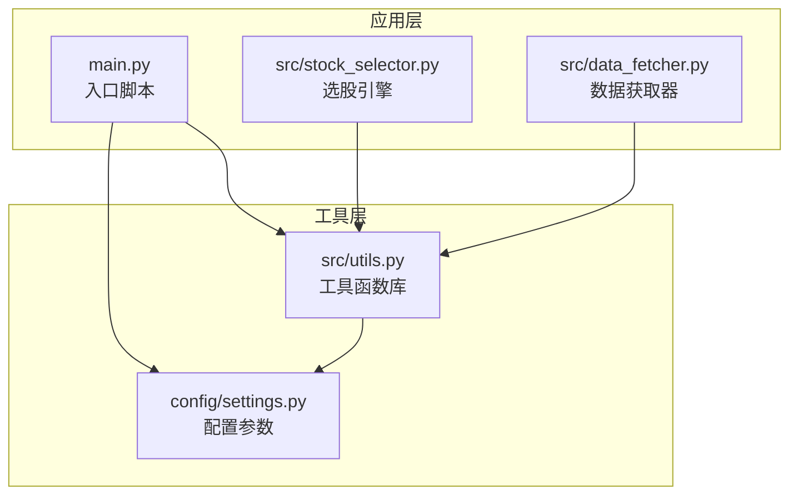
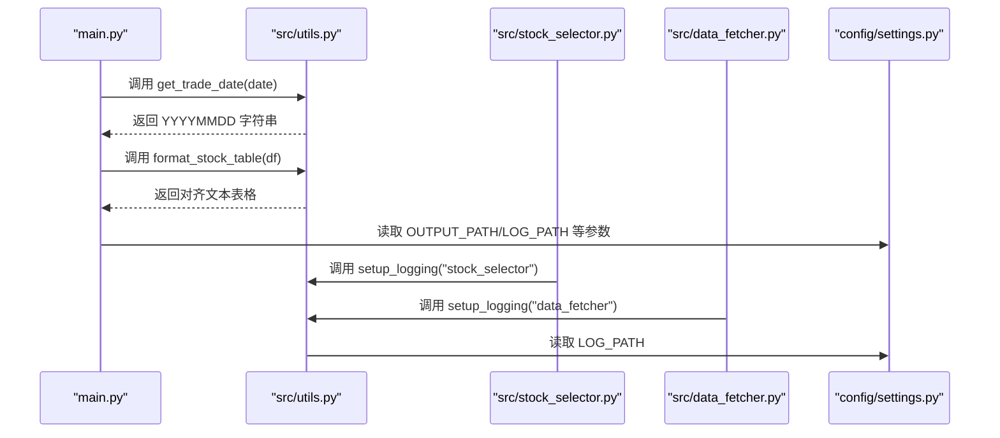
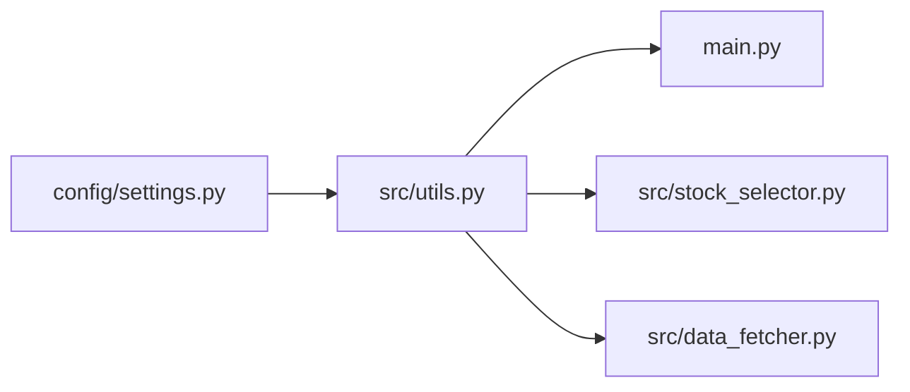

# 工具函数库

<cite>
**本文引用的文件**
- [src/utils.py](file://src/utils.py)
- [config/settings.py](file://config/settings.py)
- [main.py](file://main.py)
- [src/data_fetcher.py](file://src/data_fetcher.py)
- [src/stock_selector.py](file://src/stock_selector.py)
- [手工选股.md](file://手工选股.md)
- [需求.md](file://需求.md)
</cite>

## 目录
1. [简介](#简介)
2. [项目结构](#项目结构)
3. [核心组件](#核心组件)
4. [架构概览](#架构概览)
5. [详细组件分析](#详细组件分析)
6. [依赖分析](#依赖分析)
7. [性能考虑](#性能考虑)
8. [故障排查指南](#故障排查指南)
9. [结论](#结论)
10. [附录](#附录)

## 简介
本文件面向“工具函数库”的使用者与维护者，系统性梳理并说明以下内容：
- utils.py 提供的通用工具函数：日志配置、日期处理、结果格式化等
- 配置管理模块 settings.py 的参数与作用
- 函数使用示例与参数说明
- 设计原则与使用注意事项
- 错误处理与异常情况处理方式
- 如何扩展工具函数库以满足新需求

该工具函数库服务于 A 股智能选股系统，贯穿数据获取、指标计算、筛选与结果输出的全流程。

## 项目结构
工具函数库位于 src/utils.py，配置参数位于 config/settings.py，入口脚本 main.py 使用这些工具函数完成日期解析与结果表格格式化，其他模块如数据获取与选股引擎也通过导入工具函数实现日志配置与日期处理。

图表来源
- [main.py:112-156](file://main.py#L112-L156)
- [src/stock_selector.py:16-67](file://src/stock_selector.py#L16-L67)
- [src/data_fetcher.py:12-15](file://src/data_fetcher.py#L12-L15)
- [src/utils.py:9-30](file://src/utils.py#L9-L30)
- [config/settings.py:21-31](file://config/settings.py#L21-L31)

章节来源
- [main.py:112-156](file://main.py#L112-L156)
- [src/stock_selector.py:16-67](file://src/stock_selector.py#L16-L67)
- [src/data_fetcher.py:12-15](file://src/data_fetcher.py#L12-L15)
- [src/utils.py:9-30](file://src/utils.py#L9-L30)
- [config/settings.py:21-31](file://config/settings.py#L21-L31)

## 核心组件
- 日志配置函数：提供控制台与文件双重输出的日志记录能力，支持 INFO/DEBUG 等级，便于开发调试与生产排障。
- 交易日期函数：解析或推断交易日期，自动处理周末回退，保证指标计算所需的交易日一致性。
- 结果格式化函数：将选股结果 DataFrame 格式化为对齐的文本表格，支持中文字符宽度计算与数值/文本列对齐。

章节来源
- [src/utils.py:9-30](file://src/utils.py#L9-L30)
- [src/utils.py:33-53](file://src/utils.py#L33-L53)
- [src/utils.py:56-134](file://src/utils.py#L56-L134)

## 架构概览
工具函数库与各模块的交互关系如下：

图表来源
- [main.py:117-118](file://main.py#L117-L118)
- [main.py:76-79](file://main.py#L76-L79)
- [src/stock_selector.py:16](file://src/stock_selector.py#L16)
- [src/data_fetcher.py:12-15](file://src/data_fetcher.py#L12-L15)
- [src/utils.py:6](file://src/utils.py#L6)
- [config/settings.py:26](file://config/settings.py#L26)

## 详细组件分析

### 日志配置函数 setup_logging
- 功能概述
  - 创建并返回一个命名的 Logger 实例，具备控制台与文件两种 Handler
  - 控制台 Handler 输出 INFO 级别及以上日志，文件 Handler 输出 DEBUG 级别及以上日志
  - 日志文件位于配置项 LOG_PATH 下，文件名为 {name}.log
- 关键行为
  - 自动创建日志目录（若不存在）
  - 统一的日志格式：包含时间戳、Logger 名称、级别与消息
- 使用场景
  - 各模块初始化时调用，例如数据获取器与选股引擎
- 参数与返回
  - 参数：name（可选，默认 "stock_selector"）
  - 返回：logging.Logger 实例
- 错误处理
  - 若创建目录或写入文件失败，通常由 logging 模块抛出异常；建议在调用方捕获并记录
- 性能与注意
  - 文件 IO 为顺序写入，开销较小
  - 建议在模块初始化阶段调用一次，避免重复创建多个 Logger

章节来源
- [src/utils.py:9-30](file://src/utils.py#L9-L30)
- [src/data_fetcher.py:12-15](file://src/data_fetcher.py#L12-L15)
- [src/stock_selector.py:16](file://src/stock_selector.py#L16)
- [config/settings.py:26](file://config/settings.py#L26)

### 交易日期函数 get_trade_date
- 功能概述
  - 解析传入的日期字符串（YYYYMMDD），或根据当前日期推断交易日
  - 若当天为周末，则回退到最近的周五
  - 不做节假日判断，仅处理周末
- 参数与返回
  - 参数：date_str（可选，YYYYMMDD 字符串）
  - 返回：YYYYMMDD 字符串
- 错误处理
  - 当传入日期格式不合法时，抛出 ValueError，并提示使用 YYYYMMDD 格式
- 使用场景
  - 作为选股流程的起点，确保指标计算所需的历史数据覆盖足够交易日
- 性能与注意
  - 时间复杂度 O(1)，开销极小
  - 建议在入口处统一调用，避免多处重复逻辑

章节来源
- [src/utils.py:33-53](file://src/utils.py#L33-L53)
- [main.py:117-121](file://main.py#L117-L121)
- [src/stock_selector.py:66-71](file://src/stock_selector.py#L66-L71)

### 结果格式化函数 format_stock_table
- 功能概述
  - 将包含股票代码、名称、板块、技术指标等列的 DataFrame 转换为对齐的文本表格
  - 支持中文字符宽度计算（中文字符占 2 个宽度单位）
  - 数值列右对齐，文本列左对齐
- 期望列
  - code、name、sector、dif、dea、macd、k、d、j、kongpan
- 参数与返回
  - 参数：df（pd.DataFrame）
  - 返回：str（对齐后的文本表格；空 DataFrame 返回空字符串）
- 错误处理
  - 对空 DataFrame 的健壮处理
  - 对缺失值（NaN）的兼容处理
- 使用场景
  - 在终端中打印选股结果，便于快速审阅
- 性能与注意
  - 对于大数据集，字符串拼接可能成为瓶颈；建议分批处理或减少列数
  - 中文宽度计算为线性复杂度，与行数成正比

章节来源
- [src/utils.py:56-134](file://src/utils.py#L56-L134)
- [main.py:76-79](file://main.py#L76-L79)

### 配置管理模块 settings.py
- 功能概述
  - 提供系统运行所需的各类配置参数，包括指标参数、数据路径、网络请求配置等
- 关键配置项
  - 指标参数：RPS_PERIOD、RPS_TOP_N、MACD_SHORT、MACD_LONG、MACD_MID、KDJ_N、KDJ_M1、KDJ_M2、PROFIT_GROWTH_YEARS、PROFIT_GROWTH_MIN
  - 数据路径：BASE_DIR、DB_PATH、OUTPUT_PATH、LOG_PATH
  - 请求配置：REQUEST_TIMEOUT、REQUEST_RETRY、REQUEST_DELAY
- 使用方式
  - 在模块内直接导入使用，如 DataFetcher 与入口脚本
- 设计原则
  - 将“可变配置”集中管理，便于维护与横向扩展
  - 路径采用相对根目录的绝对路径拼接，提升跨平台可移植性

章节来源
- [config/settings.py:3-31](file://config/settings.py#L3-L31)
- [src/data_fetcher.py:12](file://src/data_fetcher.py#L12)
- [main.py:22](file://main.py#L22)

## 依赖分析
- 模块耦合
  - utils.py 依赖 config/settings.py 中的 LOG_PATH
  - main.py 依赖 utils.py 的 get_trade_date 与 format_stock_table
  - stock_selector.py 依赖 utils.py 的 setup_logging 与 get_trade_date
  - data_fetcher.py 依赖 utils.py 的 setup_logging
- 依赖方向
  - utils.py 为底层工具库，被上层模块广泛依赖
  - settings.py 为配置中心，被工具与业务模块共同依赖
- 循环依赖
  - 未发现循环依赖；依赖方向清晰

图表来源
- [src/utils.py:6](file://src/utils.py#L6)
- [main.py:21](file://main.py#L21)
- [src/stock_selector.py:16](file://src/stock_selector.py#L16)
- [src/data_fetcher.py:12-15](file://src/data_fetcher.py#L12-L15)

章节来源
- [src/utils.py:6](file://src/utils.py#L6)
- [main.py:21](file://main.py#L21)
- [src/stock_selector.py:16](file://src/stock_selector.py#L16)
- [src/data_fetcher.py:12-15](file://src/data_fetcher.py#L12-L15)

## 性能考虑
- 日志配置
  - 控制台与文件双通道写入，建议在生产环境降低文件 Handler 级别或频率，避免磁盘 IO 压力
- 日期处理
  - get_trade_date 为常数时间操作，影响可忽略
- 结果格式化
  - format_stock_table 对中文宽度的计算与字符串拼接为 O(n*m)（n 行，m 列），建议在大数据量时考虑分页或减少列数
- 配置读取
  - settings.py 为一次性导入，开销可忽略

## 故障排查指南
- 日期格式错误
  - 现象：调用 get_trade_date 抛出 ValueError
  - 排查：确认传入字符串是否为 YYYYMMDD 格式
  - 处理：在入口处捕获并提示用户修正
- 日志文件无法写入
  - 现象：setup_logging 后日志未落盘
  - 排查：检查 LOG_PATH 目录权限与磁盘空间
  - 处理：在调用方增加 try-except 并记录异常
- 结果表格为空
  - 现象：format_stock_table 返回空字符串
  - 排查：确认传入 DataFrame 非空且包含期望列
  - 处理：在调用前进行空值检查
- 网络请求失败
  - 现象：DataFetcher 内部重试多次后仍失败
  - 排查：检查 REQUEST_TIMEOUT、REQUEST_RETRY、REQUEST_DELAY 设置与网络状态
  - 处理：适当增大重试次数与延时，或在网络异常时提示用户

章节来源
- [src/utils.py:42-45](file://src/utils.py#L42-L45)
- [src/data_fetcher.py:182-195](file://src/data_fetcher.py#L182-L195)
- [main.py:95-109](file://main.py#L95-L109)

## 结论
工具函数库以简洁、稳定为核心设计原则，提供了日志、日期与结果格式化的通用能力。通过集中配置管理与清晰的模块边界，使得上层业务模块能够专注于业务逻辑，同时具备良好的可维护性与扩展性。建议在后续迭代中：
- 增加更丰富的日志级别与上下文字段
- 优化结果格式化函数的大数据量处理策略
- 将常用配置项抽象为可动态加载的配置文件，支持热更新

## 附录

### 函数使用示例与参数说明
- 日志配置
  - 示例：在模块初始化时调用 setup_logging("your_module_name")
  - 参数：name（可选），默认 "stock_selector"
  - 返回：logging.Logger 实例
- 交易日期
  - 示例：get_trade_date("20250101") 或 get_trade_date()
  - 参数：date_str（可选，YYYYMMDD）
  - 返回：YYYYMMDD 字符串
- 结果格式化
  - 示例：format_stock_table(df)
  - 参数：df（pd.DataFrame，包含期望列）
  - 返回：对齐的文本表格字符串

章节来源
- [src/utils.py:9-30](file://src/utils.py#L9-L30)
- [src/utils.py:33-53](file://src/utils.py#L33-L53)
- [src/utils.py:56-134](file://src/utils.py#L56-L134)
- [main.py:76-79](file://main.py#L76-L79)

### 设计原则与使用注意事项
- 设计原则
  - 单一职责：每个函数聚焦一个明确任务
  - 可测试性：函数无副作用或副作用可控
  - 可维护性：配置集中、依赖清晰
- 使用注意事项
  - 日期处理需统一入口，避免多处重复逻辑
  - 日志应分级输出，避免过度冗余
  - 结果格式化前先校验 DataFrame 的列与非空性

### 扩展工具函数库的建议
- 新增日志工具
  - 增加带上下文的结构化日志函数，便于链路追踪
- 新增日期工具
  - 增加节假日判断与交易日历查询接口
- 新增格式化工具
  - 支持 HTML/Markdown 表格导出，适配不同展示场景
- 配置扩展
  - 将部分参数改为可配置文件加载，支持运行时调整