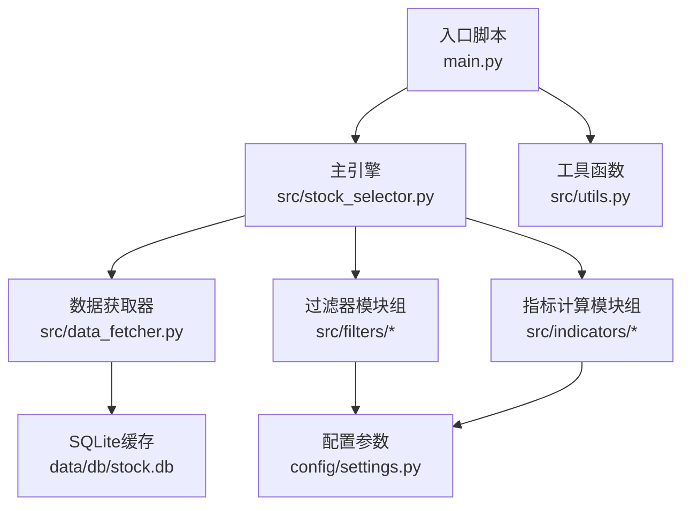
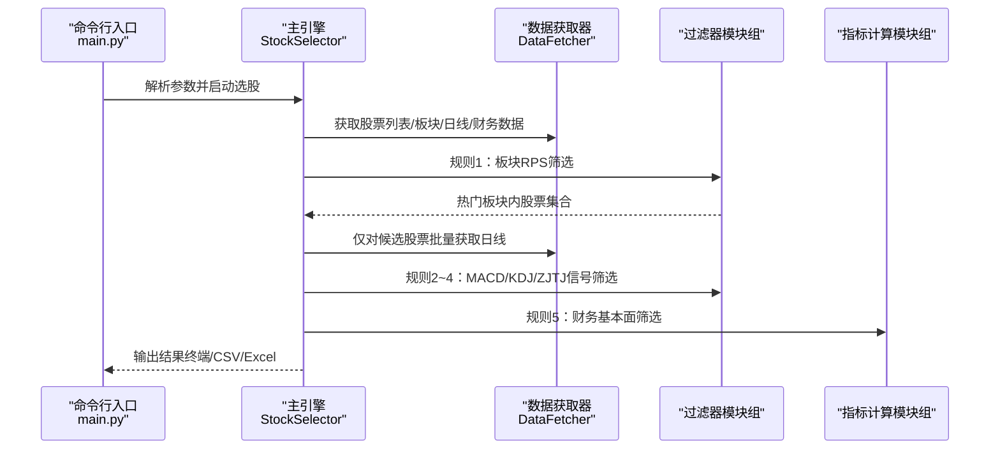
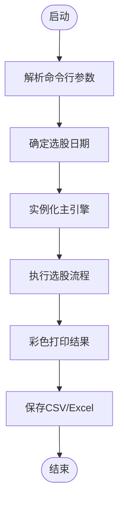
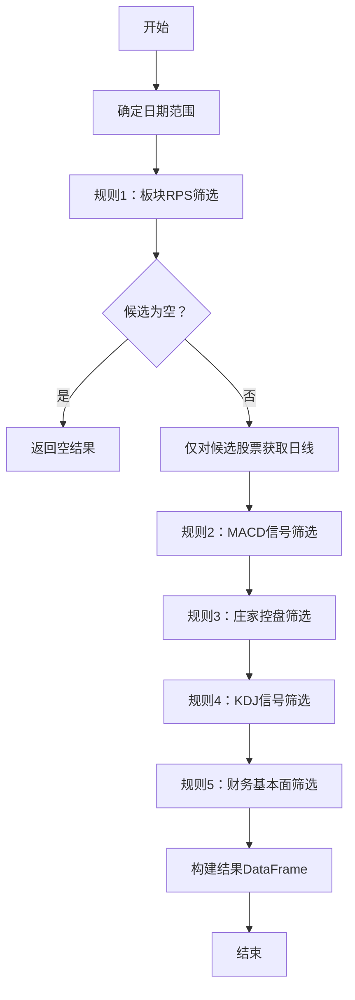
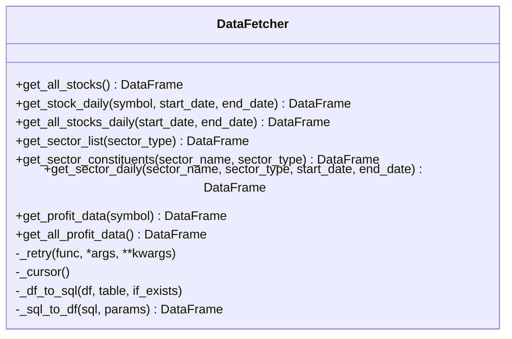
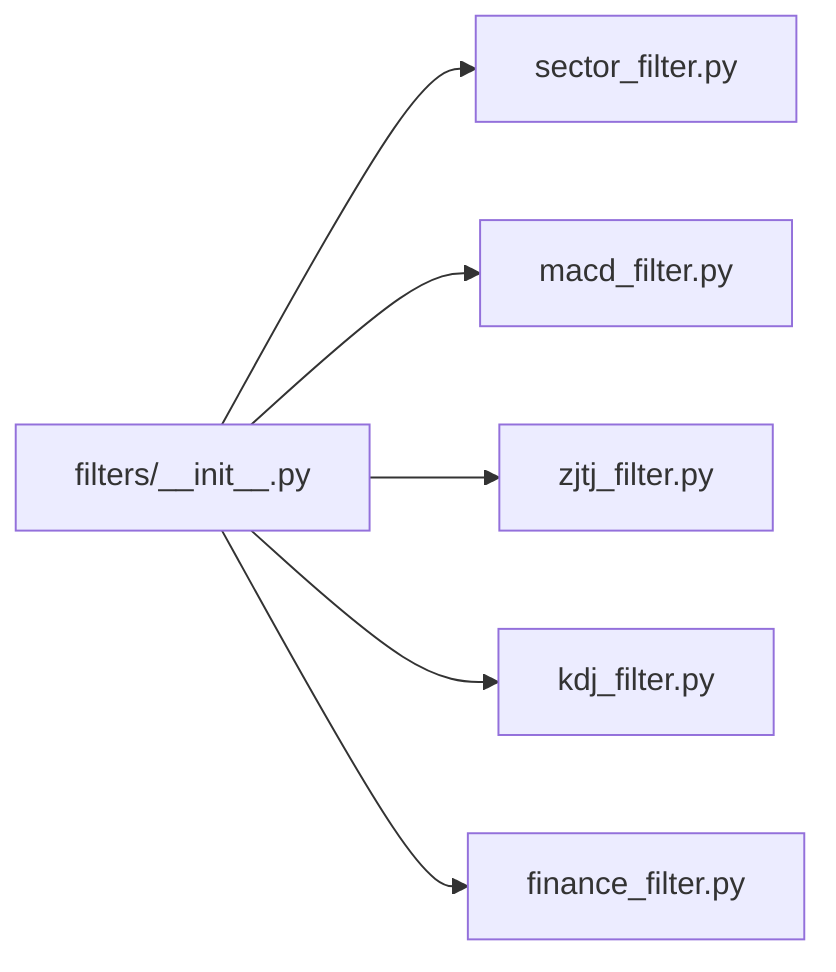
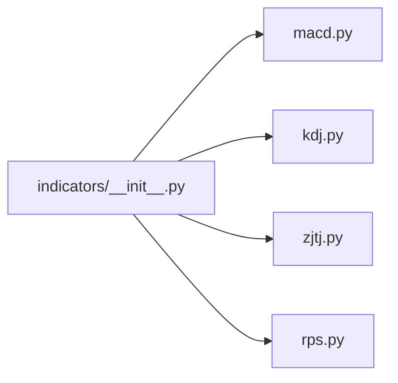
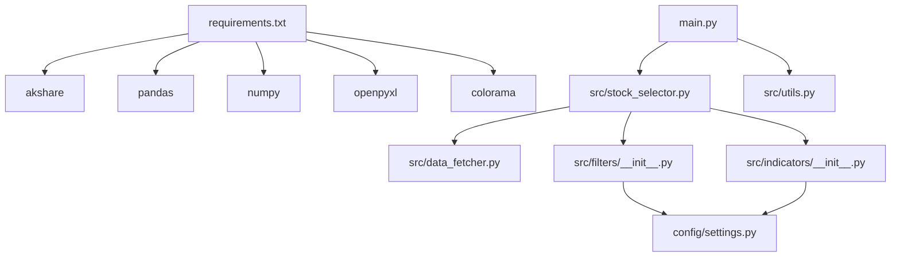

# 开发者指南

<cite>
**本文引用的文件**
- [main.py](file://main.py)
- [stock_selector.py](file://src/stock_selector.py)
- [data_fetcher.py](file://src/data_fetcher.py)
- [utils.py](file://src/utils.py)
- [filters/__init__.py](file://src/filters/__init__.py)
- [filters/finance_filter.py](file://src/filters/finance_filter.py)
- [filters/kdj_filter.py](file://src/filters/kdj_filter.py)
- [filters/macd_filter.py](file://src/filters/macd_filter.py)
- [filters/sector_filter.py](file://src/filters/sector_filter.py)
- [filters/zjtj_filter.py](file://src/filters/zjtj_filter.py)
- [indicators/__init__.py](file://src/indicators/__init__.py)
- [indicators/macd.py](file://src/indicators/macd.py)
- [indicators/kdj.py](file://src/indicators/kdj.py)
- [indicators/rps.py](file://src/indicators/rps.py)
- [indicators/zjtj.py](file://src/indicators/zjtj.py)
- [settings.py](file://config/settings.py)
- [requirements.txt](file://requirements.txt)
</cite>

## 目录
1. [简介](#简介)
2. [项目结构](#项目结构)
3. [核心组件](#核心组件)
4. [架构总览](#架构总览)
5. [详细组件分析](#详细组件分析)
6. [依赖分析](#依赖分析)
7. [性能考虑](#性能考虑)
8. [故障排查指南](#故障排查指南)
9. [结论](#结论)
10. [附录](#附录)

## 简介
本指南面向A股智能选股系统的开发者，目标是帮助你快速理解系统架构、掌握代码规范、搭建开发与调试环境、扩展过滤器与指标模块、正确使用插件式模块组织方式、编写测试与单元测试、遵循版本控制与发布流程、以及贡献与代码评审的最佳实践。同时提供工具函数库的使用方法与扩展建议。

## 项目结构
项目采用“功能域+模块化”的组织方式：
- config：集中存放全局配置参数
- src：核心业务代码
  - filters：过滤器模块组（规则1~5）
  - indicators：指标计算模块组（MACD/KDJ/ZJTJ/RPS等）
  - data_fetcher.py：数据获取与SQLite缓存
  - stock_selector.py：主引擎（漏斗式五步筛选）
  - utils.py：通用工具函数
- data：输出、日志、数据库缓存目录
- requirements.txt：依赖清单
- main.py：命令行入口

图表来源
- [main.py:112-156](file://main.py#L112-L156)
- [stock_selector.py:45-185](file://src/stock_selector.py#L45-L185)
- [data_fetcher.py:140-150](file://src/data_fetcher.py#L140-L150)
- [filters/__init__.py:1-6](file://src/filters/__init__.py#L1-L6)
- [indicators/__init__.py:1-5](file://src/indicators/__init__.py#L1-L5)

章节来源
- [main.py:112-156](file://main.py#L112-L156)
- [stock_selector.py:45-185](file://src/stock_selector.py#L45-L185)
- [data_fetcher.py:140-150](file://src/data_fetcher.py#L140-L150)
- [filters/__init__.py:1-6](file://src/filters/__init__.py#L1-L6)
- [indicators/__init__.py:1-5](file://src/indicators/__init__.py#L1-L5)

## 核心组件
- 入口脚本：负责命令行参数解析、日期校验、调用主引擎、结果打印与持久化
- 主引擎（StockSelector）：串联过滤器与指标计算，执行漏斗式五步筛选
- 数据获取器（DataFetcher）：封装AKShare接口，提供股票、板块、财务等数据，并以SQLite缓存提升性能
- 过滤器模块组：规则1~5的实现，分别对应板块RPS、MACD、庄家控盘、KDJ、财务基本面
- 指标计算模块组：MACD、KDJ、ZJTJ、RPS等指标的计算与信号判定
- 工具函数库：日志、日期、表格格式化等通用能力

章节来源
- [main.py:112-156](file://main.py#L112-L156)
- [stock_selector.py:21-185](file://src/stock_selector.py#L21-L185)
- [data_fetcher.py:140-608](file://src/data_fetcher.py#L140-L608)
- [utils.py:9-134](file://src/utils.py#L9-L134)

## 架构总览
系统采用“入口脚本 → 主引擎 → 过滤器/指标 → 数据获取器 → SQLite缓存”的分层架构。主引擎通过组合多个过滤器形成漏斗式筛选流程，每个过滤器独立负责特定维度的筛选，指标模块提供信号判定能力。

图表来源
- [main.py:112-156](file://main.py#L112-L156)
- [stock_selector.py:45-185](file://src/stock_selector.py#L45-L185)
- [filters/sector_filter.py:11-73](file://src/filters/sector_filter.py#L11-L73)
- [filters/macd_filter.py:9-46](file://src/filters/macd_filter.py#L9-L46)
- [filters/kdj_filter.py:9-51](file://src/filters/kdj_filter.py#L9-L51)
- [filters/zjtj_filter.py:9-46](file://src/filters/zjtj_filter.py#L9-L46)
- [filters/finance_filter.py:10-91](file://src/filters/finance_filter.py#L10-L91)
- [indicators/macd.py:13-67](file://src/indicators/macd.py#L13-L67)
- [indicators/kdj.py:45-110](file://src/indicators/kdj.py#L45-L110)
- [indicators/zjtj.py:13-57](file://src/indicators/zjtj.py#L13-L57)

## 详细组件分析

### 入口脚本（main.py）
- 功能要点
  - 命令行参数解析：日期、强制刷新、输出路径
  - 日期校验与交易日回退逻辑
  - 调用主引擎执行选股，彩色打印结果，导出CSV与可选Excel
- 关键流程
  - 参数解析 → 日期确定 → 实例化主引擎 → 执行选股 → 打印/保存结果

图表来源
- [main.py:29-52](file://main.py#L29-L52)
- [main.py:112-156](file://main.py#L112-L156)

章节来源
- [main.py:29-52](file://main.py#L29-L52)
- [main.py:112-156](file://main.py#L112-L156)

### 主引擎（StockSelector）
- 功能要点
  - 漏斗式五步筛选：板块RPS → MACD → 庄家控盘 → KDJ → 财务基本面
  - 仅对候选股票批量获取日线，避免全市场扫描
  - 指标计算与结果构建：在最终候选集上计算MACD/KDJ/ZJTJ，附加板块信息
  - 强制刷新模式：清空日线缓存
- 关键流程
  - 确定日期范围 → 规则1筛选 → 仅对候选股票获取日线 → 规则2~4筛选 → 规则5财务筛选 → 构建结果

图表来源
- [stock_selector.py:45-185](file://src/stock_selector.py#L45-L185)

章节来源
- [stock_selector.py:21-185](file://src/stock_selector.py#L21-L185)

### 数据获取器（DataFetcher）
- 功能要点
  - 股票列表、板块列表、板块成分股、日线、财务数据的统一获取与缓存
  - SQLite建表、写入、查询、事务与上下文管理
  - 请求重试、延迟与异常处理
- 关键点
  - 列名映射与数据清洗
  - 增量更新与缓存一致性
  - 股票代码前缀转换

图表来源
- [data_fetcher.py:140-608](file://src/data_fetcher.py#L140-L608)

章节来源
- [data_fetcher.py:140-608](file://src/data_fetcher.py#L140-L608)

### 过滤器模块组（filters）
- 组织方式
  - 通过filters/__init__.py聚合导出，便于主引擎统一导入
- 规则职责
  - 规则1：板块RPS筛选（热门板块内股票）
  - 规则2：MACD买入信号筛选
  - 规则3：庄家控盘筛选
  - 规则4：KDJ买入信号筛选
  - 规则5：财务基本面筛选（净利润连续增长与复合增速）
- 扩展机制
  - 新增过滤器：在filters目录新增模块，实现函数签名与返回约定，修改filters/__init__.py导出，主引擎中引入并串联到漏斗流程

图表来源
- [filters/__init__.py:1-6](file://src/filters/__init__.py#L1-L6)

章节来源
- [filters/__init__.py:1-6](file://src/filters/__init__.py#L1-L6)
- [filters/sector_filter.py:11-73](file://src/filters/sector_filter.py#L11-L73)
- [filters/macd_filter.py:9-46](file://src/filters/macd_filter.py#L9-L46)
- [filters/zjtj_filter.py:9-46](file://src/filters/zjtj_filter.py#L9-L46)
- [filters/kdj_filter.py:9-51](file://src/filters/kdj_filter.py#L9-L51)
- [filters/finance_filter.py:10-91](file://src/filters/finance_filter.py#L10-L91)

### 指标计算模块组（indicators）
- 组织方式
  - 通过indicators/__init__.py聚合导出，便于过滤器与主引擎按需导入
- 指标职责
  - MACD：计算DIF/DEA/MACD并提供买入信号判定
  - KDJ：计算RSV/K/D/J并提供买入信号判定
  - ZJTJ：计算VAR1与控盘度并提供“有庄控盘”信号判定
  - RPS：计算板块相对强度排名
- 扩展机制
  - 新增指标：在indicators目录新增模块，提供计算函数与信号判定函数，修改indicators/__init__.py导出，过滤器或主引擎中按需调用

图表来源
- [indicators/__init__.py:1-5](file://src/indicators/__init__.py#L1-L5)

章节来源
- [indicators/__init__.py:1-5](file://src/indicators/__init__.py#L1-L5)
- [indicators/macd.py:13-67](file://src/indicators/macd.py#L13-L67)
- [indicators/kdj.py:45-110](file://src/indicators/kdj.py#L45-L110)
- [indicators/zjtj.py:13-57](file://src/indicators/zjtj.py#L13-L57)
- [indicators/rps.py:9-61](file://src/indicators/rps.py#L9-L61)

### 工具函数库（utils）
- 日志：统一配置控制台与文件日志
- 日期：交易日回退与格式校验
- 表格：将结果DataFrame格式化为对齐的文本表格

章节来源
- [utils.py:9-134](file://src/utils.py#L9-L134)

## 依赖分析
- 外部依赖：akshare、pandas、numpy、openpyxl、colorama
- 内部依赖：入口脚本依赖主引擎与工具函数；主引擎依赖数据获取器与过滤器/指标模块；过滤器/指标模块依赖配置参数

图表来源
- [requirements.txt:1-5](file://requirements.txt#L1-L5)
- [main.py:18-22](file://main.py#L18-L22)
- [stock_selector.py:4-16](file://src/stock_selector.py#L4-L16)
- [filters/__init__.py:1-6](file://src/filters/__init__.py#L1-L6)
- [indicators/__init__.py:1-5](file://src/indicators/__init__.py#L1-L5)
- [settings.py:1-31](file://config/settings.py#L1-L31)

章节来源
- [requirements.txt:1-5](file://requirements.txt#L1-L5)
- [main.py:18-22](file://main.py#L18-L22)
- [stock_selector.py:4-16](file://src/stock_selector.py#L4-L16)
- [filters/__init__.py:1-6](file://src/filters/__init__.py#L1-L6)
- [indicators/__init__.py:1-5](file://src/indicators/__init__.py#L1-L5)
- [settings.py:1-31](file://config/settings.py#L1-L31)

## 性能考虑
- 数据缓存与增量更新：DataFetcher对股票日线、板块日线、财务数据进行缓存，支持增量拉取，减少重复请求
- 漏斗式筛选：仅对候选股票批量获取日线，降低I/O与计算压力
- 指标计算：使用向量化与滚动窗口计算，避免逐行循环
- 请求节流：统一的重试与延迟策略，避免触发接口限频
- 输出优化：CSV优先，Excel导出按需启用

章节来源
- [data_fetcher.py:263-345](file://src/data_fetcher.py#L263-L345)
- [data_fetcher.py:478-555](file://src/data_fetcher.py#L478-L555)
- [stock_selector.py:100-125](file://src/stock_selector.py#L100-L125)

## 故障排查指南
- 常见问题
  - 网络异常：入口脚本捕获ConnectionError并提示检查网络
  - 日期格式错误：工具函数对日期格式进行严格校验
  - Excel导出失败：入口脚本捕获ImportError与异常并提示
  - 数据缺失：过滤器与指标模块对空数据与NaN进行保护
- 日志定位
  - 使用统一日志配置，查看data/logs下的日志文件
- 快速恢复
  - 强制刷新模式：删除日线缓存后重新拉取
  - 分步验证：逐条规则输出数量，定位问题环节

章节来源
- [main.py:133-144](file://main.py#L133-L144)
- [utils.py:33-53](file://src/utils.py#L33-L53)
- [stock_selector.py:35-43](file://src/stock_selector.py#L35-L43)

## 结论
本系统通过清晰的模块划分与插件式导出机制，实现了可扩展的A股智能选股框架。开发者可在不破坏现有流程的前提下，通过新增过滤器与指标模块来增强策略能力；同时依托缓存与漏斗式筛选，兼顾了性能与可维护性。

## 附录

### 代码规范与开发环境
- Python版本与依赖：参考requirements.txt
- 项目根目录加入sys.path，确保模块导入稳定
- 日志：统一使用setup_logging配置，输出至控制台与文件
- 命名与注释：函数/类/模块具备清晰文档字符串，参数与返回值明确

章节来源
- [requirements.txt:1-5](file://requirements.txt#L1-L5)
- [main.py:13-16](file://main.py#L13-L16)
- [utils.py:9-30](file://src/utils.py#L9-L30)

### 过滤器模块组扩展指南
- 新增过滤器步骤
  - 在src/filters目录新增模块，实现函数：接收DataFetcher或日线字典，返回股票代码集合
  - 在src/filters/__init__.py中导出新函数
  - 在src/stock_selector.py中引入并串联到漏斗流程
  - 在config/settings.py中按需新增参数
- 示例参考
  - MACD过滤器：[filters/macd_filter.py:9-46](file://src/filters/macd_filter.py#L9-L46)
  - KDJ过滤器：[filters/kdj_filter.py:9-51](file://src/filters/kdj_filter.py#L9-L51)
  - 庄家控盘过滤器：[filters/zjtj_filter.py:9-46](file://src/filters/zjtj_filter.py#L9-L46)
  - 财务过滤器：[filters/finance_filter.py:10-91](file://src/filters/finance_filter.py#L10-L91)
  - 板块RPS过滤器：[filters/sector_filter.py:11-73](file://src/filters/sector_filter.py#L11-L73)

章节来源
- [filters/__init__.py:1-6](file://src/filters/__init__.py#L1-L6)
- [stock_selector.py:5-11](file://src/stock_selector.py#L5-L11)

### 指标计算模块扩展指南
- 新增指标步骤
  - 在src/indicators目录新增模块，提供计算函数与信号判定函数
  - 在src/indicators/__init__.py中导出
  - 在过滤器或主引擎中按需调用
- 示例参考
  - MACD指标：[indicators/macd.py:13-67](file://src/indicators/macd.py#L13-L67)
  - KDJ指标：[indicators/kdj.py:45-110](file://src/indicators/kdj.py#L45-L110)
  - ZJTJ指标：[indicators/zjtj.py:13-57](file://src/indicators/zjtj.py#L13-L57)
  - RPS指标：[indicators/rps.py:9-61](file://src/indicators/rps.py#L9-L61)

章节来源
- [indicators/__init__.py:1-5](file://src/indicators/__init__.py#L1-L5)

### 插件系统使用与最佳实践
- 插件式导出：通过__init__.py聚合导出，主引擎统一导入，便于替换与扩展
- 接口契约：过滤器函数返回股票代码集合；指标函数返回DataFrame并提供信号判定
- 配置中心：将可调参数集中在config/settings.py，避免硬编码

章节来源
- [filters/__init__.py:1-6](file://src/filters/__init__.py#L1-L6)
- [indicators/__init__.py:1-5](file://src/indicators/__init__.py#L1-L5)
- [settings.py:1-31](file://config/settings.py#L1-L31)

### 测试策略与单元测试编写指导
- 单元测试建议
  - 过滤器：构造模拟日线DataFrame，验证返回集合与边界条件
  - 指标：构造固定序列，断言计算结果与信号判定
  - 数据获取器：Mock AKShare接口，验证缓存写入与读取、增量更新逻辑
- 集成测试建议
  - 从入口脚本到主引擎到过滤器/指标的端到端流程测试
  - 异常场景：网络异常、数据缺失、日期格式错误
- 覆盖率与回归
  - 关键分支与异常路径均需覆盖
  - 版本升级前后对比指标一致性

（本节为通用测试指导，不直接分析具体文件）

### 版本控制与发布流程
- 分支策略：主分支稳定，特性分支开发，热修复分支hotfix
- 提交规范：语义化提交信息（feat/fix/docs/chore）
- 发布流程：打标签 → 自动化构建产物 → 生成变更日志
- 依赖管理：requirements.txt锁定版本，定期安全扫描

（本节为通用流程说明，不直接分析具体文件）

### 贡献指南与代码评审标准
- 提交流程：Fork仓库 → 创建特性分支 → 编写测试 → 提交PR
- 评审标准：可读性、可测试性、性能影响、兼容性、文档与日志
- 代码风格：PEP8、类型注解、短函数、单一职责

（本节为通用规范说明，不直接分析具体文件）

### 工具函数库使用与扩展
- 日志：setup_logging统一配置，便于调试与审计
- 日期：get_trade_date处理周末回退与格式校验
- 表格：format_stock_table将结果格式化为对齐文本表格
- 扩展建议：新增函数保持纯函数风格，避免全局状态

章节来源
- [utils.py:9-134](file://src/utils.py#L9-L134)