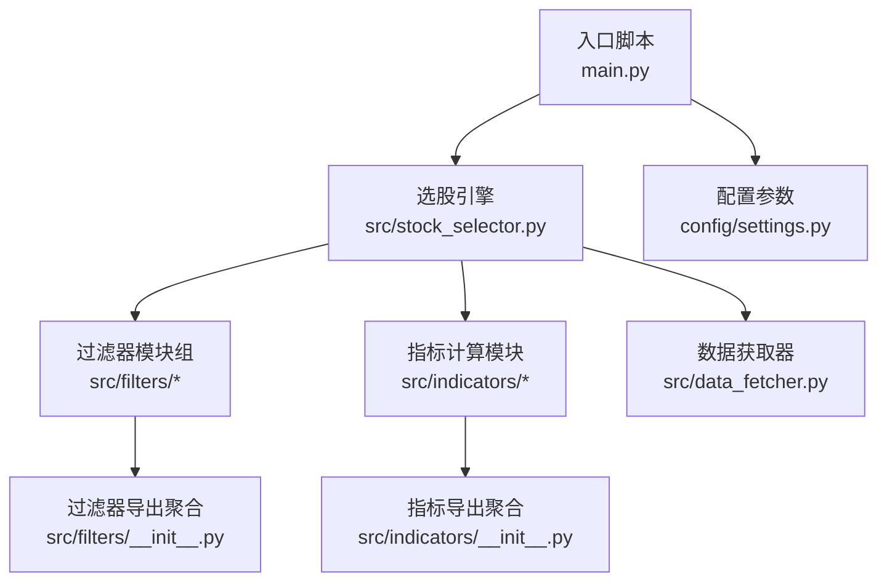
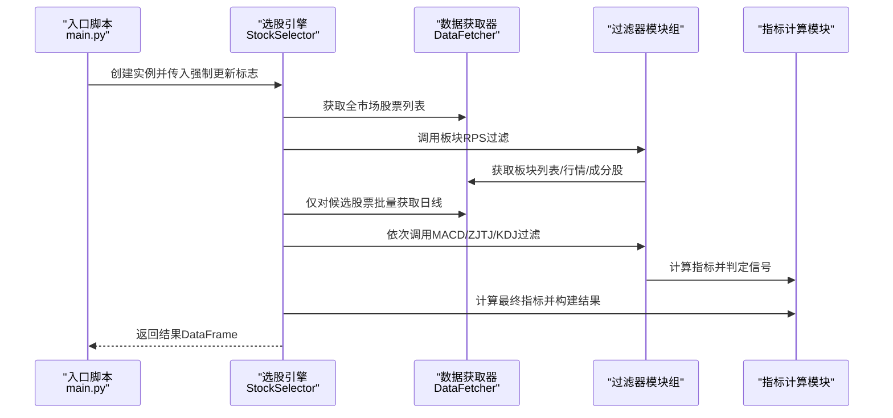
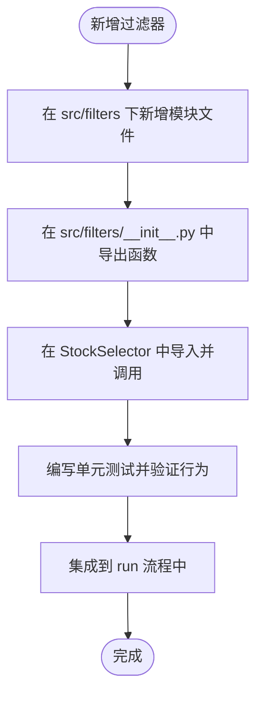
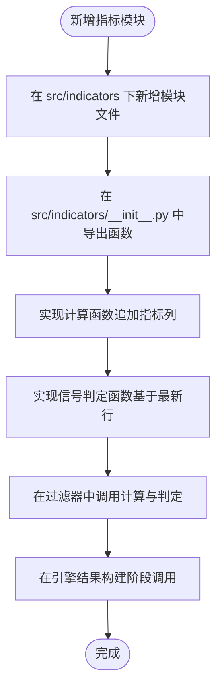
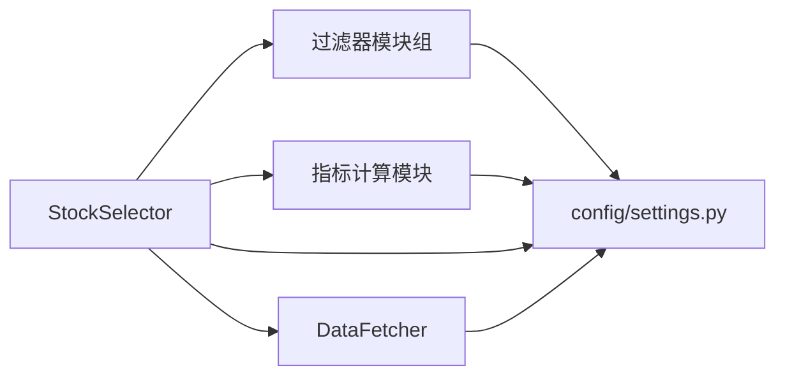

# 扩展开发指南

<cite>
**本文引用的文件**
- [main.py](file://main.py)
- [stock_selector.py](file://src/stock_selector.py)
- [filters/__init__.py](file://src/filters/__init__.py)
- [indicators/__init__.py](file://src/indicators/__init__.py)
- [settings.py](file://config/settings.py)
- [finance_filter.py](file://src/filters/finance_filter.py)
- [macd_filter.py](file://src/filters/macd_filter.py)
- [kdj_filter.py](file://src/filters/kdj_filter.py)
- [zjtj_filter.py](file://src/filters/zjtj_filter.py)
- [sector_filter.py](file://src/filters/sector_filter.py)
- [macd.py](file://src/indicators/macd.py)
- [kdj.py](file://src/indicators/kdj.py)
- [zjtj.py](file://src/indicators/zjtj.py)
- [rps.py](file://src/indicators/rps.py)
- [data_fetcher.py](file://src/data_fetcher.py)
</cite>

## 目录
1. [简介](#简介)
2. [项目结构](#项目结构)
3. [核心组件](#核心组件)
4. [架构总览](#架构总览)
5. [详细组件分析](#详细组件分析)
6. [依赖分析](#依赖分析)
7. [性能考虑](#性能考虑)
8. [故障排查指南](#故障排查指南)
9. [结论](#结论)
10. [附录](#附录)

## 简介
本指南面向希望为A股智能选股系统进行扩展开发的工程师，重点讲解如何新增“过滤器模块组”和“指标计算模块”，包括：
- 过滤器模块组的扩展机制与注册方式
- 指标计算模块的开发流程与调用约定
- 插件式模块导入与初始化流程
- 过滤器函数的命名规范、参数传递与返回值格式
- 指标计算函数的实现模板与调用约定
- 调试技巧与常见问题解决方案

## 项目结构
系统采用“功能域分层 + 模块化导入”的组织方式：
- 入口脚本负责参数解析、日志与结果输出
- 选股引擎串联多个过滤器，逐步缩小候选池
- 指标模块提供技术指标计算与信号判定
- 数据获取模块统一处理数据源、缓存与重试
- 配置模块集中管理参数与路径

图表来源
- [main.py:112-156](file://main.py#L112-L156)
- [stock_selector.py:45-185](file://src/stock_selector.py#L45-L185)
- [filters/__init__.py:1-6](file://src/filters/__init__.py#L1-L6)
- [indicators/__init__.py:1-5](file://src/indicators/__init__.py#L1-L5)
- [settings.py:1-31](file://config/settings.py#L1-L31)

章节来源
- [main.py:112-156](file://main.py#L112-L156)
- [stock_selector.py:45-185](file://src/stock_selector.py#L45-L185)
- [filters/__init__.py:1-6](file://src/filters/__init__.py#L1-L6)
- [indicators/__init__.py:1-5](file://src/indicators/__init__.py#L1-L5)
- [settings.py:1-31](file://config/settings.py#L1-L31)

## 核心组件
- 选股引擎：按漏斗式步骤串联过滤器，逐步筛除不符合条件的股票，并在最后阶段计算技术指标以形成最终结果。
- 过滤器模块组：每个过滤器负责特定维度的筛选，输入为数据获取器或日线字典，输出为股票代码集合。
- 指标计算模块：提供技术指标的计算与信号判定函数，供过滤器与结果构建阶段调用。
- 数据获取器：封装AKShare数据源访问、SQLite缓存、重试与增量更新策略。
- 配置模块：集中管理参数（如MACD/KDJ/RPS等周期与阈值）。

章节来源
- [stock_selector.py:21-310](file://src/stock_selector.py#L21-L310)
- [data_fetcher.py:140-608](file://src/data_fetcher.py#L140-L608)
- [settings.py:1-31](file://config/settings.py#L1-L31)

## 架构总览
系统通过“入口脚本 → 选股引擎 → 过滤器 → 指标 → 结果构建”的链路完成选股。过滤器与指标均通过各自的导出聚合文件集中暴露接口，便于引擎按需导入与调用。

图表来源
- [main.py:112-156](file://main.py#L112-L156)
- [stock_selector.py:45-185](file://src/stock_selector.py#L45-L185)
- [filters/__init__.py:1-6](file://src/filters/__init__.py#L1-L6)
- [indicators/__init__.py:1-5](file://src/indicators/__init__.py#L1-L5)

## 详细组件分析

### 过滤器模块组扩展机制
- 扩展点位置：在 src/filters 下新增模块，并在 src/filters/__init__.py 中导出新函数。
- 注册方式：在 __init__.py 中通过 from ... import ... 的形式将新过滤器函数暴露给引擎。
- 引擎调用：StockSelector 在 run 方法中按顺序调用各过滤器函数，输入为 DataFetcher 或日线字典，输出为股票代码集合。

图表来源
- [filters/__init__.py:1-6](file://src/filters/__init__.py#L1-L6)
- [stock_selector.py:84-170](file://src/stock_selector.py#L84-L170)

章节来源
- [filters/__init__.py:1-6](file://src/filters/__init__.py#L1-L6)
- [stock_selector.py:84-170](file://src/stock_selector.py#L84-L170)

### 指标计算模块开发流程
- 扩展点位置：在 src/indicators 下新增模块，并在 src/indicators/__init__.py 中导出计算函数与信号判定函数。
- 调用约定：过滤器以“日线DataFrame + 参数”形式调用计算函数；结果需在原DataFrame上追加指标列；信号判定函数基于最新一行数据判断是否满足买入/控盘等条件。
- 参数来源：优先从 config/settings.py 读取全局参数，允许调用方传入覆盖值。

图表来源
- [indicators/__init__.py:1-5](file://src/indicators/__init__.py#L1-L5)
- [macd.py:13-34](file://src/indicators/macd.py#L13-L34)
- [kdj.py:45-76](file://src/indicators/kdj.py#L45-L76)
- [zjtj.py:13-33](file://src/indicators/zjtj.py#L13-L33)

章节来源
- [indicators/__init__.py:1-5](file://src/indicators/__init__.py#L1-L5)
- [macd.py:13-67](file://src/indicators/macd.py#L13-L67)
- [kdj.py:45-110](file://src/indicators/kdj.py#L45-L110)
- [zjtj.py:13-57](file://src/indicators/zjtj.py#L13-L57)

### 过滤器函数命名规范与调用约定
- 命名规范：以“filter_by_”开头，后接筛选维度（如 macd、zjtj、kdj、finance、sector_rps）。
- 参数传递：
  - 板块RPS类：接收 DataFetcher、起止日期等；返回股票代码集合。
  - 日线类：接收日线字典（key为股票代码，value为DataFrame）；返回满足条件的代码集合。
- 返回值格式：统一返回 set[str]，表示满足条件的股票代码集合。
- 引擎调用：StockSelector 在 run 中按顺序调用各过滤器，并以“输入集合 → 输出集合”的方式逐步缩小候选池。

章节来源
- [sector_filter.py:11-73](file://src/filters/sector_filter.py#L11-L73)
- [macd_filter.py:9-46](file://src/filters/macd_filter.py#L9-L46)
- [zjtj_filter.py:9-46](file://src/filters/zjtj_filter.py#L9-L46)
- [kdj_filter.py:9-51](file://src/filters/kdj_filter.py#L9-L51)
- [finance_filter.py:10-91](file://src/filters/finance_filter.py#L10-L91)
- [stock_selector.py:84-170](file://src/stock_selector.py#L84-L170)

### 指标计算函数实现模板与调用约定
- 计算函数模板：
  - 输入：pandas.DataFrame（包含必要价格列）
  - 输出：在原DataFrame上追加指标列并返回
  - 参数：优先使用 config/settings.py 中的全局参数，允许调用方传入覆盖值
- 信号判定函数模板：
  - 输入：pandas.DataFrame（可选：若缺少指标列则先调用计算函数）
  - 输出：bool，表示最新一行是否满足买入/控盘等条件
- 示例参考：
  - MACD：计算 dif、dea、macd；判定买入条件（DIF/DEA金叉或MACD由绿转红）
  - KDJ：计算 rsv、k、d、j；判定买入条件（K上穿D或J由负转正）
  - ZJTJ：计算 var1、kongpan；判定“有庄控盘”条件（控盘度上升且大于0）

章节来源
- [macd.py:13-67](file://src/indicators/macd.py#L13-L67)
- [kdj.py:45-110](file://src/indicators/kdj.py#L45-L110)
- [zjtj.py:13-57](file://src/indicators/zjtj.py#L13-L57)

### 插件系统的使用方法
- 过滤器插件注册：在 src/filters/__init__.py 中导出新过滤器函数，引擎即可通过 from src.filters import ... 自动发现并调用。
- 指标插件注册：在 src/indicators/__init__.py 中导出新指标计算与信号判定函数，过滤器与引擎可直接调用。
- 初始化流程：入口脚本 main.py 启动时将项目根目录加入 sys.path，随后导入 StockSelector 并执行 run；StockSelector 在构造时初始化 DataFetcher 并按需清理缓存。

章节来源
- [filters/__init__.py:1-6](file://src/filters/__init__.py#L1-L6)
- [indicators/__init__.py:1-5](file://src/indicators/__init__.py#L1-L5)
- [main.py:13-26](file://main.py#L13-L26)
- [stock_selector.py:24-34](file://src/stock_selector.py#L24-L34)

### 模块导入机制与初始化流程
- 入口脚本：将项目根目录插入 sys.path，确保相对导入生效；解析参数并创建 StockSelector 实例。
- 选股引擎：初始化 DataFetcher，按需清空日线缓存；在 run 中按步骤调用过滤器与指标。
- 数据获取器：建立SQLite连接并建表，封装AKShare数据获取、缓存写入与读取、重试与延迟控制。
- 配置模块：集中定义参数（如MACD/KDJ/RPS周期、财务增长阈值、数据路径与请求配置）。

章节来源
- [main.py:13-26](file://main.py#L13-L26)
- [stock_selector.py:24-34](file://src/stock_selector.py#L24-L34)
- [data_fetcher.py:140-202](file://src/data_fetcher.py#L140-L202)
- [settings.py:1-31](file://config/settings.py#L1-L31)

## 依赖分析
- 组件耦合：
  - StockSelector 依赖 DataFetcher、过滤器模块组与指标模块组
  - 过滤器模块组依赖 DataFetcher 或日线字典
  - 指标模块组依赖 pandas/numpy 与 config/settings.py
- 导入关系：
  - StockSelector 在顶部导入过滤器与指标函数
  - 过滤器与指标通过各自的 __init__.py 聚合导出
- 外部依赖：
  - AKShare：用于获取股票、板块、利润等数据
  - SQLite：本地缓存与增量更新
  - pandas/numpy：指标计算与数据处理

图表来源
- [stock_selector.py:5-16](file://src/stock_selector.py#L5-L16)
- [filters/__init__.py:1-6](file://src/filters/__init__.py#L1-L6)
- [indicators/__init__.py:1-5](file://src/indicators/__init__.py#L1-L5)
- [settings.py:1-31](file://config/settings.py#L1-L31)

章节来源
- [stock_selector.py:5-16](file://src/stock_selector.py#L5-L16)
- [filters/__init__.py:1-6](file://src/filters/__init__.py#L1-L6)
- [indicators/__init__.py:1-5](file://src/indicators/__init__.py#L1-L5)
- [settings.py:1-31](file://config/settings.py#L1-L31)

## 性能考虑
- 数据获取与缓存：
  - 使用 SQLite 缓存股票列表、板块列表、成分股、日线与利润数据，减少重复请求
  - 增量更新：基于最大缓存日期决定拉取起点，避免全量重复下载
- 指标计算：
  - 使用 pandas/numpy 向量化运算，尽量避免逐行循环
  - 指标计算函数在原DataFrame上追加列，减少复制成本
- 过滤器优化：
  - 先做宽筛（板块RPS），再做窄筛（MACD/ZJTJ/KDJ/财务），降低后续计算规模
  - 对候选股票批量获取日线，避免全市场重复拉取

章节来源
- [data_fetcher.py:278-345](file://src/data_fetcher.py#L278-L345)
- [stock_selector.py:100-116](file://src/stock_selector.py#L100-L116)
- [macd.py:13-34](file://src/indicators/macd.py#L13-L34)
- [kdj.py:45-76](file://src/indicators/kdj.py#L45-L76)
- [zjtj.py:13-33](file://src/indicators/zjtj.py#L13-L33)

## 故障排查指南
- 网络/请求异常：
  - 现象：ConnectionError 或请求失败
  - 排查：检查网络连通性、代理设置；确认 REQUEST_RETRY 与 REQUEST_DELAY 配置合理
- 数据为空：
  - 现象：板块/股票日线/利润数据为空
  - 排查：确认 AKShare 接口可用；检查缓存表是否存在；必要时使用强制更新模式
- 指标计算异常：
  - 现象：NaN或列缺失导致信号判定失败
  - 排查：确保输入DataFrame包含必要列；检查时间序列长度是否满足指标要求
- 过滤器返回空集：
  - 现象：某规则后候选集为空
  - 排查：调整参数（如RPS_TOP_N、KDJ阈值等）；检查数据质量与时间窗口

章节来源
- [main.py:133-144](file://main.py#L133-L144)
- [data_fetcher.py:180-194](file://src/data_fetcher.py#L180-L194)
- [macd_filter.py:28-39](file://src/filters/macd_filter.py#L28-L39)
- [kdj_filter.py:28-44](file://src/filters/kdj_filter.py#L28-L44)
- [zjtj_filter.py:28-39](file://src/filters/zjtj_filter.py#L28-L39)

## 结论
通过模块化设计与插件式导入，系统实现了清晰的扩展边界。新增过滤器与指标模块的关键在于：
- 正确的命名与导出
- 严格的参数与返回值约定
- 合理的性能与健壮性设计
遵循本指南可快速、安全地扩展系统能力，同时保持整体架构的一致性与可维护性。

## 附录
- 新增过滤器步骤清单
  - 在 src/filters 下创建模块文件
  - 在 src/filters/__init__.py 中导出函数
  - 在 StockSelector.run 中按顺序调用
  - 编写单元测试并集成到主流程
- 新增指标步骤清单
  - 在 src/indicators 下创建模块文件
  - 在 src/indicators/__init__.py 中导出计算与信号函数
  - 在过滤器与引擎中按约定调用
  - 编写单元测试并集成到主流程