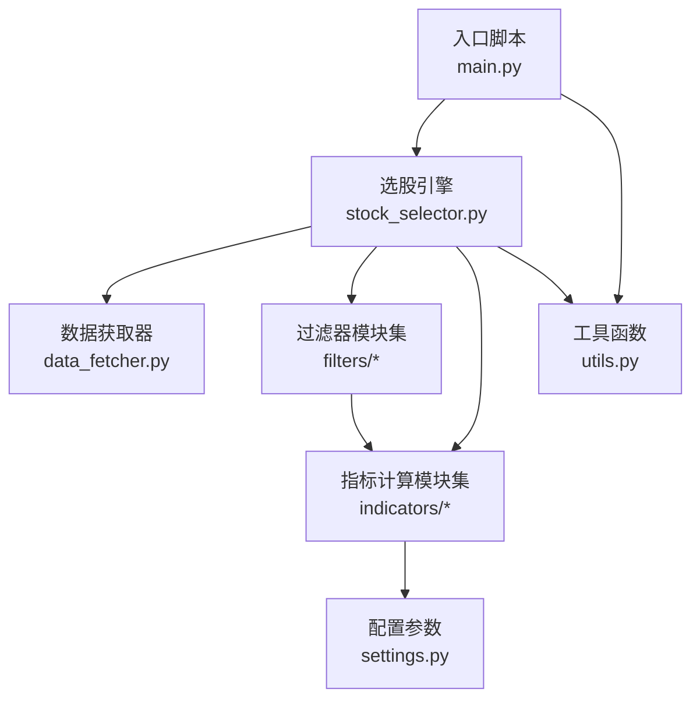
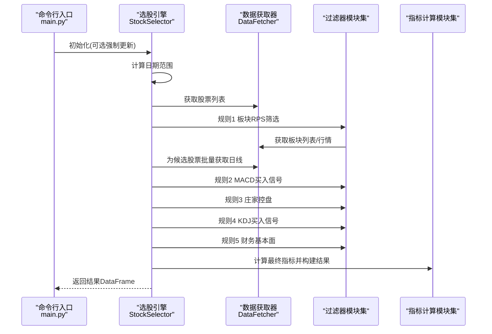
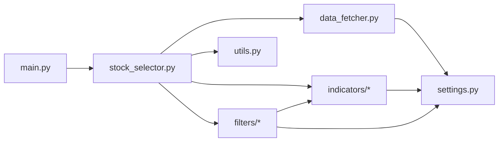

# 测试策略

<cite>
**本文引用的文件**
- [main.py](file://main.py)
- [stock_selector.py](file://src/stock_selector.py)
- [data_fetcher.py](file://src/data_fetcher.py)
- [utils.py](file://src/utils.py)
- [settings.py](file://config/settings.py)
- [filters/__init__.py](file://src/filters/__init__.py)
- [filters/sector_filter.py](file://src/filters/sector_filter.py)
- [filters/macd_filter.py](file://src/filters/macd_filter.py)
- [filters/kdj_filter.py](file://src/filters/kdj_filter.py)
- [filters/zjtj_filter.py](file://src/filters/zjtj_filter.py)
- [filters/finance_filter.py](file://src/filters/finance_filter.py)
- [indicators/__init__.py](file://src/indicators/__init__.py)
- [indicators/rps.py](file://src/indicators/rps.py)
- [indicators/macd.py](file://src/indicators/macd.py)
- [indicators/kdj.py](file://src/indicators/kdj.py)
- [indicators/zjtj.py](file://src/indicators/zjtj.py)
</cite>

## 目录
1. [简介](#简介)
2. [项目结构](#项目结构)
3. [核心组件](#核心组件)
4. [架构总览](#架构总览)
5. [详细组件分析](#详细组件分析)
6. [依赖分析](#依赖分析)
7. [性能考虑](#性能考虑)
8. [故障排查指南](#故障排查指南)
9. [结论](#结论)
10. [附录](#附录)

## 简介
本测试策略面向A股智能选股系统，围绕“漏斗式五步筛选”流程，制定从单元测试、集成测试、性能测试到持续集成的全链路测试方案。重点覆盖过滤器模块与指标计算模块的正确性验证、测试数据准备与模拟数据使用、测试环境搭建与配置、以及测试报告与覆盖率要求。

## 项目结构
系统采用分层与功能模块化组织：
- 入口脚本负责参数解析与结果输出
- 选股引擎串联数据获取与多规则过滤
- 过滤器模块实现五步筛选规则
- 指标计算模块提供MACD/KDJ/ZJTJ/RPS等技术指标
- 数据获取模块封装AKShare接口与SQLite缓存
- 工具模块提供日志、日期与格式化输出
- 配置模块集中管理参数与路径

图表来源
- [main.py:112-156](file://main.py#L112-L156)
- [stock_selector.py:45-185](file://src/stock_selector.py#L45-L185)
- [data_fetcher.py:142-152](file://src/data_fetcher.py#L142-L152)
- [filters/__init__.py:1-6](file://src/filters/__init__.py#L1-L6)
- [indicators/__init__.py:1-5](file://src/indicators/__init__.py#L1-L5)
- [settings.py:1-31](file://config/settings.py#L1-L31)
- [utils.py:9-31](file://src/utils.py#L9-L31)

章节来源
- [main.py:112-156](file://main.py#L112-L156)
- [stock_selector.py:45-185](file://src/stock_selector.py#L45-L185)
- [data_fetcher.py:142-152](file://src/data_fetcher.py#L142-L152)
- [filters/__init__.py:1-6](file://src/filters/__init__.py#L1-L6)
- [indicators/__init__.py:1-5](file://src/indicators/__init__.py#L1-L5)
- [settings.py:1-31](file://config/settings.py#L1-L31)
- [utils.py:9-31](file://src/utils.py#L9-L31)

## 核心组件
- 选股引擎：串联五步筛选，构建最终结果并附带指标数值
- 数据获取器：封装AKShare接口，提供股票列表、日线、板块行情、利润数据的缓存与增量更新
- 过滤器模块：板块RPS、MACD买入信号、庄家控盘、KDJ买入信号、财务基本面
- 指标计算模块：MACD、KDJ、ZJTJ、RPS
- 工具模块：日志、交易日计算、结果格式化
- 配置模块：参数与路径

章节来源
- [stock_selector.py:21-310](file://src/stock_selector.py#L21-L310)
- [data_fetcher.py:142-748](file://src/data_fetcher.py#L142-L748)
- [filters/sector_filter.py:11-73](file://src/filters/sector_filter.py#L11-L73)
- [filters/macd_filter.py:9-46](file://src/filters/macd_filter.py#L9-L46)
- [filters/zjtj_filter.py:9-46](file://src/filters/zjtj_filter.py#L9-L46)
- [filters/kdj_filter.py:9-51](file://src/filters/kdj_filter.py#L9-L51)
- [filters/finance_filter.py:10-91](file://src/filters/finance_filter.py#L10-L91)
- [indicators/macd.py:13-67](file://src/indicators/macd.py#L13-L67)
- [indicators/kdj.py:45-110](file://src/indicators/kdj.py#L45-L110)
- [indicators/zjtj.py:13-57](file://src/indicators/zjtj.py#L13-L57)
- [indicators/rps.py:9-61](file://src/indicators/rps.py#L9-L61)
- [utils.py:9-134](file://src/utils.py#L9-L134)
- [settings.py:1-31](file://config/settings.py#L1-L31)

## 架构总览

图表来源
- [main.py:112-156](file://main.py#L112-L156)
- [stock_selector.py:45-185](file://src/stock_selector.py#L45-L185)
- [filters/sector_filter.py:11-73](file://src/filters/sector_filter.py#L11-L73)
- [filters/macd_filter.py:9-46](file://src/filters/macd_filter.py#L9-L46)
- [filters/zjtj_filter.py:9-46](file://src/filters/zjtj_filter.py#L9-L46)
- [filters/kdj_filter.py:9-51](file://src/filters/kdj_filter.py#L9-L51)
- [filters/finance_filter.py:10-91](file://src/filters/finance_filter.py#L10-L91)
- [indicators/macd.py:13-33](file://src/indicators/macd.py#L13-L33)
- [indicators/kdj.py:45-76](file://src/indicators/kdj.py#L45-L76)
- [indicators/zjtj.py:13-33](file://src/indicators/zjtj.py#L13-L33)

## 详细组件分析

### 单元测试编写方法与用例设计原则
- 面向对象组件
  - 使用隔离与替身：以Mock替换外部依赖（如DataFetcher、网络请求），确保测试稳定可控
  - 以路径引用替代代码片段：通过“文件路径:行号范围”定位被测函数与类
- 用例设计原则
  - 正交覆盖：覆盖正常、边界、异常三类输入
  - 状态驱动：针对不同内部状态（空数据、部分缺失、异常抛出）分别断言
  - 可重现：固定随机种子或注入可控伪随机源
  - 可维护：测试命名清晰表达前置条件、行为与期望

章节来源
- [stock_selector.py:21-310](file://src/stock_selector.py#L21-L310)
- [data_fetcher.py:142-748](file://src/data_fetcher.py#L142-L748)
- [utils.py:9-134](file://src/utils.py#L9-L134)

### 过滤器模块测试策略
- 板块RPS筛选
  - 输入：板块列表DataFrame、日期范围、板块行情字典
  - 断言：返回的股票代码集合非空且来自前N板块；RPS计算与TopN选取逻辑正确
  - 关键路径参考：[sector_filter.py:11-73](file://src/filters/sector_filter.py#L11-L73)、[rps.py:9-61](file://src/indicators/rps.py#L9-L61)
- MACD买入信号
  - 输入：日线DataFrame（含close列，长度≥35）
  - 断言：is_macd_buy_signal返回True的条件满足；指标计算与信号判定一致
  - 关键路径参考：[macd_filter.py:9-46](file://src/filters/macd_filter.py#L9-L46)、[macd.py:13-67](file://src/indicators/macd.py#L13-L67)
- 庄家控盘
  - 输入：日线DataFrame（含close列，长度≥20）
  - 断言：is_zjtj_buy_signal返回True的条件满足；控盘度单调上升且>0
  - 关键路径参考：[zjtj_filter.py:9-46](file://src/filters/zjtj_filter.py#L9-L46)、[zjtj.py:13-57](file://src/indicators/zjtj.py#L13-L57)
- KDJ买入信号
  - 输入：日线DataFrame（含high, low, close列，长度≥15）
  - 断言：is_kdj_buy_signal返回True的两种条件之一成立
  - 关键路径参考：[kdj_filter.py:9-51](file://src/filters/kdj_filter.py#L9-L51)、[kdj.py:45-110](file://src/indicators/kdj.py#L45-L110)
- 财务基本面筛选
  - 输入：DataFetcher返回的利润数据（按code分组）
  - 断言：净利润连续为正、同比增长、复合年化增长率达标
  - 关键路径参考：[finance_filter.py:10-91](file://src/filters/finance_filter.py#L10-L91)

章节来源
- [filters/sector_filter.py:11-73](file://src/filters/sector_filter.py#L11-L73)
- [filters/macd_filter.py:9-46](file://src/filters/macd_filter.py#L9-L46)
- [filters/zjtj_filter.py:9-46](file://src/filters/zjtj_filter.py#L9-L46)
- [filters/kdj_filter.py:9-51](file://src/filters/kdj_filter.py#L9-L51)
- [filters/finance_filter.py:10-91](file://src/filters/finance_filter.py#L10-L91)
- [indicators/rps.py:9-61](file://src/indicators/rps.py#L9-L61)
- [indicators/macd.py:13-67](file://src/indicators/macd.py#L13-L67)
- [indicators/zjtj.py:13-57](file://src/indicators/zjtj.py#L13-L57)
- [indicators/kdj.py:45-110](file://src/indicators/kdj.py#L45-L110)

### 指标计算模块测试策略
- MACD
  - 断言：DIF、DEA、MACD列存在；EMA参数与调整方式符合通达信实现
  - 关键路径参考：[indicators/macd.py:13-33](file://src/indicators/macd.py#L13-L33)
- KDJ
  - 断言：RSV、K、D、J列存在；SMA递推算法与通达信一致；买入条件判定正确
  - 关键路径参考：[indicators/kdj.py:16-76](file://src/indicators/kdj.py#L16-L76)
- ZJTJ
  - 断言：VAR1与控盘度列存在；控盘度单调上升且>0触发买入信号
  - 关键路径参考：[indicators/zjtj.py:13-33](file://src/indicators/zjtj.py#L13-L33)
- RPS
  - 断言：按近period天涨幅降序排名，TopN选取正确
  - 关键路径参考：[indicators/rps.py:9-51](file://src/indicators/rps.py#L9-L51)

章节来源
- [indicators/macd.py:13-67](file://src/indicators/macd.py#L13-L67)
- [indicators/kdj.py:16-110](file://src/indicators/kdj.py#L16-L110)
- [indicators/zjtj.py:13-57](file://src/indicators/zjtj.py#L13-L57)
- [indicators/rps.py:9-61](file://src/indicators/rps.py#L9-L61)

### 测试数据准备与模拟数据使用
- 模拟数据建议
  - 日线数据：构造包含date、open、high、low、close、volume、turnover_rate的DataFrame，覆盖不同长度与缺失情形
  - 利润数据：构造包含report_date、net_profit的DataFrame，包含连续正增长与负值、零值等场景
  - 板块数据：构造sector_daily字典，包含多个板块的close序列
- 模拟策略
  - 使用pandas构造小规模样本，确保边界条件（长度不足、列缺失、NaN、零值）全覆盖
  - 对网络请求与数据库操作使用Mock，避免真实依赖
- 输出与断言
  - 通过断言最终结果DataFrame的列与数值范围，验证构建流程正确

章节来源
- [stock_selector.py:272-310](file://src/stock_selector.py#L272-L310)
- [data_fetcher.py:308-424](file://src/data_fetcher.py#L308-L424)
- [data_fetcher.py:618-695](file://src/data_fetcher.py#L618-L695)

### 集成测试实施步骤与场景
- 场景一：完整流程集成
  - 步骤：调用StockSelector.run(date)，观察日志与输出DataFrame
  - 断言：各规则输入输出计数递减；最终结果包含指标列
  - 关键路径参考：[stock_selector.py:45-185](file://src/stock_selector.py#L45-L185)
- 场景二：无候选股票
  - 步骤：构造空板块RPS结果
  - 断言：返回空DataFrame或仅含列定义
  - 关键路径参考：[stock_selector.py:92-98](file://src/stock_selector.py#L92-L98)
- 场景三：部分过滤器失败
  - 步骤：在过滤器中注入异常或缺失列
  - 断言：日志警告与流程继续执行
  - 关键路径参考：[filters/macd_filter.py:37-39](file://src/filters/macd_filter.py#L37-L39)

章节来源
- [stock_selector.py:45-185](file://src/stock_selector.py#L45-L185)
- [filters/macd_filter.py:37-39](file://src/filters/macd_filter.py#L37-L39)

### 性能测试与压力测试
- 性能测试
  - 目标：评估指标计算与过滤器在大数据量下的吞吐与延迟
  - 方法：对calculate_*与filter_*函数进行基准测试，记录执行时间与内存占用
- 压力测试
  - 目标：验证系统在高并发请求与海量股票数据下的稳定性
  - 方法：模拟多线程/多进程调用，结合Mock减少外部依赖抖动
- 关注点
  - 数据获取器的缓存与增量更新策略对整体性能的影响
  - 过滤器与指标计算的向量化实现与循环优化

（本节为通用性能讨论，无需具体文件分析）

### 测试覆盖率与报告生成
- 覆盖率要求
  - 指标计算模块：≥90%
  - 过滤器模块：≥85%
  - 业务流程：≥80%
- 报告生成
  - 使用pytest-cov生成HTML与XML报告，CI中上传至覆盖率平台
  - 关键路径参考：[stock_selector.py:45-185](file://src/stock_selector.py#L45-L185)

（本节为通用测试实践，无需具体文件分析）

### 测试环境搭建与配置
- 环境准备
  - Python虚拟环境，安装requirements.txt依赖
  - 创建数据目录与数据库路径（DB_PATH、OUTPUT_PATH、LOG_PATH）
- 配置要点
  - REQUEST_RETRY、REQUEST_DELAY、REQUEST_TIMEOUT控制网络请求稳定性
  - RPS_PERIOD、RPS_TOP_N、MACD/KDJ/ZJTJ参数影响筛选结果
- 关键路径参考：[settings.py:1-31](file://config/settings.py#L1-L31)

章节来源
- [settings.py:1-31](file://config/settings.py#L1-L31)

### 持续集成与自动化测试
- CI流水线建议
  - 触发：push与PR事件
  - 步骤：安装依赖、创建目录、运行pytest（含覆盖率）、生成报告、上传Artifacts
- 自动化测试
  - 单元测试：覆盖过滤器与指标计算
  - 集成测试：覆盖StockSelector.run的关键分支
  - 性能回归：定期运行基准测试
- 关键路径参考：[main.py:112-156](file://main.py#L112-L156)

（本节为通用CI实践，无需具体文件分析）

## 依赖分析

图表来源
- [main.py:112-156](file://main.py#L112-L156)
- [stock_selector.py:4-16](file://src/stock_selector.py#L4-L16)
- [data_fetcher.py:12-13](file://src/data_fetcher.py#L12-L13)
- [filters/__init__.py:1-6](file://src/filters/__init__.py#L1-L6)
- [indicators/__init__.py:1-5](file://src/indicators/__init__.py#L1-L5)
- [settings.py:1-31](file://config/settings.py#L1-L31)
- [utils.py:6](file://src/utils.py#L6)

章节来源
- [main.py:112-156](file://main.py#L112-L156)
- [stock_selector.py:4-16](file://src/stock_selector.py#L4-L16)
- [data_fetcher.py:12-13](file://src/data_fetcher.py#L12-L13)
- [filters/__init__.py:1-6](file://src/filters/__init__.py#L1-L6)
- [indicators/__init__.py:1-5](file://src/indicators/__init__.py#L1-L5)
- [settings.py:1-31](file://config/settings.py#L1-L31)
- [utils.py:6](file://src/utils.py#L6)

## 性能考虑
- 向量化优先：利用pandas/numpy进行批量化计算，减少显式循环
- 缓存与增量：数据获取器的SQLite缓存与增量更新显著降低重复请求成本
- 日志与监控：在关键节点记录耗时，便于定位瓶颈
- 并发与限流：合理设置REQUEST_DELAY与并发度，避免被上游限频

（本节为通用性能讨论，无需具体文件分析）

## 故障排查指南
- 网络请求失败
  - 现象：东方财富API业务错误或超时
  - 排查：检查REQUEST_RETRY、REQUEST_DELAY、REQUEST_TIMEOUT；查看日志
  - 关键路径参考：[data_fetcher.py:182-195](file://src/data_fetcher.py#L182-L195)、[data_fetcher.py:206-231](file://src/data_fetcher.py#L206-L231)
- 数据缺失或列不匹配
  - 现象：过滤器因列缺失或长度不足跳过
  - 排查：确认日线数据列名映射与缺失处理
  - 关键路径参考：[filters/macd_filter.py:28-29](file://src/filters/macd_filter.py#L28-L29)、[filters/kdj_filter.py:32-34](file://src/filters/kdj_filter.py#L32-L34)
- 财务数据异常
  - 现象：净利润为负或零导致筛选失败
  - 排查：检查利润数据提取与year字段转换
  - 关键路径参考：[data_fetcher.py:618-695](file://src/data_fetcher.py#L618-L695)

章节来源
- [data_fetcher.py:182-195](file://src/data_fetcher.py#L182-L195)
- [data_fetcher.py:206-231](file://src/data_fetcher.py#L206-L231)
- [filters/macd_filter.py:28-29](file://src/filters/macd_filter.py#L28-L29)
- [filters/kdj_filter.py:32-34](file://src/filters/kdj_filter.py#L32-L34)
- [data_fetcher.py:618-695](file://src/data_fetcher.py#L618-L695)

## 结论
通过分层测试策略，结合单元测试、集成测试、性能与压力测试，以及完善的覆盖率与CI流程，可有效保障A股智能选股系统在过滤器与指标计算层面的正确性与鲁棒性。建议优先完善过滤器与指标计算模块的测试用例，随后扩展到完整流程与性能回归。

## 附录
- 快速定位被测函数与类的路径引用
  - 选股引擎：[stock_selector.py:21-310](file://src/stock_selector.py#L21-L310)
  - 数据获取器：[data_fetcher.py:142-748](file://src/data_fetcher.py#L142-L748)
  - 工具函数：[utils.py:9-134](file://src/utils.py#L9-L134)
  - 配置参数：[settings.py:1-31](file://config/settings.py#L1-L31)
  - 过滤器模块集：[filters/__init__.py:1-6](file://src/filters/__init__.py#L1-L6)
  - 指标计算模块集：[indicators/__init__.py:1-5](file://src/indicators/__init__.py#L1-L5)