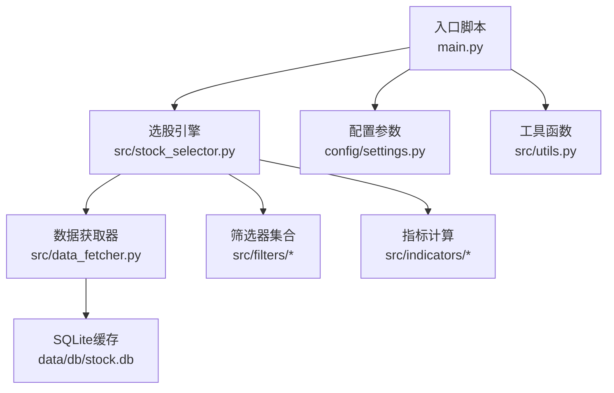
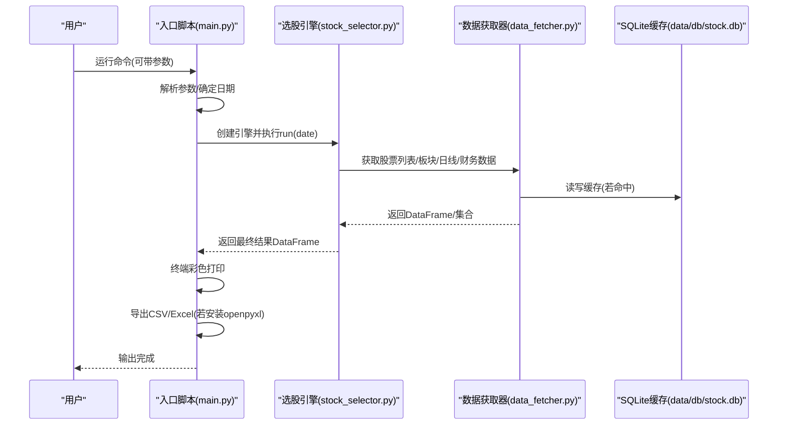
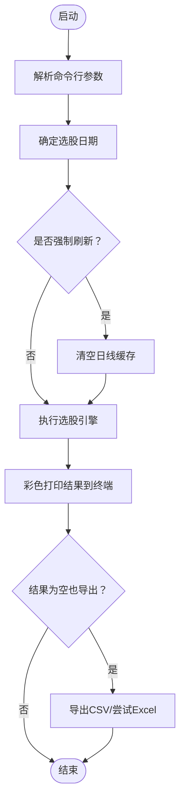
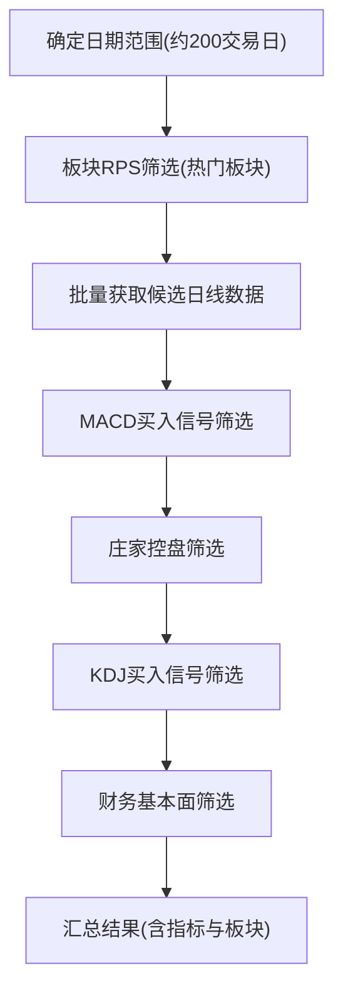
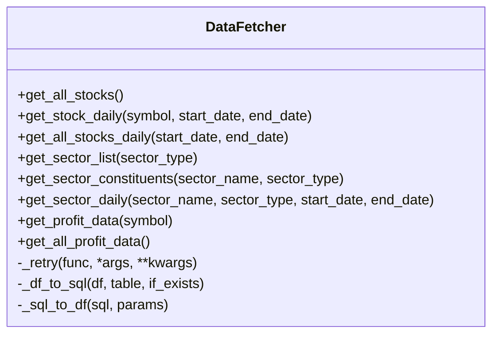
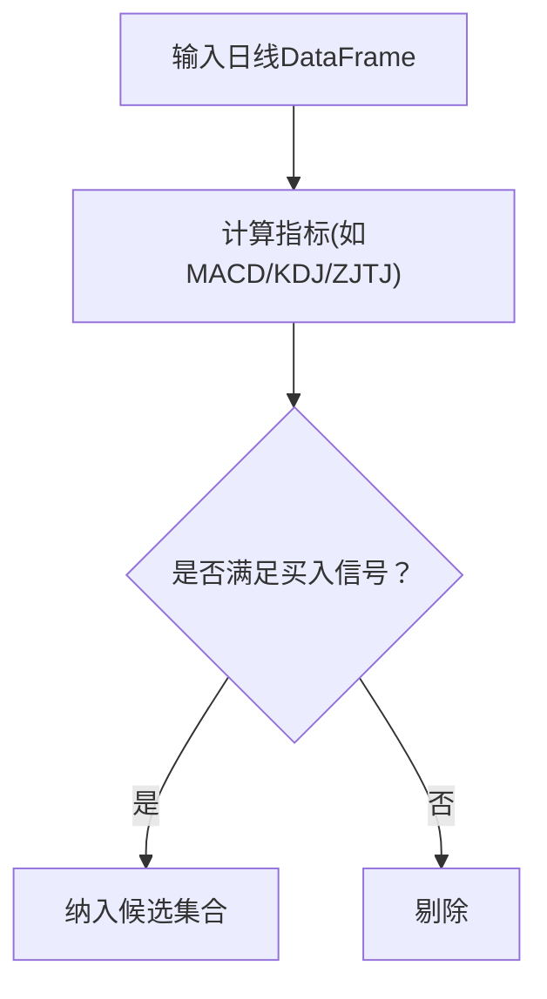
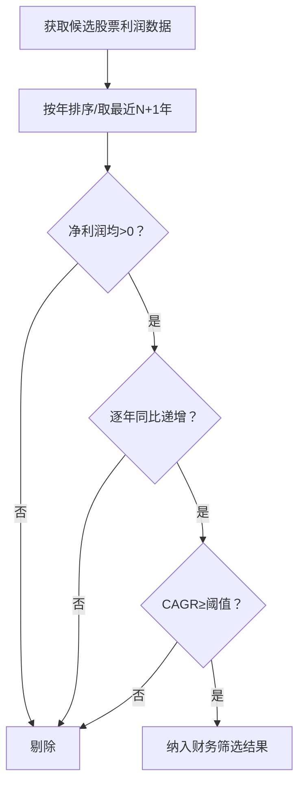
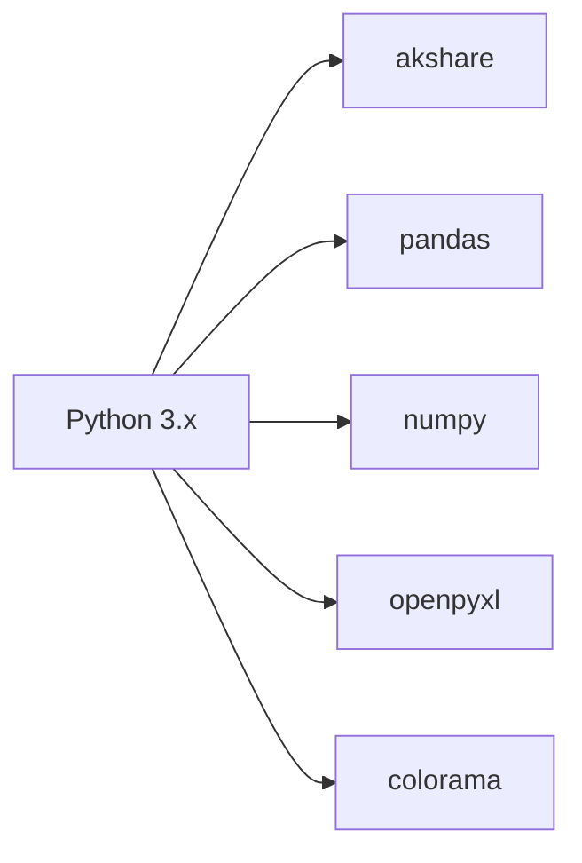

# 快速开始

<cite>
**本文引用的文件**
- [main.py](file://main.py)
- [requirements.txt](file://requirements.txt)
- [settings.py](file://config/settings.py)
- [stock_selector.py](file://src/stock_selector.py)
- [data_fetcher.py](file://src/data_fetcher.py)
- [utils.py](file://src/utils.py)
- [sector_filter.py](file://src/filters/sector_filter.py)
- [macd_filter.py](file://src/filters/macd_filter.py)
- [zjtj_filter.py](file://src/filters/zjtj_filter.py)
- [kdj_filter.py](file://src/filters/kdj_filter.py)
- [finance_filter.py](file://src/filters/finance_filter.py)
- [macd.py](file://src/indicators/macd.py)
- [kdj.py](file://src/indicators/kdj.py)
- [zjtj.py](file://src/indicators/zjtj.py)
- [手工选股.md](file://手工选股.md)
</cite>

## 目录
1. [简介](#简介)
2. [项目结构](#项目结构)
3. [核心组件](#核心组件)
4. [架构总览](#架构总览)
5. [详细组件分析](#详细组件分析)
6. [依赖分析](#依赖分析)
7. [性能考虑](#性能考虑)
8. [故障排查指南](#故障排查指南)
9. [结论](#结论)
10. [附录](#附录)

## 简介
本指南面向A股智能选股系统的初学者，帮助你在30分钟内完成环境准备、依赖安装、初次运行与基础使用。系统采用“漏斗式五步筛选”策略，结合板块热度、技术指标与财务数据，输出可直接导出的选股结果。

## 项目结构
项目采用分层组织方式：
- 入口脚本负责命令行参数解析、日期确定、调用选股引擎、结果打印与导出
- 配置模块集中管理参数与路径
- 数据层通过数据获取器对接第三方接口并维护本地SQLite缓存
- 筛选器与指标模块分别实现规则与技术指标计算
- 工具模块提供日志、日期与表格格式化等通用能力

图表来源
- [main.py:112-156](file://main.py#L112-L156)
- [stock_selector.py:45-185](file://src/stock_selector.py#L45-L185)
- [data_fetcher.py:140-150](file://src/data_fetcher.py#L140-L150)
- [settings.py:21-26](file://config/settings.py#L21-L26)
- [utils.py:9-30](file://src/utils.py#L9-L30)

章节来源
- [main.py:112-156](file://main.py#L112-L156)
- [settings.py:21-26](file://config/settings.py#L21-L26)

## 核心组件
- 入口脚本：解析命令行参数、确定日期、执行选股、打印与导出结果
- 选股引擎：串联五步筛选流程，按需批量获取日线数据，最终汇总指标
- 数据获取器：封装AKShare接口，提供股票列表、日线、板块、财务等数据，并以SQLite缓存提升性能
- 筛选器：板块RPS、MACD、庄家控盘、KDJ、财务基本面
- 指标计算：MACD、KDJ、庄家控盘
- 工具模块：日志、交易日计算、结果表格格式化

章节来源
- [main.py:29-52](file://main.py#L29-L52)
- [stock_selector.py:21-310](file://src/stock_selector.py#L21-L310)
- [data_fetcher.py:140-608](file://src/data_fetcher.py#L140-L608)
- [utils.py:9-134](file://src/utils.py#L9-L134)

## 架构总览
系统采用“入口脚本 → 引擎 → 数据层 → 筛选器/指标”的分层设计，数据层通过SQLite缓存减少重复抓取，提升整体性能。

图表来源
- [main.py:112-156](file://main.py#L112-L156)
- [stock_selector.py:45-185](file://src/stock_selector.py#L45-L185)
- [data_fetcher.py:205-345](file://src/data_fetcher.py#L205-L345)

## 详细组件分析

### 命令行与入口流程
- 支持的参数
  - --date：指定日期(YYYYMMDD)，默认当天（遇周末自动回退到最近工作日）
  - --force-update：强制刷新数据（清空日线缓存，重新拉取）
  - --output：指定输出文件路径（CSV）
- 运行流程
  - 解析参数 → 确定日期 → 创建引擎 → 执行选股 → 打印结果 → 导出CSV/Excel

图表来源
- [main.py:29-52](file://main.py#L29-L52)
- [main.py:112-156](file://main.py#L112-L156)
- [stock_selector.py:35-44](file://src/stock_selector.py#L35-L44)

章节来源
- [main.py:29-52](file://main.py#L29-L52)
- [main.py:112-156](file://main.py#L112-L156)

### 选股引擎与五步筛选
- 步骤概览
  1) 板块RPS筛选：热门板块中的股票集合
  2) 准备数据：为候选股票批量获取日线数据
  3) MACD买入信号筛选
  4) 庄家控盘筛选
  5) KDJ买入信号筛选
  6) 财务基本面筛选
- 关键点
  - 历史窗口：约200个交易日以保证指标稳定性
  - 每步输出输入/输出数量，便于追踪
  - 最终汇总指标（MACD、KDJ、控盘度）并附带板块信息

图表来源
- [stock_selector.py:45-185](file://src/stock_selector.py#L45-L185)
- [sector_filter.py:11-73](file://src/filters/sector_filter.py#L11-L73)
- [macd_filter.py:9-46](file://src/filters/macd_filter.py#L9-L46)
- [zjtj_filter.py:9-46](file://src/filters/zjtj_filter.py#L9-L46)
- [kdj_filter.py:9-51](file://src/filters/kdj_filter.py#L9-L51)
- [finance_filter.py:10-91](file://src/filters/finance_filter.py#L10-L91)

章节来源
- [stock_selector.py:45-185](file://src/stock_selector.py#L45-L185)

### 数据获取与缓存
- 功能
  - 股票列表、板块列表/成分股、板块日线、个股日线、财务数据（净利润）
  - SQLite缓存：stock_list、stock_daily、sector_list、sector_constituents、sector_daily、profit_data
  - 增量更新：基于缓存最新日期决定拉取起点
- 性能
  - 重试与延迟：降低被限流风险
  - 批量获取：分批处理并记录进度

图表来源
- [data_fetcher.py:140-608](file://src/data_fetcher.py#L140-L608)

章节来源
- [data_fetcher.py:140-608](file://src/data_fetcher.py#L140-L608)

### 技术指标与信号
- MACD
  - 计算：短周期、长周期、信号周期参数来自配置
  - 买入信号：多条件组合（DIF/DEA交叉、柱状由绿转红）
- KDJ
  - 计算：周期与平滑参数来自配置
  - 买入信号：K上穿D（低位）、J由负转正
- 庄家控盘（ZJTJ）
  - 计算：双重EMA与环比变化
  - 买入信号：控盘度上升且大于0

图表来源
- [macd.py:13-67](file://src/indicators/macd.py#L13-L67)
- [kdj.py:45-110](file://src/indicators/kdj.py#L45-L110)
- [zjtj.py:13-57](file://src/indicators/zjtj.py#L13-L57)

章节来源
- [macd.py:13-67](file://src/indicators/macd.py#L13-L67)
- [kdj.py:45-110](file://src/indicators/kdj.py#L45-L110)
- [zjtj.py:13-57](file://src/indicators/zjtj.py#L13-L57)

### 财务筛选
- 条件
  - 近若干年净利润均为正
  - 每年同比增长
  - 复合年化增长率不低于阈值
- 实现要点
  - 仅对候选股票集进行筛选，提高效率
  - 年度利润数据来自缓存或接口

图表来源
- [finance_filter.py:10-91](file://src/filters/finance_filter.py#L10-L91)
- [stock_selector.py:191-256](file://src/stock_selector.py#L191-L256)

章节来源
- [finance_filter.py:10-91](file://src/filters/finance_filter.py#L10-L91)
- [stock_selector.py:191-256](file://src/stock_selector.py#L191-L256)

## 依赖分析
- Python版本：3.x（建议3.9及以上）
- 主要依赖
  - akshare：A股行情与财务数据源
  - pandas/numpy：数据处理与计算
  - openpyxl：导出Excel（可选）
  - colorama：终端彩色输出（Windows兼容）

图表来源
- [requirements.txt:1-5](file://requirements.txt#L1-L5)

章节来源
- [requirements.txt:1-5](file://requirements.txt#L1-L5)

## 性能考虑
- 缓存策略：SQLite持久化存储股票、板块、日线与利润数据，避免重复抓取
- 增量更新：根据缓存最新日期决定拉取起点，减少网络与数据库压力
- 重试与延迟：降低接口限流风险，提升成功率
- 候选集缩小：先做板块RPS与技术信号筛选，再做财务筛选，减少不必要的计算

章节来源
- [data_fetcher.py:278-345](file://src/data_fetcher.py#L278-L345)
- [data_fetcher.py:180-194](file://src/data_fetcher.py#L180-L194)
- [stock_selector.py:191-256](file://src/stock_selector.py#L191-L256)

## 故障排查指南
- 网络连接异常
  - 现象：提示网络连接异常
  - 处理：检查网络与代理，重试；适当增加请求超时与重试次数
- Excel导出失败
  - 现象：提示未安装openpyxl或导出失败
  - 处理：安装openpyxl；确认输出路径可写
- 日期格式错误
  - 现象：提示日期格式错误
  - 处理：使用YYYYMMDD格式传入--date
- 选股结果为空
  - 现象：无符合所有条件的股票
  - 处理：放宽条件（如缩短历史窗口、调整阈值），或使用--force-update刷新数据
- 权限问题
  - 现象：无法写入日志/输出目录
  - 处理：确认data/logs与data/output目录可写

章节来源
- [main.py:133-144](file://main.py#L133-L144)
- [main.py:106-109](file://main.py#L106-L109)
- [utils.py:33-53](file://src/utils.py#L33-L53)
- [settings.py:21-31](file://config/settings.py#L21-L31)

## 结论
通过本指南，你可以在30分钟内完成环境准备、依赖安装与系统初次运行，并掌握日常选股、指定日期选股、强制更新与自定义输出等基本操作。建议在稳定网络环境下首次运行时使用--force-update以建立完整缓存，后续运行将更快更稳。

## 附录

### 环境要求与安装步骤
- 环境要求
  - Python 3.x（推荐3.9及以上）
  - Windows/Linux/MacOS均可
- 安装步骤
  1) 安装依赖
     - 使用pip安装requirements.txt中的包
  2) 首次运行
     - 直接运行入口脚本，系统将自动创建数据库与缓存目录
  3) 配置文件
     - 如需修改输出路径、日志路径或参数，请编辑配置文件
- 首次运行验证
  - 命令行输出包含选股日期、筛选步骤与最终结果数量
  - 输出目录生成CSV文件；若安装openpyxl，同时生成Excel文件

章节来源
- [requirements.txt:1-5](file://requirements.txt#L1-L5)
- [settings.py:21-31](file://config/settings.py#L21-L31)
- [main.py:84-110](file://main.py#L84-L110)

### 基本使用示例
- 日常选股
  - 命令：python main.py
  - 说明：默认当天（遇周末回退到最近工作日）
- 指定日期选股
  - 命令：python main.py --date 20250101
  - 说明：YYYYMMDD格式
- 强制更新数据
  - 命令：python main.py --force-update
  - 说明：清空日线缓存，重新拉取
- 自定义输出路径
  - 命令：python main.py --output result.csv
  - 说明：输出CSV；若安装openpyxl，同时输出Excel

章节来源
- [main.py:34-51](file://main.py#L34-L51)
- [main.py:125-127](file://main.py#L125-L127)
- [main.py:84-110](file://main.py#L84-L110)

### 常见问题解答
- 问：为什么第一次运行很慢？
  - 答：需要拉取并缓存大量数据，后续运行将显著加快
- 问：如何查看日志？
  - 答：日志文件位于data/logs目录
- 问：如何查看手工选股样例？
  - 答：参阅手工选股文档，了解手动挑选思路
- 问：如何调整筛选参数？
  - 答：在配置文件中修改相关参数（如RPS周期、阈值等）

章节来源
- [settings.py:3-31](file://config/settings.py#L3-L31)
- [utils.py:9-30](file://src/utils.py#L9-L30)
- [手工选股.md:1-2](file://手工选股.md#L1-L2)