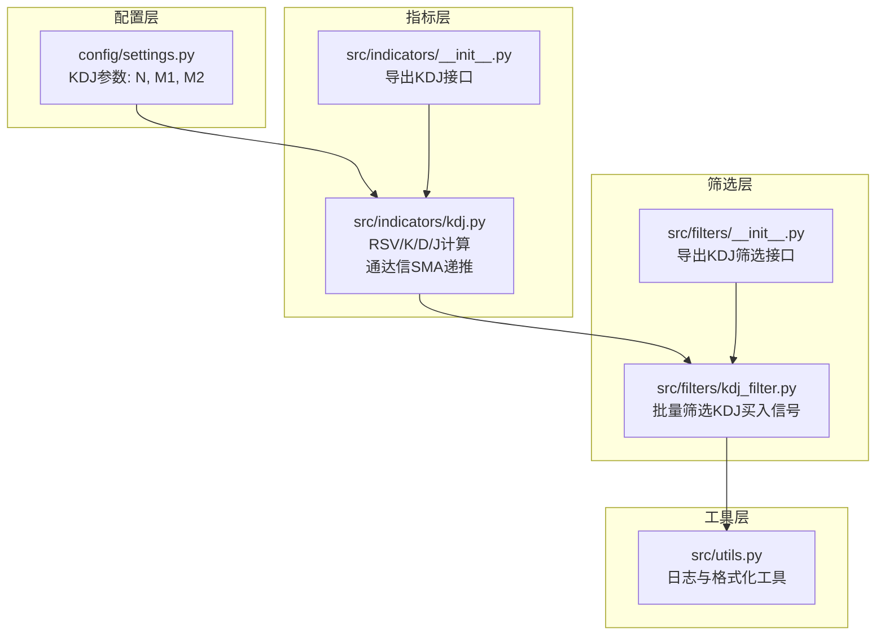
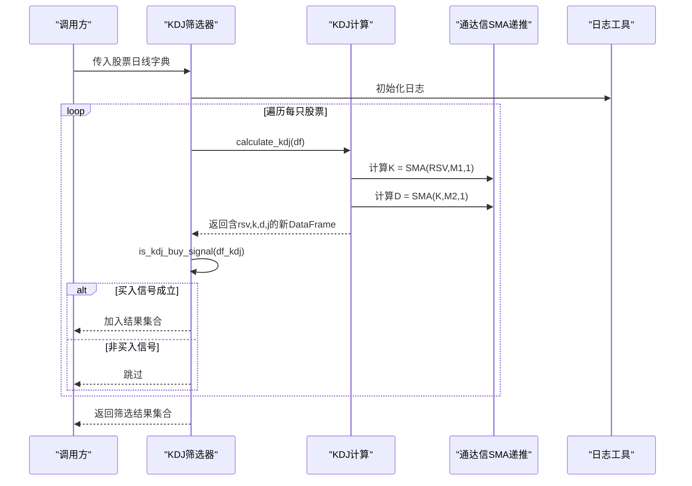
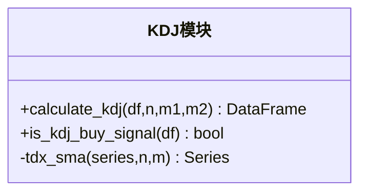
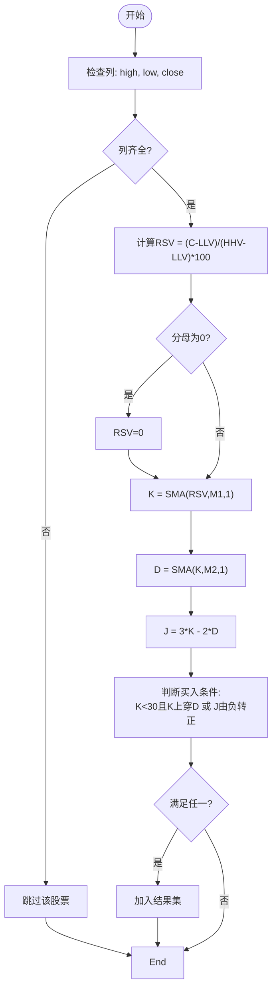
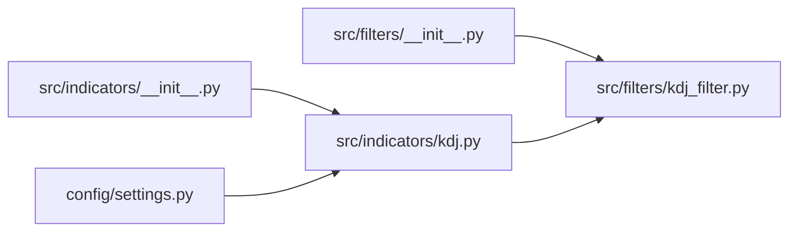

# KDJ指标计算

<cite>
**本文档引用的文件**
- [src/indicators/kdj.py](file://src/indicators/kdj.py)
- [src/filters/kdj_filter.py](file://src/filters/kdj_filter.py)
- [config/settings.py](file://config/settings.py)
- [src/indicators/__init__.py](file://src/indicators/__init__.py)
- [src/filters/__init__.py](file://src/filters/__init__.py)
- [src/utils.py](file://src/utils.py)
</cite>

## 目录
1. [简介](#简介)
2. [项目结构](#项目结构)
3. [核心组件](#核心组件)
4. [架构总览](#架构总览)
5. [详细组件分析](#详细组件分析)
6. [依赖分析](#依赖分析)
7. [性能考虑](#性能考虑)
8. [故障排查指南](#故障排查指南)
9. [结论](#结论)
10. [附录](#附录)

## 简介
本文件面向KDJ指标计算模块，系统性阐述其数学原理、通达信算法实现、参数配置与使用注意事项，并提供计算流程图、序列调用图与解读示例，帮助读者在技术分析场景中正确理解与应用KDJ指标。

## 项目结构
KDJ指标计算位于指标模块中，配合筛选器模块与配置模块协同工作，形成“计算—筛选—输出”的完整链路。

图表来源
- [config/settings.py:12-15](file://config/settings.py#L12-L15)
- [src/indicators/kdj.py:13](file://src/indicators/kdj.py#L13)
- [src/indicators/__init__.py:2](file://src/indicators/__init__.py#L2)
- [src/filters/kdj_filter.py:3](file://src/filters/kdj_filter.py#L3)
- [src/filters/__init__.py:4](file://src/filters/__init__.py#L4)
- [src/utils.py:9](file://src/utils.py#L9)

章节来源
- [config/settings.py:12-15](file://config/settings.py#L12-L15)
- [src/indicators/kdj.py:11-13](file://src/indicators/kdj.py#L11-L13)
- [src/filters/kdj_filter.py:1](file://src/filters/kdj_filter.py#L1)

## 核心组件
- KDJ指标计算函数：负责RSV、K、D、J的计算，并严格遵循通达信SMA递推公式。
- 通达信SMA递推算法：提供初始值设定与NaN处理逻辑。
- 买入信号判定函数：基于K上穿D或J由负转正的条件进行判断。
- KDJ筛选器：对批量股票数据进行KDJ指标计算与买入信号识别。
- 配置参数：集中定义KDJ的周期参数N、M1、M2。

章节来源
- [src/indicators/kdj.py:45-76](file://src/indicators/kdj.py#L45-L76)
- [src/indicators/kdj.py:16-42](file://src/indicators/kdj.py#L16-L42)
- [src/indicators/kdj.py:79-109](file://src/indicators/kdj.py#L79-L109)
- [src/filters/kdj_filter.py:9-50](file://src/filters/kdj_filter.py#L9-L50)
- [config/settings.py:12-15](file://config/settings.py#L12-L15)

## 架构总览
KDJ模块采用“纯函数式”设计，输入为包含高低价收的DataFrame，输出为新增RSV、K、D、J列的DataFrame；筛选器通过遍历股票字典，逐只计算并判断买入信号，最终返回满足条件的股票集合。

图表来源
- [src/filters/kdj_filter.py:26-41](file://src/filters/kdj_filter.py#L26-L41)
- [src/indicators/kdj.py:45-76](file://src/indicators/kdj.py#L45-L76)
- [src/indicators/kdj.py:16-42](file://src/indicators/kdj.py#L16-L42)
- [src/utils.py:9](file://src/utils.py#L9)

## 详细组件分析

### 数学原理与通达信算法
- RSV计算：基于N周期最低价与最高价，将收盘价标准化到[0,100]区间。
- K值：对RSV做通达信SMA递推平滑，权重参数为M1，初始值取RSV首个有效值。
- D值：对K做通达信SMA递推平滑，权重参数为M2。
- J值：3倍K减去2倍D，用于放大背离信号。

通达信SMA递推公式要点：
- 初始值：取序列首个非空值作为第一期SMA。
- 递推：当前期 = (M × 当前期数值 + (N − M) × 前一期SMA) / N。
- NaN处理：若当期数值为NaN，则沿用前一日SMA值。

章节来源
- [src/indicators/kdj.py:3-9](file://src/indicators/kdj.py#L3-L9)
- [src/indicators/kdj.py:54-68](file://src/indicators/kdj.py#L54-L68)
- [src/indicators/kdj.py:16-42](file://src/indicators/kdj.py#L16-L42)

### 函数与类关系
KDJ模块以纯函数为主，不涉及类封装，便于组合与测试。

图表来源
- [src/indicators/kdj.py:45-76](file://src/indicators/kdj.py#L45-L76)
- [src/indicators/kdj.py:79-109](file://src/indicators/kdj.py#L79-L109)
- [src/indicators/kdj.py:16-42](file://src/indicators/kdj.py#L16-L42)

### 计算流程与边界处理
- 输入校验：要求DataFrame包含high、low、close列；至少2天数据才可判断买入信号。
- RSV边界：当分母为0时，RSV置为0，避免除零。
- NaN处理：SMA遇到NaN时沿用前一日值，保证序列连续性。
- 买入条件：满足以下任一即为买入信号
  - K在低位（<30）向上交叉D（今日K>D且昨日K≤D）
  - J由负值转正值（昨日J<0且今日J≥0）

图表来源
- [src/indicators/kdj.py:45-76](file://src/indicators/kdj.py#L45-L76)
- [src/indicators/kdj.py:79-109](file://src/indicators/kdj.py#L79-L109)

### 通达信SMA递推实现细节
- 寻找首个有效值作为初始SMA，确保序列从首个可用数据点开始平滑。
- 遇NaN时沿用前一日SMA，避免因缺失值导致整条序列断裂。
- 递推公式严格遵循通达信定义，保证与软件端结果一致。

章节来源
- [src/indicators/kdj.py:16-42](file://src/indicators/kdj.py#L16-L42)

### 买入信号判定逻辑
- 时间窗口：至少需要2天数据，否则无法比较今日与昨日。
- NaN防护：若任一日的K、D、J存在NaN，直接视为非买入信号。
- 条件1：K在低位（<30）向上穿越D，通常代表短期动能增强。
- 条件2：J由负转正，反映超卖修复，常伴随趋势反转。

章节来源
- [src/indicators/kdj.py:79-109](file://src/indicators/kdj.py#L79-L109)

### 批量筛选流程
- 输入：股票代码到日线DataFrame的映射。
- 过滤门槛：每只股票至少15个交易日，且包含high、low、close列。
- 输出：满足买入信号的股票代码集合。
- 日志：记录开始、进度与完成信息，便于监控执行状态。

章节来源
- [src/filters/kdj_filter.py:9-50](file://src/filters/kdj_filter.py#L9-L50)
- [src/utils.py:9](file://src/utils.py#L9)

## 依赖分析
- 指标导出：通过指标包的初始化文件统一导出KDJ计算与信号判定接口。
- 筛选导出：通过筛选包的初始化文件统一导出KDJ筛选接口。
- 配置依赖：KDJ参数来自配置文件，便于集中管理与调整。

图表来源
- [src/indicators/__init__.py:2](file://src/indicators/__init__.py#L2)
- [src/filters/__init__.py:4](file://src/filters/__init__.py#L4)
- [config/settings.py:12-15](file://config/settings.py#L12-L15)
- [src/indicators/kdj.py:13](file://src/indicators/kdj.py#L13)

章节来源
- [src/indicators/__init__.py:2](file://src/indicators/__init__.py#L2)
- [src/filters/__init__.py:4](file://src/filters/__init__.py#L4)
- [config/settings.py:12-15](file://config/settings.py#L12-L15)

## 性能考虑
- 向量化计算：使用pandas rolling与numpy向量化操作，提升大样本数据处理效率。
- 内存占用：复制DataFrame一次，新增四列；整体内存开销可控。
- 并发与批处理：筛选器按股票循环处理，适合批量数据处理；如需加速可结合多进程策略（需在上层调用处扩展）。
- NaN处理：沿用前一日SMA减少无效计算，避免重复扫描。

章节来源
- [src/indicators/kdj.py:54-68](file://src/indicators/kdj.py#L54-L68)
- [src/indicators/kdj.py:36-42](file://src/indicators/kdj.py#L36-L42)

## 故障排查指南
- 缺少必要列：若DataFrame缺少high、low、close列，筛选器会跳过该股票并记录警告。
- 数据不足：若股票数据少于15日，筛选器会跳过该股票。
- NaN导致信号缺失：若K、D、J任一出现NaN，买入信号判定返回False。
- 计算异常：筛选器捕获异常并记录日志，不影响其他股票的处理。
- 日志定位：通过日志文件定位具体失败股票与错误原因。

章节来源
- [src/filters/kdj_filter.py:28-44](file://src/filters/kdj_filter.py#L28-L44)
- [src/utils.py:9](file://src/utils.py#L9)

## 结论
本模块严格遵循通达信公式实现KDJ指标，具备清晰的RSV、K、D、J计算流程与稳健的买入信号判定机制。通过集中参数配置与模块化设计，既保证了与软件端的一致性，又便于在批量筛选场景中高效运行。建议在实际应用中结合市场阶段与其它指标进行综合判断，以降低误判风险。

## 附录

### 参数配置与使用建议
- 默认参数：N=9，M1=3，M2=3。适用于大多数日线级别震荡行情。
- 参数调整建议：
  - 更敏感：缩短N或M1/M2，适合震荡偏强的行情。
  - 更稳健：延长N或增大M1/M2，适合震荡偏弱或趋势行情。
- 使用注意事项：
  - KDJ对极端行情（单边上涨/下跌）可能产生误导，建议结合趋势指标共同判断。
  - 买入信号在超卖区域（K<30）出现更可靠，但需关注成交量与外部消息面。
  - 不同周期（日线、周线）下参数可差异化设置，避免过度拟合。

章节来源
- [config/settings.py:12-15](file://config/settings.py#L12-L15)

### 计算示例与解读案例
- 示例思路（不展示具体数值）：
  - 步骤1：准备包含high、low、close的DataFrame，按日期升序排列。
  - 步骤2：调用计算函数得到rsv、k、d、j列。
  - 步骤3：调用买入信号函数，判断今日是否满足K上穿D或J由负转正。
- 解读要点：
  - K上穿D：短期动能增强，适合轻仓试多。
  - J由负转正：超卖修复信号，适合短线博弈。
  - 超买/超卖区：K接近80或20时，注意回调风险。

章节来源
- [src/indicators/kdj.py:45-76](file://src/indicators/kdj.py#L45-L76)
- [src/indicators/kdj.py:79-109](file://src/indicators/kdj.py#L79-L109)