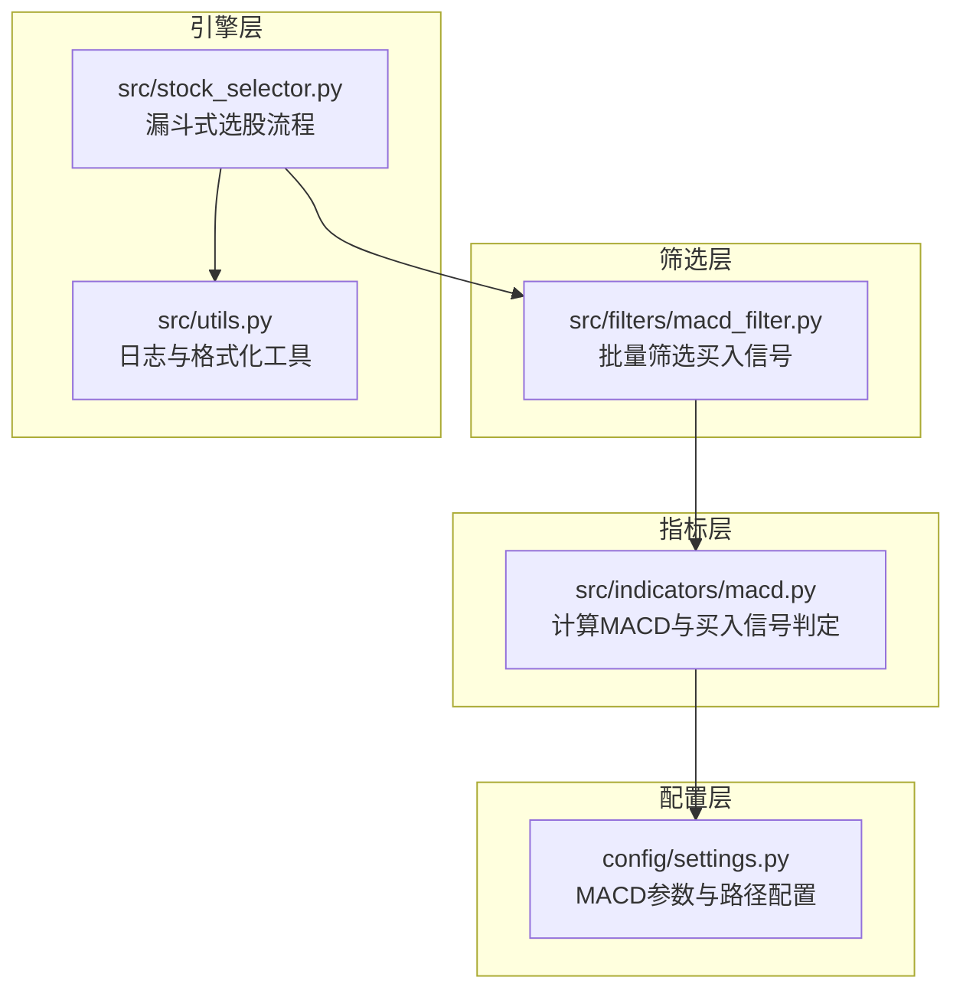
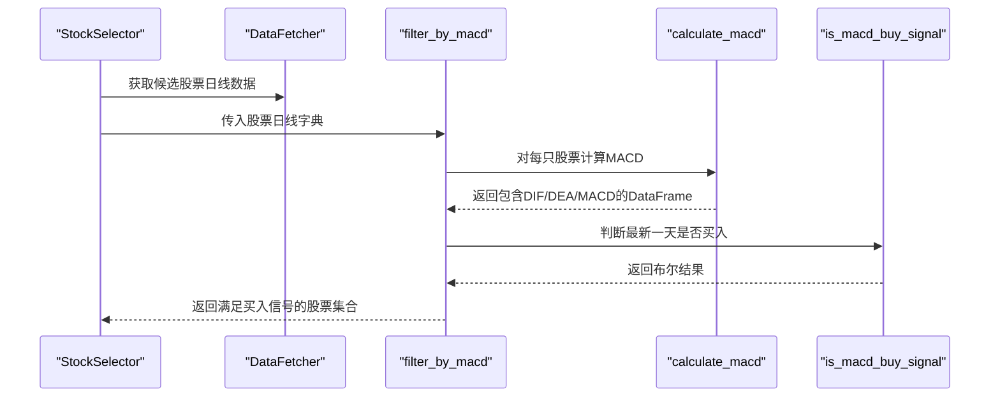
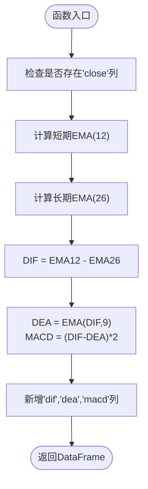
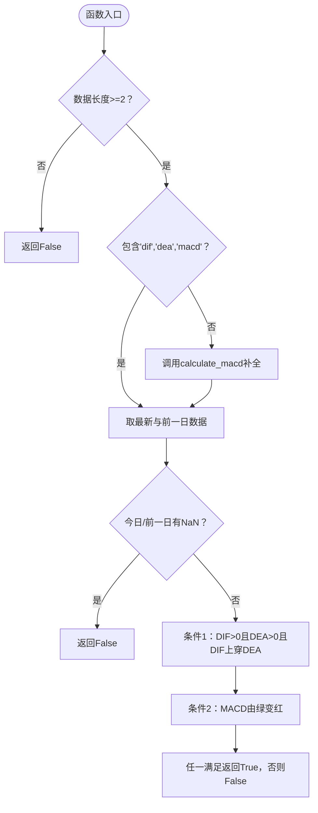
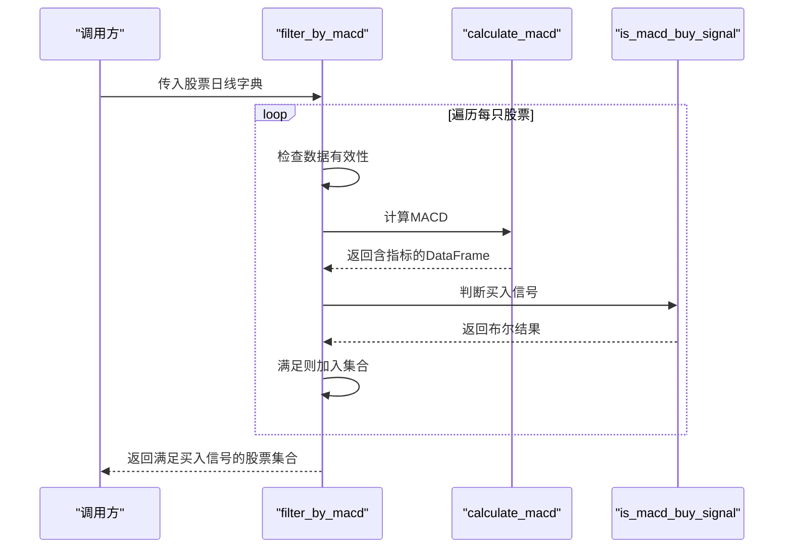
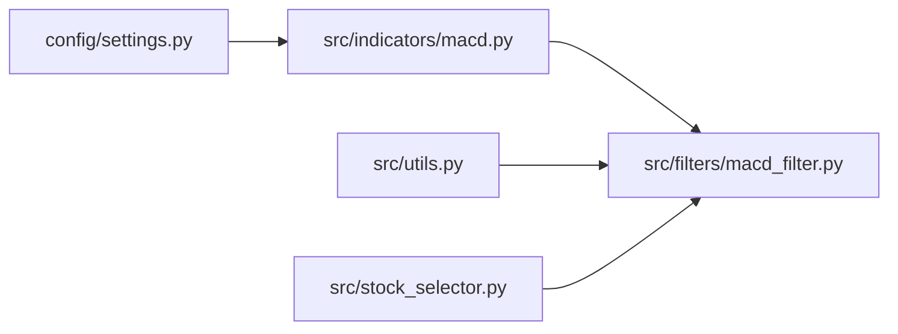

# MACD指标计算

<cite>
**本文引用的文件**
- [src/indicators/macd.py](file://src/indicators/macd.py)
- [src/filters/macd_filter.py](file://src/filters/macd_filter.py)
- [config/settings.py](file://config/settings.py)
- [src/stock_selector.py](file://src/stock_selector.py)
- [src/utils.py](file://src/utils.py)
- [src/indicators/__init__.py](file://src/indicators/__init__.py)
- [src/filters/__init__.py](file://src/filters/__init__.py)
</cite>

## 目录
1. [简介](#简介)
2. [项目结构](#项目结构)
3. [核心组件](#核心组件)
4. [架构概览](#架构概览)
5. [详细组件分析](#详细组件分析)
6. [依赖分析](#依赖分析)
7. [性能考虑](#性能考虑)
8. [故障排查指南](#故障排查指南)
9. [结论](#结论)
10. [附录](#附录)

## 简介
本文件针对MACD指标计算模块进行系统性技术文档整理，重点覆盖以下内容：
- MACD指标的数学原理与通达信严格实现方式
- DIF、DEA与MACD柱状图的计算步骤与公式来源
- 指数移动平均（EMA）的实现细节与参数配置
- is_macd_buy_signal函数的买入信号判断逻辑与两个条件的实现
- 参数调优建议与性能优化策略
- 计算示例与信号识别案例

## 项目结构
MACD模块位于src/indicators子目录，配合筛选器与主引擎协同工作：
- 指标计算：src/indicators/macd.py
- 筛选器：src/filters/macd_filter.py
- 配置参数：config/settings.py
- 主引擎：src/stock_selector.py
- 工具函数：src/utils.py
- 包导出：src/indicators/__init__.py、src/filters/__init__.py

图表来源
- [src/indicators/macd.py:1-67](file://src/indicators/macd.py#L1-L67)
- [src/filters/macd_filter.py:1-46](file://src/filters/macd_filter.py#L1-L46)
- [config/settings.py:1-31](file://config/settings.py#L1-L31)
- [src/stock_selector.py:1-202](file://src/stock_selector.py#L1-L202)
- [src/utils.py:1-134](file://src/utils.py#L1-L134)

章节来源
- [src/indicators/macd.py:1-67](file://src/indicators/macd.py#L1-L67)
- [src/filters/macd_filter.py:1-46](file://src/filters/macd_filter.py#L1-L46)
- [config/settings.py:1-31](file://config/settings.py#L1-L31)
- [src/stock_selector.py:1-202](file://src/stock_selector.py#L1-L202)
- [src/utils.py:1-134](file://src/utils.py#L1-L134)

## 核心组件
- calculate_macd：计算MACD指标（DIF、DEA、MACD），严格遵循通达信公式
- is_macd_buy_signal：判断最新一天是否发出买入信号，支持两个条件
- filter_by_macd：批量筛选满足买入信号的股票集合
- 配置项：MACD_SHORT、MACD_LONG、MACD_MID（12、26、9）

章节来源
- [src/indicators/macd.py:13-33](file://src/indicators/macd.py#L13-L33)
- [src/indicators/macd.py:36-66](file://src/indicators/macd.py#L36-L66)
- [src/filters/macd_filter.py:9-45](file://src/filters/macd_filter.py#L9-L45)
- [config/settings.py:7-10](file://config/settings.py#L7-L10)

## 架构概览
MACD模块在主引擎中作为第二步筛选器参与漏斗式选股流程，其调用链如下：

图表来源
- [src/stock_selector.py:126-135](file://src/stock_selector.py#L126-L135)
- [src/filters/macd_filter.py:9-45](file://src/filters/macd_filter.py#L9-L45)
- [src/indicators/macd.py:13-33](file://src/indicators/macd.py#L13-L33)
- [src/indicators/macd.py:36-66](file://src/indicators/macd.py#L36-L66)

## 详细组件分析

### 指标计算：calculate_macd
- 输入要求：DataFrame必须包含'close'列，按日期升序排列
- 参数来源：从配置读取短期（12）、长期（26）、中线（9）周期
- 计算步骤：
  1) 使用pandas的指数加权移动平均（span=周期，adjust=False）分别计算短期与长期EMA
  2) DIF = 短期EMA - 长期EMA
  3) DEA = DIF的中线EMA（span=9，adjust=False）
  4) MACD = (DIF - DEA) × 2
- 输出：在原DataFrame上新增'dif'、'dea'、'macd'三列并返回

图表来源
- [src/indicators/macd.py:13-33](file://src/indicators/macd.py#L13-L33)
- [config/settings.py:7-10](file://config/settings.py#L7-L10)

章节来源
- [src/indicators/macd.py:13-33](file://src/indicators/macd.py#L13-L33)
- [config/settings.py:7-10](file://config/settings.py#L7-L10)

### 买入信号判定：is_macd_buy_signal
- 输入：DataFrame（可包含或不包含DIF/DEA/MACD列）
- 输出：布尔值，表示最新一天是否满足买入条件
- 判定条件（任一满足即为买入）：
  1) DIF > 0 且 DEA > 0，且DIF从下向上首次突破DEA（今日DIF>DEA，昨日DIF<=DEA）
  2) MACD柱由绿变红（前一日MACD<0，今日MACD>=0）
- 边界处理：
  - 若数据长度不足2或存在NaN，则直接返回False
  - 若DataFrame缺少所需列，则先调用calculate_macd补全

图表来源
- [src/indicators/macd.py:36-66](file://src/indicators/macd.py#L36-L66)

章节来源
- [src/indicators/macd.py:36-66](file://src/indicators/macd.py#L36-L66)

### 批量筛选：filter_by_macd
- 输入：股票日线字典（键为股票代码，值为DataFrame，需包含'close'列，至少35个交易日）
- 处理流程：
  1) 遍历每个股票，若数据不足则跳过
  2) 调用calculate_macd生成指标列
  3) 调用is_macd_buy_signal判断是否买入
  4) 将满足条件的股票代码加入结果集合
- 日志记录：分批输出筛选进度与命中数量

图表来源
- [src/filters/macd_filter.py:9-45](file://src/filters/macd_filter.py#L9-L45)
- [src/indicators/macd.py:13-33](file://src/indicators/macd.py#L13-L33)
- [src/indicators/macd.py:36-66](file://src/indicators/macd.py#L36-L66)

章节来源
- [src/filters/macd_filter.py:9-45](file://src/filters/macd_filter.py#L9-L45)

### 配置参数与导入导出
- 配置参数：MACD_SHORT=12、MACD_LONG=26、MACD_MID=9
- 包导出：通过__init__.py将calculate_macd与is_macd_buy_signal暴露给上层模块

章节来源
- [config/settings.py:7-10](file://config/settings.py#L7-L10)
- [src/indicators/__init__.py:1-4](file://src/indicators/__init__.py#L1-L4)
- [src/filters/__init__.py:1-5](file://src/filters/__init__.py#L1-L5)

## 依赖分析
- 模块内聚与耦合
  - calculate_macd与is_macd_buy_signal高度内聚，共同构成MACD指标域
  - filter_by_macd依赖calculate_macd与is_macd_buy_signal，形成筛选层
  - 配置层通过settings.py集中管理参数，降低硬编码耦合
- 外部依赖
  - pandas/numpy用于数值计算与向量化操作
  - logging用于筛选过程的日志记录
- 潜在循环依赖
  - 当前结构无循环依赖；若后续扩展，应避免在indicators与filters之间互相导入

图表来源
- [config/settings.py:7-10](file://config/settings.py#L7-L10)
- [src/indicators/macd.py](file://src/indicators/macd.py#L10)
- [src/filters/macd_filter.py](file://src/filters/macd_filter.py#L3)
- [src/utils.py](file://src/utils.py#L6)
- [src/stock_selector.py:5-11](file://src/stock_selector.py#L5-L11)

章节来源
- [config/settings.py:7-10](file://config/settings.py#L7-L10)
- [src/indicators/macd.py](file://src/indicators/macd.py#L10)
- [src/filters/macd_filter.py](file://src/filters/macd_filter.py#L3)
- [src/utils.py](file://src/utils.py#L6)
- [src/stock_selector.py:5-11](file://src/stock_selector.py#L5-L11)

## 性能考虑
- 向量化优先：使用pandas的ewm与算术运算，避免显式循环
- adjust=False：与通达信一致的EMA实现，确保跨平台一致性
- 数据预处理：筛选器要求至少35个交易日，减少无效计算
- 批量处理：filter_by_macd按批次记录日志，便于监控与资源控制
- 内存与时间复杂度
  - 单只股票：O(n)，n为交易日数量
  - 批量筛选：O(m×n)，m为股票数量，n为交易日数量
- 优化建议
  - 对于超大规模数据集，可考虑分块处理与并行化（如多进程）
  - 缓存中间结果（如EMA中间值）以复用，减少重复计算
  - 在高频场景下，可将关键路径用Cython或numba加速

## 故障排查指南
- 常见问题
  - 数据长度不足：当DataFrame长度小于2时，is_macd_buy_signal直接返回False
  - 缺失必要列：若缺少'dif'、'dea'、'macd'，会自动调用calculate_macd补全
  - NaN值：若最新或前一日任一指标为NaN，返回False
  - 输入数据格式：确保DataFrame包含'close'列且按日期升序排列
- 日志定位
  - filter_by_macd在处理异常时会记录警告信息，便于定位具体股票与错误原因
- 建议排查步骤
  1) 检查输入DataFrame的列名与长度
  2) 查看日志输出，确认筛选进度与命中数量
  3) 对个别股票单独调用calculate_macd与is_macd_buy_signal验证

章节来源
- [src/indicators/macd.py:42-56](file://src/indicators/macd.py#L42-L56)
- [src/filters/macd_filter.py:37-39](file://src/filters/macd_filter.py#L37-L39)
- [src/utils.py:9-30](file://src/utils.py#L9-L30)

## 结论
MACD模块以通达信公式为基准，实现了严格的指标计算与买入信号判定，并通过筛选器与主引擎集成到完整的漏斗式选股流程中。其设计强调：
- 严格遵循通达信公式，保证跨平台一致性
- 清晰的职责划分与良好的内聚性
- 完善的边界处理与日志记录
- 可扩展的参数配置与潜在的性能优化空间

## 附录

### 通达信公式与实现对照
- DIF = EMA(CLOSE, 12) - EMA(CLOSE, 26)
- DEA = EMA(DIF, 9)
- MACD = (DIF - DEA) × 2
- 实现要点：使用pandas ewm(span=周期, adjust=False)，与通达信一致

章节来源
- [src/indicators/macd.py:3-6](file://src/indicators/macd.py#L3-L6)
- [src/indicators/macd.py:20-26](file://src/indicators/macd.py#L20-L26)

### 参数调优建议
- 周期选择
  - 12/26/9为经典参数，适合中短期趋势跟踪
  - 若追求更灵敏，可尝试缩短周期（如9/21/6），但可能增加噪音
  - 若追求更稳健，可延长周期（如15/30/12），但可能滞后
- 信号阈值
  - 当前实现未引入额外阈值，保持与通达信一致
  - 可根据回测结果在上穿与柱状变化处设置微调阈值（需谨慎，避免过拟合）
- 数据长度
  - 筛选器要求至少35个交易日，建议结合业务需求调整最小数据长度

章节来源
- [config/settings.py:7-10](file://config/settings.py#L7-L10)
- [src/filters/macd_filter.py](file://src/filters/macd_filter.py#L28)

### 计算示例与信号识别案例
- 示例思路
  - 选取某股票的历史日线数据（至少35日），包含'close'列
  - 调用calculate_macd得到DIF、DEA、MACD序列
  - 调用is_macd_buy_signal判断最新一天是否满足买入条件
- 信号识别
  - 条件1：DIF与DEA均大于0，且DIF从下方首次上穿DEA
  - 条件2：MACD柱由绿（负值）转为红（正值）
- 注意事项
  - 严格按日期升序排列，确保“今日/昨日”比较正确
  - 若存在NaN，需先补齐或剔除缺失值后再判断

章节来源
- [src/indicators/macd.py:36-66](file://src/indicators/macd.py#L36-L66)
- [src/filters/macd_filter.py](file://src/filters/macd_filter.py#L28)