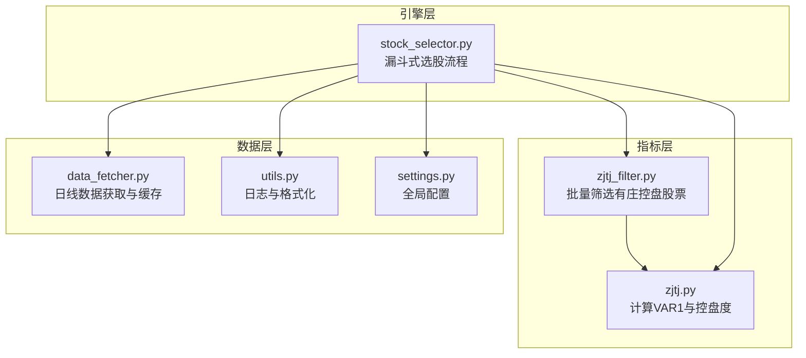
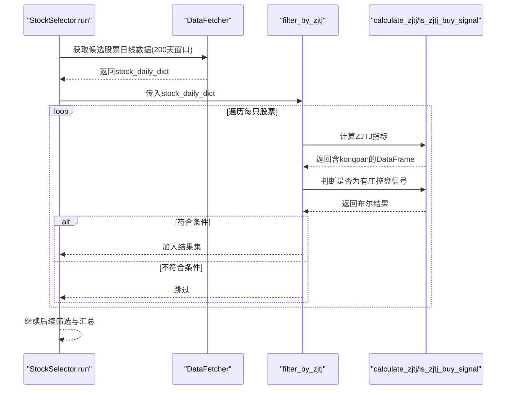
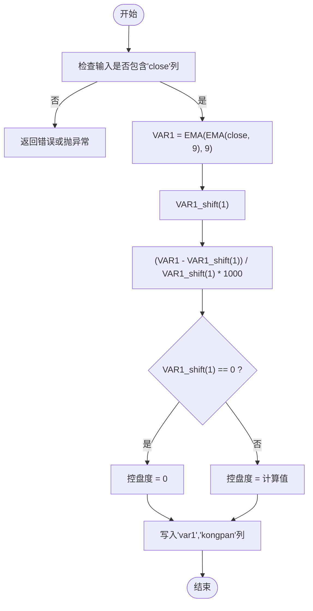
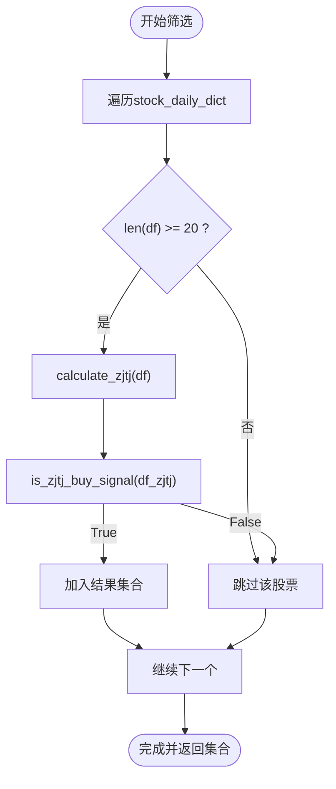
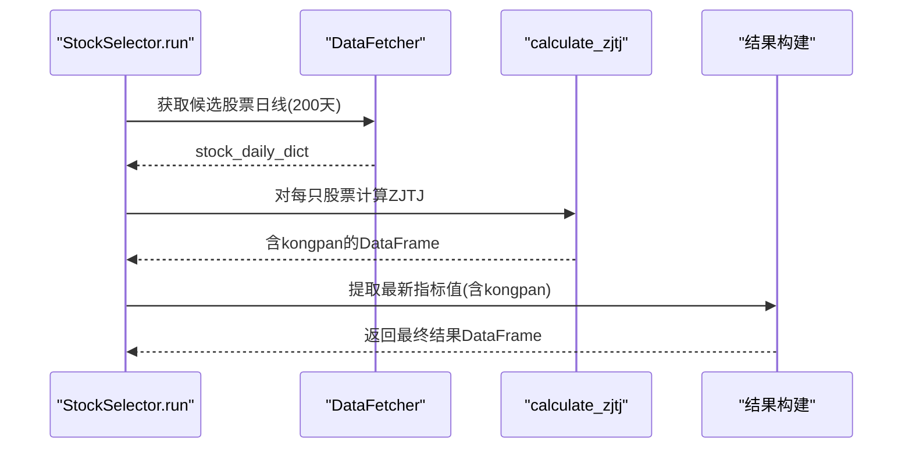
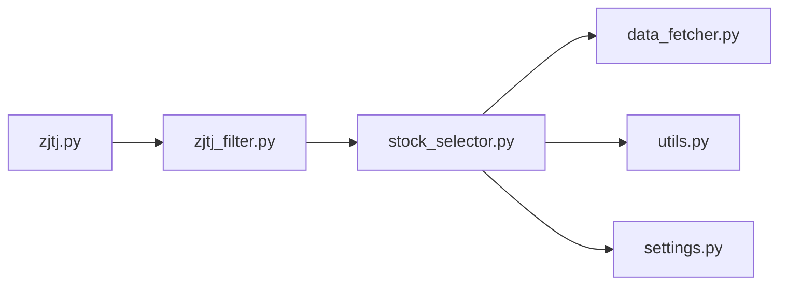

# 庄家控盘度计算

<cite>
**本文引用的文件**
- [src/indicators/zjtj.py](file://src/indicators/zjtj.py)
- [src/filters/zjtj_filter.py](file://src/filters/zjtj_filter.py)
- [src/stock_selector.py](file://src/stock_selector.py)
- [src/data_fetcher.py](file://src/data_fetcher.py)
- [src/utils.py](file://src/utils.py)
- [config/settings.py](file://config/settings.py)
</cite>

## 目录
1. [简介](#简介)
2. [项目结构](#项目结构)
3. [核心组件](#核心组件)
4. [架构总览](#架构总览)
5. [详细组件分析](#详细组件分析)
6. [依赖关系分析](#依赖关系分析)
7. [性能考量](#性能考量)
8. [故障排查指南](#故障排查指南)
9. [结论](#结论)
10. [附录](#附录)

## 简介
本文件围绕“庄家控盘度（ZJTJ）”指标的计算与应用，系统性梳理了指标的数学公式、实现细节、工程化封装、筛选流程以及实战使用建议。ZJTJ指标通过双指数平滑（两次EMA(9)）得到平滑价格序列，并以相邻两日该序列的变化率作为“控盘度”，用于识别“庄家介入程度在增加”的短期信号。本文同时给出指标解读、使用策略与实战案例思路，帮助读者在量化选股流程中正确理解与运用该指标。

## 项目结构
与ZJTJ相关的代码主要分布在以下模块：
- 指标计算模块：src/indicators/zjtj.py
- 筛选器模块：src/filters/zjtj_filter.py
- 主引擎（漏斗式选股）：src/stock_selector.py
- 数据获取与缓存：src/data_fetcher.py
- 工具与日志：src/utils.py
- 配置参数：config/settings.py

图表来源
- [src/stock_selector.py:45-185](file://src/stock_selector.py#L45-L185)
- [src/filters/zjtj_filter.py:9-45](file://src/filters/zjtj_filter.py#L9-L45)
- [src/indicators/zjtj.py:13-56](file://src/indicators/zjtj.py#L13-L56)
- [src/data_fetcher.py:143-200](file://src/data_fetcher.py#L143-L200)
- [src/utils.py:9-31](file://src/utils.py#L9-L31)
- [config/settings.py:1-31](file://config/settings.py#L1-L31)

章节来源
- [src/stock_selector.py:45-185](file://src/stock_selector.py#L45-L185)
- [src/filters/zjtj_filter.py:9-45](file://src/filters/zjtj_filter.py#L9-L45)
- [src/indicators/zjtj.py:13-56](file://src/indicators/zjtj.py#L13-L56)
- [src/data_fetcher.py:143-200](file://src/data_fetcher.py#L143-L200)
- [src/utils.py:9-31](file://src/utils.py#L9-L31)
- [config/settings.py:1-31](file://config/settings.py#L1-L31)

## 核心组件
- ZJTJ指标计算函数：对收盘价进行两次EMA(9)得到VAR1，再计算VAR1的环比变化率（乘以1000放大），形成“控盘度”序列。
- 信号判定函数：要求当日控盘度大于前一日且大于零，表示“庄家介入程度在增加”。
- 筛选器：遍历候选股票，逐只计算ZJTJ并判定是否发出“有庄控盘”信号。
- 引擎：在漏斗式选股流程中，作为第三步筛选器参与。

章节来源
- [src/indicators/zjtj.py:13-56](file://src/indicators/zjtj.py#L13-L56)
- [src/filters/zjtj_filter.py:9-45](file://src/filters/zjtj_filter.py#L9-L45)
- [src/stock_selector.py:137-146](file://src/stock_selector.py#L137-L146)

## 架构总览
ZJTJ在系统中的位置如下：
- 数据来源：通过DataFetcher从本地缓存或网络获取日线数据，保证至少约60个交易日的历史长度。
- 指标计算：在StockSelector中对候选股票批量计算MACD/KDJ/ZJTJ等指标，提取最新值组成最终结果。
- 筛选器：在漏斗流程中，ZJTJ作为第三步筛选器，过滤掉不符合“有庄控盘”条件的股票。

图表来源
- [src/stock_selector.py:100-146](file://src/stock_selector.py#L100-L146)
- [src/filters/zjtj_filter.py:9-45](file://src/filters/zjtj_filter.py#L9-L45)
- [src/indicators/zjtj.py:13-56](file://src/indicators/zjtj.py#L13-L56)

## 详细组件分析

### ZJTJ指标计算模块（src/indicators/zjtj.py）
- 数学公式与实现要点
  - VAR1 = EMA(EMA(CLOSE, 9), 9)：对收盘价做两次指数移动平均，平滑噪声，突出趋势。
  - 控盘度 = (VAR1(t) − VAR1(t−1)) / VAR1(t−1) × 1000：VAR1的环比变化率放大1000倍，便于观察与比较。
  - 特殊处理：当VAR1(t−1)为0时，控盘度设为0，避免除零。
- 输入输出约定
  - 输入：必须包含“close”列的DataFrame，按日期升序排列。
  - 输出：原DataFrame副本，新增“var1”和“kongpan”两列。
- 信号判定
  - 有庄控盘条件：当日控盘度 > 前一日控盘度 且 当日控盘度 > 0。
  - 适用前提：至少需要两日数据，且当日与前一日控盘度非空。

图表来源
- [src/indicators/zjtj.py:13-33](file://src/indicators/zjtj.py#L13-L33)
- [src/indicators/zjtj.py:36-56](file://src/indicators/zjtj.py#L36-L56)

章节来源
- [src/indicators/zjtj.py:13-56](file://src/indicators/zjtj.py#L13-L56)

### ZJTJ筛选器（src/filters/zjtj_filter.py）
- 功能概述
  - 对候选股票字典逐只计算ZJTJ指标，并判断是否满足“有庄控盘”条件。
  - 返回满足条件的股票代码集合。
- 关键逻辑
  - 数据长度校验：至少20个交易日。
  - 指标计算：调用calculate_zjtj(df)。
  - 信号判断：调用is_zjtj_buy_signal(df)。
  - 错误处理：单只股票异常不影响整体流程，记录警告日志。
- 性能与可观测性
  - 进度日志：每500只股票或最后一批输出一次统计信息。
  - 异常捕获：避免因个别股票数据异常导致整个筛选中断。

图表来源
- [src/filters/zjtj_filter.py:9-45](file://src/filters/zjtj_filter.py#L9-L45)

章节来源
- [src/filters/zjtj_filter.py:9-45](file://src/filters/zjtj_filter.py#L9-L45)

### StockSelector引擎中的ZJTJ集成（src/stock_selector.py）
- 选股流程中的位置
  - 第三步：在板块RPS、MACD、ZJTJ、KDJ之后，进入财务基本面筛选。
- 数据准备与计算
  - 仅对候选股票批量获取日线数据，避免全市场重复拉取。
  - 在最终结果构建阶段，对每只股票计算MACD/KDJ/ZJTJ并取最新值。
- 输出字段
  - 包含“kongpan”列，便于展示与复盘。

图表来源
- [src/stock_selector.py:100-146](file://src/stock_selector.py#L100-L146)
- [src/stock_selector.py:272-309](file://src/stock_selector.py#L272-L309)

章节来源
- [src/stock_selector.py:137-146](file://src/stock_selector.py#L137-L146)
- [src/stock_selector.py:272-309](file://src/stock_selector.py#L272-L309)

### 数据获取与缓存（src/data_fetcher.py）
- 列名映射：将AKShare返回的中文列名标准化为“date, code, open, close, high, low, volume, turnover_rate”等。
- 缓存表：stock_daily、sector_daily、profit_data等，支持重复运行与断点续跑。
- 重试与延迟：统一的请求包装，降低接口限流风险。

章节来源
- [src/data_fetcher.py:143-200](file://src/data_fetcher.py#L143-L200)

### 工具与日志（src/utils.py）
- 日志：统一配置控制台与文件输出，便于追踪筛选进度与异常。
- 日期：提供交易日格式化与周末回退逻辑。
- 结果格式化：将最终结果DataFrame格式化为对齐的文本表格，便于阅读。

章节来源
- [src/utils.py:9-31](file://src/utils.py#L9-L31)
- [src/utils.py:33-53](file://src/utils.py#L33-L53)
- [src/utils.py:56-134](file://src/utils.py#L56-L134)

### 配置参数（config/settings.py）
- 全局参数：数据库路径、输出路径、日志路径、请求超时/重试/延迟等。
- 与ZJTJ间接相关：历史窗口（约200天）与最小数据长度（≥20日）由引擎与筛选器共同保障。

章节来源
- [config/settings.py:1-31](file://config/settings.py#L1-L31)

## 依赖关系分析
- 模块内聚与耦合
  - zjtj.py与zjtj_filter.py：前者提供指标计算与信号判定，后者负责批量筛选，职责清晰。
  - stock_selector.py：作为引擎，依赖DataFetcher与多个筛选器，ZJTJ作为其中一环。
- 外部依赖
  - pandas/numpy：用于向量化计算与数组操作。
  - akshare：用于实时数据抓取（通过DataFetcher封装）。
- 循环依赖
  - 未发现循环导入，模块间调用方向明确。

图表来源
- [src/indicators/zjtj.py:13-56](file://src/indicators/zjtj.py#L13-L56)
- [src/filters/zjtj_filter.py:9-45](file://src/filters/zjtj_filter.py#L9-L45)
- [src/stock_selector.py:45-185](file://src/stock_selector.py#L45-L185)
- [src/data_fetcher.py:143-200](file://src/data_fetcher.py#L143-L200)
- [src/utils.py:9-31](file://src/utils.py#L9-L31)
- [config/settings.py:1-31](file://config/settings.py#L1-L31)

## 性能考量
- 向量化优先：使用pandas的ewm与shift实现，避免显式循环，提升吞吐。
- 批量处理：在StockSelector中仅对候选股票计算指标，减少无效工作量。
- 异常隔离：筛选器对单只股票异常进行捕获与跳过，保证整体流程稳定。
- I/O优化：通过DataFetcher的缓存表与重试机制，降低网络波动影响。

## 故障排查指南
- “控盘度为NaN或异常”
  - 检查输入是否包含“close”列且按日期升序。
  - 确认历史数据长度至少为20日。
  - 若VAR1(t−1)为0，控盘度将被置为0，属正常保护逻辑。
- “筛选结果为空”
  - 可能由于候选股票数量不足或数据质量不佳。
  - 查看筛选器日志中的进度与命中数。
- “日线数据缺失”
  - 检查DataFetcher的缓存表与网络请求状态。
  - 确认日期范围与交易日设置（周末自动回退）。

章节来源
- [src/indicators/zjtj.py:24-27](file://src/indicators/zjtj.py#L24-L27)
- [src/filters/zjtj_filter.py:28-29](file://src/filters/zjtj_filter.py#L28-L29)
- [src/utils.py:33-53](file://src/utils.py#L33-L53)

## 结论
ZJTJ指标通过双EMA平滑与环比变化率，有效捕捉短期“庄家介入程度增加”的信号。在工程实现上，模块职责清晰、可扩展性强；在系统流程中，作为漏斗式选股的第三步筛选器，与其他技术面指标协同，有助于提高选股命中率与稳定性。建议结合成交量、换手率与价格趋势进行多因子验证，并在实盘中以小仓位试仓、严格止损。

## 附录

### 指标解读与使用策略
- 指标含义
  - 控盘度为正且逐日递增，通常意味着主力资金在持续建仓或控盘，短期内上涨动能可能增强。
- 使用建议
  - 与MACD/KDJ等其他技术指标组合，避免单一信号误判。
  - 关注成交量与换手率配合：若控盘度上升但量能萎缩，可能存在分歧。
  - 设置时间窗口：建议至少观察3-5日连续递增，提高可靠性。
- 风险提示
  - 控盘度为短期信号，不能替代基本面分析。
  - 避免追高，应等待确认信号后再入场。

### 实战应用案例思路
- 案例1：板块轮动期间，利用板块RPS筛选热门方向，再依次通过MACD、ZJTJ、KDJ与财务筛选，最终得到具备“庄家控盘+技术共振”的标的池。
- 案例2：对某行业热点个股，观察其控盘度在回调后的首次递增，结合成交量温和放量，作为低吸机会的参考信号之一。
- 案例3：回测策略：当ZJTJ出现“有庄控盘”信号时触发买入信号，后续设定止盈止损位，评估胜率与收益风险比。