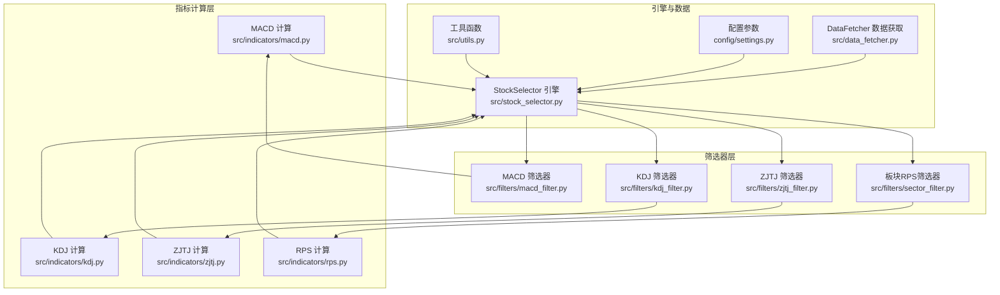
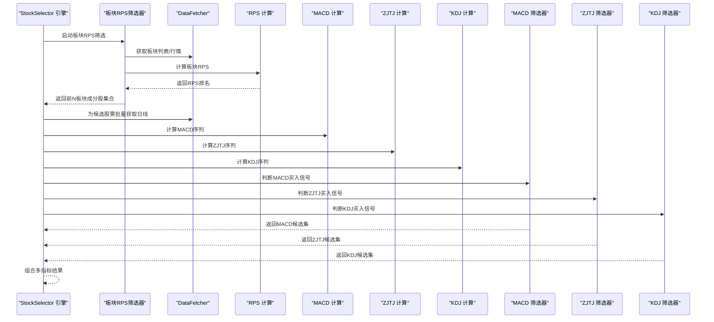
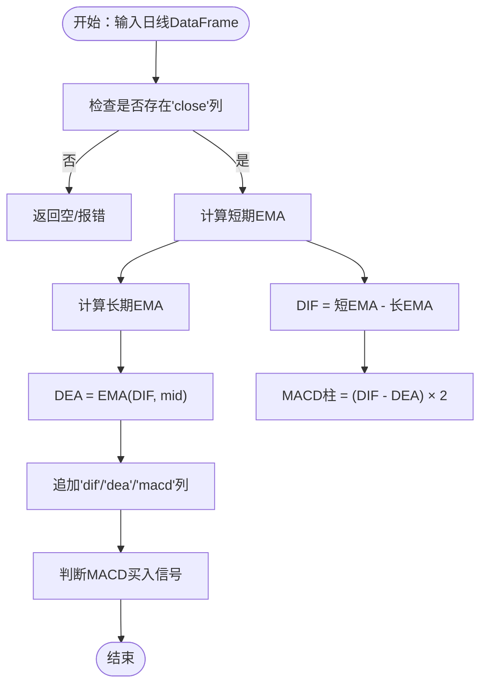
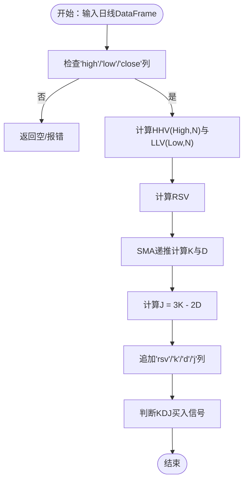
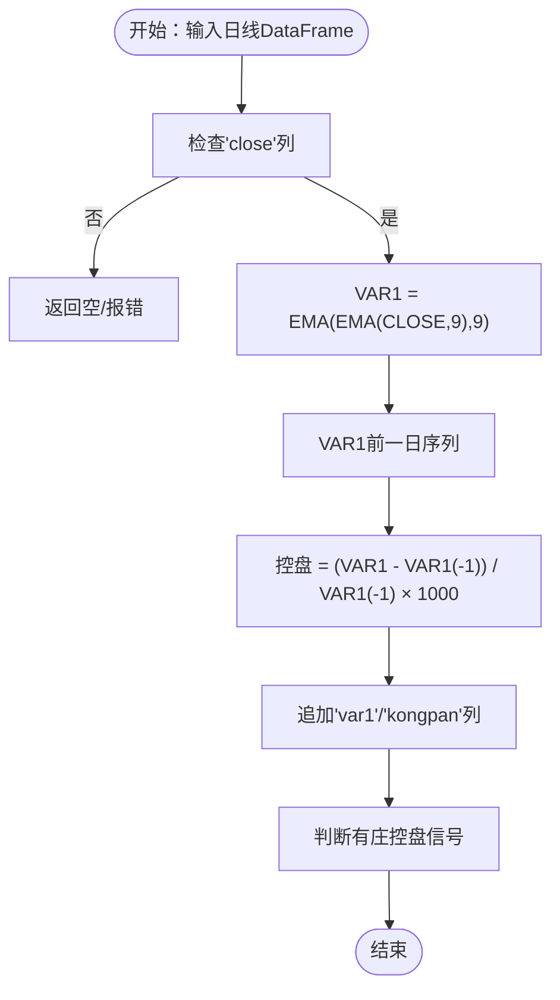
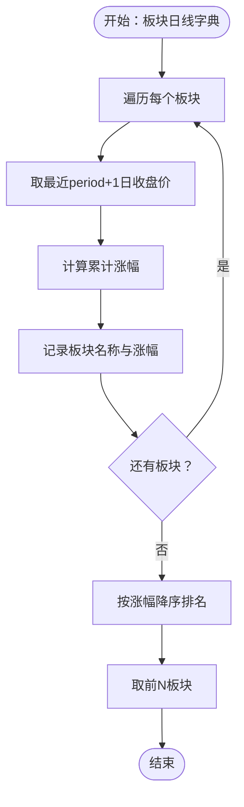
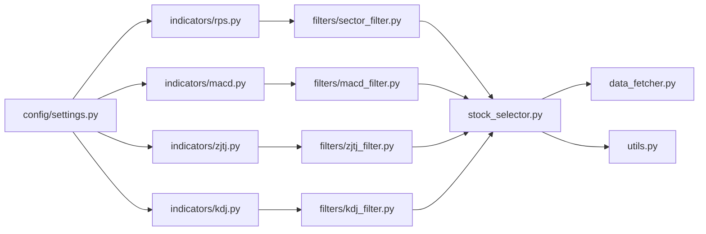

# 技术指标计算模块

<cite>
**本文引用的文件**
- [src/indicators/macd.py](file://src/indicators/macd.py)
- [src/indicators/kdj.py](file://src/indicators/kdj.py)
- [src/indicators/zjtj.py](file://src/indicators/zjtj.py)
- [src/indicators/rps.py](file://src/indicators/rps.py)
- [src/filters/macd_filter.py](file://src/filters/macd_filter.py)
- [src/filters/kdj_filter.py](file://src/filters/kdj_filter.py)
- [src/filters/zjtj_filter.py](file://src/filters/zjtj_filter.py)
- [src/filters/sector_filter.py](file://src/filters/sector_filter.py)
- [src/stock_selector.py](file://src/stock_selector.py)
- [src/data_fetcher.py](file://src/data_fetcher.py)
- [config/settings.py](file://config/settings.py)
- [src/utils.py](file://src/utils.py)
</cite>

## 目录
1. [简介](#简介)
2. [项目结构](#项目结构)
3. [核心组件](#核心组件)
4. [架构总览](#架构总览)
5. [详细组件分析](#详细组件分析)
6. [依赖关系分析](#依赖关系分析)
7. [性能考量](#性能考量)
8. [故障排查指南](#故障排查指南)
9. [结论](#结论)
10. [附录](#附录)

## 简介
本文件面向A股智能选股系统的“技术指标计算模块”，系统性阐述四个核心指标的数学原理、参数配置、信号判定逻辑、实现细节与性能优化策略，并提供最佳实践、参数调优建议、计算示例与可视化思路，以及指标组合使用的策略与效果评估方法。四个指标分别为：
- MACD（平滑异同移动平均）
- KDJ（随机指标）
- 庄家控盘度（ZJTJ）
- 板块相对强度（RPS）

## 项目结构
技术指标相关代码主要分布在以下位置：
- 指标计算模块：src/indicators/
- 筛选器模块：src/filters/
- 选股引擎：src/stock_selector.py
- 数据获取与缓存：src/data_fetcher.py
- 配置参数：config/settings.py
- 工具函数：src/utils.py

图表来源
- [src/indicators/macd.py:1-67](file://src/indicators/macd.py#L1-L67)
- [src/indicators/kdj.py:1-110](file://src/indicators/kdj.py#L1-L110)
- [src/indicators/zjtj.py:1-57](file://src/indicators/zjtj.py#L1-L57)
- [src/indicators/rps.py:1-61](file://src/indicators/rps.py#L1-L61)
- [src/filters/macd_filter.py:1-46](file://src/filters/macd_filter.py#L1-L46)
- [src/filters/kdj_filter.py:1-51](file://src/filters/kdj_filter.py#L1-L51)
- [src/filters/zjtj_filter.py:1-46](file://src/filters/zjtj_filter.py#L1-L46)
- [src/filters/sector_filter.py:1-73](file://src/filters/sector_filter.py#L1-L73)
- [src/stock_selector.py:45-185](file://src/stock_selector.py#L45-L185)
- [src/data_fetcher.py:143-774](file://src/data_fetcher.py#L143-L774)
- [config/settings.py:1-31](file://config/settings.py#L1-L31)
- [src/utils.py:1-134](file://src/utils.py#L1-L134)

章节来源
- [src/indicators/macd.py:1-67](file://src/indicators/macd.py#L1-L67)
- [src/indicators/kdj.py:1-110](file://src/indicators/kdj.py#L1-L110)
- [src/indicators/zjtj.py:1-57](file://src/indicators/zjtj.py#L1-L57)
- [src/indicators/rps.py:1-61](file://src/indicators/rps.py#L1-L61)
- [src/filters/macd_filter.py:1-46](file://src/filters/macd_filter.py#L1-L46)
- [src/filters/kdj_filter.py:1-51](file://src/filters/kdj_filter.py#L1-L51)
- [src/filters/zjtj_filter.py:1-46](file://src/filters/zjtj_filter.py#L1-L46)
- [src/filters/sector_filter.py:1-73](file://src/filters/sector_filter.py#L1-L73)
- [src/stock_selector.py:45-185](file://src/stock_selector.py#L45-L185)
- [src/data_fetcher.py:143-774](file://src/data_fetcher.py#L143-L774)
- [config/settings.py:1-31](file://config/settings.py#L1-L31)
- [src/utils.py:1-134](file://src/utils.py#L1-L134)

## 核心组件
本模块围绕四大指标的计算与信号判定展开，具体职责如下：
- MACD：计算DIF、DEA与MACD柱，提供买入信号判断
- KDJ：计算RSV、K、D、J，提供买入信号判断
- ZJTJ：计算庄家控盘度（基于双EMA），提供“有庄控盘”信号
- RPS：计算板块相对强度排名，用于板块热度筛选

章节来源
- [src/indicators/macd.py:13-33](file://src/indicators/macd.py#L13-L33)
- [src/indicators/kdj.py:45-76](file://src/indicators/kdj.py#L45-L76)
- [src/indicators/zjtj.py:13-33](file://src/indicators/zjtj.py#L13-L33)
- [src/indicators/rps.py:9-51](file://src/indicators/rps.py#L9-L51)

## 架构总览
四个指标均以“计算函数 + 信号判断函数”的形式组织，计算函数负责生成指标序列，信号判断函数基于最新两日数据进行条件判定。筛选器模块负责批量应用指标信号，引擎在漏斗式流程中串联各规则。

图表来源
- [src/stock_selector.py:45-185](file://src/stock_selector.py#L45-L185)
- [src/filters/sector_filter.py:11-73](file://src/filters/sector_filter.py#L11-L73)
- [src/indicators/rps.py:9-51](file://src/indicators/rps.py#L9-L51)
- [src/indicators/macd.py:13-33](file://src/indicators/macd.py#L13-L33)
- [src/indicators/zjtj.py:13-33](file://src/indicators/zjtj.py#L13-L33)
- [src/indicators/kdj.py:45-76](file://src/indicators/kdj.py#L45-L76)
- [src/filters/macd_filter.py:9-46](file://src/filters/macd_filter.py#L9-L46)
- [src/filters/zjtj_filter.py:9-46](file://src/filters/zjtj_filter.py#L9-L46)
- [src/filters/kdj_filter.py:9-51](file://src/filters/kdj_filter.py#L9-L51)

## 详细组件分析

### MACD 指标
- 数学公式与实现要点
  - 使用指数移动平均（EMA）计算短期与长期均线，DIF = EMA_short - EMA_long
  - DEA = EMA(DIF, mid)，MACD柱 = (DIF - DEA) × 2
  - 采用pandas的指数加权移动平均，参数span对应EMA周期，adjust=False以匹配通达信实现
- 参数配置
  - 短周期、长周期、信号周期分别由配置项提供，便于统一调整
- 信号判断逻辑
  - 买入条件（满足其一）：
    - DIF > 0 且 DEA > 0，且DIF向上突破DEA（今日DIF>DEA，昨日DIF<=DEA）
    - MACD柱由绿变红（前一日MACD<0，今日MACD>=0）
- 性能与内存
  - 使用向量化计算（pandas rolling/ewm），避免显式循环
  - 计算后复制DataFrame并追加新列，避免原数据被修改
- 使用建议
  - 确保输入数据至少包含35个交易日，以满足信号判断所需的前后两日比较
  - 若仅需信号判断，可直接调用信号函数，内部会在缺失指标列时自动补算

图表来源
- [src/indicators/macd.py:13-33](file://src/indicators/macd.py#L13-L33)
- [src/indicators/macd.py:36-67](file://src/indicators/macd.py#L36-L67)

章节来源
- [src/indicators/macd.py:13-33](file://src/indicators/macd.py#L13-L33)
- [src/indicators/macd.py:36-67](file://src/indicators/macd.py#L36-L67)
- [config/settings.py:7-11](file://config/settings.py#L7-L11)

### KDJ 指标
- 数学公式与实现要点
  - RSV = (CLOSE - LLV(LOW, N)) / (HHV(HIGH, N) - LLV(LOW, N)) × 100
  - K = SMA(RSV, M1, 1)，D = SMA(K, M2, 1)，J = 3×K − 2×D
  - SMA采用通达信递推算法：SMA(X, N, M) = (M×X + (N−M)×REF(SMA,1)) / N，初始值取首个有效值
- 参数配置
  - N、M1、M2由配置项提供，便于统一调整
- 信号判断逻辑
  - 买入条件（满足其一）：
    - K在20左右向上交叉D（K<30 且 今日K>D 且 昨日K<=D）
    - J从负值转正（昨日J<0，今日J>=0）
- 性能与内存
  - 使用滚动窗口函数计算HHV/LLV，SMA采用自定义递推实现，避免循环
  - 对分母为零的情况进行保护，防止除零
- 使用建议
  - 确保输入数据至少包含15个交易日，且包含'high'、'low'、'close'
  - 若仅需信号判断，可直接调用信号函数，内部会在缺失指标列时自动补算

图表来源
- [src/indicators/kdj.py:45-76](file://src/indicators/kdj.py#L45-L76)
- [src/indicators/kdj.py:79-110](file://src/indicators/kdj.py#L79-L110)

章节来源
- [src/indicators/kdj.py:16-42](file://src/indicators/kdj.py#L16-L42)
- [src/indicators/kdj.py:45-76](file://src/indicators/kdj.py#L45-L76)
- [src/indicators/kdj.py:79-110](file://src/indicators/kdj.py#L79-L110)
- [config/settings.py:12-16](file://config/settings.py#L12-L16)

### 庄家控盘度（ZJTJ）
- 数学公式与实现要点
  - VAR1 = EMA(EMA(CLOSE, 9), 9)
  - 控盘 = (VAR1 − REF(VAR1, 1)) / REF(VAR1, 1) × 1000
  - 本版本实现“有庄控盘”条件，不涉及筹码数据的“高度控盘”
- 参数配置
  - 本指标固定使用9日EMA周期
- 信号判断逻辑
  - 有庄控盘：今日控盘 > 昨日控盘 且 今日控盘 > 0（即庄家介入程度在增加）
- 性能与内存
  - 使用两次EMA与一次位移操作，向量化实现
  - 对分母为0进行保护
- 使用建议
  - 确保输入数据至少包含20个交易日
  - 该信号强调“控盘度上升”，适合捕捉主力资金介入初期

图表来源
- [src/indicators/zjtj.py:13-33](file://src/indicators/zjtj.py#L13-L33)
- [src/indicators/zjtj.py:36-57](file://src/indicators/zjtj.py#L36-L57)

章节来源
- [src/indicators/zjtj.py:13-33](file://src/indicators/zjtj.py#L13-L33)
- [src/indicators/zjtj.py:36-57](file://src/indicators/zjtj.py#L36-L57)

### 板块相对强度（RPS）
- 计算逻辑
  - 对每个板块，取最近period+1个交易日的收盘价，计算period天累计涨幅
  - 按涨幅降序排名，涨幅最高的rank=1
- 参数配置
  - period与top_n由配置项提供
- 使用建议
  - 用于板块热度筛选，结合板块RPS筛选器获取前N板块的成分股集合
  - 适合在漏斗式流程的第一步使用，缩小候选股票池

图表来源
- [src/indicators/rps.py:9-51](file://src/indicators/rps.py#L9-L51)

章节来源
- [src/indicators/rps.py:9-51](file://src/indicators/rps.py#L9-L51)
- [config/settings.py:3-6](file://config/settings.py#L3-L6)

## 依赖关系分析
- 指标计算模块之间无直接依赖，各自独立
- 筛选器模块依赖对应指标计算模块与工具函数
- 引擎通过筛选器串联流程，数据获取模块提供日线与板块数据
- 配置模块集中管理参数，工具模块提供日志与格式化

图表来源
- [config/settings.py:1-31](file://config/settings.py#L1-L31)
- [src/indicators/macd.py:1-67](file://src/indicators/macd.py#L1-L67)
- [src/indicators/kdj.py:1-110](file://src/indicators/kdj.py#L1-L110)
- [src/indicators/zjtj.py:1-57](file://src/indicators/zjtj.py#L1-L57)
- [src/indicators/rps.py:1-61](file://src/indicators/rps.py#L1-L61)
- [src/filters/macd_filter.py:1-46](file://src/filters/macd_filter.py#L1-L46)
- [src/filters/kdj_filter.py:1-51](file://src/filters/kdj_filter.py#L1-L51)
- [src/filters/zjtj_filter.py:1-46](file://src/filters/zjtj_filter.py#L1-L46)
- [src/filters/sector_filter.py:1-73](file://src/filters/sector_filter.py#L1-L73)
- [src/stock_selector.py:45-185](file://src/stock_selector.py#L45-L185)
- [src/data_fetcher.py:143-774](file://src/data_fetcher.py#L143-L774)
- [src/utils.py:1-134](file://src/utils.py#L1-L134)

章节来源
- [src/stock_selector.py:45-185](file://src/stock_selector.py#L45-L185)
- [src/filters/macd_filter.py:1-46](file://src/filters/macd_filter.py#L1-L46)
- [src/filters/kdj_filter.py:1-51](file://src/filters/kdj_filter.py#L1-L51)
- [src/filters/zjtj_filter.py:1-46](file://src/filters/zjtj_filter.py#L1-L46)
- [src/filters/sector_filter.py:1-73](file://src/filters/sector_filter.py#L1-L73)
- [src/data_fetcher.py:143-774](file://src/data_fetcher.py#L143-L774)
- [config/settings.py:1-31](file://config/settings.py#L1-L31)

## 性能考量
- 向量化优先：使用pandas的ewm、rolling、shift等内置函数，避免Python循环
- 内存管理：
  - 计算函数返回新的DataFrame副本，避免修改原始数据
  - 筛选器按需计算指标，减少不必要的中间变量
- I/O与缓存：
  - DataFetcher提供SQLite缓存，支持增量更新与重试机制，降低外部API压力
  - 引擎仅对候选股票批量获取日线，缩小数据规模
- 并发与批处理：
  - 筛选器对字典中的每只股票逐个处理，可通过分批或并行策略进一步优化（当前实现为顺序处理）
- 数值稳定性：
  - 对除零与NaN进行保护，避免异常传播
  - 对EMA使用adjust=False以保证与通达信一致

章节来源
- [src/indicators/macd.py:18-33](file://src/indicators/macd.py#L18-L33)
- [src/indicators/kdj.py:54-76](file://src/indicators/kdj.py#L54-L76)
- [src/indicators/zjtj.py:18-33](file://src/indicators/zjtj.py#L18-L33)
- [src/data_fetcher.py:182-197](file://src/data_fetcher.py#L182-L197)
- [src/stock_selector.py:100-125](file://src/stock_selector.py#L100-L125)

## 故障排查指南
- 常见问题与定位
  - 输入数据不足：MACD需要至少35日，ZJTJ至少20日，KDJ至少15日；若长度不足，信号判断返回False
  - 缺少必要列：KDJ需要'high'、'low'、'close'；MACD需要'close'
  - NaN或分母为零：指标计算中对NaN与除零进行了保护，但仍可能出现部分指标为NaN
  - 外部API异常：DataFetcher具备重试与延迟机制，若仍失败，检查网络与接口状态
- 日志与输出
  - 筛选器与引擎均使用统一日志配置，便于追踪进度与异常
  - 工具函数提供结果格式化，便于终端查看

章节来源
- [src/filters/macd_filter.py:28-39](file://src/filters/macd_filter.py#L28-L39)
- [src/filters/kdj_filter.py:28-34](file://src/filters/kdj_filter.py#L28-L34)
- [src/filters/zjtj_filter.py:28-30](file://src/filters/zjtj_filter.py#L28-L30)
- [src/data_fetcher.py:182-197](file://src/data_fetcher.py#L182-L197)
- [src/utils.py:9-31](file://src/utils.py#L9-L31)

## 结论
本模块以“计算函数 + 信号函数 + 筛选器”的清晰分层实现了四大核心指标，配合漏斗式选股引擎与数据缓存机制，形成高效、可维护的A股智能选股指标体系。通过参数集中配置、向量化计算与稳健的数值处理，既保证了与通达信一致的计算结果，又兼顾了工程上的性能与可靠性。

## 附录

### 参数配置清单
- RPS参数
  - RPS_PERIOD：20（计算周期）
  - RPS_TOP_N：20（取前N板块）
- MACD参数
  - MACD_SHORT：12
  - MACD_LONG：26
  - MACD_MID：9
- KDJ参数
  - KDJ_N：9
  - KDJ_M1：3
  - KDJ_M2：3
- 财务参数
  - PROFIT_GROWTH_YEARS：3（考察年数）
  - PROFIT_GROWTH_MIN：0.20（最低复合增长率）

章节来源
- [config/settings.py:3-19](file://config/settings.py#L3-L19)

### 指标信号判断速查
- MACD买入信号
  - 条件1：DIF>0 且 DEA>0，且今日DIF>DEA，昨日DIF<=DEA
  - 条件2：MACD柱由绿变红（前一日MACD<0，今日MACD>=0）
- KDJ买入信号
  - 条件1：K<30 且 今日K>D，昨日K<=D
  - 条件2：J从负值转正（昨日J<0，今日J>=0）
- ZJTJ有庄控盘信号
  - 今日控盘>昨日控盘 且 今日控盘>0

章节来源
- [src/indicators/macd.py:36-67](file://src/indicators/macd.py#L36-L67)
- [src/indicators/kdj.py:79-110](file://src/indicators/kdj.py#L79-L110)
- [src/indicators/zjtj.py:36-57](file://src/indicators/zjtj.py#L36-L57)

### 使用最佳实践与参数调优建议
- 数据质量
  - 确保日线数据完整、连续，避免缺失值过多导致指标异常
  - 复权方式建议使用前复权，以保证价格序列连续性
- 参数选择
  - MACD：短周期与长周期通常为12与26，信号周期为9；可根据波动率调整
  - KDJ：N常用9，M1/M2常用3；在震荡市可适当增大阈值（如K上限）
  - ZJTJ：本模块固定9日EMA，信号侧重“控盘度上升”
  - RPS：period与top_n影响候选池大小，建议结合市场风格动态调整
- 组合策略
  - 先用RPS筛选热门板块，再在板块内用MACD/KDJ/ZJTJ进行二次筛选
  - 信号叠加：同一日出现多个买入信号可提升可信度
  - 风险控制：对信号出现频率进行限制，避免过度交易
- 可视化建议
  - 将指标序列与K线叠加展示，标注买入信号点位
  - 对RPS排名进行时间序列展示，观察板块轮动趋势

### 计算示例与可视化思路
- 示例思路（不展示具体代码）
  - 选取某股票近60日日线数据，依次计算MACD、KDJ、ZJTJ序列
  - 在K线图上标记MACD金叉、KDJ底背离、ZJTJ控盘上升等关键点
  - 对RPS计算过程，绘制板块涨幅分布与排名变化曲线
- 可视化展示
  - 终端表格：利用工具函数格式化输出，便于快速审阅
  - 文件导出：支持CSV与Excel导出，便于进一步分析

章节来源
- [src/utils.py:56-134](file://src/utils.py#L56-L134)
- [src/stock_selector.py:272-309](file://src/stock_selector.py#L272-L309)