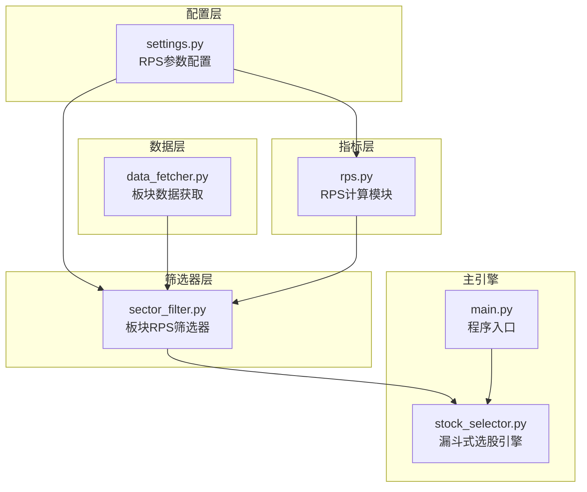
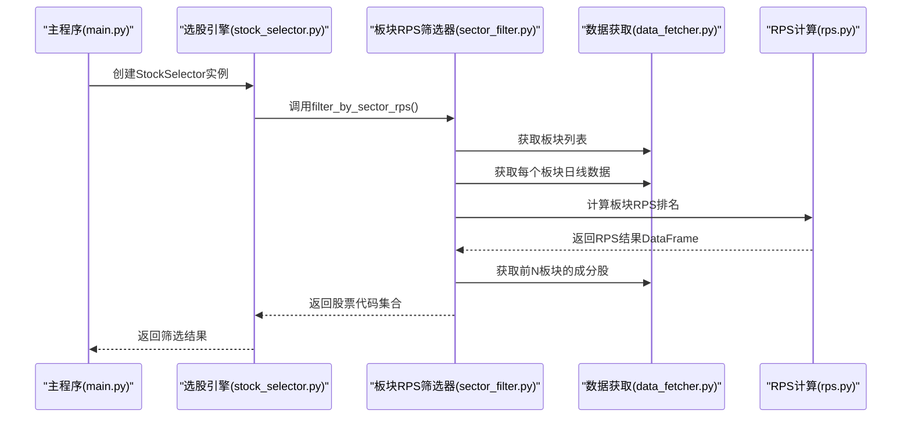
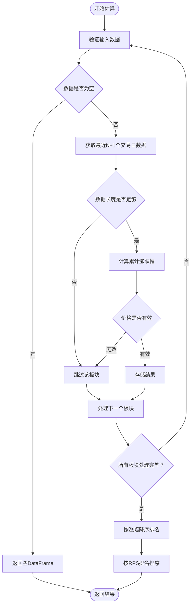
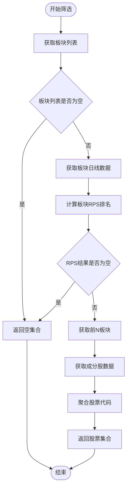
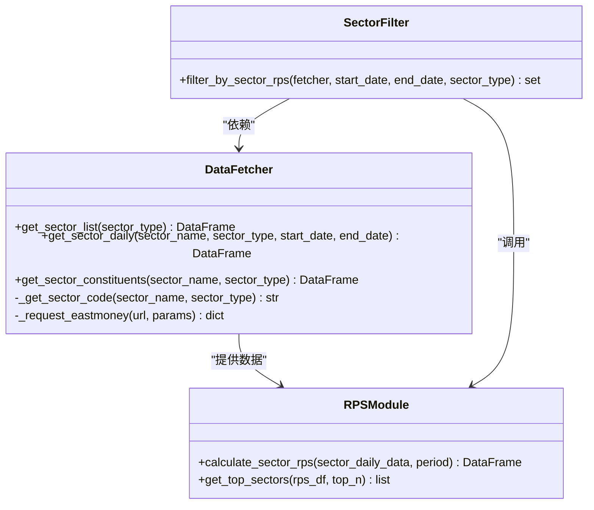
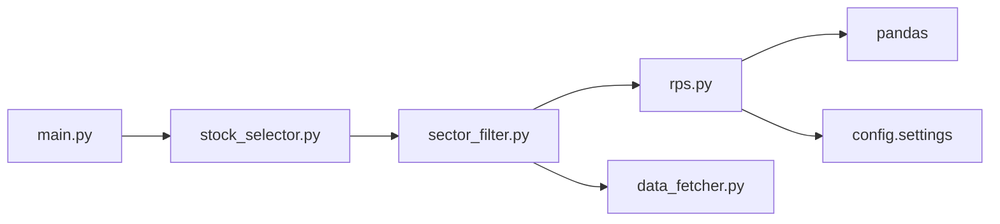

# 板块相对强度计算

<cite>
**本文档引用的文件**
- [rps.py](file://src/indicators/rps.py)
- [sector_filter.py](file://src/filters/sector_filter.py)
- [data_fetcher.py](file://src/data_fetcher.py)
- [settings.py](file://config/settings.py)
- [stock_selector.py](file://src/stock_selector.py)
- [utils.py](file://src/utils.py)
- [main.py](file://main.py)
</cite>

## 目录
1. [简介](#简介)
2. [项目结构](#项目结构)
3. [核心组件](#核心组件)
4. [架构概览](#架构概览)
5. [详细组件分析](#详细组件分析)
6. [依赖关系分析](#依赖关系分析)
7. [性能考虑](#性能考虑)
8. [故障排除指南](#故障排除指南)
9. [结论](#结论)
10. [附录](#附录)

## 简介
本文档详细阐述了板块相对强度（RPS）指标计算模块的设计与实现。RPS指标通过计算板块在特定时间周期内的累计涨跌幅，并据此进行相对强度排序，为板块轮动策略提供量化依据。该模块采用漏斗式选股流程，将RPS作为第一道筛选关卡，有效缩小候选股票池，提升后续技术指标筛选的精准度。

## 项目结构
该项目采用模块化设计，RPS计算模块位于`src/indicators/rps.py`，并与数据获取层、筛选器层和主引擎协同工作。配置参数集中在`config/settings.py`中，便于统一管理和调整。



**图表来源**
- [settings.py:1-31](file://config/settings.py#L1-L31)
- [data_fetcher.py:143-774](file://src/data_fetcher.py#L143-L774)
- [rps.py:1-61](file://src/indicators/rps.py#L1-L61)
- [sector_filter.py:1-73](file://src/filters/sector_filter.py#L1-L73)
- [stock_selector.py:21-310](file://src/stock_selector.py#L21-L310)
- [main.py:1-161](file://main.py#L1-L161)

**章节来源**
- [settings.py:1-31](file://config/settings.py#L1-L31)
- [data_fetcher.py:143-774](file://src/data_fetcher.py#L143-L774)
- [rps.py:1-61](file://src/indicators/rps.py#L1-L61)
- [sector_filter.py:1-73](file://src/filters/sector_filter.py#L1-L73)
- [stock_selector.py:21-310](file://src/stock_selector.py#L21-L310)
- [main.py:1-161](file://main.py#L1-L161)

## 核心组件
RPS计算模块由两个核心函数组成：
- `calculate_sector_rps`: 计算所有板块的RPS值并进行排名
- `get_top_sectors`: 获取RPS排名前N的板块名称列表

这两个函数共同实现了板块相对强度的量化评估，为后续的板块轮动策略提供决策依据。

**章节来源**
- [rps.py:9-61](file://src/indicators/rps.py#L9-L61)

## 架构概览
RPS指标在整个选股系统中扮演着关键角色，作为漏斗式筛选的第一步，有效过滤掉表现较弱的板块，集中资源分析强势板块中的个股机会。



**图表来源**
- [main.py:112-156](file://main.py#L112-L156)
- [stock_selector.py:45-185](file://src/stock_selector.py#L45-L185)
- [sector_filter.py:11-72](file://src/filters/sector_filter.py#L11-L72)
- [data_fetcher.py:429-640](file://src/data_fetcher.py#L429-L640)
- [rps.py:9-61](file://src/indicators/rps.py#L9-L61)

## 详细组件分析

### RPS计算模块详解

#### 计算原理
RPS指标基于以下核心理念：通过计算板块在固定时间窗口内的累计涨跌幅，反映板块的相对强弱程度。具体计算公式为：
```
RPS = (当日收盘价 - N日前收盘价) / N日前收盘价 × 100%
```

#### 实现细节
计算模块采用稳健的数据处理策略，确保结果的准确性和鲁棒性：



**图表来源**
- [rps.py:9-51](file://src/indicators/rps.py#L9-L51)

#### 数据验证机制
模块内置多重数据验证机制，确保计算的可靠性：
- 空数据检查：跳过空数据或数据不足的板块
- 列完整性检查：确保包含必要的收盘价列
- 价格有效性检查：防止除零错误和NaN值影响
- 时间窗口验证：确保有足够的历史数据进行计算

**章节来源**
- [rps.py:17-38](file://src/indicators/rps.py#L17-L38)

### 板块RPS筛选器

#### 功能概述
`filter_by_sector_rps`函数实现了完整的板块RPS筛选流程，包括板块数据获取、RPS计算、结果筛选和成分股提取等步骤。

#### 筛选流程


**图表来源**
- [sector_filter.py:11-72](file://src/filters/sector_filter.py#L11-L72)

**章节来源**
- [sector_filter.py:11-72](file://src/filters/sector_filter.py#L11-L72)

### 数据获取层集成

#### 板块数据获取
数据获取层通过`DataFetcher`类提供统一的板块数据访问接口，支持行业板块和概念板块两种类型：



**图表来源**
- [data_fetcher.py:143-774](file://src/data_fetcher.py#L143-L774)
- [rps.py:9-61](file://src/indicators/rps.py#L9-L61)
- [sector_filter.py:11-72](file://src/filters/sector_filter.py#L11-L72)

**章节来源**
- [data_fetcher.py:429-640](file://src/data_fetcher.py#L429-L640)

## 依赖关系分析

### 组件耦合度
RPS模块具有良好的内聚性和较低的耦合度：
- **低耦合**：主要依赖配置参数和pandas库
- **高内聚**：专注于RPS计算的核心功能
- **可测试性**：清晰的输入输出接口便于单元测试

### 外部依赖
- **pandas**：用于数据结构操作和统计计算
- **config.settings**：提供可配置的参数设置
- **logging**：提供日志记录功能



**图表来源**
- [rps.py:5-6](file://src/indicators/rps.py#L5-L6)
- [sector_filter.py:3-6](file://src/filters/sector_filter.py#L3-L6)
- [stock_selector.py:4-11](file://src/stock_selector.py#L4-L11)
- [main.py:20](file://main.py#L20)

**章节来源**
- [rps.py:5-6](file://src/indicators/rps.py#L5-L6)
- [sector_filter.py:3-6](file://src/filters/sector_filter.py#L3-L6)
- [stock_selector.py:4-11](file://src/stock_selector.py#L4-L11)
- [main.py:20](file://main.py#L20)

## 性能考虑

### 计算复杂度
- **时间复杂度**：O(N×M)，其中N为板块数量，M为每个板块的数据点数
- **空间复杂度**：O(N)，主要用于存储板块结果
- **内存优化**：采用流式处理，避免一次性加载大量数据

### 缓存策略
- **数据库缓存**：使用SQLite存储板块列表、成分股和日线数据
- **增量更新**：支持部分数据更新，减少重复请求
- **重试机制**：网络请求失败时自动重试，提高稳定性

### 并发处理
- **批量数据获取**：支持并发获取多个板块的日线数据
- **进度监控**：实时显示数据获取进度
- **异常处理**：单个板块数据获取失败不影响整体流程

## 故障排除指南

### 常见问题及解决方案

#### 数据获取失败
**症状**：板块数据为空或获取失败
**原因**：网络连接问题、API限制、数据源不可用
**解决方案**：
- 检查网络连接状态
- 调整请求重试参数
- 验证API访问权限

#### RPS计算异常
**症状**：RPS结果为空或计算错误
**原因**：数据格式不正确、缺失必要字段、价格数据异常
**解决方案**：
- 验证输入数据格式
- 检查收盘价列是否存在
- 确认数据时间顺序正确

#### 性能问题
**症状**：计算速度慢、内存占用高
**原因**：数据量过大、算法效率低
**解决方案**：
- 调整计算周期参数
- 优化数据结构
- 启用缓存机制

**章节来源**
- [sector_filter.py:40-42](file://src/filters/sector_filter.py#L40-L42)
- [rps.py:18-32](file://src/indicators/rps.py#L18-L32)

## 结论
RPS指标计算模块通过简洁而高效的实现，为板块轮动策略提供了可靠的量化基础。模块设计遵循单一职责原则，具有良好的可维护性和扩展性。结合完整的数据获取层和筛选器层，形成了从数据采集到策略执行的完整链路。

该模块的关键优势包括：
- **准确性**：基于严格的数学公式计算相对强度
- **稳定性**：完善的错误处理和数据验证机制
- **可配置性**：灵活的参数设置适应不同市场环境
- **可扩展性**：模块化设计便于功能扩展和性能优化

## 附录

### 参数配置说明
- **RPS_PERIOD**：计算周期（默认20天），影响指标的敏感度
- **RPS_TOP_N**：筛选前N个板块（默认20个），控制候选股票池规模

### 使用示例
```python
# 基本使用
from src.indicators.rps import calculate_sector_rps, get_top_sectors

# 自定义参数
top_sectors = get_top_sectors(rps_df, top_n=15)
```

### 板块轮动策略应用
RPS指标在板块轮动中的应用价值：
- **趋势识别**：快速识别强势板块和弱势板块
- **时机把握**：为板块轮动提供入场和出场信号
- **风险控制**：通过分散投资降低单一板块风险
- **收益增强**：聚焦于表现优异的板块获得超额收益