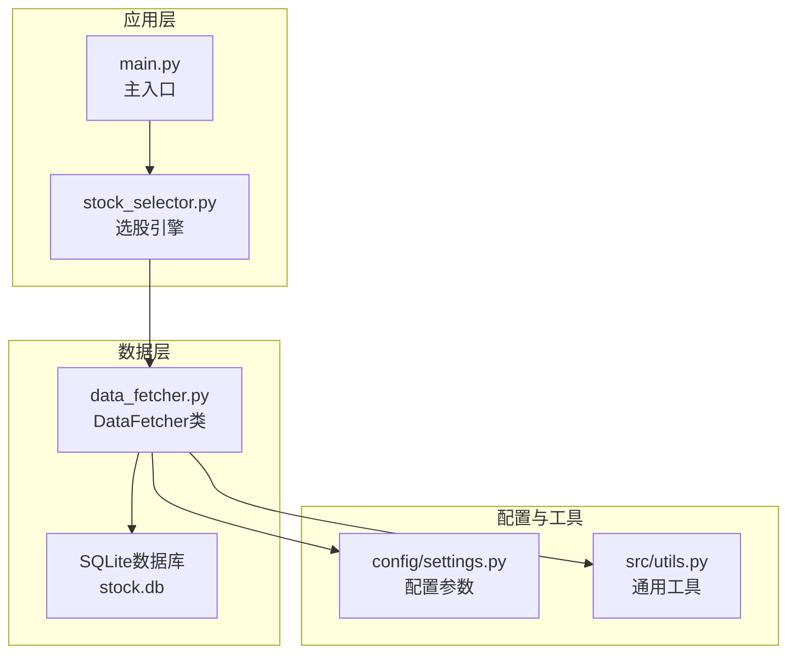
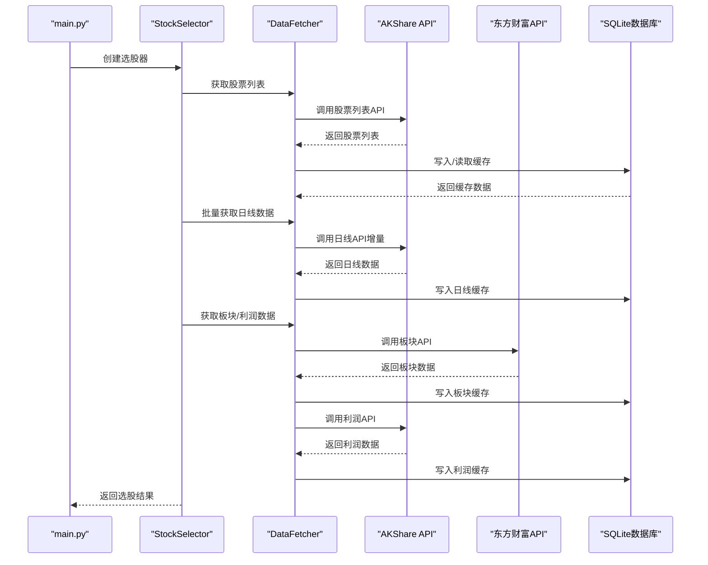
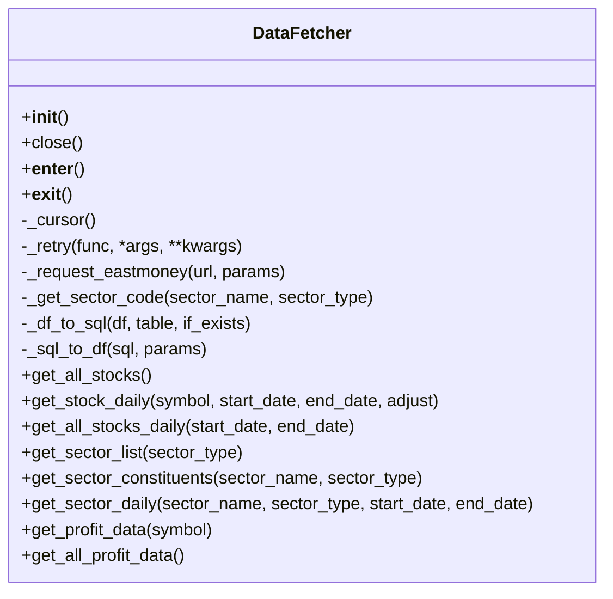
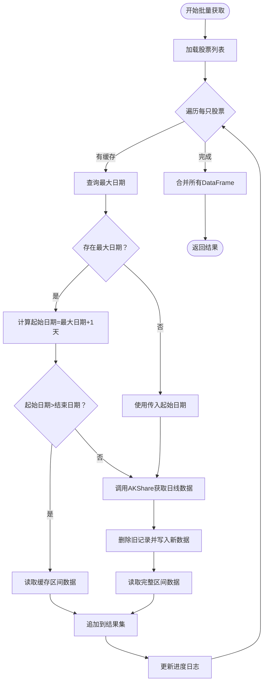
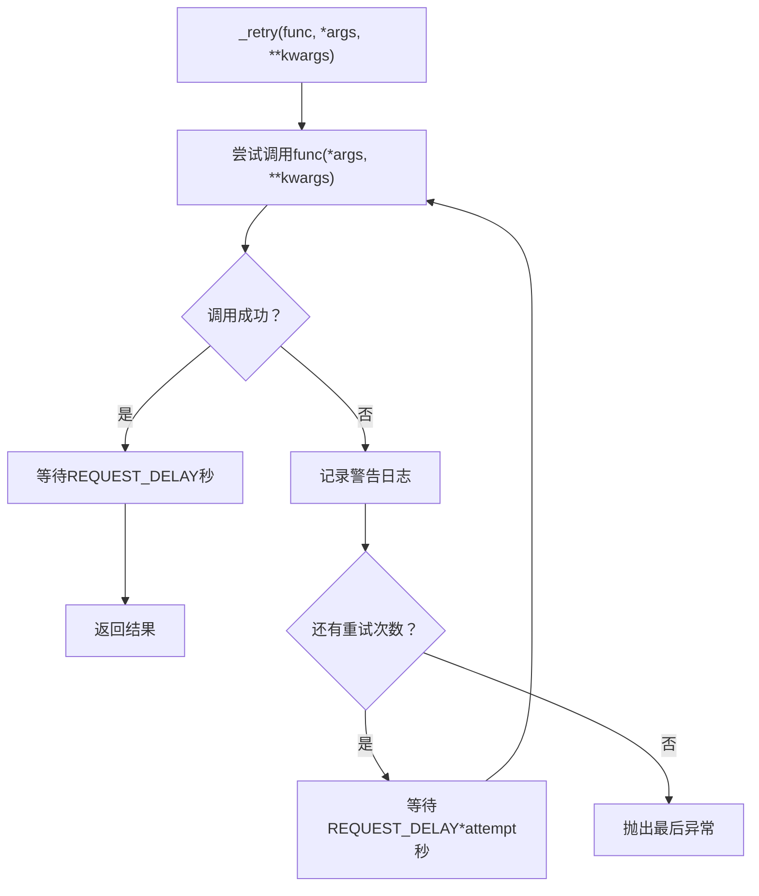
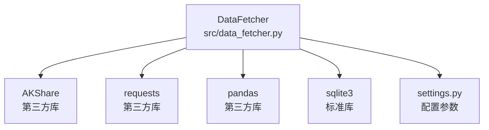

# 数据获取与缓存机制

<cite>
**本文引用的文件**
- [data_fetcher.py](file://src/data_fetcher.py)
- [settings.py](file://config/settings.py)
- [utils.py](file://src/utils.py)
- [stock_selector.py](file://src/stock_selector.py)
- [main.py](file://main.py)
- [需求.md](file://需求.md)
</cite>

## 目录
1. [简介](#简介)
2. [项目结构](#项目结构)
3. [核心组件](#核心组件)
4. [架构概览](#架构概览)
5. [详细组件分析](#详细组件分析)
6. [依赖分析](#依赖分析)
7. [性能考虑](#性能考虑)
8. [故障排除指南](#故障排除指南)
9. [结论](#结论)
10. [附录](#附录)

## 简介
本文件针对A股智能选股系统的数据获取与缓存机制进行全面技术文档化，重点围绕DataFetcher类的设计与实现，详细阐述基于AKShare的数据获取策略、SQLite本地缓存的设计原理与实现方式、数据同步机制、性能优化策略（批量获取与增量更新）、错误处理与重试机制，以及数据缓存的最佳实践与故障排除指南。文档同时提供使用示例与配置选项说明，帮助开发者与使用者快速理解并高效使用该系统。

## 项目结构
系统采用模块化组织，核心数据获取与缓存逻辑集中在src/data_fetcher.py中，配置参数位于config/settings.py，通用工具函数位于src/utils.py，主程序入口位于main.py，选股引擎位于src/stock_selector.py。整体结构清晰，职责分离明确，便于维护与扩展。



**图表来源**
- [main.py:112-156](file://main.py#L112-L156)
- [stock_selector.py:21-310](file://src/stock_selector.py#L21-L310)
- [data_fetcher.py:142-718](file://src/data_fetcher.py#L142-L718)
- [settings.py:21-31](file://config/settings.py#L21-L31)
- [utils.py:9-31](file://src/utils.py#L9-L31)

**章节来源**
- [main.py:1-161](file://main.py#L1-L161)
- [stock_selector.py:1-310](file://src/stock_selector.py#L1-L310)
- [data_fetcher.py:1-718](file://src/data_fetcher.py#L1-L718)
- [settings.py:1-31](file://config/settings.py#L1-L31)
- [utils.py:1-134](file://src/utils.py#L1-L134)

## 核心组件
- DataFetcher类：封装了基于AKShare的数据获取与SQLite缓存功能，提供股票列表、日线数据、板块列表、板块成分股、板块日线、利润数据等接口，并内置重试与延迟机制。
- 配置模块：集中定义数据库路径、日志路径、请求超时、重试次数、请求间隔等参数。
- 通用工具：提供日志初始化、交易日计算、结果格式化等工具函数。
- 选股引擎：调用DataFetcher获取所需数据，串联多个筛选器完成漏斗式选股流程。

**章节来源**
- [data_fetcher.py:142-718](file://src/data_fetcher.py#L142-L718)
- [settings.py:21-31](file://config/settings.py#L21-L31)
- [utils.py:9-31](file://src/utils.py#L9-L31)
- [stock_selector.py:21-310](file://src/stock_selector.py#L21-L310)

## 架构概览
DataFetcher作为数据访问层，负责：
- 与AKShare交互获取实时数据
- 通过SQLite缓存历史数据，减少重复请求
- 提供批量与增量更新能力
- 统一的错误处理与重试策略
- 与配置模块协作，控制请求行为与缓存策略



**图表来源**
- [main.py:112-156](file://main.py#L112-L156)
- [stock_selector.py:45-185](file://src/stock_selector.py#L45-L185)
- [data_fetcher.py:284-718](file://src/data_fetcher.py#L284-L718)

## 详细组件分析

### DataFetcher类设计与实现
DataFetcher类是系统的核心数据访问组件，具备以下关键特性：
- 初始化时自动创建数据库目录与表结构
- 提供上下文管理器接口，确保资源正确释放
- 内置重试与延迟机制，提升请求稳定性
- 支持多类数据的获取与缓存：股票列表、日线、板块、板块成分股、板块日线、利润数据
- 实现增量更新与批量获取策略，兼顾性能与准确性



**图表来源**
- [data_fetcher.py:142-718](file://src/data_fetcher.py#L142-L718)

#### 数据获取策略（基于AKShare）
- 股票列表：通过AKShare获取全市场A股代码与名称，写入stock_list表并缓存。
- 日线数据：支持单只股票日线获取与批量获取，自动进行增量更新。
- 板块数据：通过东方财富API直连获取板块列表与板块日线，避免部分域名不可达问题。
- 板块成分股：通过AKShare获取行业或概念板块的成分股列表。
- 利润数据：通过AKShare获取个股年度净利润数据，提取年份并缓存。

**章节来源**
- [data_fetcher.py:284-718](file://src/data_fetcher.py#L284-L718)

#### SQLite本地缓存设计与实现
- 表结构设计：
  - stock_list：存储股票代码与名称
  - stock_daily：存储日线数据，主键为(code, date)
  - sector_list：存储板块列表，主键为(sector_name, sector_type)
  - sector_constituents：存储板块成分股，主键为(sector_name, sector_type, code)
  - sector_daily：存储板块日线，主键为(sector_name, sector_type, date)
  - profit_data：存储年度净利润，主键为(code, year)
- 数据同步机制：
  - 读取优先：优先从缓存表读取，若无缓存则调用API并写入缓存
  - 增量更新：批量获取时根据缓存中的最大日期决定起始拉取时间
  - 删除覆盖：写入新数据前先删除对应区间的旧记录，保证一致性

```mermaid
erDiagram
STOCK_LIST {
text code PK
text name
}
STOCK_DAILY {
text code
text date
real open
real high
real low
real close
real volume
real turnover_rate
PK(code, date)
}
SECTOR_LIST {
text sector_name
text sector_type
real change_pct
PK(sector_name, sector_type)
}
SECTOR_CONSTITUENTS {
text sector_name
text sector_type
text code
text name
PK(sector_name, sector_type, code)
}
SECTOR_DAILY {
text sector_name
text sector_type
text date
real close
real change_pct
PK(sector_name, sector_type, date)
}
PROFIT_DATA {
text code
int year
real net_profit
PK(code, year)
}
```

**图表来源**
- [data_fetcher.py:87-135](file://src/data_fetcher.py#L87-L135)

**章节来源**
- [data_fetcher.py:87-135](file://src/data_fetcher.py#L87-L135)

#### 性能优化策略
- 批量获取：get_all_stocks_daily遍历股票列表，逐只获取日线数据并增量更新，减少重复请求。
- 增量更新：根据stock_daily表中的最大日期决定起始拉取时间，避免重复下载历史数据。
- 写入优化：使用pandas的to_sql批量写入，并在事务中执行删除与插入操作，提升写入效率。
- 请求节流：在每次请求后添加固定延迟，避免触发API限频。



**图表来源**
- [data_fetcher.py:342-424](file://src/data_fetcher.py#L342-L424)

**章节来源**
- [data_fetcher.py:342-424](file://src/data_fetcher.py#L342-L424)

#### 错误处理与重试策略
- 统一重试包装：_retry方法对任意函数调用进行多次重试，每次重试后等待递增延迟。
- 业务错误处理：_request_eastmoney对东方财富API返回的rc字段进行校验，非0视为业务错误并记录警告。
- 异常捕获：在批量获取过程中捕获单只股票的异常，记录错误并继续处理其他股票。
- 请求超时与延迟：通过配置参数控制请求超时与重试间隔，避免频繁请求导致的失败。



**图表来源**
- [data_fetcher.py:181-196](file://src/data_fetcher.py#L181-L196)

**章节来源**
- [data_fetcher.py:181-196](file://src/data_fetcher.py#L181-L196)
- [data_fetcher.py:205-232](file://src/data_fetcher.py#L205-L232)

#### 使用示例与配置选项
- 基本使用：通过DataFetcher实例调用相应方法获取所需数据，如get_all_stocks、get_stock_daily、get_all_stocks_daily等。
- 配置选项：通过config/settings.py设置数据库路径、日志路径、请求超时、重试次数、请求间隔等参数。
- 强制更新：在main.py中可通过--force-update参数强制清空日线缓存，重新拉取数据。

**章节来源**
- [data_fetcher.py:284-718](file://src/data_fetcher.py#L284-L718)
- [settings.py:21-31](file://config/settings.py#L21-L31)
- [main.py:112-156](file://main.py#L112-L156)

## 依赖分析
DataFetcher类与外部系统的依赖关系如下：
- AKShare：用于获取股票列表、日线、板块、利润等数据
- requests：用于直接请求东方财富API
- pandas：用于数据转换与缓存写入
- sqlite3：用于本地数据库操作
- 配置模块：提供数据库路径、请求参数等配置



**图表来源**
- [data_fetcher.py:10-13](file://src/data_fetcher.py#L10-L13)
- [settings.py:21-31](file://config/settings.py#L21-L31)

**章节来源**
- [data_fetcher.py:10-13](file://src/data_fetcher.py#L10-L13)
- [settings.py:21-31](file://config/settings.py#L21-L31)

## 性能考虑
- 数据库索引：建议在常用查询字段上建立索引以提升查询性能（如stock_daily的code与date组合查询）。
- 批量写入：使用pandas的to_sql进行批量写入，减少单条插入的开销。
- 增量更新：通过查询最大日期实现增量更新，避免重复下载历史数据。
- 请求节流：合理设置REQUEST_DELAY，避免触发API限频。
- 内存管理：在批量处理时及时释放中间变量，避免内存占用过高。

## 故障排除指南
- 网络连接异常：检查网络连接状态，确认代理设置是否正确。
- API限频：适当增加REQUEST_DELAY，降低请求频率。
- 数据库锁定：确保同一时间只有一个进程访问数据库，避免并发写入冲突。
- 缓存失效：使用--force-update参数强制清空日线缓存，重新拉取数据。
- 字段缺失：当AKShare返回的字段名称变化时，检查列映射字典并更新。

**章节来源**
- [main.py:130-144](file://main.py#L130-L144)
- [data_fetcher.py:181-196](file://src/data_fetcher.py#L181-L196)

## 结论
DataFetcher类通过合理的数据获取策略与SQLite本地缓存机制，实现了高效、稳定的A股数据获取与管理。结合批量获取与增量更新策略、完善的错误处理与重试机制，系统能够在保证数据准确性的同时显著提升性能。建议在生产环境中根据实际需求调整配置参数，并定期监控数据库性能与API响应情况，以确保系统的稳定运行。

## 附录
- 配置参数说明：
  - DB_PATH：SQLite数据库文件路径
  - REQUEST_TIMEOUT：请求超时时间（秒）
  - REQUEST_RETRY：重试次数
  - REQUEST_DELAY：请求间隔（秒）

**章节来源**
- [settings.py:21-31](file://config/settings.py#L21-L31)