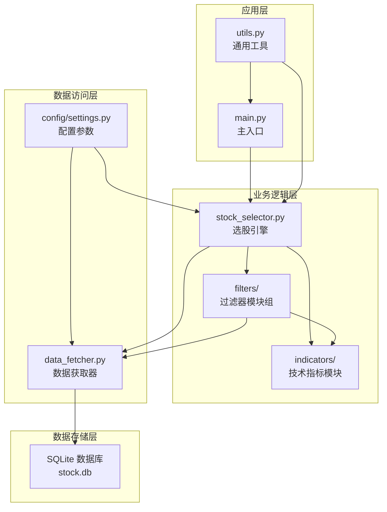
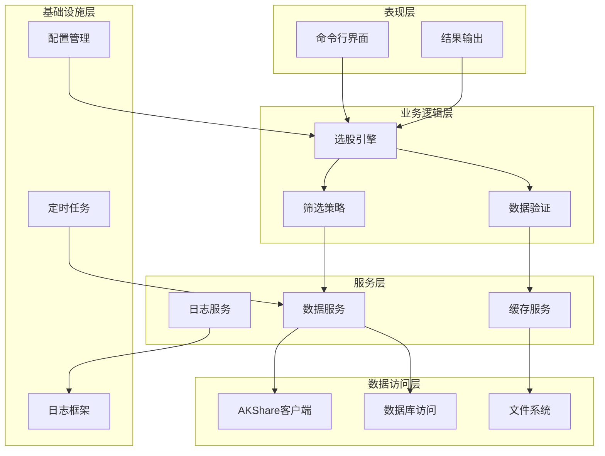
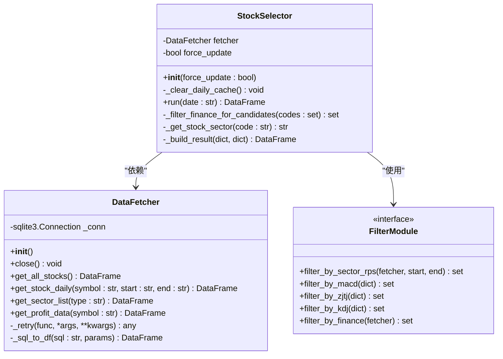
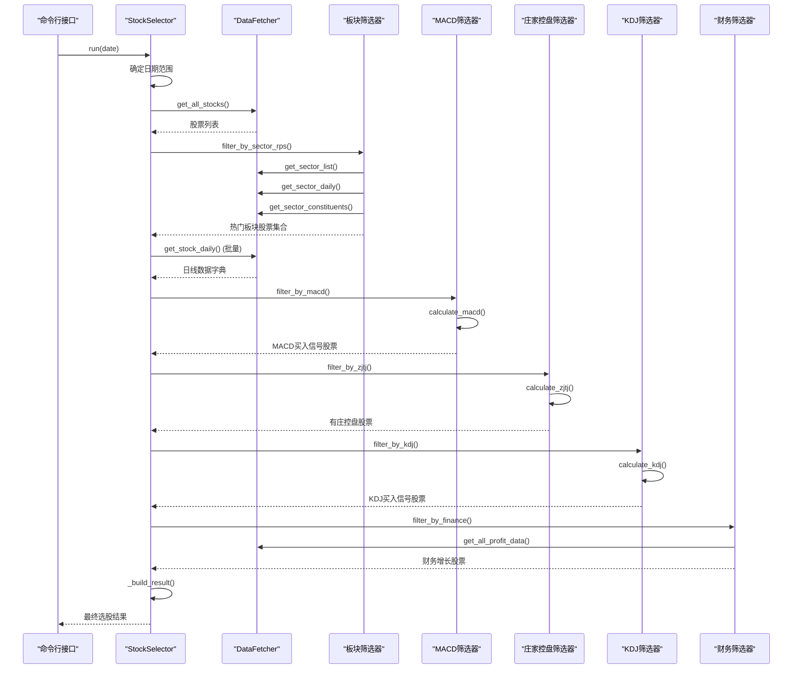
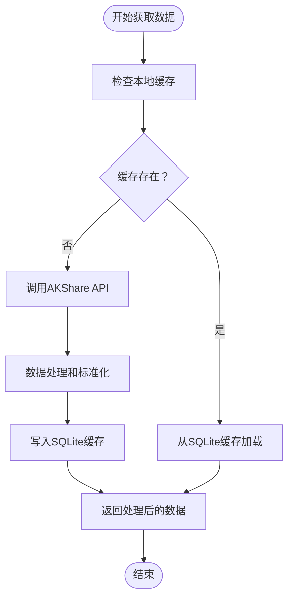
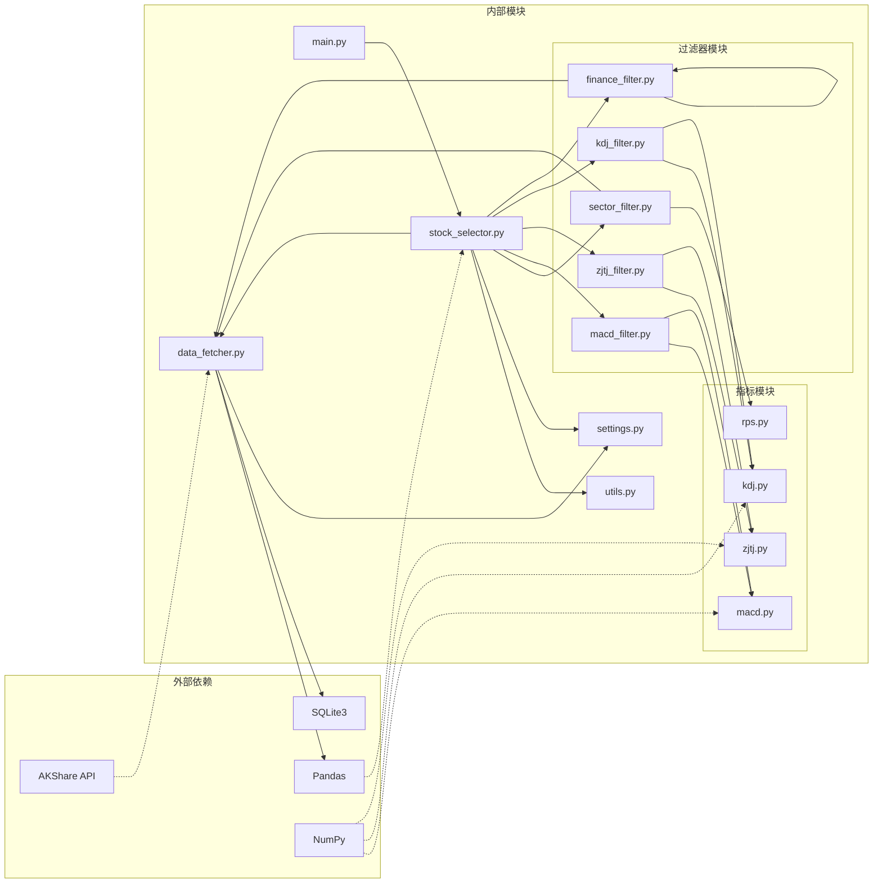

# 核心架构设计

<cite>
**本文档引用的文件**
- [main.py](file://main.py)
- [stock_selector.py](file://src/stock_selector.py)
- [data_fetcher.py](file://src/data_fetcher.py)
- [settings.py](file://config/settings.py)
- [utils.py](file://src/utils.py)
- [sector_filter.py](file://src/filters/sector_filter.py)
- [finance_filter.py](file://src/filters/finance_filter.py)
- [macd_filter.py](file://src/filters/macd_filter.py)
- [kdj_filter.py](file://src/filters/kdj_filter.py)
- [zjtj_filter.py](file://src/filters/zjtj_filter.py)
- [rps.py](file://src/indicators/rps.py)
- [macd.py](file://src/indicators/macd.py)
- [kdj.py](file://src/indicators/kdj.py)
- [zjtj.py](file://src/indicators/zjtj.py)
</cite>

## 目录
1. [引言](#引言)
2. [项目结构](#项目结构)
3. [核心组件](#核心组件)
4. [架构概览](#架构概览)
5. [详细组件分析](#详细组件分析)
6. [依赖关系分析](#依赖关系分析)
7. [性能考量](#性能考量)
8. [故障排除指南](#故障排除指南)
9. [结论](#结论)

## 引言

本文件为A股智能选股系统的架构设计文档，旨在全面阐述系统的整体架构模式、模块化设计以及各组件间的交互关系。系统采用分层架构与模块化设计相结合的方式，通过漏斗式五步筛选机制实现智能化选股。本文档详细说明了主入口、选股引擎、数据获取器以及过滤器模块组的设计思路，并提供了架构图、序列图和流程图等可视化表示，帮助开发者和技术人员快速理解系统的工作原理。

## 项目结构

系统采用清晰的分层架构组织，主要分为以下层次：

**图表来源**
- [main.py:1-161](file://main.py#L1-L161)
- [stock_selector.py:1-310](file://src/stock_selector.py#L1-L310)
- [data_fetcher.py:1-608](file://src/data_fetcher.py#L1-L608)

**章节来源**
- [main.py:1-161](file://main.py#L1-L161)
- [stock_selector.py:1-310](file://src/stock_selector.py#L1-L310)
- [data_fetcher.py:1-608](file://src/data_fetcher.py#L1-L608)

## 核心组件

### 主入口组件 (main.py)
主入口负责命令行参数解析、系统初始化和结果输出。其职责包括：
- 解析命令行参数（日期、强制更新、输出路径）
- 初始化日志系统和颜色显示
- 调用选股引擎执行筛选流程
- 处理异常情况和用户中断
- 格式化输出结果到控制台和文件

### 选股引擎组件 (StockSelector)
选股引擎是系统的核心业务逻辑组件，采用漏斗式五步筛选机制：
1. **板块RPS筛选** - 基于板块相对强度排名的热门板块筛选
2. **MACD买入信号筛选** - 技术指标层面的买入信号识别
3. **庄家控盘筛选** - 基于庄家行为特征的控盘信号检测
4. **KDJ买入信号筛选** - 随机指标层面的超卖反弹识别
5. **财务基本面筛选** - 基于盈利能力增长的财务健康度评估

### 数据获取器组件 (DataFetcher)
数据获取器提供统一的数据访问接口，具备以下特性：
- 支持AKShare数据源的股票、板块、财务数据获取
- SQLite本地缓存机制，支持增量更新
- 请求重试和防限流机制
- 数据标准化和格式转换

### 过滤器模块组
过滤器模块组包含五个专门的筛选器：
- **sector_filter**: 基于板块RPS的技术筛选
- **macd_filter**: MACD技术指标买入信号筛选
- **zjtj_filter**: 庄家控盘信号筛选
- **kdj_filter**: KDJ随机指标买入信号筛选
- **finance_filter**: 财务基本面增长筛选

### 技术指标模块
技术指标模块提供专业的技术分析工具：
- **RPS**: 相对强度排名计算
- **MACD**: 指数平滑异同移动平均线
- **KDJ**: 随机指标计算
- **ZJTJ**: 庄家控盘度指标

**章节来源**
- [main.py:29-52](file://main.py#L29-L52)
- [stock_selector.py:21-310](file://src/stock_selector.py#L21-L310)
- [data_fetcher.py:140-608](file://src/data_fetcher.py#L140-L608)

## 架构概览

系统采用分层架构设计，通过明确的职责分离和模块化组织实现高内聚、低耦合的系统结构：

**图表来源**
- [main.py:112-156](file://main.py#L112-L156)
- [stock_selector.py:45-185](file://src/stock_selector.py#L45-L185)
- [data_fetcher.py:180-194](file://src/data_fetcher.py#L180-L194)

系统架构特点：
- **分层清晰**：表现层、业务逻辑层、服务层、数据访问层逐层抽象
- **模块化设计**：各功能模块职责单一，便于维护和扩展
- **缓存策略**：多层次缓存减少API调用频率
- **异常处理**：完善的异常捕获和错误恢复机制

## 详细组件分析

### 选股引擎类设计

**图表来源**
- [stock_selector.py:21-310](file://src/stock_selector.py#L21-L310)
- [data_fetcher.py:140-608](file://src/data_fetcher.py#L140-L608)

### 漏斗式筛选流程

**图表来源**
- [stock_selector.py:45-185](file://src/stock_selector.py#L45-L185)
- [sector_filter.py:11-73](file://src/filters/sector_filter.py#L11-L73)
- [macd_filter.py:9-46](file://src/filters/macd_filter.py#L9-L46)
- [zjtj_filter.py:9-46](file://src/filters/zjtj_filter.py#L9-L46)
- [kdj_filter.py:9-51](file://src/filters/kdj_filter.py#L9-L51)
- [finance_filter.py:10-91](file://src/filters/finance_filter.py#L10-L91)

### 数据获取流程

**图表来源**
- [data_fetcher.py:205-225](file://src/data_fetcher.py#L205-L225)
- [data_fetcher.py:263-345](file://src/data_fetcher.py#L263-L345)
- [data_fetcher.py:478-555](file://src/data_fetcher.py#L478-L555)

**章节来源**
- [stock_selector.py:21-310](file://src/stock_selector.py#L21-L310)
- [data_fetcher.py:140-608](file://src/data_fetcher.py#L140-L608)

## 依赖关系分析

系统采用模块化设计，各组件间依赖关系清晰：

**图表来源**
- [main.py:18-22](file://main.py#L18-L22)
- [stock_selector.py:4-16](file://src/stock_selector.py#L4-L16)
- [data_fetcher.py:7-11](file://src/data_fetcher.py#L7-L11)

**章节来源**
- [settings.py:1-31](file://config/settings.py#L1-L31)
- [utils.py:9-31](file://src/utils.py#L9-L31)

## 性能考量

### 缓存策略
系统采用多层缓存机制优化性能：
- **SQLite本地缓存**：存储股票列表、日线数据、板块数据和财务数据
- **增量更新**：基于最大日期的增量拉取，避免全量重复下载
- **批量处理**：对大量股票数据采用批量获取和处理策略

### 并发处理
- **异步API调用**：使用重试机制和延迟策略避免API限流
- **内存优化**：使用生成器和分批处理大数据集
- **索引优化**：在SQLite中建立必要的索引提升查询性能

### 算法优化
- **漏斗式筛选**：通过逐步缩小候选集减少后续计算量
- **向量化计算**：利用Pandas和NumPy进行高效数值计算
- **条件早停**：在筛选过程中遇到空结果时及时终止

## 故障排除指南

### 常见问题及解决方案

**网络连接异常**
- 检查网络连接状态
- 调整REQUEST_RETRY和REQUEST_DELAY配置
- 验证AKShare API可用性

**数据获取失败**
- 清理缓存后重试
- 检查数据库连接状态
- 验证日期格式和范围

**性能问题**
- 增加缓存时间
- 调整批量大小参数
- 优化数据库索引

**章节来源**
- [main.py:133-144](file://main.py#L133-L144)
- [data_fetcher.py:180-194](file://src/data_fetcher.py#L180-L194)

## 结论

A股智能选股系统采用成熟的分层架构和模块化设计理念，通过漏斗式五步筛选机制实现了高效、准确的智能选股。系统的主要优势包括：

1. **架构清晰**：分层设计使得各组件职责明确，便于维护和扩展
2. **性能优秀**：多层缓存和优化算法确保了高效的运行性能
3. **可扩展性强**：模块化设计支持新筛选器和指标的便捷添加
4. **可靠性高**：完善的异常处理和重试机制保证了系统的稳定性

该架构为A股智能选股提供了坚实的技术基础，能够适应不断变化的市场环境和业务需求。