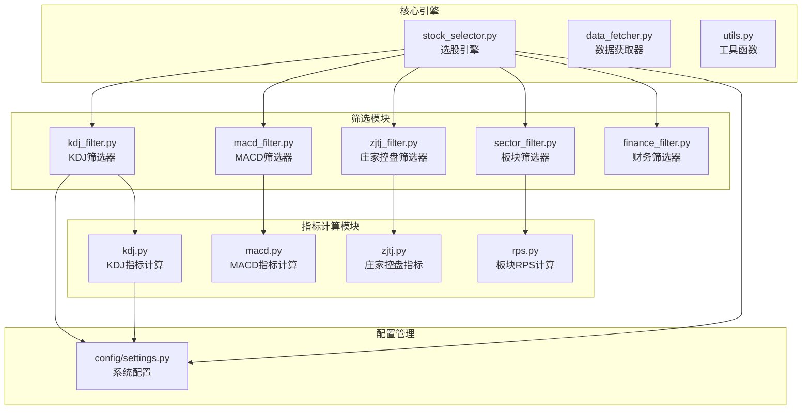
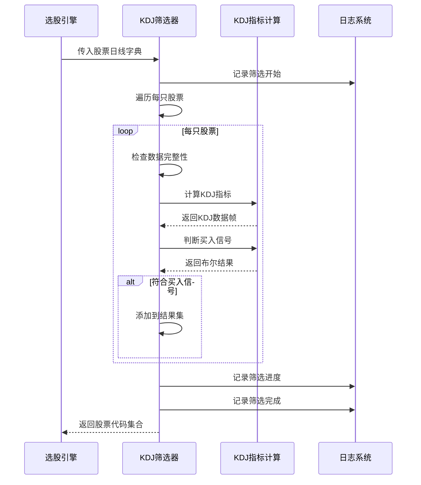
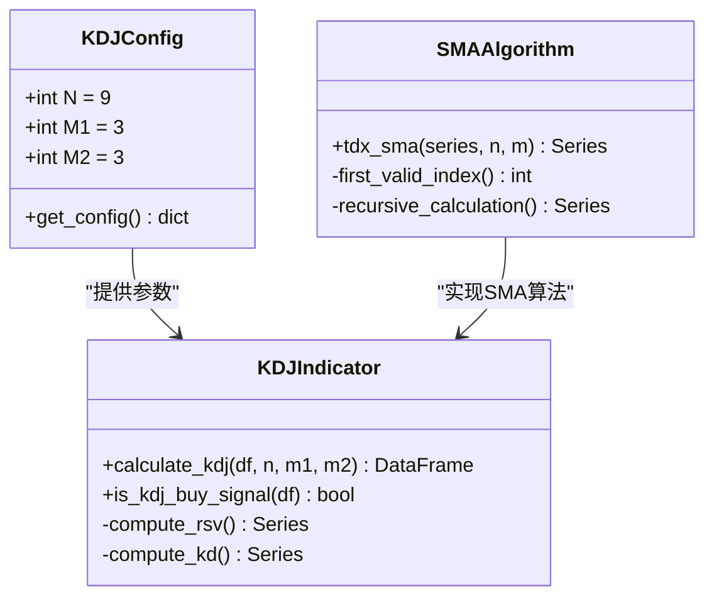
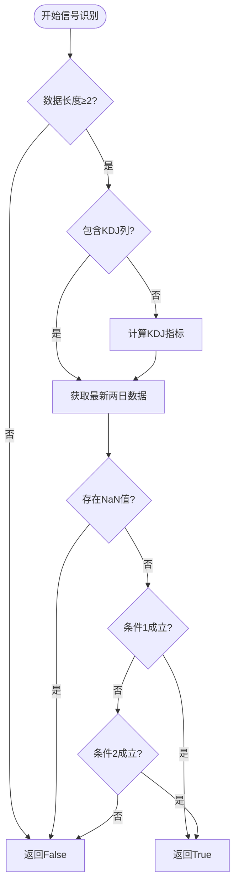
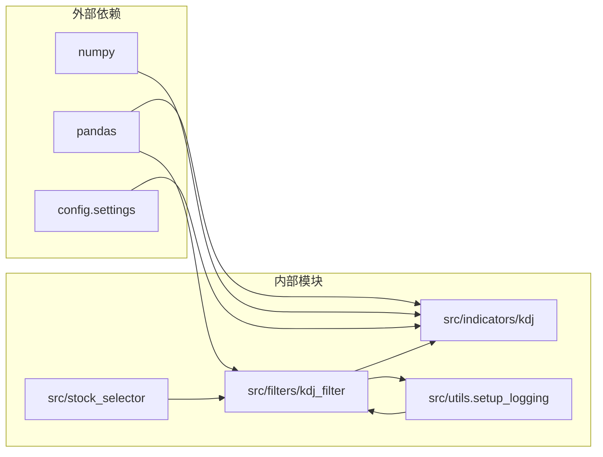

# KDJ技术筛选

<cite>
**本文档引用的文件**
- [src/filters/kdj_filter.py](file://src/filters/kdj_filter.py)
- [src/indicators/kdj.py](file://src/indicators/kdj.py)
- [src/stock_selector.py](file://src/stock_selector.py)
- [config/settings.py](file://config/settings.py)
- [src/indicators/__init__.py](file://src/indicators/__init__.py)
- [src/filters/__init__.py](file://src/filters/__init__.py)
</cite>

## 目录
1. [简介](#简介)
2. [项目结构](#项目结构)
3. [核心组件](#核心组件)
4. [架构概览](#架构概览)
5. [详细组件分析](#详细组件分析)
6. [依赖关系分析](#依赖关系分析)
7. [性能考虑](#性能考虑)
8. [故障排除指南](#故障排除指南)
9. [结论](#结论)

## 简介

本文件详细阐述了KDJ技术筛选过滤器的设计与实现，包括KDJ指标的技术原理、超买超卖判断机制、金叉死叉识别以及背离信号分析等核心技术要点。文档还解释了不同参数组合对筛选结果的影响，并提供了在不同市场环境下应用KDJ指标的策略和注意事项，以及技术指标验证和回测方法。

## 项目结构

该项目采用模块化设计，KDJ筛选功能位于以下关键位置：

**图表来源**
- [src/filters/kdj_filter.py:1-51](file://src/filters/kdj_filter.py#L1-L51)
- [src/indicators/kdj.py:1-110](file://src/indicators/kdj.py#L1-L110)
- [src/stock_selector.py:1-310](file://src/stock_selector.py#L1-L310)
- [config/settings.py:1-31](file://config/settings.py#L1-L31)

**章节来源**
- [src/filters/kdj_filter.py:1-51](file://src/filters/kdj_filter.py#L1-L51)
- [src/indicators/kdj.py:1-110](file://src/indicators/kdj.py#L1-L110)
- [src/stock_selector.py:1-310](file://src/stock_selector.py#L1-L310)
- [config/settings.py:1-31](file://config/settings.py#L1-L31)

## 核心组件

### KDJ筛选器 (filter_by_kdj)

KDJ筛选器是整个选股流程中的第四步，负责从通过前三个筛选器的股票中识别出具有KDJ买入信号的股票。

**主要功能特性：**
- 批量处理股票日线数据
- 计算KDJ技术指标
- 识别买入信号
- 错误处理和进度监控

**输入输出规范：**
- 输入：股票代码到日线DataFrame的字典映射
- 输出：符合KDJ买入信号的股票代码集合

**章节来源**
- [src/filters/kdj_filter.py:9-50](file://src/filters/kdj_filter.py#L9-L50)

### KDJ指标计算模块 (calculate_kdj)

该模块实现了严格遵循通达信公式的KDJ指标计算，包括RSV、K、D、J四个核心指标。

**技术实现特点：**
- 使用通达信SMA递推算法
- 支持可配置的参数(N、M1、M2)
- 处理边界情况和异常值
- 提供完整的指标序列

**章节来源**
- [src/indicators/kdj.py:45-76](file://src/indicators/kdj.py#L45-L76)

### KDJ买入信号判断 (is_kdj_buy_signal)

实现了两种核心的KDJ买入信号识别机制：

**信号类型1：金叉买入信号**
- K线在20左右向上交叉D线
- 条件：K < 30 且 今日K > 今日D 且 昨日K ≤ 昨日D

**信号类型2：背离反转信号**
- J线从负值区域转正值
- 条件：昨日J < 0 且 今日J ≥ 0

**章节来源**
- [src/indicators/kdj.py:79-109](file://src/indicators/kdj.py#L79-L109)

## 架构概览

KDJ筛选在整个选股系统中扮演着关键角色，作为漏斗式筛选流程的第四步：

**图表来源**
- [src/stock_selector.py:148-157](file://src/stock_selector.py#L148-L157)
- [src/filters/kdj_filter.py:26-44](file://src/filters/kdj_filter.py#L26-L44)
- [src/indicators/kdj.py:79-109](file://src/indicators/kdj.py#L79-L109)

**章节来源**
- [src/stock_selector.py:148-157](file://src/stock_selector.py#L148-L157)
- [src/filters/kdj_filter.py:26-44](file://src/filters/kdj_filter.py#L26-L44)

## 详细组件分析

### KDJ参数配置系统

系统采用集中配置的方式管理KDJ参数：

**图表来源**
- [config/settings.py:12-15](file://config/settings.py#L12-L15)
- [src/indicators/kdj.py:16-42](file://src/indicators/kdj.py#L16-L42)
- [src/indicators/kdj.py:45-76](file://src/indicators/kdj.py#L45-L76)

**参数配置详情：**
- **N参数 (9)**：计算RSV时的周期长度，反映短期价格波动范围
- **M1参数 (3)**：K线的平滑周期，影响K线的敏感度
- **M2参数 (3)**：D线的平滑周期，决定D线的平滑程度

**章节来源**
- [config/settings.py:12-15](file://config/settings.py#L12-L15)
- [src/indicators/kdj.py:16-42](file://src/indicators/kdj.py#L16-L42)

### 金叉死叉识别机制

KDJ指标的核心交易信号识别基于两个关键条件：

**图表来源**
- [src/indicators/kdj.py:85-109](file://src/indicators/kdj.py#L85-L109)

**条件1：金叉买入信号**
- **超卖区域**：K < 30，表明股价处于相对低位
- **金叉确认**：今日K > 今日D，显示多头力量增强
- **交叉确认**：昨日K ≤ 昨日D，确保交叉的有效性

**条件2：背离反转信号**
- **负值反转**：J线从负值区域转正值，显示动能恢复
- **技术意义**：即使价格创新高，但指标出现积极信号

**章节来源**
- [src/indicators/kdj.py:85-109](file://src/indicators/kdj.py#L85-L109)

### 不同参数组合的影响分析

**参数组合对筛选结果的影响：**

| 组合 | N值 | M1值 | M2值 | 影响特征 | 筛选结果 |
|------|-----|------|------|----------|----------|
| 默认组合 | 9 | 3 | 3 | 平衡敏感度 | 中等筛选强度 |
| 敏感组合 | 5 | 2 | 2 | 高敏感度 | 更多买入信号 |
| 稳健组合 | 14 | 3 | 3 | 低敏感度 | 更少买入信号 |
| 平滑组合 | 9 | 5 | 5 | 强平滑效果 | 更少但更可靠信号 |

**参数调优建议：**
- **趋势跟踪**：增大N值（如14）以减少假信号
- **短线交易**：减小N值（如5）以提高敏感度
- **波动市场**：增大M1、M2值以增加平滑效果
- **震荡市场**：减小M1、M2值以提高响应速度

**章节来源**
- [config/settings.py:12-15](file://config/settings.py#L12-L15)

### 市场环境应用策略

**不同市场环境下的应用策略：**

**上升趋势市场：**
- 适用参数：N=9, M1=3, M2=3（默认）
- 关注金叉信号，特别是突破重要阻力位时的KDJ金叉
- 配合成交量确认信号有效性

**震荡市场：**
- 适用参数：N=14, M1=5, M2=5（更平滑）
- 重点关注超卖反弹信号（K<30的金叉）
- 避免追涨杀跌，等待明确信号

**下跌趋势市场：**
- 适用参数：N=5, M1=2, M2=2（更敏感）
- 密切关注J线反转信号
- 设置严格的止损机制

**注意事项：**
- 避免单一指标决策，结合其他技术指标
- 考虑成交量配合验证信号
- 注意市场阶段性和周期性变化
- 定期调整参数适应市场变化

## 依赖关系分析

KDJ筛选器与其他组件的依赖关系如下：

**图表来源**
- [src/filters/kdj_filter.py:2-4](file://src/filters/kdj_filter.py#L2-L4)
- [src/indicators/kdj.py:11-13](file://src/indicators/kdj.py#L11-L13)
- [src/stock_selector.py:5-11](file://src/stock_selector.py#L5-L11)

**依赖关系特点：**
- **低耦合设计**：KDJ筛选器独立于其他筛选器
- **参数注入**：通过配置模块传递参数
- **错误隔离**：单个股票计算失败不影响整体流程
- **日志集成**：统一的日志记录机制

**章节来源**
- [src/filters/kdj_filter.py:2-4](file://src/filters/kdj_filter.py#L2-L4)
- [src/indicators/kdj.py:11-13](file://src/indicators/kdj.py#L11-L13)
- [src/stock_selector.py:5-11](file://src/stock_selector.py#L5-L11)

## 性能考虑

### 计算复杂度分析

**时间复杂度：**
- 单只股票KDJ计算：O(n)，其中n为交易日数量
- 批量筛选：O(m×n)，其中m为股票数量
- 内存使用：O(n)用于存储中间计算结果

**优化策略：**
- **向量化计算**：利用pandas的向量化操作提高效率
- **数据预处理**：确保输入数据的有序性和完整性
- **异常处理**：及时跳过无效数据减少计算开销
- **进度监控**：大批次处理时提供实时进度反馈

### 存储和I/O优化

**数据流优化：**
- 只为候选股票获取日线数据
- 批量处理减少数据库连接开销
- 合理的数据缓存策略

**章节来源**
- [src/filters/kdj_filter.py:22-48](file://src/filters/kdj_filter.py#L22-L48)
- [src/stock_selector.py:100-116](file://src/stock_selector.py#L100-L116)

## 故障排除指南

### 常见问题及解决方案

**问题1：数据完整性检查失败**
- **症状**：股票被跳过，日志显示数据不足
- **原因**：日线数据缺失或列不完整
- **解决方案**：检查数据源完整性，确保至少15个交易日数据

**问题2：KDJ计算异常**
- **症状**：计算过程中出现异常或返回NaN
- **原因**：除零错误或数据格式问题
- **解决方案**：检查输入数据的质量和格式

**问题3：信号识别不准确**
- **症状**：买入信号过于频繁或稀少
- **原因**：参数设置不适合当前市场环境
- **解决方案**：调整KDJ参数组合

**章节来源**
- [src/filters/kdj_filter.py:28-34](file://src/filters/kdj_filter.py#L28-L34)
- [src/indicators/kdj.py:95-99](file://src/indicators/kdj.py#L95-L99)

### 调试和验证方法

**单元测试建议：**
- 创建典型KDJ形态的测试数据
- 验证金叉死叉识别准确性
- 测试不同参数组合的效果

**回归测试：**
- 使用历史数据验证信号准确性
- 比较不同参数设置下的表现
- 监控信号频率和胜率

## 结论

KDJ技术筛选过滤器通过严谨的通达信公式实现和合理的参数配置，在复杂的股票筛选流程中发挥着重要作用。其双信号识别机制（金叉信号和背离信号）提供了多重确认，提高了信号的可靠性。

**核心优势：**
- 严格遵循通达信公式，保证计算一致性
- 灵活的参数配置适应不同市场环境
- 完善的错误处理和进度监控机制
- 与其他技术指标的良好兼容性

**应用建议：**
- 根据具体的投资策略调整参数设置
- 结合其他技术指标形成综合判断
- 定期评估和优化筛选参数
- 建立完善的回测和验证体系

通过合理运用KDJ技术筛选器，投资者可以在海量股票中高效识别潜在的买入机会，提高选股质量和投资成功率。