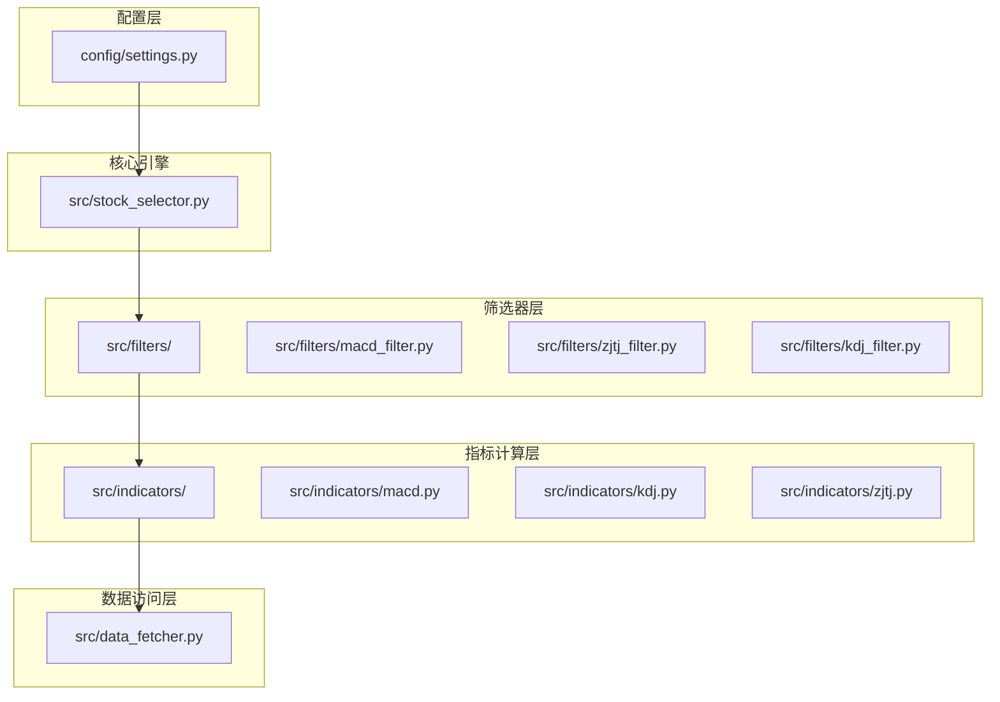
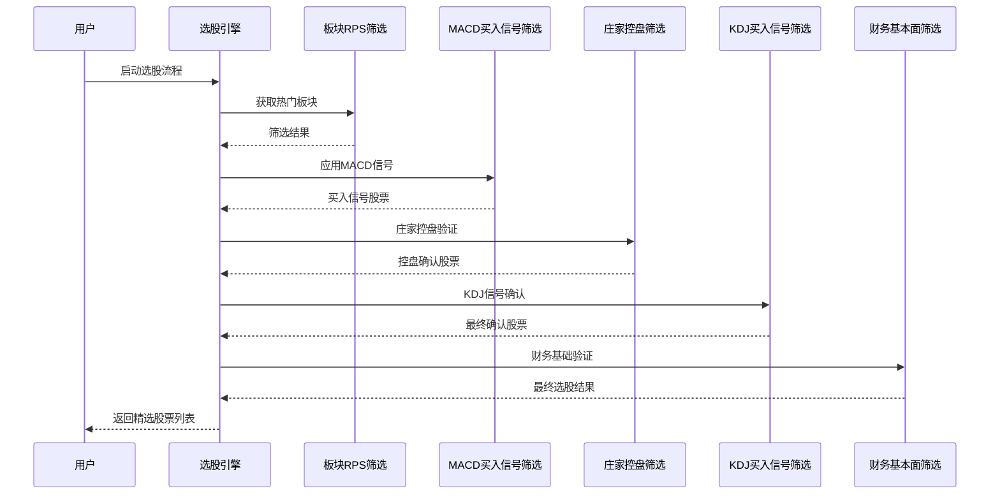
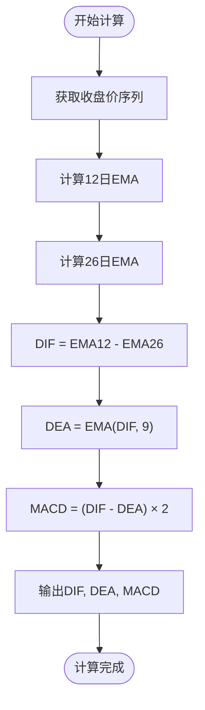
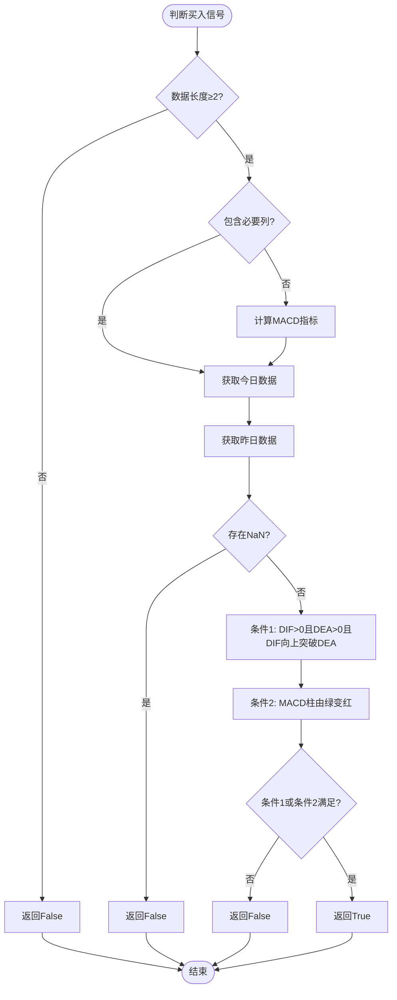
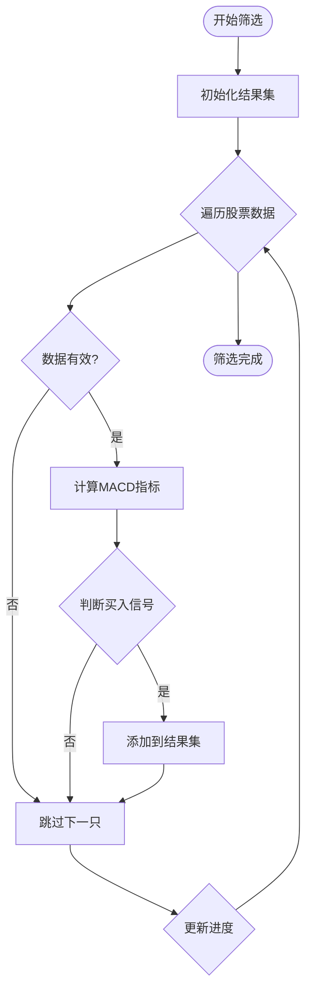
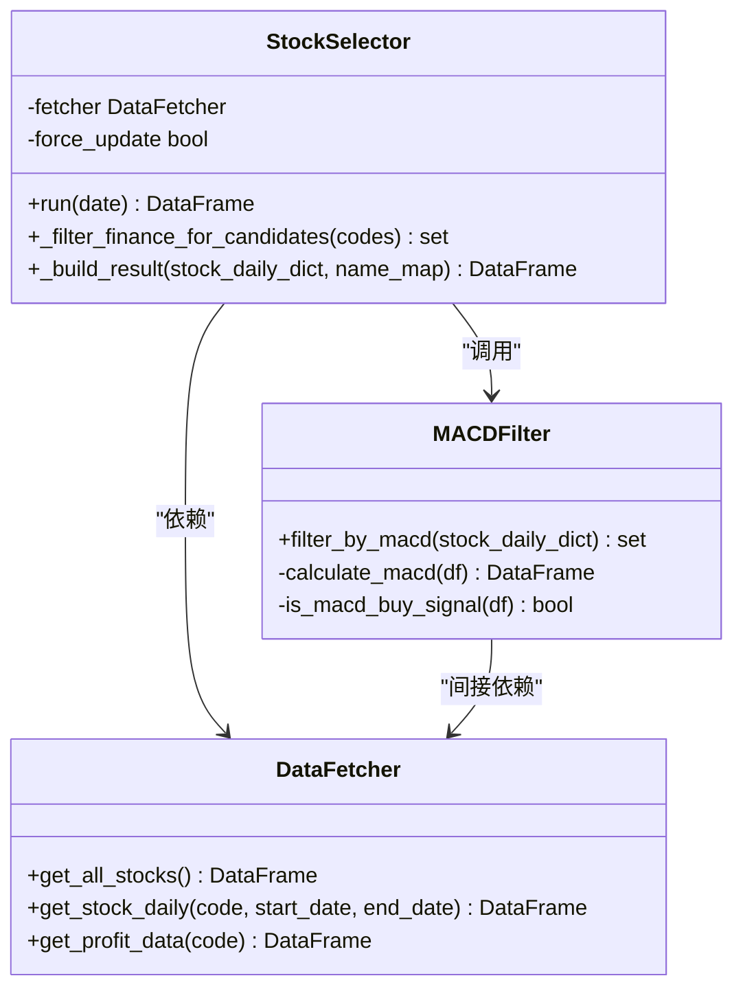
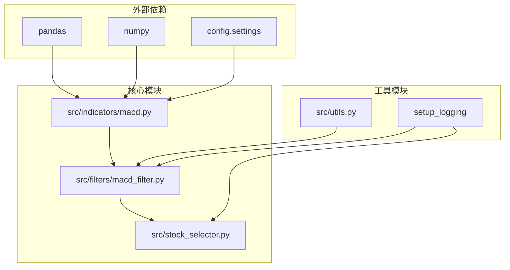

# MACD技术筛选

<cite>
**本文档引用的文件**
- [macd_filter.py](file://src/filters/macd_filter.py)
- [macd.py](file://src/indicators/macd.py)
- [stock_selector.py](file://src/stock_selector.py)
- [settings.py](file://config/settings.py)
- [__init__.py](file://src/filters/__init__.py)
- [__init__.py](file://src/indicators/__init__.py)
</cite>

## 目录
1. [简介](#简介)
2. [项目结构](#项目结构)
3. [核心组件](#核心组件)
4. [架构概览](#架构概览)
5. [详细组件分析](#详细组件分析)
6. [依赖关系分析](#依赖关系分析)
7. [性能考虑](#性能考虑)
8. [故障排除指南](#故障排除指南)
9. [结论](#结论)
10. [附录](#附录)

## 简介

MACD（Moving Average Convergence Divergence，指数平滑异同移动平均线）是技术分析中最常用的趋势跟踪指标之一。本项目实现了基于MACD指标的智能筛选系统，通过自动化算法识别具有潜在投资价值的股票标的。

MACD技术筛选系统采用多步骤漏斗式筛选架构，第一阶段通过板块RPS（相对表现）筛选热门板块，第二阶段应用MACD买入信号进行精确筛选，第三阶段结合庄家控盘指标，第四阶段验证KDJ指标确认，最后进行财务基本面筛选。这种分层筛选机制有效提高了选股精度和成功率。

## 项目结构

该项目采用模块化设计，主要包含以下核心目录结构：

**图表来源**
- [stock_selector.py:1-310](file://src/stock_selector.py#L1-L310)
- [macd_filter.py:1-46](file://src/filters/macd_filter.py#L1-L46)
- [macd.py:1-67](file://src/indicators/macd.py#L1-L67)

**章节来源**
- [stock_selector.py:1-310](file://src/stock_selector.py#L1-L310)
- [settings.py:1-31](file://config/settings.py#L1-L31)

## 核心组件

### MACD筛选器核心功能

MACD筛选器是整个选股系统的核心组件，负责识别具有买入潜力的股票标的。其主要功能包括：

1. **批量股票处理**：支持对大量股票进行并行MACD指标计算
2. **信号识别**：基于严格的MACD买入信号标准进行筛选
3. **异常处理**：完善的错误处理机制确保系统稳定性
4. **进度监控**：实时显示筛选进度和结果统计

### 技术参数配置

系统采用可配置的参数设置，支持灵活调整MACD计算参数：

- **短期周期**：12天（默认）
- **长期周期**：26天（默认）  
- **信号线周期**：9天（默认）

这些参数严格遵循通达信公式的计算标准，确保与主流金融软件的计算结果保持一致。

**章节来源**
- [macd_filter.py:9-46](file://src/filters/macd_filter.py#L9-L46)
- [settings.py:7-11](file://config/settings.py#L7-L11)

## 架构概览

MACD技术筛选系统采用漏斗式多阶段筛选架构，每个阶段都有明确的目标和筛选标准：

**图表来源**
- [stock_selector.py:45-185](file://src/stock_selector.py#L45-L185)

**章节来源**
- [stock_selector.py:45-185](file://src/stock_selector.py#L45-L185)

## 详细组件分析

### MACD指标计算模块

MACD指标计算模块实现了标准的MACD技术指标计算，严格按照通达信公式进行：

#### 技术原理

MACD指标由三个部分组成：
- **DIF线**：短期指数移动平均线与长期指数移动平均线的差值
- **DEA线**：DIF线的移动平均线
- **MACD柱状图**：DIF线与DEA线差值的两倍

#### 计算公式

**图表来源**
- [macd.py:13-33](file://src/indicators/macd.py#L13-L33)

#### 买入信号判断机制

系统采用双重买入信号判断标准：

**图表来源**
- [macd.py:36-66](file://src/indicators/macd.py#L36-L66)

**章节来源**
- [macd.py:13-66](file://src/indicators/macd.py#L13-L66)

### MACD筛选器实现

MACD筛选器作为独立的筛选模块，负责批量处理股票数据并识别买入信号：

#### 核心处理流程

**图表来源**
- [macd_filter.py:9-46](file://src/filters/macd_filter.py#L9-L46)

#### 异常处理机制

系统实现了完善的异常处理策略：

- **数据验证**：检查股票数据完整性，确保至少35个交易日的有效数据
- **计算异常**：捕获MACD计算过程中的异常情况
- **日志记录**：详细记录筛选过程中的异常信息
- **容错处理**：单只股票的异常不影响整体筛选进程

**章节来源**
- [macd_filter.py:9-46](file://src/filters/macd_filter.py#L9-L46)

### 选股引擎集成

MACD筛选器与整个选股系统紧密集成，作为第二阶段筛选的核心组件：

#### 系统集成架构

**图表来源**
- [stock_selector.py:21-310](file://src/stock_selector.py#L21-L310)
- [macd_filter.py:1-46](file://src/filters/macd_filter.py#L1-L46)

**章节来源**
- [stock_selector.py:21-310](file://src/stock_selector.py#L21-L310)

## 依赖关系分析

### 模块依赖关系

系统采用清晰的模块化设计，各组件之间的依赖关系如下：

**图表来源**
- [macd.py:8-10](file://src/indicators/macd.py#L8-L10)
- [macd_filter.py:2-4](file://src/filters/macd_filter.py#L2-L4)
- [stock_selector.py:4-16](file://src/stock_selector.py#L4-L16)

### 参数依赖关系

MACD指标计算依赖于配置参数，这些参数在运行时动态加载：

- **MACD_SHORT**：短期EMA周期（默认12）
- **MACD_LONG**：长期EMA周期（默认26）  
- **MACD_MID**：信号线EMA周期（默认9）

这些参数确保了与通达信等主流金融软件的计算一致性。

**章节来源**
- [macd.py:10](file://src/indicators/macd.py#L10)
- [settings.py:7-11](file://config/settings.py#L7-L11)

## 性能考虑

### 计算优化策略

系统在性能优化方面采用了多项策略：

1. **向量化计算**：利用pandas的向量化操作进行批量计算
2. **内存管理**：及时释放不需要的数据对象
3. **进度监控**：大批次处理时提供实时进度反馈
4. **异常容错**：单点异常不影响整体处理效率

### 数据处理效率

- **批量处理**：支持一次性处理大量股票数据
- **增量更新**：支持部分数据更新，减少重复计算
- **缓存机制**：合理利用中间计算结果，避免重复计算

## 故障排除指南

### 常见问题及解决方案

#### 数据质量问题

**问题现象**：MACD计算结果异常或为空
**可能原因**：
- 股票数据缺失或不完整
- 交易日数据不足（少于35个交易日）
- 数据格式不符合要求

**解决方法**：
- 检查数据源连接状态
- 验证数据完整性
- 确认数据格式符合要求

#### 计算异常

**问题现象**：MACD计算过程中出现异常
**可能原因**：
- EMA计算异常
- NaN值处理不当
- 内存不足

**解决方法**：
- 检查输入数据质量
- 增加数据预处理步骤
- 优化内存使用策略

#### 性能问题

**问题现象**：筛选过程耗时过长
**可能原因**：
- 股票数量过多
- 数据量过大
- 系统资源不足

**解决方法**：
- 分批处理数据
- 优化算法实现
- 增加系统资源

**章节来源**
- [macd_filter.py:37-39](file://src/filters/macd_filter.py#L37-L39)
- [macd.py:52-56](file://src/indicators/macd.py#L52-L56)

## 结论

MACD技术筛选系统通过严谨的技术实现和合理的架构设计，为投资者提供了一个高效、可靠的股票筛选工具。系统的主要优势包括：

1. **准确性高**：基于严格的MACD技术分析理论
2. **稳定性强**：完善的异常处理和容错机制
3. **扩展性好**：模块化设计便于功能扩展
4. **实用性高**：与实际投资需求紧密结合

该系统不仅能够帮助投资者快速识别潜在的投资机会，还为后续的深入分析提供了可靠的基础。通过与其他技术指标的结合使用，可以进一步提高选股的准确性和成功率。

## 附录

### 技术参数调优指南

#### MACD参数优化建议

| 参数类型 | 默认值 | 推荐范围 | 适用场景 |
|---------|--------|----------|----------|
| 短期周期 | 12天 | 8-15天 | 短线交易，敏感度较高 |
| 长期周期 | 26天 | 20-35天 | 中长期趋势跟踪 |
| 信号线周期 | 9天 | 6-12天 | 平衡响应速度与稳定性 |

#### 时间周期应用策略

- **日线级别**：适合中长期投资决策
- **周线级别**：适合趋势方向判断
- **月线级别**：适合宏观趋势把握

#### 风险控制建议

1. **多重验证**：结合多个技术指标进行交叉验证
2. **资金管理**：合理分配投资比例，控制单一标的权重
3. **止损设置**：建立完善的止损机制
4. **持续监控**：定期评估和调整筛选策略