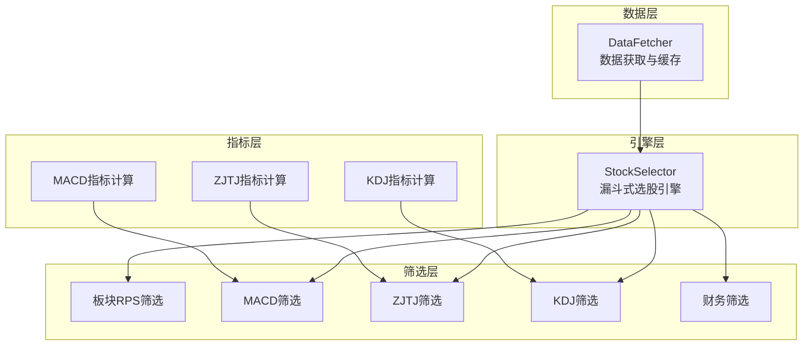
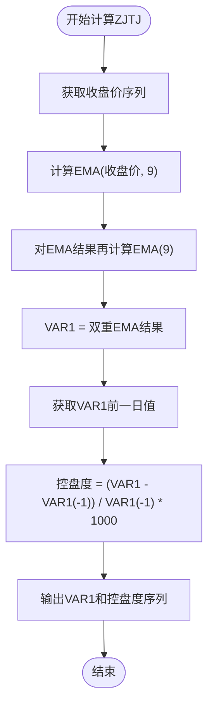
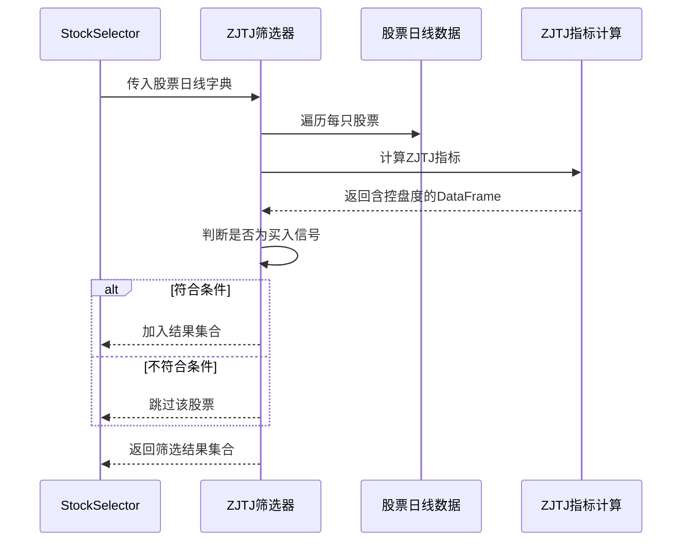
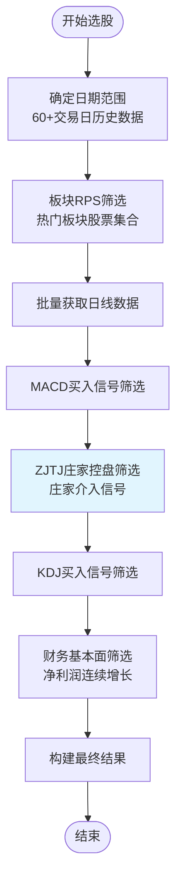
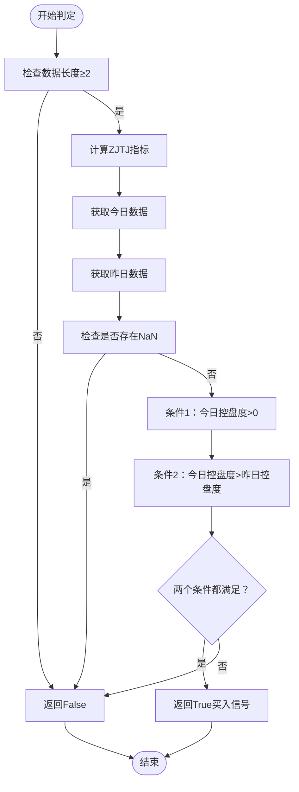
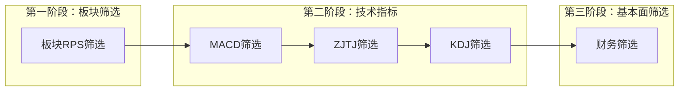
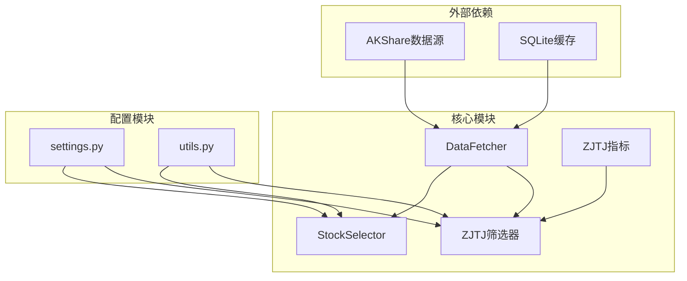

# 庄家控盘筛选

<cite>
**本文引用的文件**
- [zjtj_filter.py](file://src/filters/zjtj_filter.py)
- [zjtj.py](file://src/indicators/zjtj.py)
- [stock_selector.py](file://src/stock_selector.py)
- [settings.py](file://config/settings.py)
- [data_fetcher.py](file://src/data_fetcher.py)
- [utils.py](file://src/utils.py)
- [macd_filter.py](file://src/filters/macd_filter.py)
- [kdj_filter.py](file://src/filters/kdj_filter.py)
- [macd.py](file://src/indicators/macd.py)
- [kdj.py](file://src/indicators/kdj.py)
- [sector_filter.py](file://src/filters/sector_filter.py)
- [finance_filter.py](file://src/filters/finance_filter.py)
</cite>

## 目录
1. [简介](#简介)
2. [项目结构](#项目结构)
3. [核心组件](#核心组件)
4. [架构概览](#架构概览)
5. [详细组件分析](#详细组件分析)
6. [依赖分析](#依赖分析)
7. [性能考虑](#性能考虑)
8. [故障排除指南](#故障排除指南)
9. [结论](#结论)
10. [附录](#附录)

## 简介
本文件为庄家控盘筛选过滤器的技术文档，深入解释ZJTJ（庄家控盘度）指标的计算原理与庄家行为识别机制，详细说明filter_by_zjtj函数的实现逻辑，包括成交量分析、价格波动性评估、主力资金流向判断等核心要素。同时解释控盘度阈值的设定依据和筛选标准，并提供庄家控盘现象的识别技巧和投资策略建议，以及技术指标的局限性和风险提示。

## 项目结构
本项目采用模块化设计，围绕"漏斗式"多因子筛选流程组织代码：
- 数据层：DataFetcher负责从AKShare获取并缓存日线、板块、财务等数据
- 指标层：独立的指标计算模块（MACD、KDJ、ZJTJ等）
- 筛选层：各规则的筛选器模块（板块RPS、MACD、ZJTJ、KDJ、财务）
- 引擎层：StockSelector串联所有筛选器，形成完整的选股流程
- 配置层：settings.py集中管理参数配置

**图表来源**
- [stock_selector.py:45-185](file://src/stock_selector.py#L45-L185)
- [data_fetcher.py:143-153](file://src/data_fetcher.py#L143-L153)

**章节来源**
- [stock_selector.py:1-310](file://src/stock_selector.py#L1-L310)
- [data_fetcher.py:1-774](file://src/data_fetcher.py#L1-L774)

## 核心组件
本节详细介绍庄家控盘筛选的核心组件及其职责。

### ZJTJ指标计算模块
ZJTJ（庄家控盘度）指标基于双重指数平滑计算，反映庄家对股价的控制力度变化。

**图表来源**
- [zjtj.py:13-33](file://src/indicators/zjtj.py#L13-L33)

### ZJTJ筛选器
filter_by_zjtj函数实现庄家控盘信号的批量筛选，遵循漏斗式流程。

**图表来源**
- [zjtj_filter.py:9-45](file://src/filters/zjtj_filter.py#L9-L45)
- [stock_selector.py:137-146](file://src/stock_selector.py#L137-L146)

**章节来源**
- [zjtj_filter.py:1-46](file://src/filters/zjtj_filter.py#L1-L46)
- [zjtj.py:1-57](file://src/indicators/zjtj.py#L1-L57)

## 架构概览
庄家控盘筛选在整个选股系统中处于第四阶段，作为多因子筛选的重要环节。

**图表来源**
- [stock_selector.py:45-185](file://src/stock_selector.py#L45-L185)

**章节来源**
- [stock_selector.py:45-185](file://src/stock_selector.py#L45-L185)

## 详细组件分析

### ZJTJ指标计算原理
ZJTJ指标基于双重指数平滑（Double EMA）计算庄家控盘度，其核心思想是通过平滑后的价格趋势变化来识别庄家的控盘行为。

#### 计算步骤
1. **双重EMA计算**：对收盘价进行两次指数平滑，消除短期噪音
2. **趋势变化计算**：计算VAR1的当日与前一日差值百分比
3. **标准化处理**：乘以1000进行数值标准化

#### 指标特性
- **平滑效果**：双重EMA有效减少价格波动的干扰
- **灵敏度**：通过1000倍放大，使微小趋势变化更明显
- **稳定性**：较长周期的EMA提供稳定的基准线

**章节来源**
- [zjtj.py:13-33](file://src/indicators/zjtj.py#L13-L33)

### 买入信号判定机制
is_zjtj_buy_signal函数定义了庄家控盘的买入信号条件。

**图表来源**
- [zjtj.py:36-56](file://src/indicators/zjtj.py#L36-L56)

#### 信号条件解析
1. **控盘度>0**：表明庄家正在积极介入，股价呈现上升趋势
2. **控盘度递增**：显示庄家控盘力度在持续增强
3. **时间窗口**：基于最新两个交易日的数据进行判断

**章节来源**
- [zjtj.py:36-56](file://src/indicators/zjtj.py#L36-L56)

### 筛选器实现细节
filter_by_zjtj函数实现了完整的筛选流程，包含异常处理和进度监控。

#### 关键实现要点
1. **数据验证**：确保每只股票至少有20个交易日的数据
2. **指标计算**：调用calculate_zjtj计算控盘度指标
3. **信号判定**：使用is_zjtj_buy_signal判断买入信号
4. **异常处理**：捕获计算异常并继续处理其他股票
5. **进度监控**：定期输出筛选进度日志

#### 性能优化措施
- **批量处理**：对候选股票进行批量筛选，避免逐个处理
- **内存管理**：及时释放中间变量，避免内存泄漏
- **日志记录**：提供详细的筛选进度和结果统计

**章节来源**
- [zjtj_filter.py:9-45](file://src/filters/zjtj_filter.py#L9-L45)

### 与其他指标的协同作用
庄家控盘筛选在多因子系统中的位置和作用：

**图表来源**
- [stock_selector.py:126-170](file://src/stock_selector.py#L126-L170)

**章节来源**
- [stock_selector.py:126-170](file://src/stock_selector.py#L126-L170)

## 依赖分析
庄家控盘筛选涉及多个模块间的依赖关系，形成了清晰的层次结构。

**图表来源**
- [data_fetcher.py:143-153](file://src/data_fetcher.py#L143-L153)
- [zjtj_filter.py:1-6](file://src/filters/zjtj_filter.py#L1-L6)
- [stock_selector.py:1-18](file://src/stock_selector.py#L1-L18)

### 依赖关系特点
1. **单向依赖**：数据获取模块独立于筛选模块
2. **松耦合**：通过接口抽象降低模块间耦合度
3. **可扩展性**：新增筛选器不影响现有模块

**章节来源**
- [data_fetcher.py:143-153](file://src/data_fetcher.py#L143-L153)
- [zjtj_filter.py:1-6](file://src/filters/zjtj_filter.py#L1-L6)
- [stock_selector.py:1-18](file://src/stock_selector.py#L1-L18)

## 性能考虑
庄家控盘筛选在大数据量场景下的性能表现和优化策略。

### 时间复杂度分析
- **单只股票处理**：O(n) - n为交易日数量
- **批量筛选**：O(m×n) - m为股票数量，n为平均交易日数
- **总体复杂度**：O(M×N) - M为总股票数，N为平均数据长度

### 内存使用优化
1. **数据流处理**：避免一次性加载所有股票数据
2. **中间结果清理**：及时释放不再使用的DataFrame
3. **缓存策略**：利用SQLite缓存减少重复数据获取

### 并发处理能力
- **异步数据获取**：支持多线程并发获取日线数据
- **批处理优化**：合理设置批次大小平衡内存和速度
- **资源限制**：根据系统资源调整并发度

## 故障排除指南
针对庄家控盘筛选可能出现的问题提供诊断和解决方案。

### 常见问题及解决方法

#### 数据质量问题
**问题症状**：筛选结果异常或计算报错
**可能原因**：
- 日线数据缺失或格式不正确
- 收盘价为NaN或零值
- 交易日数量不足

**解决方法**：
1. 检查数据获取是否成功
2. 验证DataFrame列结构完整性
3. 确认数据时间范围符合要求

#### 计算异常处理
**问题症状**：部分股票筛选失败
**可能原因**：
- 指标计算过程中的除零错误
- NaN值导致的逻辑判断异常
- 内存不足导致的计算中断

**解决方法**：
1. 实施异常捕获和日志记录
2. 使用np.where处理除零情况
3. 分批处理大数据集

#### 性能问题诊断
**问题症状**：筛选过程耗时过长
**可能原因**：
- 数据量过大导致内存压力
- I/O操作频繁
- 缺少必要的索引

**解决方法**：
1. 优化数据获取策略
2. 实施分页和批处理
3. 增加适当的索引

**章节来源**
- [zjtj_filter.py:37-39](file://src/filters/zjtj_filter.py#L37-L39)
- [zjtj.py:26-27](file://src/indicators/zjtj.py#L26-L27)

## 结论
庄家控盘筛选通过ZJTJ指标有效识别庄家介入信号，在多因子选股系统中发挥重要作用。该实现具有以下特点：

1. **准确性**：基于双重EMA的平滑处理提高了信号的可靠性
2. **实用性**：简洁明确的买入条件便于理解和应用
3. **可扩展性**：模块化设计支持功能扩展和性能优化
4. **鲁棒性**：完善的异常处理和日志记录机制

建议在实际应用中结合其他技术指标和基本面分析，形成更加全面的投资决策体系。

## 附录

### 技术指标局限性
1. **滞后性**：EMA指标存在固有的滞后特征
2. **市场适应性**：不同市场环境下阈值可能需要调整
3. **假信号风险**：极端行情可能导致误判
4. **样本外失效**：历史表现不代表未来收益

### 风险提示
1. **市场风险**：股市投资存在本金损失风险
2. **模型风险**：量化模型可能失效
3. **流动性风险**：某些股票可能存在流动性不足
4. **信息不对称**：庄家行为可能难以完全预测

### 投资策略建议
1. **组合投资**：不要将所有资金投入单一标的
2. **止损机制**：设置合理的止损点位
3. **时间分散**：避免集中在特定时间段操作
4. **持续监控**：定期评估和调整投资策略