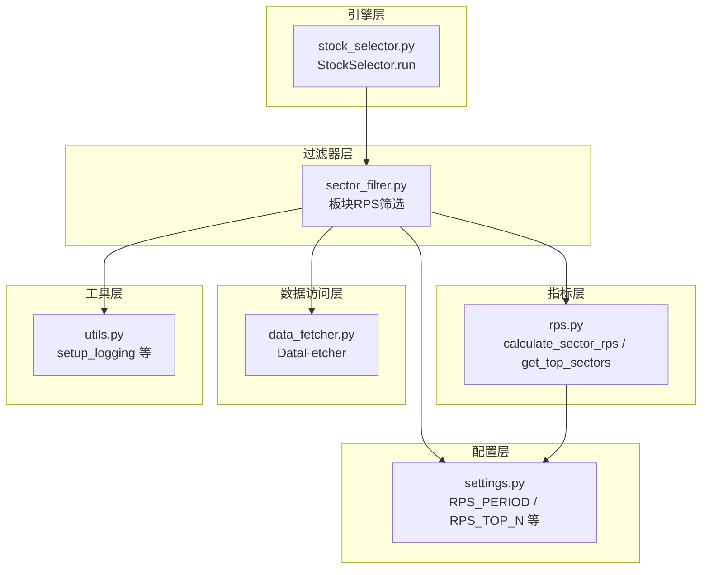
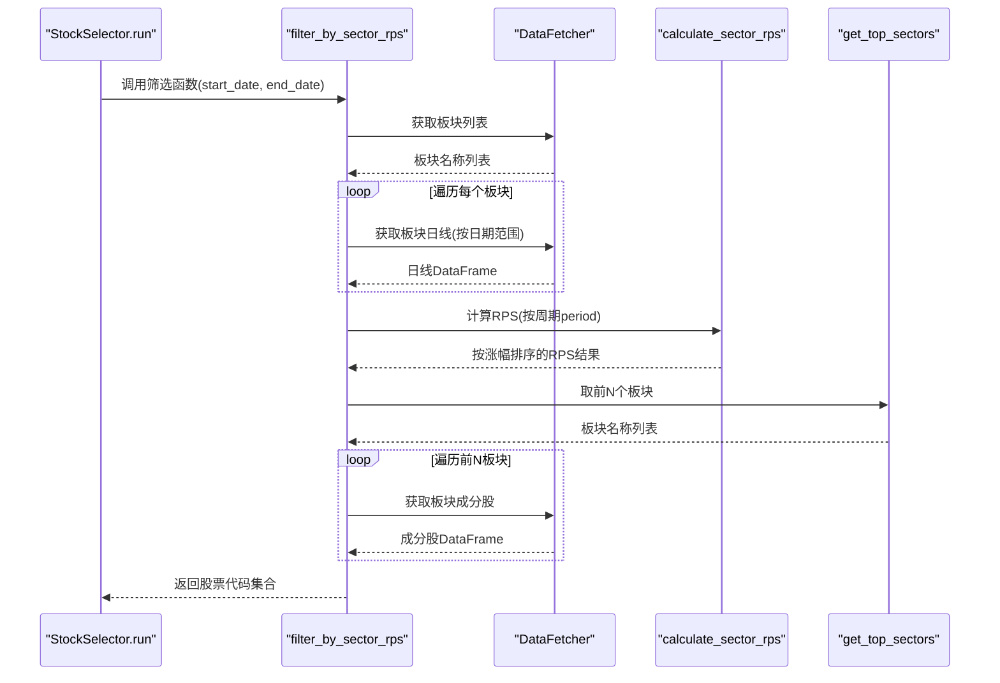
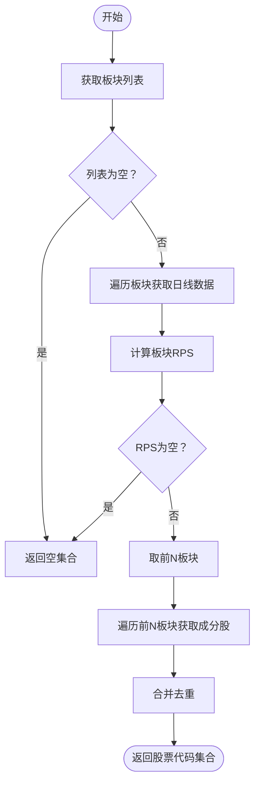
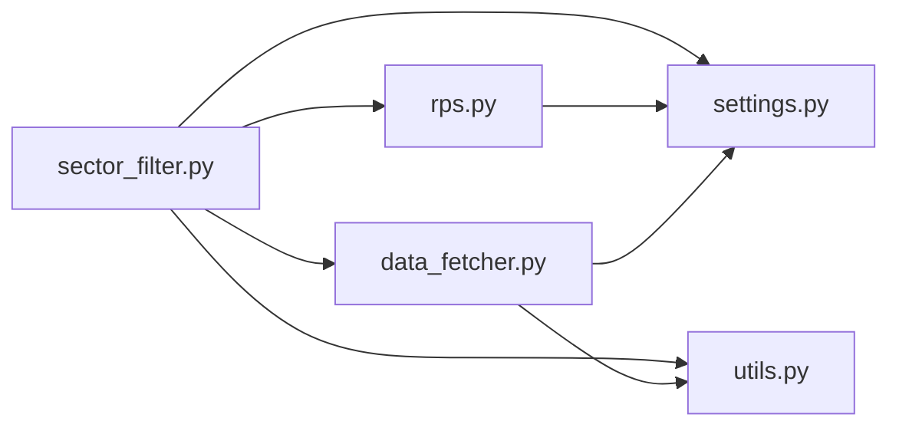

# 板块RPS筛选

<cite>
**本文引用的文件**
- [sector_filter.py](file://src/filters/sector_filter.py)
- [rps.py](file://src/indicators/rps.py)
- [settings.py](file://config/settings.py)
- [data_fetcher.py](file://src/data_fetcher.py)
- [utils.py](file://src/utils.py)
- [stock_selector.py](file://src/stock_selector.py)
</cite>

## 目录
1. [简介](#简介)
2. [项目结构](#项目结构)
3. [核心组件](#核心组件)
4. [架构总览](#架构总览)
5. [详细组件分析](#详细组件分析)
6. [依赖关系分析](#依赖关系分析)
7. [性能考虑](#性能考虑)
8. [故障排查指南](#故障排查指南)
9. [结论](#结论)
10. [附录](#附录)

## 简介
本文件围绕“板块RPS筛选过滤器”展开，系统性阐述RPS（相对强度）指标的计算原理、板块轮动策略以及filter_by_sector_rps函数的实现逻辑。内容涵盖：
- RPS指标定义与计算流程
- 板块轮动策略与参数配置
- filter_by_sector_rps函数的步骤拆解（板块列表获取、行情数据收集、RPS计算、排名筛选、成分股提取）
- RPS_PERIOD与RPS_TOP_N参数的作用与调优建议
- 错误处理与日志记录策略
- 性能优化与最佳实践

## 项目结构
本项目采用“功能域+层次化”的组织方式，与板块RPS筛选相关的关键模块如下：
- 过滤器层：负责具体筛选规则的实现，如板块RPS筛选
- 指标层：封装RPS计算与排名逻辑
- 数据访问层：统一的数据获取与缓存接口
- 配置层：集中管理参数与路径
- 工具层：日志、日期、格式化等通用能力
- 选股引擎：串联多规则的漏斗式流程

图表来源
- [sector_filter.py:11-73](file://src/filters/sector_filter.py#L11-L73)
- [rps.py:9-61](file://src/indicators/rps.py#L9-L61)
- [data_fetcher.py:429-641](file://src/data_fetcher.py#L429-L641)
- [settings.py:3-5](file://config/settings.py#L3-L5)
- [utils.py:9-31](file://src/utils.py#L9-L31)
- [stock_selector.py:45-98](file://src/stock_selector.py#L45-L98)

章节来源
- [sector_filter.py:1-73](file://src/filters/sector_filter.py#L1-L73)
- [rps.py:1-61](file://src/indicators/rps.py#L1-L61)
- [data_fetcher.py:1-774](file://src/data_fetcher.py#L1-L774)
- [settings.py:1-31](file://config/settings.py#L1-L31)
- [utils.py:1-134](file://src/utils.py#L1-L134)
- [stock_selector.py:21-309](file://src/stock_selector.py#L21-L309)

## 核心组件
- 板块RPS筛选器：实现filter_by_sector_rps函数，完成从板块列表到成分股集合的筛选
- RPS指标计算：封装calculate_sector_rps与get_top_sectors，提供板块RPS值与排名
- 数据获取器：DataFetcher提供板块列表、板块日线、板块成分股等数据接口，并内置缓存与重试
- 配置中心：settings.py集中管理RPS_PERIOD、RPS_TOP_N等参数
- 日志工具：utils.setup_logging统一输出控制台与文件日志
- 选股引擎：StockSelector.run串联规则，其中规则1即板块RPS筛选

章节来源
- [sector_filter.py:11-73](file://src/filters/sector_filter.py#L11-L73)
- [rps.py:9-61](file://src/indicators/rps.py#L9-L61)
- [data_fetcher.py:429-641](file://src/data_fetcher.py#L429-L641)
- [settings.py:3-5](file://config/settings.py#L3-L5)
- [utils.py:9-31](file://src/utils.py#L9-L31)
- [stock_selector.py:45-98](file://src/stock_selector.py#L45-L98)

## 架构总览
板块RPS筛选在整体选股流程中的位置如下：

图表来源
- [stock_selector.py:83-90](file://src/stock_selector.py#L83-L90)
- [sector_filter.py:24-72](file://src/filters/sector_filter.py#L24-L72)
- [data_fetcher.py:429-641](file://src/data_fetcher.py#L429-L641)
- [rps.py:9-61](file://src/indicators/rps.py#L9-L61)

## 详细组件分析

### RPS指标计算原理与板块轮动策略
- 指标定义：RPS基于“近period天累计涨跌幅”，用于衡量板块相对强弱
- 计算步骤：
  1) 截取最近period+1个交易日的收盘价序列
  2) 计算期末/期初收盘价的百分比变化
  3) 对所有板块按涨幅降序排名，得到rps_rank
- 排名策略：涨幅越高，排名越靠前（rank=1为最强）
- 板块轮动策略：取RPS前N个板块，认为其近期走势最强，从而提升进入后续规则的股票质量与胜率

章节来源
- [rps.py:9-51](file://src/indicators/rps.py#L9-L51)

### filter_by_sector_rps函数实现逻辑
- 输入：DataFetcher实例、起止日期、板块类型（行业/概念）
- 步骤分解：
  1) 获取板块列表：调用DataFetcher.get_sector_list
  2) 收集行情数据：遍历板块名称，调用DataFetcher.get_sector_daily
  3) 计算RPS：调用calculate_sector_rps，按RPS_PERIOD计算
  4) 排名筛选：调用get_top_sectors，取前N个板块
  5) 提取成分股：遍历前N板块，调用DataFetcher.get_sector_constituents，合并去重
- 输出：前N板块对应的股票代码集合

图表来源
- [sector_filter.py:24-72](file://src/filters/sector_filter.py#L24-L72)
- [rps.py:54-61](file://src/indicators/rps.py#L54-L61)
- [data_fetcher.py:429-641](file://src/data_fetcher.py#L429-L641)

章节来源
- [sector_filter.py:11-73](file://src/filters/sector_filter.py#L11-L73)

### 参数配置：RPS_PERIOD 与 RPS_TOP_N
- RPS_PERIOD（默认20）：RPS计算所用的交易日窗口长度，窗口越大对噪声更鲁棒但时效性下降
- RPS_TOP_N（默认20）：取RPS最强的前N个板块参与后续筛选，N越大覆盖面广但可能稀释强度
- 配置位置：config/settings.py
- 使用方式：filter_by_sector_rps与calculate_sector_rps均从配置读取默认值，亦可在调用处显式传参覆盖

章节来源
- [settings.py:3-5](file://config/settings.py#L3-L5)
- [rps.py:9](file://src/indicators/rps.py#L9)
- [sector_filter.py:50](file://src/filters/sector_filter.py#L50)

### 数据获取与缓存策略
- 板块列表：get_sector_list，分页拉取并缓存至sector_list表
- 板块日线：get_sector_daily，按日期范围拉取并缓存至sector_daily表
- 板块成分股：get_sector_constituents，分页拉取并缓存至sector_constituents表
- 重试与限频：统一通过_retry与_request_eastmoney实现，避免外部接口波动影响
- 交易日范围：StockSelector.run中为保证指标稳定性，通常向前扩展约200个交易日

章节来源
- [data_fetcher.py:429-641](file://src/data_fetcher.py#L429-L641)
- [stock_selector.py:66-76](file://src/stock_selector.py#L66-L76)

### 错误处理与日志记录
- 板块列表为空：记录警告并返回空集合
- 板块日线缺失或异常：记录警告并跳过该板块
- RPS计算结果为空：记录警告并返回空集合
- 板块成分股为空：记录警告并跳过该板块
- 日志策略：统一通过setup_logging创建控制台与文件处理器，便于问题定位与审计

章节来源
- [sector_filter.py:26-28](file://src/filters/sector_filter.py#L26-L28)
- [sector_filter.py:40-42](file://src/filters/sector_filter.py#L40-L42)
- [sector_filter.py:51-53](file://src/filters/sector_filter.py#L51-L53)
- [sector_filter.py:67-69](file://src/filters/sector_filter.py#L67-L69)
- [utils.py:9-31](file://src/utils.py#L9-L31)

## 依赖关系分析
- filter_by_sector_rps依赖：
  - DataFetcher：板块列表、日线、成分股
  - RPS计算模块：calculate_sector_rps、get_top_sectors
  - 配置：RPS_PERIOD、RPS_TOP_N
  - 日志：setup_logging
- RPS计算模块依赖：
  - 配置：RPS_PERIOD、RPS_TOP_N
- DataFetcher依赖：
  - 配置：DB_PATH、REQUEST_RETRY、REQUEST_DELAY、REQUEST_TIMEOUT
  - 日志：setup_logging

图表来源
- [sector_filter.py:3-6](file://src/filters/sector_filter.py#L3-L6)
- [rps.py:6](file://src/indicators/rps.py#L6)
- [data_fetcher.py:12](file://src/data_fetcher.py#L12)
- [settings.py:3-5](file://config/settings.py#L3-L5)
- [utils.py:9-31](file://src/utils.py#L9-L31)

章节来源
- [sector_filter.py:3-6](file://src/filters/sector_filter.py#L3-L6)
- [rps.py:6](file://src/indicators/rps.py#L6)
- [data_fetcher.py:12](file://src/data_fetcher.py#L12)
- [settings.py:3-5](file://config/settings.py#L3-L5)
- [utils.py:9-31](file://src/utils.py#L9-L31)

## 性能考虑
- 数据批量化与缓存
  - 板块列表、日线、成分股均写入SQLite缓存，避免重复拉取
  - 批量获取日线时按日期增量更新，减少重复IO
- 请求重试与限频
  - 统一的_retry与_request_eastmoney实现指数退避重试，降低外部接口波动影响
- 计算复杂度
  - RPS计算对每个板块做一次线性窗口滑动（取period+1收盘价），整体O(N×M)，N为板块数，M为有效交易日
  - 排名阶段O(N log N)，总体可接受
- 参数调优建议
  - RPS_PERIOD：短期策略可取10~15；中长期策略可取20~60；极端震荡市场可适当增大以平滑噪声
  - RPS_TOP_N：兼顾覆盖面与强度，常见取值20~50；若个股池较小，可适当下调
- 并发与资源
  - 当前实现为顺序遍历，若需加速可考虑多线程/进程池拉取日线与成分股，注意外部接口限频与幂等写入

[本节为通用性能建议，无需特定文件引用]

## 故障排查指南
- 现象：未获取到板块列表
  - 检查网络与东方财富接口状态；查看日志中警告信息
  - 章节来源: [sector_filter.py:26-28](file://src/filters/sector_filter.py#L26-L28)
- 现象：RPS计算结果为空
  - 检查输入日线是否包含close列且长度足够；确认日期范围合理
  - 章节来源: [rps.py:17-25](file://src/indicators/rps.py#L17-L25)
- 现象：部分板块日线获取失败
  - 查看日志中的警告条目，确认外部接口返回与重试策略是否生效
  - 章节来源: [sector_filter.py:40-42](file://src/filters/sector_filter.py#L40-L42)
- 现象：成分股为空
  - 确认板块名称正确且存在成分股；查看日志中的警告
  - 章节来源: [sector_filter.py:67-69](file://src/filters/sector_filter.py#L67-L69)
- 日志定位
  - 使用setup_logging输出到控制台与文件，结合时间戳与模块名快速定位问题
  - 章节来源: [utils.py:9-31](file://src/utils.py#L9-L31)

## 结论
板块RPS筛选通过“近N日涨跌幅”衡量板块强弱，结合前N强板块的成分股作为高质量候选池，显著提升后续技术面与基本面筛选的命中率。通过合理的参数配置（RPS_PERIOD、RPS_TOP_N）、完善的缓存与重试机制、以及清晰的日志体系，可在保证稳定性的同时获得良好的性能表现。

## 附录
- 参数一览
  - RPS_PERIOD：RPS计算周期（天）
  - RPS_TOP_N：取前N个板块
  - 章节来源: [settings.py:3-5](file://config/settings.py#L3-L5)
- 关键函数路径
  - filter_by_sector_rps：[sector_filter.py:11-73](file://src/filters/sector_filter.py#L11-L73)
  - calculate_sector_rps：[rps.py:9-51](file://src/indicators/rps.py#L9-L51)
  - get_top_sectors：[rps.py:54-61](file://src/indicators/rps.py#L54-L61)
  - DataFetcher.get_sector_list/get_sector_daily/get_sector_constituents：[data_fetcher.py:429-641](file://src/data_fetcher.py#L429-L641)
- 选股引擎集成
  - StockSelector.run在规则1中调用filter_by_sector_rps，形成漏斗式筛选流程
  - 章节来源: [stock_selector.py:83-90](file://src/stock_selector.py#L83-L90)