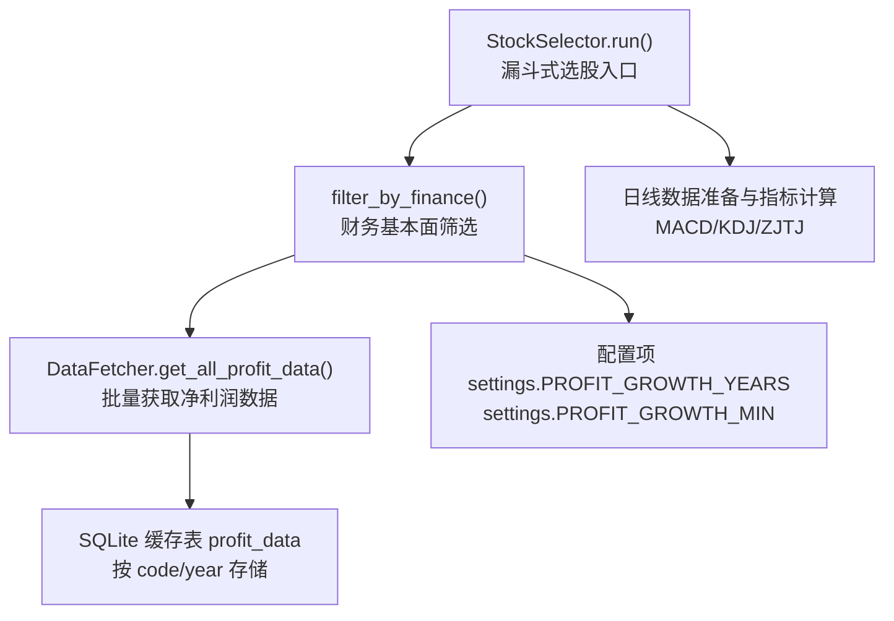
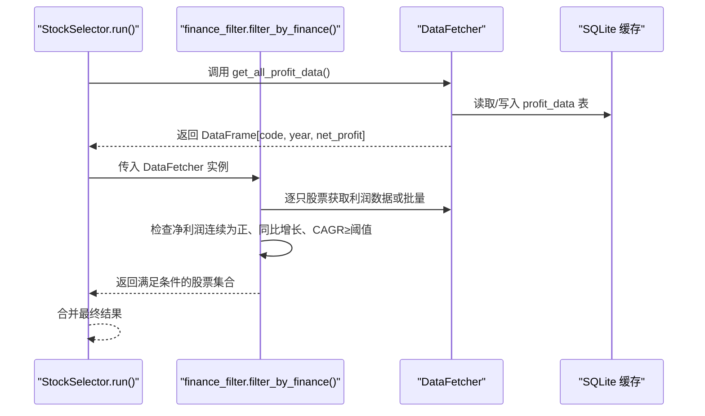
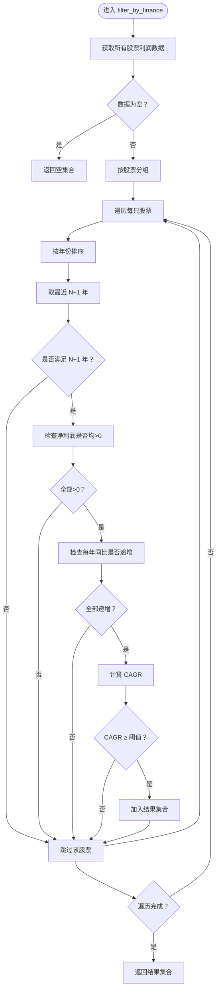
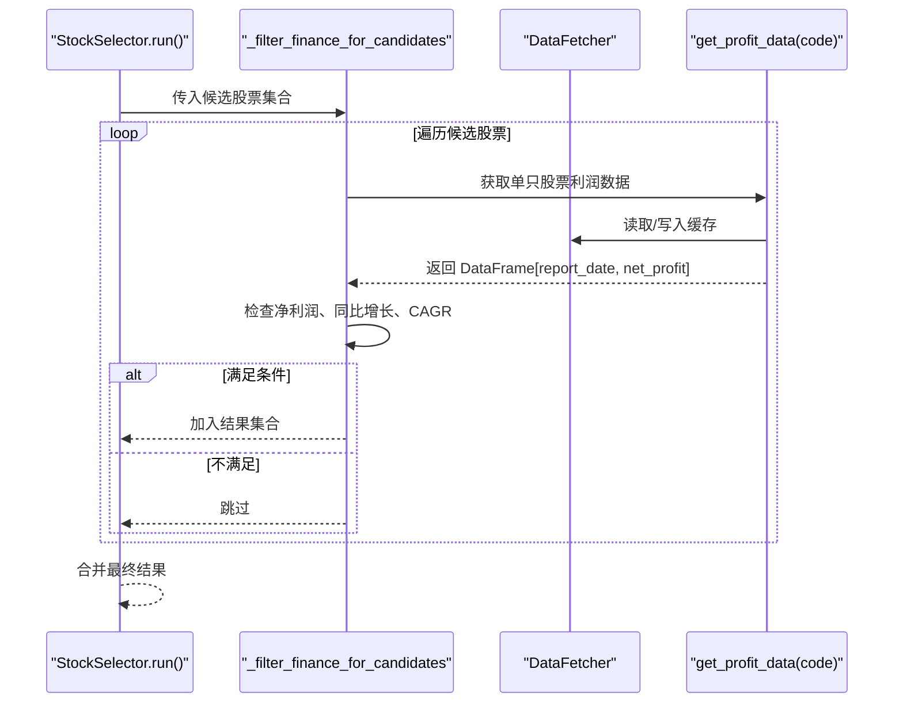
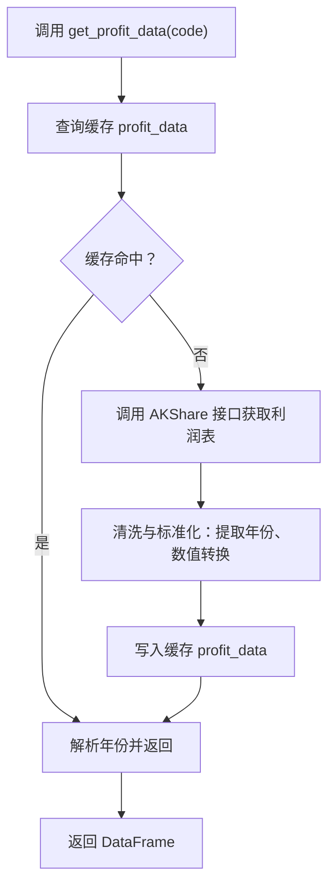
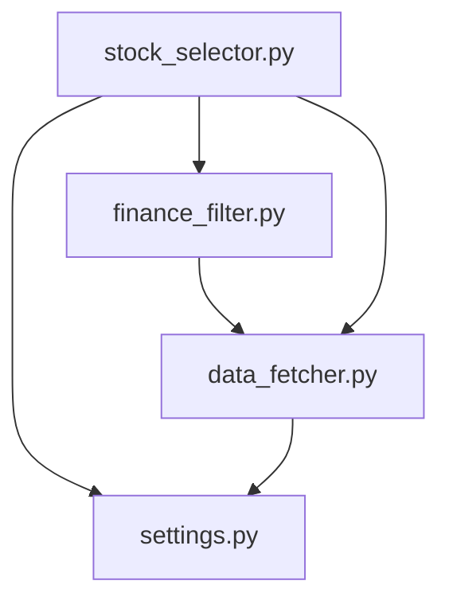

# 财务基本面筛选

<cite>
**本文引用的文件**
- [finance_filter.py](file://src/filters/finance_filter.py)
- [stock_selector.py](file://src/stock_selector.py)
- [data_fetcher.py](file://src/data_fetcher.py)
- [settings.py](file://config/settings.py)
- [utils.py](file://src/utils.py)
</cite>

## 目录
1. [简介](#简介)
2. [项目结构](#项目结构)
3. [核心组件](#核心组件)
4. [架构总览](#架构总览)
5. [详细组件分析](#详细组件分析)
6. [依赖分析](#依赖分析)
7. [性能考虑](#性能考虑)
8. [故障排查指南](#故障排查指南)
9. [结论](#结论)
10. [附录](#附录)

## 简介
本文件围绕“财务基本面筛选”功能展开，重点解释基于净利润增长的筛选规则与实现逻辑，涵盖以下内容：
- 筛选规则的理论基础与估值方法概述
- filter_by_finance 函数的实现流程与关键判定条件
- 财务数据来源、缓存机制与质量控制
- 与其他筛选器的协作关系
- 实战中的投资策略建议与风险评估要点

## 项目结构
财务基本面筛选位于“src/filters/finance_filter.py”，由“src/stock_selector.py”在漏斗式选股流程的最后阶段调用，数据由“src/data_fetcher.py”提供，并通过“config/settings.py”配置关键阈值。

图表来源
- [stock_selector.py:45-185](file://src/stock_selector.py#L45-L185)
- [finance_filter.py:10-91](file://src/filters/finance_filter.py#L10-L91)
- [data_fetcher.py:725-774](file://src/data_fetcher.py#L725-L774)
- [settings.py:17-20](file://config/settings.py#L17-L20)

章节来源
- [stock_selector.py:45-185](file://src/stock_selector.py#L45-L185)
- [finance_filter.py:10-91](file://src/filters/finance_filter.py#L10-L91)
- [data_fetcher.py:725-774](file://src/data_fetcher.py#L725-L774)
- [settings.py:17-20](file://config/settings.py#L17-L20)

## 核心组件
- 财务筛选器（finance_filter.py）
  - 提供 filter_by_finance(fetcher) 接口，返回满足条件的股票代码集合
  - 关键条件：净利润连续多年为正、同比增长、复合年化增长率不低于阈值
- 选股引擎（stock_selector.py）
  - 在完成板块RPS、MACD、ZJTJ、KDJ等筛选后，调用财务筛选
  - 提供候选集优化版本 _filter_finance_for_candidates，仅对候选股票进行逐只检查
- 数据获取器（data_fetcher.py）
  - 提供 get_all_profit_data() 批量获取净利润数据，并写入 SQLite 缓存
  - 提供 get_profit_data(code) 单只股票利润数据获取与缓存
- 配置（settings.py）
  - PROFIT_GROWTH_YEARS：考察年数（默认3年）
  - PROFIT_GROWTH_MIN：最低复合年化增长率阈值（默认20%）

章节来源
- [finance_filter.py:10-91](file://src/filters/finance_filter.py#L10-L91)
- [stock_selector.py:191-256](file://src/stock_selector.py#L191-L256)
- [data_fetcher.py:644-774](file://src/data_fetcher.py#L644-L774)
- [settings.py:17-20](file://config/settings.py#L17-L20)

## 架构总览
财务筛选在整体选股流程中的位置如下：

图表来源
- [stock_selector.py:159-170](file://src/stock_selector.py#L159-L170)
- [finance_filter.py:10-91](file://src/filters/finance_filter.py#L10-L91)
- [data_fetcher.py:725-774](file://src/data_fetcher.py#L725-L774)

## 详细组件分析

### 财务筛选器实现（filter_by_finance）
- 输入输出
  - 输入：DataFetcher 实例
  - 输出：满足条件的股票代码集合（set）
- 主要流程
  - 获取所有股票的年度净利润数据
  - 按股票分组，取最近 N+1 年数据（N 为考察年数）
  - 条件1：最近 N+1 年净利润均为正
  - 条件2：每年净利润同比增长（严格递增）
  - 条件3：复合年化增长率（CAGR）不低于阈值
  - 记录命中股票，返回集合
- 关键公式
  - CAGR = (最新利润 / 最早利润)^(1/N) - 1
- 错误处理
  - 数据为空或异常时跳过该股票并记录警告日志
  - 进度日志按批次输出，便于监控

图表来源
- [finance_filter.py:25-90](file://src/filters/finance_filter.py#L25-L90)

章节来源
- [finance_filter.py:10-91](file://src/filters/finance_filter.py#L10-L91)

### 选股引擎中的财务筛选调用
- 在 StockSelector.run() 的漏斗流程中，财务筛选位于第四步之后、第五步之前
- 提供两种调用方式
  - 使用 filter_by_finance(fetcher)：对全市场股票进行筛选
  - 使用 _filter_finance_for_candidates(codes)：仅对候选股票集合进行筛选，提升效率
- 两种实现的核心逻辑一致，均遵循“净利润连续为正、同比增长、CAGR≥阈值”的三要素

图表来源
- [stock_selector.py:159-170](file://src/stock_selector.py#L159-L170)
- [stock_selector.py:191-256](file://src/stock_selector.py#L191-L256)
- [data_fetcher.py:644-721](file://src/data_fetcher.py#L644-L721)

章节来源
- [stock_selector.py:159-170](file://src/stock_selector.py#L159-L170)
- [stock_selector.py:191-256](file://src/stock_selector.py#L191-L256)

### 财务数据获取与质量控制
- 数据来源
  - 通过 AKShare 接口获取个股年度利润表数据
  - 支持“归母净利润”或“净利润”字段，若缺失则尝试匹配包含“净利润”的列
- 数据结构
  - 原始列包含报告期与净利润
  - 写入缓存表 profit_data，结构为 (code, year, net_profit)
- 质量控制
  - 自动清洗：将报告期转换为日期格式，提取年份
  - 异常处理：字段缺失、数值解析失败时记录警告并返回空结果
  - 缓存一致性：每次写入前清理旧记录，保证数据新鲜度
- 批量与增量
  - 批量接口 get_all_profit_data() 会检查缓存，避免重复抓取
  - 增量更新：根据已有缓存的最大年份决定起始抓取时间

图表来源
- [data_fetcher.py:644-721](file://src/data_fetcher.py#L644-L721)
- [data_fetcher.py:725-774](file://src/data_fetcher.py#L725-L774)

章节来源
- [data_fetcher.py:644-721](file://src/data_fetcher.py#L644-L721)
- [data_fetcher.py:725-774](file://src/data_fetcher.py#L725-L774)

### 配置参数与阈值
- PROFIT_GROWTH_YEARS：考察年数（默认3年）
- PROFIT_GROWTH_MIN：最低复合年化增长率阈值（默认20%）
- 以上参数在筛选逻辑中用于确定所需年数与达标门槛

章节来源
- [settings.py:17-20](file://config/settings.py#L17-L20)
- [finance_filter.py:44-45](file://src/filters/finance_filter.py#L44-L45)
- [finance_filter.py:77-79](file://src/filters/finance_filter.py#L77-L79)
- [stock_selector.py:191-256](file://src/stock_selector.py#L191-L256)

## 依赖分析
- 组件耦合
  - finance_filter 依赖 DataFetcher 获取利润数据
  - stock_selector 在运行时注入 DataFetcher，并在不同阶段调用筛选器
- 外部依赖
  - AKShare：获取利润表数据
  - SQLite：本地缓存，降低重复抓取成本
- 配置依赖
  - settings 中的 PROFIT_GROWTH_YEARS 与 PROFIT_GROWTH_MIN 决定筛选标准

图表来源
- [finance_filter.py:3-4](file://src/filters/finance_filter.py#L3-L4)
- [stock_selector.py:4-16](file://src/stock_selector.py#L4-L16)
- [data_fetcher.py:12](file://src/data_fetcher.py#L12)
- [settings.py:17-20](file://config/settings.py#L17-L20)

章节来源
- [finance_filter.py:3-4](file://src/filters/finance_filter.py#L3-L4)
- [stock_selector.py:4-16](file://src/stock_selector.py#L4-L16)
- [data_fetcher.py:12](file://src/data_fetcher.py#L12)
- [settings.py:17-20](file://config/settings.py#L17-L20)

## 性能考虑
- 候选集优化
  - 在 StockSelector 中使用 _filter_finance_for_candidates，仅对候选股票集合进行筛选，显著减少循环次数
- 缓存策略
  - SQLite 缓存 profit_data，避免重复抓取 AKShare 数据
  - 批量接口 get_all_profit_data() 会先读取缓存，再增量抓取缺失部分
- 日志与进度
  - 通过日志输出筛选进度，便于监控长时间任务的执行状态

章节来源
- [stock_selector.py:191-256](file://src/stock_selector.py#L191-L256)
- [data_fetcher.py:725-774](file://src/data_fetcher.py#L725-L774)
- [finance_filter.py:86-87](file://src/filters/finance_filter.py#L86-L87)

## 故障排查指南
- 未获取到利润数据
  - 现象：筛选返回空集合或警告日志
  - 排查：确认 AKShare 接口可访问、网络与重试配置正常
- 字段缺失或解析失败
  - 现象：日志提示未找到净利润列或数值解析失败
  - 排查：检查目标股票是否存在利润表数据，确认字段命名是否变化
- 缓存不一致
  - 现象：历史数据与预期不符
  - 排查：清理 profit_data 缓存表后重新抓取，或启用强制更新模式（force_update）
- 运行缓慢
  - 现象：筛选耗时较长
  - 排查：优先使用候选集优化版本 _filter_finance_for_candidates；检查网络与重试配置

章节来源
- [finance_filter.py:27-29](file://src/filters/finance_filter.py#L27-L29)
- [data_fetcher.py:698-700](file://src/data_fetcher.py#L698-L700)
- [stock_selector.py:35-43](file://src/stock_selector.py#L35-L43)
- [stock_selector.py:191-256](file://src/stock_selector.py#L191-L256)

## 结论
本财务筛选器聚焦于“净利润连续增长与复合增速”的核心财务指标，通过严格的三条件判定与本地缓存机制，实现了高效、稳定的选股前置过滤。结合板块热度、技术信号与基本面的多维筛选，可形成稳健的量化选股体系。

## 附录

### 投资策略与风险评估建议
- 策略要点
  - 选择连续多年净利润为正且同比增长的企业，反映盈利质量与成长趋势
  - 关注 CAGR 阈值（默认20%），剔除增长乏力或波动较大的标的
  - 与技术面（MACD/KDJ/ZJTJ）及板块热度（RPS）结合，提高胜率
- 风险提示
  - 仅凭净利润增长无法完全代表企业价值，需结合行业景气度、估值水平与现金流状况综合判断
  - 历史增长不代表未来持续，应关注政策、竞争格局与管理层能力等外部因素
  - 高增长公司可能伴随较高估值风险，建议配合估值指标（如PE、PB、PEG）进行二次过滤

### 与盈利能力、成长性、偿债能力、运营效率指标的关系
- 本筛选器聚焦“净利润”与“复合年化增长率”，属于成长性维度的直接体现
- 若需扩展至更全面的基本面分析，可在现有框架基础上增加：
  - 盈利能力：ROE、ROA（需资产负债表与利润表匹配）
  - 偿债能力：资产负债率、流动比率（需资产负债表）
  - 运营效率：存货周转率、应收账款周转率（需匹配期间报表）
- 权重配置建议（概念性说明）
  - 可采用等权或基于因子稳定性调整的权重，结合回测结果动态优化
  - 建议分层打分：分别计算各指标得分并加权汇总，作为进一步筛选或排序依据