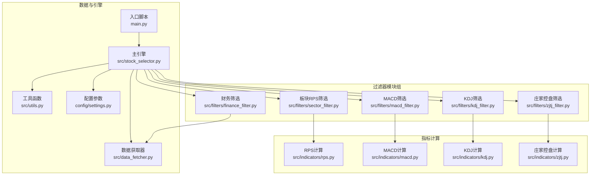
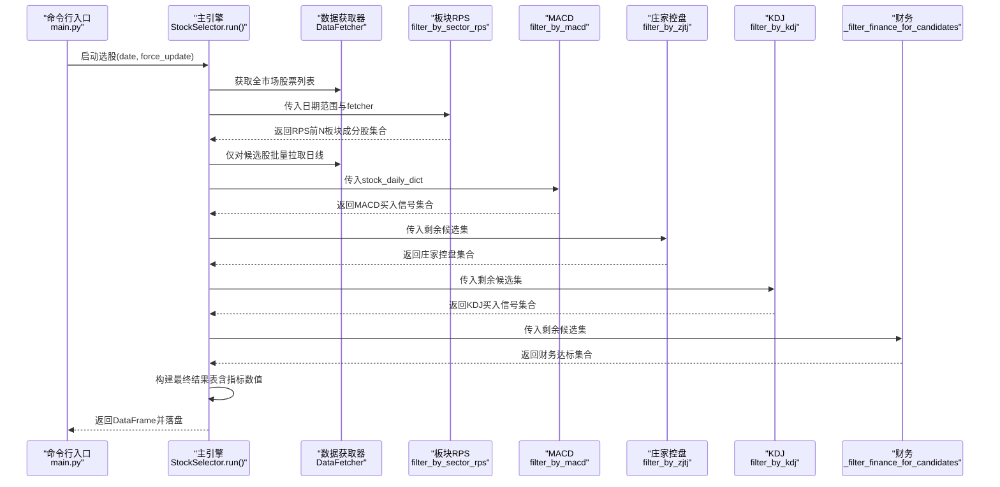
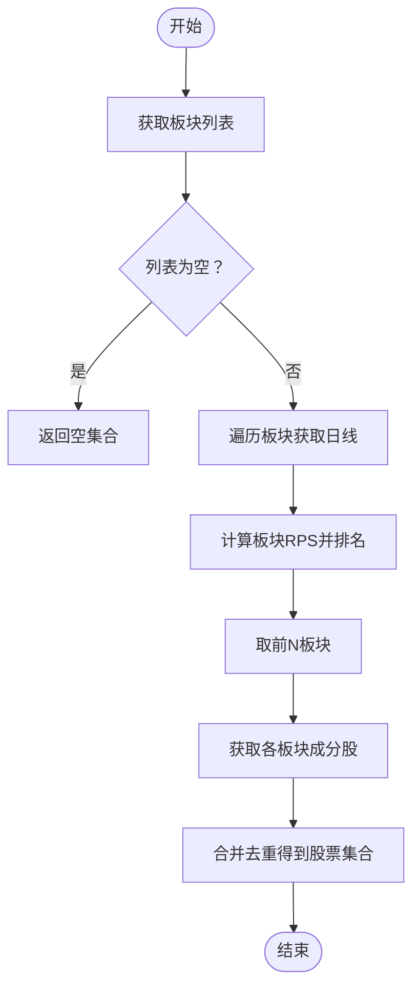
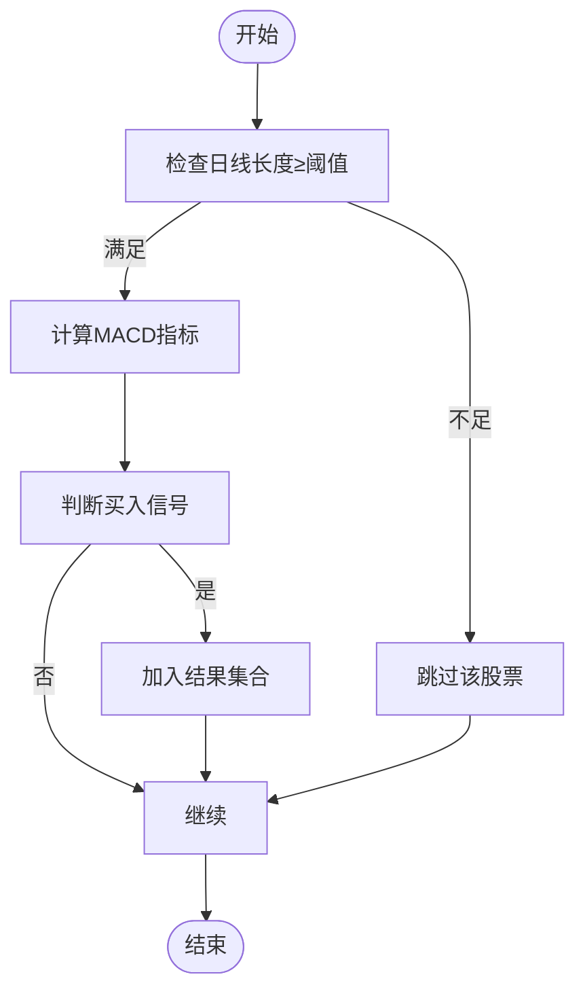
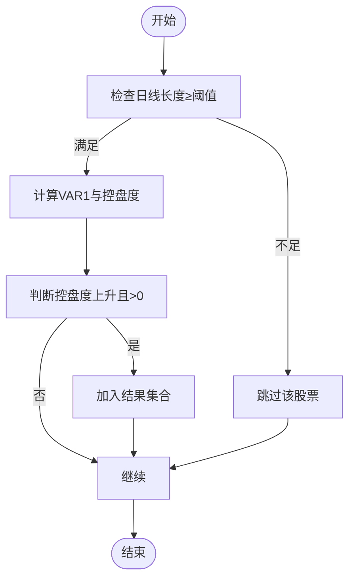
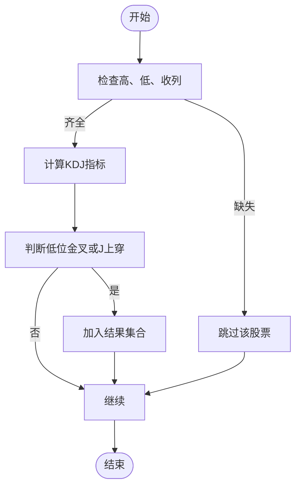
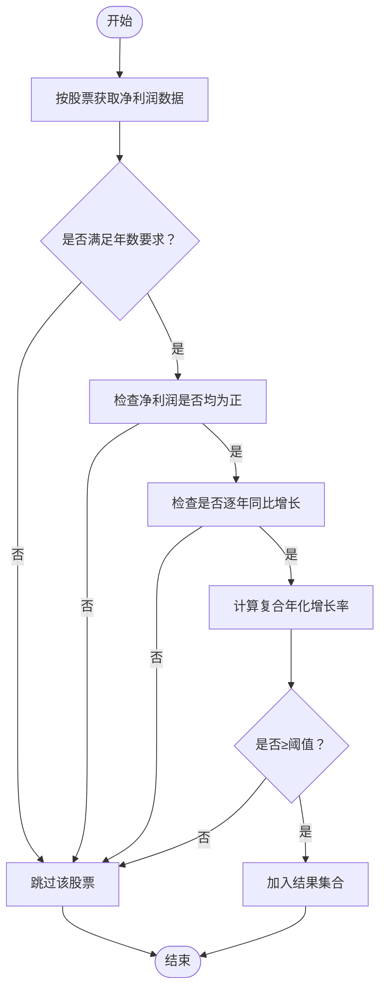
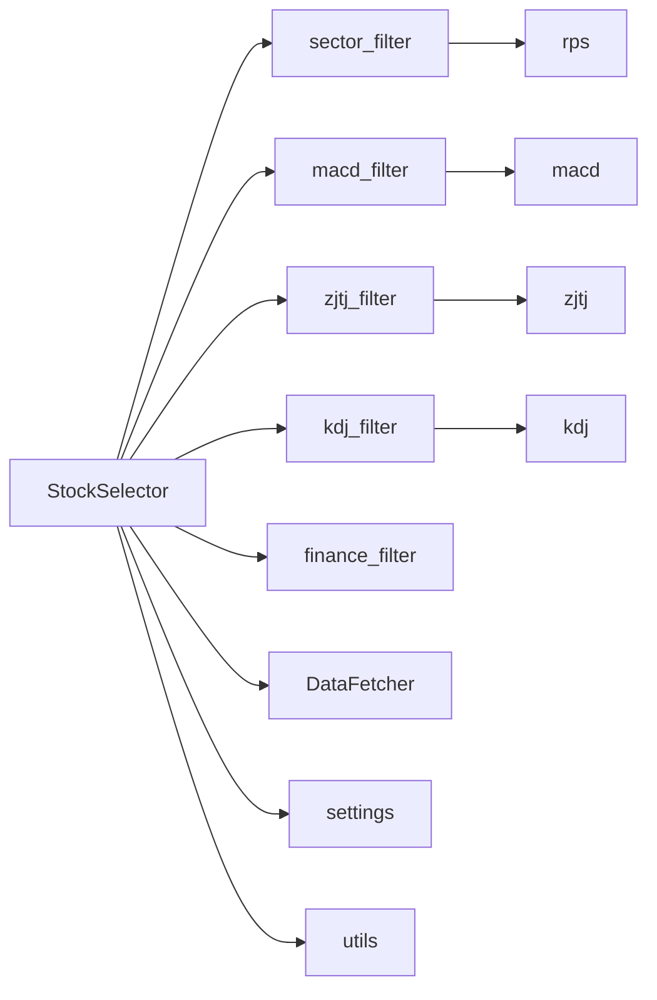

# 过滤器模块组

<cite>
**本文引用的文件**
- [src/filters/__init__.py](file://src/filters/__init__.py)
- [src/filters/sector_filter.py](file://src/filters/sector_filter.py)
- [src/filters/macd_filter.py](file://src/filters/macd_filter.py)
- [src/filters/zjtj_filter.py](file://src/filters/zjtj_filter.py)
- [src/filters/kdj_filter.py](file://src/filters/kdj_filter.py)
- [src/filters/finance_filter.py](file://src/filters/finance_filter.py)
- [src/indicators/rps.py](file://src/indicators/rps.py)
- [src/indicators/macd.py](file://src/indicators/macd.py)
- [src/indicators/kdj.py](file://src/indicators/kdj.py)
- [src/indicators/zjtj.py](file://src/indicators/zjtj.py)
- [src/data_fetcher.py](file://src/data_fetcher.py)
- [src/stock_selector.py](file://src/stock_selector.py)
- [src/utils.py](file://src/utils.py)
- [config/settings.py](file://config/settings.py)
- [main.py](file://main.py)
</cite>

## 目录
1. [简介](#简介)
2. [项目结构](#项目结构)
3. [核心组件](#核心组件)
4. [架构总览](#架构总览)
5. [详细组件分析](#详细组件分析)
6. [依赖分析](#依赖分析)
7. [性能考虑](#性能考虑)
8. [故障排查指南](#故障排查指南)
9. [结论](#结论)
10. [附录](#附录)

## 简介
本文件面向A股智能选股系统的“过滤器模块组”，系统性阐述五大核心过滤器的设计理念、实现原理、参数与阈值设定、模块间协作关系与数据传递机制，并提供使用示例、最佳实践、性能特征与优化策略，以及扩展新过滤器的开发指南。五大过滤器分别为：板块RPS筛选、MACD技术筛选、庄家控盘筛选、KDJ技术筛选与财务基本面筛选。

## 项目结构
过滤器模块组位于 src/filters 目录，配套指标计算位于 src/indicators，数据获取封装于 src/data_fetcher，主引擎在 src/stock_selector，参数配置在 config/settings，入口脚本在 main.py。

**图表来源**
- [src/filters/sector_filter.py:1-73](file://src/filters/sector_filter.py#L1-L73)
- [src/filters/macd_filter.py:1-46](file://src/filters/macd_filter.py#L1-L46)
- [src/filters/zjtj_filter.py:1-46](file://src/filters/zjtj_filter.py#L1-L46)
- [src/filters/kdj_filter.py:1-51](file://src/filters/kdj_filter.py#L1-L51)
- [src/filters/finance_filter.py:1-91](file://src/filters/finance_filter.py#L1-L91)
- [src/indicators/rps.py:1-61](file://src/indicators/rps.py#L1-L61)
- [src/indicators/macd.py:1-67](file://src/indicators/macd.py#L1-L67)
- [src/indicators/kdj.py:1-110](file://src/indicators/kdj.py#L1-L110)
- [src/indicators/zjtj.py:1-57](file://src/indicators/zjtj.py#L1-L57)
- [src/data_fetcher.py:1-773](file://src/data_fetcher.py#L1-L773)
- [src/stock_selector.py:1-310](file://src/stock_selector.py#L1-L310)
- [src/utils.py:1-134](file://src/utils.py#L1-L134)
- [config/settings.py:1-31](file://config/settings.py#L1-L31)
- [main.py:1-161](file://main.py#L1-L161)

**章节来源**
- [src/filters/__init__.py:1-6](file://src/filters/__init__.py#L1-L6)
- [src/stock_selector.py:45-185](file://src/stock_selector.py#L45-L185)
- [config/settings.py:3-31](file://config/settings.py#L3-L31)

## 核心组件
- 板块RPS筛选：基于板块日线行情计算相对强度排名，选取前N强板块，再汇总其成分股作为初筛池。
- MACD筛选：对初筛池股票逐只计算MACD指标，识别买入信号（多头排列突破或零轴上穿）。
- 庄家控盘筛选：计算庄家控盘指标，识别“控盘度上升且为正值”的信号。
- KDJ筛选：计算KDJ指标，识别低位金叉或零轴上穿的买入信号。
- 财务筛选：对候选股票提取年度净利润，校验连续正利润、同比增长、复合年化增长率阈值。

上述组件均通过统一的日志接口与配置参数驱动，主引擎以漏斗式串联，逐步收敛候选池。

**章节来源**
- [src/filters/sector_filter.py:11-73](file://src/filters/sector_filter.py#L11-L73)
- [src/filters/macd_filter.py:9-46](file://src/filters/macd_filter.py#L9-L46)
- [src/filters/zjtj_filter.py:9-46](file://src/filters/zjtj_filter.py#L9-L46)
- [src/filters/kdj_filter.py:9-51](file://src/filters/kdj_filter.py#L9-L51)
- [src/filters/finance_filter.py:10-91](file://src/filters/finance_filter.py#L10-L91)

## 架构总览
主引擎 StockSelector 按时间窗口拉取全市场股票列表，依次调用五大过滤器，每步输出“输入→输出”规模，最终汇总指标数值形成结果表。

**图表来源**
- [src/stock_selector.py:45-185](file://src/stock_selector.py#L45-L185)
- [src/filters/sector_filter.py:11-73](file://src/filters/sector_filter.py#L11-L73)
- [src/filters/macd_filter.py:9-46](file://src/filters/macd_filter.py#L9-L46)
- [src/filters/zjtj_filter.py:9-46](file://src/filters/zjtj_filter.py#L9-L46)
- [src/filters/kdj_filter.py:9-51](file://src/filters/kdj_filter.py#L9-L51)
- [src/filters/finance_filter.py:10-91](file://src/filters/finance_filter.py#L10-L91)
- [src/data_fetcher.py:308-424](file://src/data_fetcher.py#L308-L424)

**章节来源**
- [src/stock_selector.py:45-185](file://src/stock_selector.py#L45-L185)

## 详细组件分析

### 板块RPS筛选
- 设计理念：以板块为单位衡量强势领域，优先选择近期相对强度靠前的板块，再回溯其成分股，形成高概率的多头环境下的初筛池。
- 实现要点：
  - 获取板块列表与日线行情，计算每个板块近period日累计涨跌幅并排名。
  - 取前N个板块，汇总其成分股代码集合。
- 关键参数与阈值：
  - RPS周期：config/settings.py 中的 RPS_PERIOD（天）
  - 前N强板块：RPS_TOP_N
- 数据流与错误处理：
  - 对板块行情与成分股获取失败进行日志警告并跳过，保证流程稳健。
- 使用示例与最佳实践：
  - 在主引擎中作为第一步调用，随后仅对返回的股票集合批量拉取日线。
  - 建议结合交易日历与历史长度需求确定日期窗口。

**图表来源**
- [src/filters/sector_filter.py:11-73](file://src/filters/sector_filter.py#L11-L73)
- [src/indicators/rps.py:9-51](file://src/indicators/rps.py#L9-L51)
- [config/settings.py:3-6](file://config/settings.py#L3-L6)

**章节来源**
- [src/filters/sector_filter.py:11-73](file://src/filters/sector_filter.py#L11-L73)
- [src/indicators/rps.py:9-61](file://src/indicators/rps.py#L9-L61)
- [config/settings.py:3-6](file://config/settings.py#L3-L6)

### MACD技术筛选
- 设计理念：利用短期与长期均线差值及信号线的交叉关系识别短期买入信号，强调趋势与动能共振。
- 实现要点：
  - 对每只股票日线计算MACD（短周期、长周期、信号周期来自配置）。
  - 判断买入条件：多头排列且DIF向上突破DEA，或MACD柱由绿转红。
- 关键参数与阈值：
  - 短周期、长周期、信号周期：MACD_SHORT、MACD_LONG、MACD_MID
- 数据流与错误处理：
  - 跳过数据不足或计算异常的股票，持续记录进度与命中数。
- 使用示例与最佳实践：
  - 适用于初筛池的进一步收敛，建议与价格形态、成交量等其他信号组合验证。

**图表来源**
- [src/filters/macd_filter.py:9-46](file://src/filters/macd_filter.py#L9-L46)
- [src/indicators/macd.py:13-67](file://src/indicators/macd.py#L13-L67)
- [config/settings.py:7-11](file://config/settings.py#L7-L11)

**章节来源**
- [src/filters/macd_filter.py:9-46](file://src/filters/macd_filter.py#L9-L46)
- [src/indicators/macd.py:13-67](file://src/indicators/macd.py#L13-L67)
- [config/settings.py:7-11](file://config/settings.py#L7-L11)

### 庄家控盘筛选
- 设计理念：通过两层指数平滑构造“控盘度”指标，关注控盘度较前一日上升且为正值的信号，反映主力资金介入迹象。
- 实现要点：
  - 计算VAR1（双重EMA），控盘度为VAR1的环比变化（放大一定倍数）。
  - 判断条件：今日控盘度大于昨日且大于零。
- 关键参数与阈值：
  - 指标计算采用标准双EMA平滑，无需额外阈值。
- 数据流与错误处理：
  - 对缺失或异常序列进行跳过与日志记录。
- 使用示例与最佳实践：
  - 适合与MACD/KDJ等信号叠加，避免单一信号的噪声干扰。

**图表来源**
- [src/filters/zjtj_filter.py:9-46](file://src/filters/zjtj_filter.py#L9-L46)
- [src/indicators/zjtj.py:13-57](file://src/indicators/zjtj.py#L13-L57)

**章节来源**
- [src/filters/zjtj_filter.py:9-46](file://src/filters/zjtj_filter.py#L9-L46)
- [src/indicators/zjtj.py:13-57](file://src/indicators/zjtj.py#L13-L57)

### KDJ技术筛选
- 设计理念：基于随机指标的K、D交叉与J值穿越零轴的短期反转信号，捕捉超卖反弹。
- 实现要点：
  - 严格按通达信公式实现RSV、K、D、J，采用SMA递推算法。
  - 判断买入条件：K在低位向上金叉D，或J由负转正。
- 关键参数与阈值：
  - 周期N与平滑参数M1、M2：KDJ_N、KDJ_M1、KDJ_M2
- 数据流与错误处理：
  - 要求具备高、低、收列，长度不足则跳过。
- 使用示例与最佳实践：
  - 适合在MACD/ZJTJ之后进行二次确认，避免假突破。

**图表来源**
- [src/filters/kdj_filter.py:9-51](file://src/filters/kdj_filter.py#L9-L51)
- [src/indicators/kdj.py:45-110](file://src/indicators/kdj.py#L45-L110)
- [config/settings.py:12-16](file://config/settings.py#L12-L16)

**章节来源**
- [src/filters/kdj_filter.py:9-51](file://src/filters/kdj_filter.py#L9-L51)
- [src/indicators/kdj.py:45-110](file://src/indicators/kdj.py#L45-L110)
- [config/settings.py:12-16](file://config/settings.py#L12-L16)

### 财务基本面筛选
- 设计理念：从盈利能力与成长性角度筛选，要求连续若干年净利润为正、同比增长且复合年化增长率达标。
- 实现要点：
  - 按股票分组获取年度净利润，取最近所需年数数据。
  - 三重校验：净利润均为正、逐年同比增长、复合年化增长率≥阈值。
- 关键参数与阈值：
  - 考察年数：PROFIT_GROWTH_YEARS
  - 最低复合增长率：PROFIT_GROWTH_MIN
- 数据流与错误处理：
  - 对缺失或不足年份的数据跳过，持续记录进度。
- 使用示例与最佳实践：
  - 建议与估值指标（PE、PB）结合，避免高增长但高估值的公司。

**图表来源**
- [src/filters/finance_filter.py:10-91](file://src/filters/finance_filter.py#L10-L91)
- [config/settings.py:17-20](file://config/settings.py#L17-L20)

**章节来源**
- [src/filters/finance_filter.py:10-91](file://src/filters/finance_filter.py#L10-L91)
- [config/settings.py:17-20](file://config/settings.py#L17-L20)

## 依赖分析
- 组件内聚与耦合：
  - 过滤器模块彼此独立，仅在主引擎中按顺序串联，耦合度低，便于维护与替换。
  - 指标模块与过滤器模块解耦，通过函数调用传递数据框，利于单元测试与复用。
- 外部依赖与集成点：
  - 数据获取器 DataFetcher 提供统一的A股日线、板块、财务数据接口，支持缓存与重试。
  - 配置模块 config/settings 提供全局参数，主引擎与过滤器均依赖。
- 潜在循环依赖：
  - 未发现循环导入；过滤器→指标→配置→引擎→数据获取器的链路方向清晰。

**图表来源**
- [src/stock_selector.py:5-16](file://src/stock_selector.py#L5-L16)
- [src/filters/sector_filter.py:2-5](file://src/filters/sector_filter.py#L2-L5)
- [src/filters/macd_filter.py:2-4](file://src/filters/macd_filter.py#L2-L4)
- [src/filters/zjtj_filter.py:2-4](file://src/filters/zjtj_filter.py#L2-L4)
- [src/filters/kdj_filter.py:2-4](file://src/filters/kdj_filter.py#L2-L4)
- [src/filters/finance_filter.py:2-5](file://src/filters/finance_filter.py#L2-L5)
- [src/indicators/rps.py:5-6](file://src/indicators/rps.py#L5-L6)
- [src/indicators/macd.py:9-10](file://src/indicators/macd.py#L9-L10)
- [src/indicators/kdj.py:12-13](file://src/indicators/kdj.py#L12-L13)
- [src/indicators/zjtj.py:9-10](file://src/indicators/zjtj.py#L9-L10)
- [src/data_fetcher.py:12-13](file://src/data_fetcher.py#L12-L13)
- [src/utils.py](file://src/utils.py#L6)
- [config/settings.py:1-31](file://config/settings.py#L1-L31)

**章节来源**
- [src/stock_selector.py:5-16](file://src/stock_selector.py#L5-L16)
- [src/filters/*.py:2-5](file://src/filters/sector_filter.py#L2-L5)

## 性能考虑
- 数据获取与缓存：
  - DataFetcher 支持 SQLite 缓存与增量更新，减少重复拉取；批量日线获取按候选集进行，避免全市场扫描。
- 指标计算：
  - 使用向量化操作（pandas/numpy）与指数移动平均，计算效率高；注意日线长度阈值避免无效计算。
- 日志与进度：
  - 主引擎与过滤器均输出进度日志，便于监控与定位瓶颈。
- 并发与限速：
  - 请求层具备重试与延迟控制，避免触发接口限频；建议在外部调度层控制并发度。
- 内存与I/O：
  - 仅在候选集上拉取日线，降低内存占用；CSV/Excel导出在结果生成后一次性完成。

[本节为通用性能讨论，不直接分析具体文件]

## 故障排查指南
- 网络与API异常：
  - DataFetcher 内置重试与延迟机制，若仍失败，检查网络与代理设置。
- 数据为空或不完整：
  - 板块/成分股/日线/财务数据为空时，过滤器会跳过并记录警告；确认日期范围与交易所状态。
- 指标计算异常：
  - 若出现NaN或长度不足，过滤器会跳过该股票；检查数据清洗与字段完整性。
- 输出为空：
  - 漏斗式筛选逐步收敛，若最终为空属正常；可放宽参数或缩短日期窗口。

**章节来源**
- [src/data_fetcher.py:182-196](file://src/data_fetcher.py#L182-L196)
- [src/filters/sector_filter.py:26-28](file://src/filters/sector_filter.py#L26-L28)
- [src/filters/macd_filter.py:28-29](file://src/filters/macd_filter.py#L28-L29)
- [src/filters/zjtj_filter.py:28-29](file://src/filters/zjtj_filter.py#L28-L29)
- [src/filters/kdj_filter.py:28-34](file://src/filters/kdj_filter.py#L28-L34)
- [src/filters/finance_filter.py:47-48](file://src/filters/finance_filter.py#L47-L48)

## 结论
过滤器模块组通过“板块热度+技术面+资金面+技术面+基本面”的多维度筛选，形成稳健的漏斗式选股流程。模块设计清晰、参数集中、日志完备，便于扩展与维护。建议在生产环境中结合缓存策略、限速与并发控制，确保稳定性与性能。

[本节为总结性内容，不直接分析具体文件]

## 附录

### 使用示例与最佳实践
- 命令行运行：
  - 默认日期：python main.py
  - 指定日期：python main.py --date 20250101
  - 强制刷新缓存：python main.py --force-update
  - 自定义输出：python main.py --output result.csv
- 最佳实践：
  - 先以较宽松参数验证流程，再逐步收紧阈值。
  - 结合板块轮动与市场环境动态调整RPS周期与前N。
  - 将财务筛选与估值指标联动，避免高增长低价值标的。

**章节来源**
- [main.py:29-52](file://main.py#L29-L52)
- [main.py:112-156](file://main.py#L112-L156)

### 参数与阈值一览
- 板块RPS
  - RPS_PERIOD：计算周期（天）
  - RPS_TOP_N：前N强板块
- MACD
  - MACD_SHORT、MACD_LONG、MACD_MID：短、长、信号周期
- KDJ
  - KDJ_N、KDJ_M1、KDJ_M2：周期与平滑参数
- 财务
  - PROFIT_GROWTH_YEARS：考察年数
  - PROFIT_GROWTH_MIN：最低复合增长率

**章节来源**
- [config/settings.py:3-20](file://config/settings.py#L3-L20)

### 扩展新过滤器的开发指南
- 新建文件：在 src/filters 下新增模块，导出一个函数，接收必要的输入（如 DataFetcher 或 stock_daily_dict），返回股票代码集合。
- 指标复用：如需指标计算，可在 src/indicators 新增模块，提供计算函数与信号判断函数。
- 参数配置：在 config/settings.py 中新增参数，或在过滤器函数中使用默认值。
- 主引擎集成：在 src/stock_selector.py 的 run 方法中添加调用步骤，并记录“输入→输出”日志。
- 日志与健壮性：使用统一日志接口，对异常与边界情况做保护与记录。
- 单元测试：针对关键逻辑编写测试，确保在不同数据条件下稳定运行。

**章节来源**
- [src/filters/__init__.py:1-6](file://src/filters/__init__.py#L1-L6)
- [src/stock_selector.py:45-185](file://src/stock_selector.py#L45-L185)
- [config/settings.py:1-31](file://config/settings.py#L1-L31)