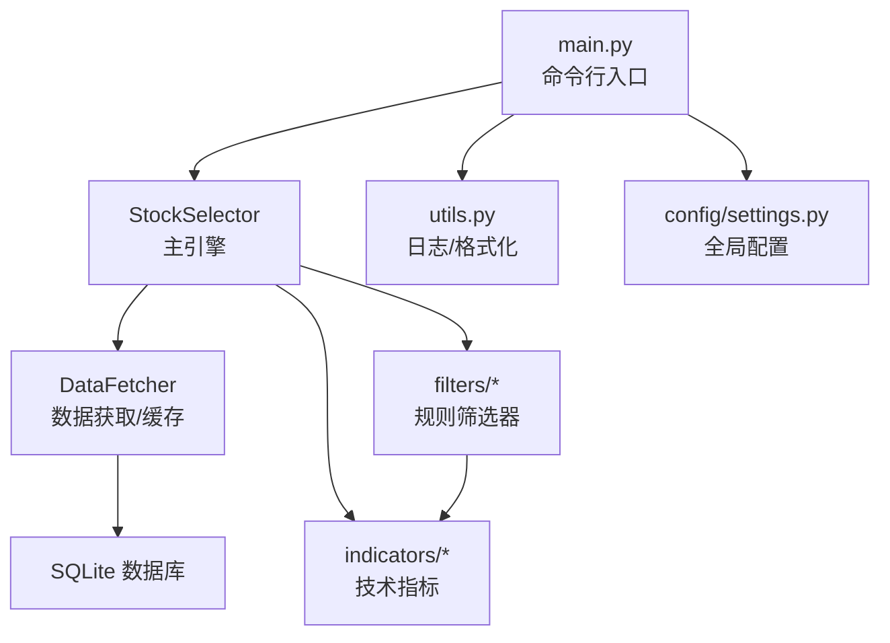
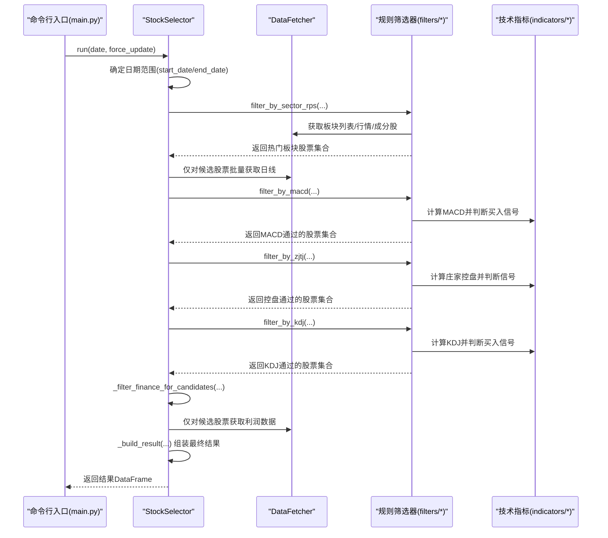
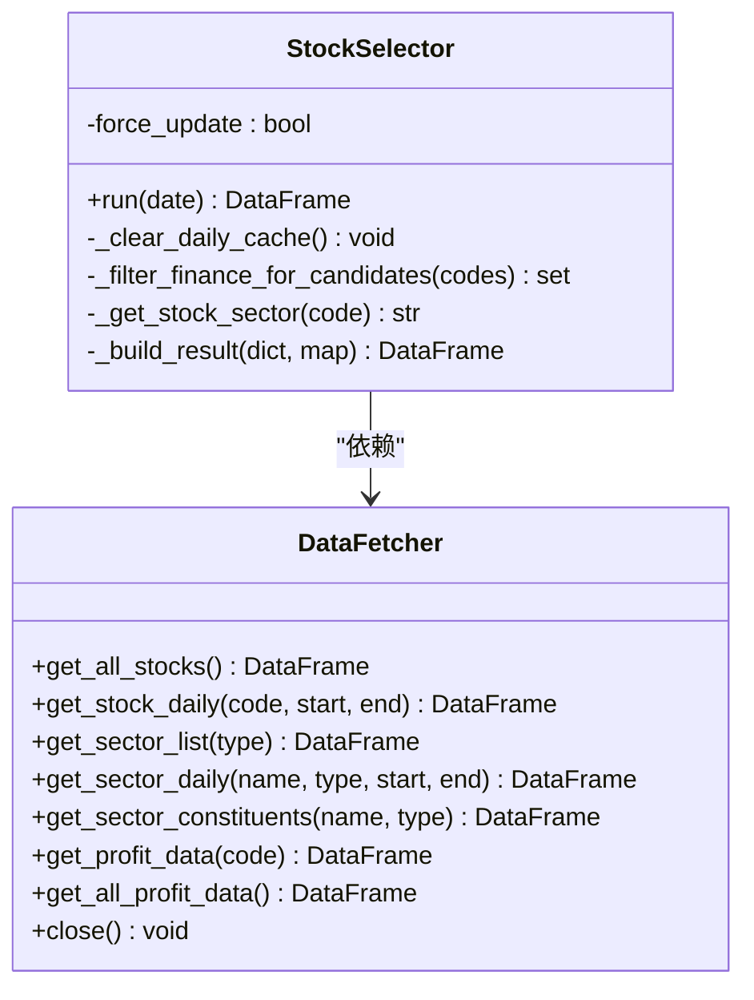
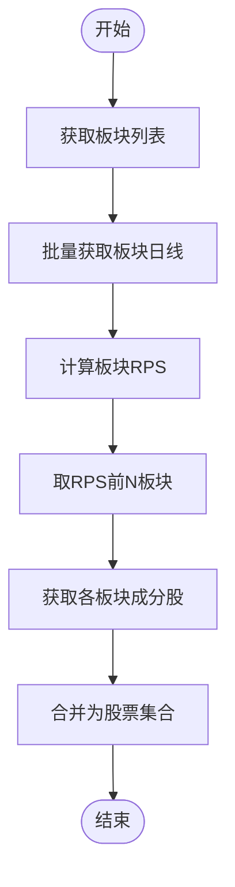
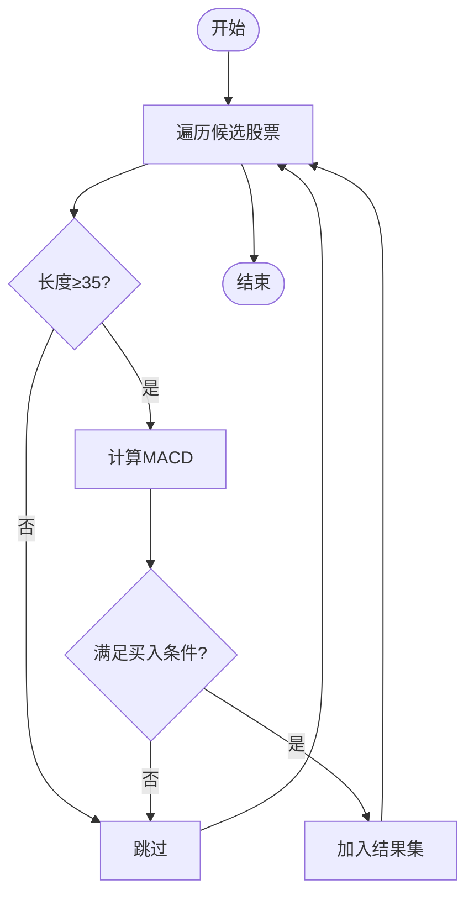
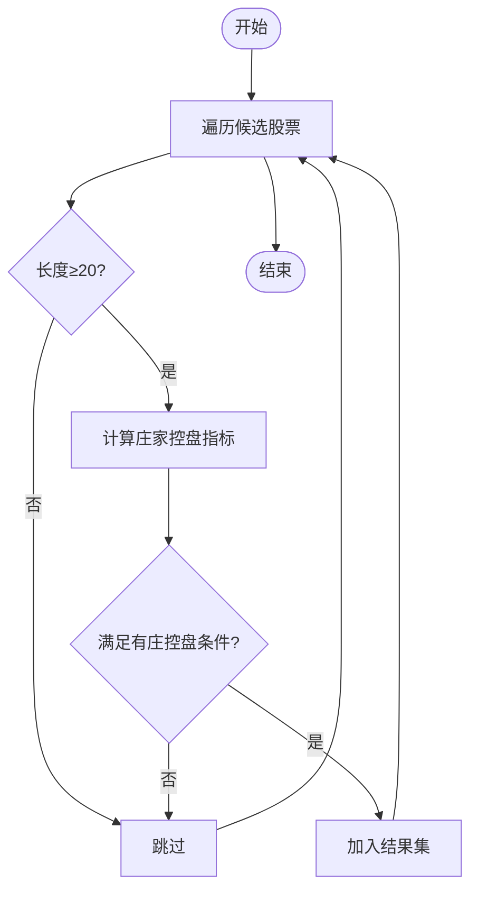
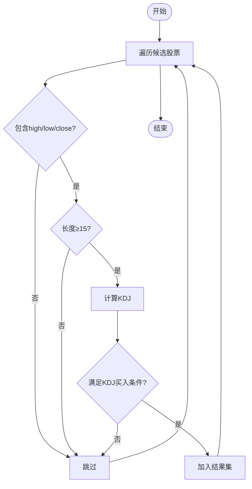
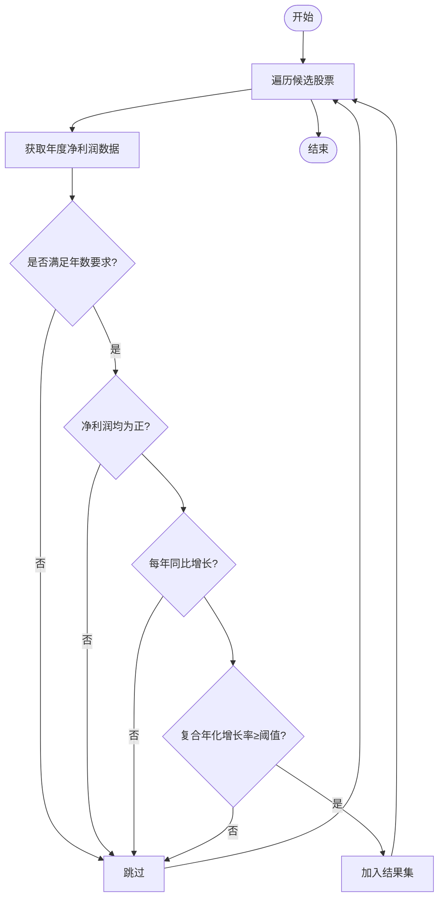
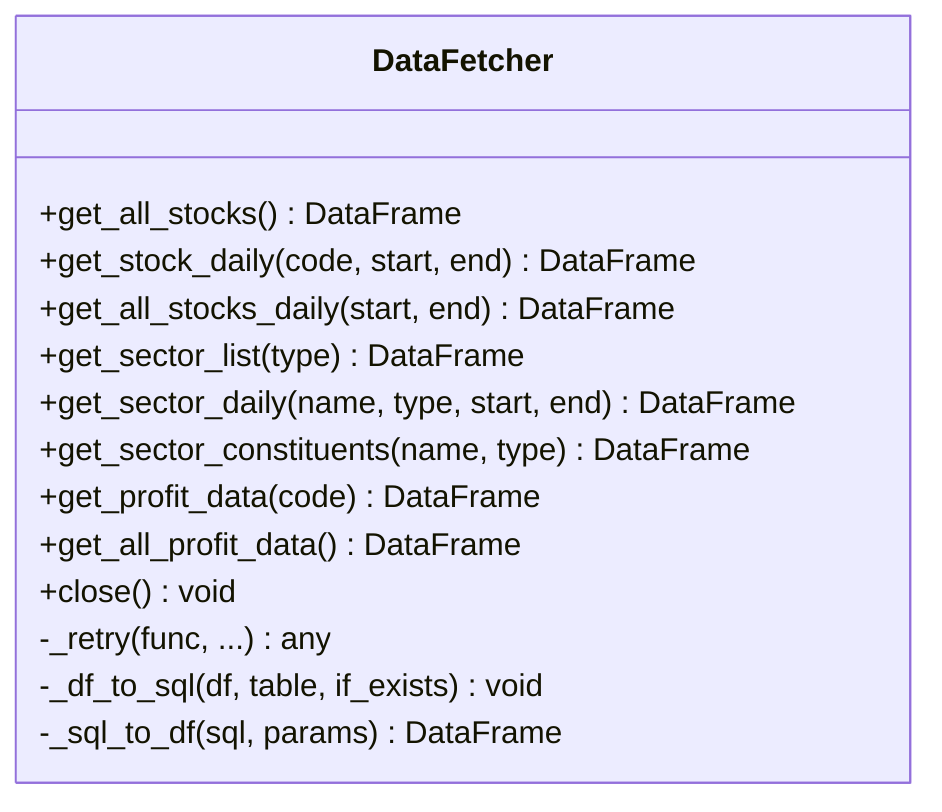
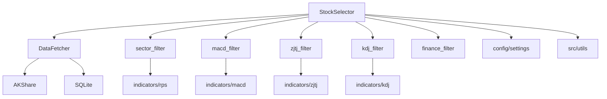

# 选股引擎详解

<cite>
**本文引用的文件**
- [src/stock_selector.py](file://src/stock_selector.py)
- [src/data_fetcher.py](file://src/data_fetcher.py)
- [src/filters/sector_filter.py](file://src/filters/sector_filter.py)
- [src/filters/macd_filter.py](file://src/filters/macd_filter.py)
- [src/filters/zjtj_filter.py](file://src/filters/zjtj_filter.py)
- [src/filters/kdj_filter.py](file://src/filters/kdj_filter.py)
- [src/filters/finance_filter.py](file://src/filters/finance_filter.py)
- [src/indicators/rps.py](file://src/indicators/rps.py)
- [src/indicators/macd.py](file://src/indicators/macd.py)
- [src/indicators/kdj.py](file://src/indicators/kdj.py)
- [src/indicators/zjtj.py](file://src/indicators/zjtj.py)
- [config/settings.py](file://config/settings.py)
- [src/utils.py](file://src/utils.py)
- [main.py](file://main.py)
</cite>

## 目录
1. [简介](#简介)
2. [项目结构](#项目结构)
3. [核心组件](#核心组件)
4. [架构总览](#架构总览)
5. [详细组件分析](#详细组件分析)
6. [依赖分析](#依赖分析)
7. [性能考虑](#性能考虑)
8. [故障排查指南](#故障排查指南)
9. [结论](#结论)
10. [附录](#附录)

## 简介
本文件面向A股智能选股系统的“漏斗式五步筛选”选股引擎，围绕StockSelector类展开，系统性阐述其设计理念、实现细节与数据流。文档重点覆盖以下五个筛选步骤：
- 板块RPS筛选
- MACD技术筛选
- 庄家控盘筛选
- KDJ技术筛选
- 财务基本面筛选

同时，文档分析数据流转与中间状态管理、性能优化策略（如增量数据获取与候选股票筛选）、错误处理与日志记录机制，并提供可操作的使用模式与参考路径。

## 项目结构
项目采用“功能域+层次化”的组织方式：
- config：集中存放全局配置参数
- src：核心业务代码
  - data_fetcher.py：数据获取与SQLite缓存
  - stock_selector.py：主引擎（漏斗式筛选）
  - filters/*：各规则筛选器
  - indicators/*：技术指标计算
  - utils.py：通用工具（日志、格式化等）
- main.py：命令行入口与结果输出
- data/db、data/logs、data/output：数据、日志与输出目录

图表来源
- [main.py:112-156](file://main.py#L112-L156)
- [src/stock_selector.py:45-185](file://src/stock_selector.py#L45-L185)
- [src/data_fetcher.py:140-151](file://src/data_fetcher.py#L140-L151)

章节来源
- [main.py:112-156](file://main.py#L112-L156)
- [src/stock_selector.py:45-185](file://src/stock_selector.py#L45-L185)
- [src/data_fetcher.py:140-151](file://src/data_fetcher.py#L140-L151)

## 核心组件
- StockSelector：漏斗式五步筛选的编排者，负责日期确定、候选集生成、数据准备、规则串联、结果构建与资源释放。
- DataFetcher：统一的数据源，封装AKShare接口调用、SQLite缓存、重试与增量更新策略。
- 各规则筛选器：分别实现板块RPS、MACD、庄家控盘、KDJ、财务基本面的筛选逻辑。
- 技术指标模块：提供RPS、MACD、KDJ、庄家控盘的计算与信号判定。

章节来源
- [src/stock_selector.py:21-310](file://src/stock_selector.py#L21-L310)
- [src/data_fetcher.py:140-608](file://src/data_fetcher.py#L140-L608)
- [src/filters/sector_filter.py:11-73](file://src/filters/sector_filter.py#L11-L73)
- [src/filters/macd_filter.py:9-46](file://src/filters/macd_filter.py#L9-L46)
- [src/filters/zjtj_filter.py:9-46](file://src/filters/zjtj_filter.py#L9-L46)
- [src/filters/kdj_filter.py:9-51](file://src/filters/kdj_filter.py#L9-L51)
- [src/filters/finance_filter.py:10-91](file://src/filters/finance_filter.py#L10-L91)
- [src/indicators/rps.py:9-61](file://src/indicators/rps.py#L9-L61)
- [src/indicators/macd.py:13-67](file://src/indicators/macd.py#L13-L67)
- [src/indicators/kdj.py:45-110](file://src/indicators/kdj.py#L45-L110)
- [src/indicators/zjtj.py:13-57](file://src/indicators/zjtj.py#L13-L57)

## 架构总览
漏斗式五步筛选的总体流程如下：

图表来源
- [src/stock_selector.py:45-185](file://src/stock_selector.py#L45-L185)
- [src/filters/sector_filter.py:11-73](file://src/filters/sector_filter.py#L11-L73)
- [src/filters/macd_filter.py:9-46](file://src/filters/macd_filter.py#L9-L46)
- [src/filters/zjtj_filter.py:9-46](file://src/filters/zjtj_filter.py#L9-L46)
- [src/filters/kdj_filter.py:9-51](file://src/filters/kdj_filter.py#L9-L51)
- [src/filters/finance_filter.py:10-91](file://src/filters/finance_filter.py#L10-L91)
- [src/indicators/macd.py:13-67](file://src/indicators/macd.py#L13-L67)
- [src/indicators/kdj.py:45-110](file://src/indicators/kdj.py#L45-L110)
- [src/indicators/zjtj.py:13-57](file://src/indicators/zjtj.py#L13-L57)

## 详细组件分析

### StockSelector 类设计与实现
- 设计理念
  - 漏斗式筛选：逐步缩小候选集，降低后续计算成本。
  - 增量数据获取：仅对通过上一步的候选股票拉取日线数据，避免全市场扫描。
  - 中间状态管理：通过字典维护候选股票与其日线数据，每步结束后按交集过滤。
  - 结果构建：在最后阶段统一计算指标并组装最终结果DataFrame。
- 关键实现要点
  - 日期范围：基于结束日回溯约200天，确保各指标所需历史长度。
  - 强制更新：可清空日线缓存，强制重新拉取。
  - 日志：每步筛选前后均输出输入/输出数量，便于追踪。
  - 资源管理：显式关闭数据库连接，避免资源泄漏。
- 性能优化
  - 候选集驱动：仅对通过规则1的股票批量拉取日线，显著减少IO与计算。
  - 财务筛选优化：在候选集上执行财务筛选，避免对全市场股票逐一查询利润数据。
  - 指标计算：在最终阶段统一计算MACD/KDJ/ZJTJ，减少重复计算。

图表来源
- [src/stock_selector.py:21-310](file://src/stock_selector.py#L21-L310)
- [src/data_fetcher.py:140-608](file://src/data_fetcher.py#L140-L608)

章节来源
- [src/stock_selector.py:21-310](file://src/stock_selector.py#L21-L310)

### 板块RPS筛选（规则1）
- 目标：筛选出处于RPS排名前N板块中的股票，作为初始候选集。
- 实现要点
  - 获取板块列表与行情，计算板块RPS并取前N板块。
  - 汇总这些板块的成分股，得到股票代码集合。
  - 使用配置参数控制周期与Top N。
- 数据流
  - 输入：板块列表、板块日线数据
  - 输出：热门板块股票集合

图表来源
- [src/filters/sector_filter.py:11-73](file://src/filters/sector_filter.py#L11-L73)
- [src/indicators/rps.py:9-61](file://src/indicators/rps.py#L9-L61)

章节来源
- [src/filters/sector_filter.py:11-73](file://src/filters/sector_filter.py#L11-L73)
- [src/indicators/rps.py:9-61](file://src/indicators/rps.py#L9-L61)

### MACD技术筛选（规则2）
- 目标：筛选出现MACD买入信号的股票。
- 实现要点
  - 对候选股票日线计算MACD，判断是否满足买入条件之一。
  - 需要至少35个交易日数据。
- 数据流
  - 输入：候选股票日线字典
  - 输出：通过MACD买入信号的股票集合

图表来源
- [src/filters/macd_filter.py:9-46](file://src/filters/macd_filter.py#L9-L46)
- [src/indicators/macd.py:13-67](file://src/indicators/macd.py#L13-L67)

章节来源
- [src/filters/macd_filter.py:9-46](file://src/filters/macd_filter.py#L9-L46)
- [src/indicators/macd.py:13-67](file://src/indicators/macd.py#L13-L67)

### 庄家控盘筛选（规则3）
- 目标：筛选出现“有庄控盘”信号的股票。
- 实现要点
  - 计算庄家控盘指标，判断当日控盘度较前一日上升且大于0。
  - 需要至少20个交易日数据。
- 数据流
  - 输入：候选股票日线字典
  - 输出：通过庄家控盘信号的股票集合

图表来源
- [src/filters/zjtj_filter.py:9-46](file://src/filters/zjtj_filter.py#L9-L46)
- [src/indicators/zjtj.py:13-57](file://src/indicators/zjtj.py#L13-L57)

章节来源
- [src/filters/zjtj_filter.py:9-46](file://src/filters/zjtj_filter.py#L9-L46)
- [src/indicators/zjtj.py:13-57](file://src/indicators/zjtj.py#L13-L57)

### KDJ技术筛选（规则4）
- 目标：筛选出现KDJ买入信号的股票。
- 实现要点
  - 计算KDJ，判断满足K向上交叉D或J由负转正。
  - 需要至少15个交易日数据且包含high/low/close。
- 数据流
  - 输入：候选股票日线字典
  - 输出：通过KDJ买入信号的股票集合

图表来源
- [src/filters/kdj_filter.py:9-51](file://src/filters/kdj_filter.py#L9-L51)
- [src/indicators/kdj.py:45-110](file://src/indicators/kdj.py#L45-L110)

章节来源
- [src/filters/kdj_filter.py:9-51](file://src/filters/kdj_filter.py#L9-L51)
- [src/indicators/kdj.py:45-110](file://src/indicators/kdj.py#L45-L110)

### 财务基本面筛选（规则5）
- 目标：筛选净利润连续增长且复合年化增长率达标的企业。
- 实现要点
  - 仅对候选股票执行筛选，避免全市场扫描。
  - 近PROFIT_GROWTH_YEARS+1年净利润均为正，且每年同比增长，复合年化增长率不低于阈值。
- 数据流
  - 输入：候选股票集合
  - 输出：通过财务筛选的股票集合

图表来源
- [src/stock_selector.py:191-256](file://src/stock_selector.py#L191-L256)
- [src/filters/finance_filter.py:10-91](file://src/filters/finance_filter.py#L10-L91)

章节来源
- [src/stock_selector.py:191-256](file://src/stock_selector.py#L191-L256)
- [src/filters/finance_filter.py:10-91](file://src/filters/finance_filter.py#L10-L91)

### 数据获取与缓存（DataFetcher）
- 功能
  - 股票列表、板块列表、板块日线、个股日线、利润数据的获取与缓存。
  - SQLite建表、写入、读取与事务管理。
  - 增量更新：按股票维度计算最大缓存日期，仅拉取缺失区间。
  - 重试与延迟：统一的请求包装，避免被限频。
- 性能优化
  - 增量更新：大幅减少重复抓取。
  - 缓存：多表缓存（stock_list、stock_daily、sector_*、profit_data）。
  - 批量读取：在批量场景下合并查询结果。

图表来源
- [src/data_fetcher.py:140-608](file://src/data_fetcher.py#L140-L608)

章节来源
- [src/data_fetcher.py:140-608](file://src/data_fetcher.py#L140-L608)

### 技术指标计算与信号判定
- RPS：按板块近period天累计涨幅排名，取前N板块。
- MACD：标准通达信公式，买入条件包括DIF/DEA金叉与MACD柱由绿转红。
- KDJ：通达信公式，买入条件包括K上穿D且K<30或J由负转正。
- 庄家控盘：VAR1两层EMA，控盘度为VAR1环比变化，有庄控盘要求控盘度上升且>0。

章节来源
- [src/indicators/rps.py:9-61](file://src/indicators/rps.py#L9-L61)
- [src/indicators/macd.py:13-67](file://src/indicators/macd.py#L13-L67)
- [src/indicators/kdj.py:45-110](file://src/indicators/kdj.py#L45-L110)
- [src/indicators/zjtj.py:13-57](file://src/indicators/zjtj.py#L13-L57)

## 依赖分析
- 组件耦合
  - StockSelector依赖DataFetcher与各规则筛选器及技术指标模块。
  - 规则筛选器依赖DataFetcher获取数据，依赖indicators模块计算指标。
  - DataFetcher依赖AKShare与SQLite，内部通过上下文管理器保证事务一致性。
- 外部依赖
  - AKShare：获取实时行情与财务数据。
  - SQLite：本地缓存，提升重复运行效率。
- 配置依赖
  - config/settings.py集中定义RPS、MACD、KDJ、财务等参数，以及数据库与日志路径。

图表来源
- [src/stock_selector.py:4-16](file://src/stock_selector.py#L4-L16)
- [src/data_fetcher.py:10-11](file://src/data_fetcher.py#L10-L11)
- [config/settings.py:1-31](file://config/settings.py#L1-L31)

章节来源
- [src/stock_selector.py:4-16](file://src/stock_selector.py#L4-L16)
- [src/data_fetcher.py:10-11](file://src/data_fetcher.py#L10-L11)
- [config/settings.py:1-31](file://config/settings.py#L1-L31)

## 性能考虑
- 增量数据获取
  - 个股日线与利润数据按股票维度计算最大缓存日期，仅拉取缺失区间，显著减少网络请求与存储压力。
- 候选集驱动
  - 仅对通过规则1的股票批量拉取日线，后续规则均在候选集上执行，避免全市场扫描。
- 指标计算优化
  - 在最终阶段统一计算MACD/KDJ/ZJTJ，减少重复计算与中间态存储。
- 并发与批处理
  - 批量获取日线与利润数据时采用逐股票处理与进度日志，便于监控与恢复。
- I/O与网络
  - 统一的重试与延迟策略，降低被限频风险；SQLite写入采用事务提交，保证一致性。

章节来源
- [src/data_fetcher.py:263-345](file://src/data_fetcher.py#L263-L345)
- [src/data_fetcher.py:559-607](file://src/data_fetcher.py#L559-L607)
- [src/stock_selector.py:100-125](file://src/stock_selector.py#L100-L125)
- [src/stock_selector.py:191-256](file://src/stock_selector.py#L191-L256)

## 故障排查指南
- 常见问题与处理
  - 网络异常：DataFetcher内部重试与延迟，若仍失败，检查代理与超时设置。
  - 数据为空：确认日期范围、板块/股票是否存在、AKShare接口可用性。
  - 缓存异常：强制更新模式可清空日线缓存，重新拉取。
  - 权限与路径：确保数据库与日志目录可写。
- 错误处理与日志
  - 统一日志：模块内使用setup_logging创建Logger，输出到控制台与文件。
  - 进度日志：每步筛选与数据获取均有进度提示，便于定位耗时环节。
  - 异常捕获：规则筛选器与财务筛选器对单只股票异常进行警告并继续，避免整体中断。

章节来源
- [src/data_fetcher.py:179-194](file://src/data_fetcher.py#L179-L194)
- [src/stock_selector.py:35-44](file://src/stock_selector.py#L35-L44)
- [src/filters/macd_filter.py:37-42](file://src/filters/macd_filter.py#L37-L42)
- [src/filters/zjtj_filter.py:37-42](file://src/filters/zjtj_filter.py#L37-L42)
- [src/filters/kdj_filter.py:42-49](file://src/filters/kdj_filter.py#L42-L49)
- [src/filters/finance_filter.py:82-87](file://src/filters/finance_filter.py#L82-L87)
- [src/utils.py:9-30](file://src/utils.py#L9-L30)

## 结论
StockSelector通过“漏斗式五步筛选”将技术面与基本面有机结合，借助DataFetcher的增量缓存与候选集驱动策略，在保证准确性的同时显著提升了运行效率。各规则筛选器与技术指标模块职责清晰、边界明确，便于扩展与维护。建议在生产环境中结合强制更新模式与日志监控，确保数据新鲜度与流程稳定性。

## 附录
- 使用模式
  - 命令行入口支持指定日期、强制更新与输出路径，适合自动化调度。
  - 结果可导出CSV与Excel，便于进一步分析。
- 配置项参考
  - RPS周期与Top N、MACD参数、KDJ参数、财务增长年数与阈值、数据库与日志路径、请求重试与延迟等。

章节来源
- [main.py:29-52](file://main.py#L29-L52)
- [main.py:112-156](file://main.py#L112-L156)
- [config/settings.py:1-31](file://config/settings.py#L1-L31)