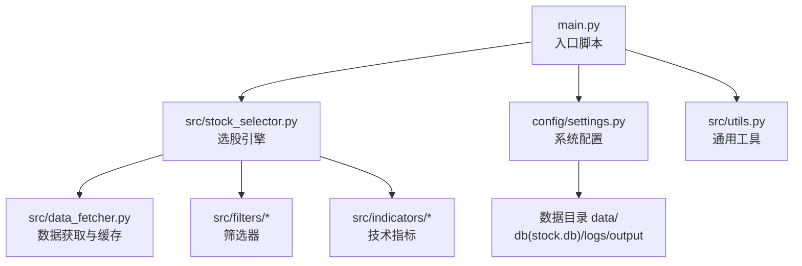
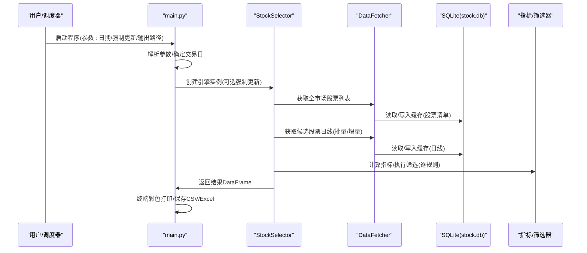
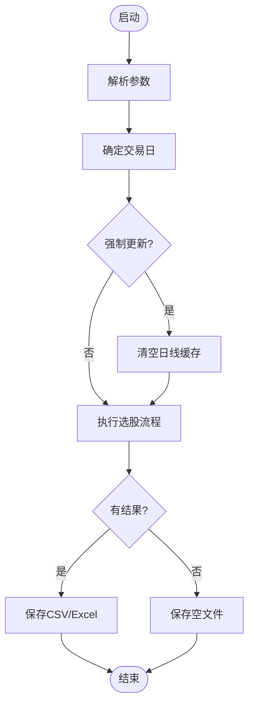
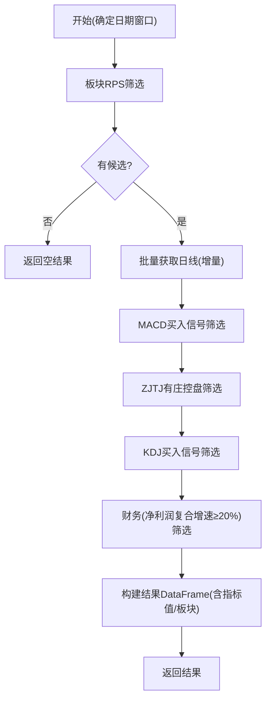
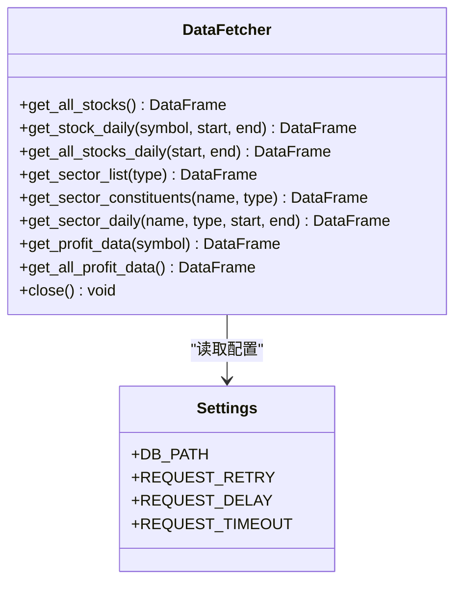
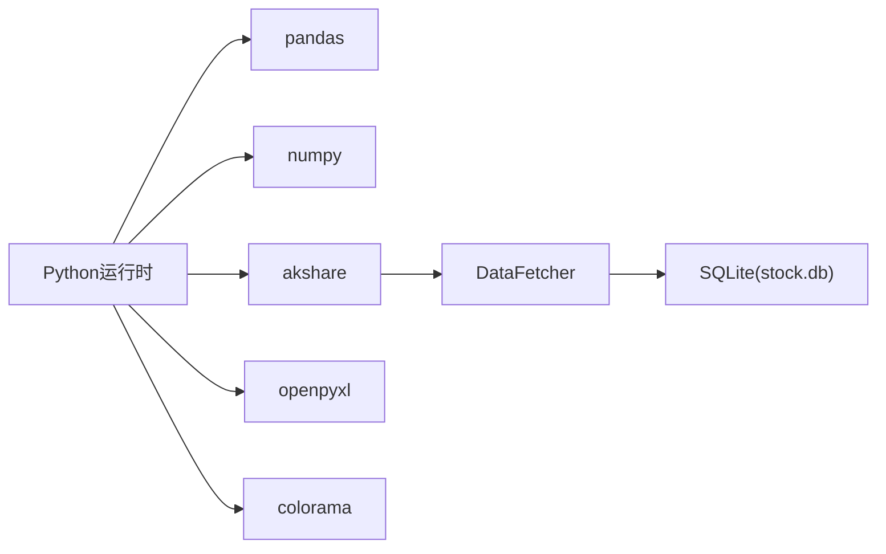

# 部署与运维

<cite>
**本文引用的文件**
- [main.py](file://main.py)
- [requirements.txt](file://requirements.txt)
- [config/settings.py](file://config/settings.py)
- [src/utils.py](file://src/utils.py)
- [src/data_fetcher.py](file://src/data_fetcher.py)
- [src/stock_selector.py](file://src/stock_selector.py)
- [src/filters/__init__.py](file://src/filters/__init__.py)
- [src/indicators/__init__.py](file://src/indicators/__init__.py)
- [src/filters/finance_filter.py](file://src/filters/finance_filter.py)
- [src/indicators/macd.py](file://src/indicators/macd.py)
- [src/indicators/kdj.py](file://src/indicators/kdj.py)
- [src/indicators/zjtj.py](file://src/indicators/zjtj.py)
- [需求.md](file://需求.md)
- [手工选股.md](file://手工选股.md)
</cite>

## 目录
1. [简介](#简介)
2. [项目结构](#项目结构)
3. [核心组件](#核心组件)
4. [架构总览](#架构总览)
5. [详细组件分析](#详细组件分析)
6. [依赖分析](#依赖分析)
7. [性能考虑](#性能考虑)
8. [故障排除指南](#故障排除指南)
9. [结论](#结论)
10. [附录](#附录)

## 简介
本文件面向A股智能选股系统的生产环境部署与运维，涵盖环境准备、依赖安装、配置设置、数据备份与恢复、性能监控与日志管理、故障排除、系统维护与定期检查、自动化部署与CI/CD集成建议，以及数据存储与清理策略。内容基于仓库现有代码与配置进行梳理与扩展，确保可操作性与可追溯性。

## 项目结构
项目采用“入口脚本 + 配置 + 数据层 + 引擎与指标/过滤器”的分层组织方式，便于独立扩展与维护。

图表来源
- [main.py:1-161](file://main.py#L1-L161)
- [config/settings.py:1-31](file://config/settings.py#L1-L31)
- [src/stock_selector.py:1-310](file://src/stock_selector.py#L1-L310)
- [src/data_fetcher.py:1-608](file://src/data_fetcher.py#L1-L608)

章节来源
- [main.py:1-161](file://main.py#L1-L161)
- [config/settings.py:1-31](file://config/settings.py#L1-L31)

## 核心组件
- 入口脚本：负责参数解析、日期确定、流程调度、结果打印与持久化。
- 选股引擎：串联多规则筛选，按漏斗式逐步缩小候选集，最终汇总输出。
- 数据获取器：封装AKShare接口调用，提供SQLite缓存、重试与增量更新能力。
- 指标与筛选器：MACD、KDJ、ZJTJ等技术指标计算与买入信号判断；财务筛选器。
- 配置中心：集中管理参数与路径，统一输出、日志、数据库位置。
- 通用工具：日志初始化、交易日计算、结果表格格式化。

章节来源
- [main.py:29-161](file://main.py#L29-L161)
- [src/stock_selector.py:21-310](file://src/stock_selector.py#L21-L310)
- [src/data_fetcher.py:140-608](file://src/data_fetcher.py#L140-L608)
- [src/filters/__init__.py:1-6](file://src/filters/__init__.py#L1-L6)
- [src/indicators/__init__.py:1-5](file://src/indicators/__init__.py#L1-L5)
- [config/settings.py:1-31](file://config/settings.py#L1-L31)
- [src/utils.py:9-134](file://src/utils.py#L9-L134)

## 架构总览
系统以“入口脚本”为控制中枢，调用“选股引擎”，引擎通过“数据获取器”访问外部数据源并写入本地SQLite缓存，随后利用“指标与筛选器”完成多轮筛选，最终将结果落盘并输出。

图表来源
- [main.py:112-161](file://main.py#L112-L161)
- [src/stock_selector.py:45-186](file://src/stock_selector.py#L45-L186)
- [src/data_fetcher.py:205-346](file://src/data_fetcher.py#L205-L346)
- [config/settings.py:21-26](file://config/settings.py#L21-L26)

## 详细组件分析

### 入口脚本与运行流程
- 支持命令行参数：指定日期、强制更新、输出路径。
- 日期处理：自动回退至最近交易日（周末回退）。
- 异常处理：网络连接异常、键盘中断、未知异常均有明确提示与退出码。
- 结果输出：终端彩色打印与CSV/Excel双格式落盘；即使无结果也生成空文件以便确认运行。

图表来源
- [main.py:112-161](file://main.py#L112-L161)
- [src/stock_selector.py:35-44](file://src/stock_selector.py#L35-L44)

章节来源
- [main.py:29-161](file://main.py#L29-L161)
- [src/utils.py:33-54](file://src/utils.py#L33-L54)

### 选股引擎与漏斗式筛选
- 日期窗口：向前扩展约200天以满足指标计算所需的历史长度。
- 规则顺序：板块RPS → MACD → ZJTJ → KDJ → 财务（净利润复合增速≥20%且连续增长）。
- 性能优化：仅对候选股票批量拉取日线；财务筛选仅针对候选集，避免全量扫描。
- 结果构建：计算最新指标值并拼接板块信息，输出标准化字段。

图表来源
- [src/stock_selector.py:45-186](file://src/stock_selector.py#L45-L186)
- [src/filters/finance_filter.py:10-91](file://src/filters/finance_filter.py#L10-L91)

章节来源
- [src/stock_selector.py:45-310](file://src/stock_selector.py#L45-L310)

### 数据获取器与缓存策略
- 数据源：AKShare，封装股票列表、日线、板块、利润等接口。
- 缓存：SQLite表stock_list、stock_daily、sector_list、sector_daily、profit_data。
- 增量更新：按股票维度记录最大日期，仅从缓存最新日期之后拉取。
- 重试与限频：统一的重试次数与请求间隔，降低外部接口压力。
- 错误处理：异常记录日志并继续处理其他股票，保证整体流程稳定。

图表来源
- [src/data_fetcher.py:140-608](file://src/data_fetcher.py#L140-L608)
- [config/settings.py:21-31](file://config/settings.py#L21-L31)

章节来源
- [src/data_fetcher.py:140-608](file://src/data_fetcher.py#L140-L608)
- [config/settings.py:21-31](file://config/settings.py#L21-L31)

### 指标与筛选器
- MACD：严格按通达信EMA参数与公式实现，提供买入信号判断。
- KDJ：实现通达信SMA递推算法，提供买入信号判断。
- ZJTJ：实现庄家控盘度计算，提供“有庄控盘”信号判断。
- 财务筛选：按年份分组，检查净利润连续为正、同比增长、复合年化增长率阈值。

章节来源
- [src/indicators/macd.py:13-67](file://src/indicators/macd.py#L13-L67)
- [src/indicators/kdj.py:45-110](file://src/indicators/kdj.py#L45-L110)
- [src/indicators/zjtj.py:13-57](file://src/indicators/zjtj.py#L13-L57)
- [src/filters/finance_filter.py:10-91](file://src/filters/finance_filter.py#L10-L91)

## 依赖分析
- Python版本与第三方库：通过requirements.txt声明，包含数据处理与导出所需的库。
- 运行时依赖：SQLite（内置）、pandas/numpy（数据处理）、openpyxl（Excel导出）、colorama（终端彩色输出）。
- 外部依赖：AKShare（免费A股数据源），需关注其可用性与限流策略。

图表来源
- [requirements.txt:1-5](file://requirements.txt#L1-L5)
- [src/data_fetcher.py:8-9](file://src/data_fetcher.py#L8-L9)
- [config/settings.py:24-26](file://config/settings.py#L24-L26)

章节来源
- [requirements.txt:1-5](file://requirements.txt#L1-L5)
- [config/settings.py:21-31](file://config/settings.py#L21-L31)

## 性能考虑
- 数据拉取与缓存
  - 仅对候选股票批量拉取日线，减少无效IO。
  - 增量更新：按股票维度记录最大日期，避免重复下载。
  - SQLite事务与批量插入提升写入效率。
- 指标计算
  - 使用向量化计算（pandas/numpy），避免逐行循环。
  - 指标列按需计算，避免重复计算。
- 网络请求
  - 统一重试与延迟策略，降低外部接口压力。
  - 合理设置请求超时与重试次数，平衡稳定性与响应时间。
- 输出与日志
  - 日志分级输出，控制台与文件双通道，便于生产环境定位问题。

章节来源
- [src/data_fetcher.py:263-346](file://src/data_fetcher.py#L263-L346)
- [src/stock_selector.py:100-125](file://src/stock_selector.py#L100-L125)
- [src/indicators/macd.py:13-33](file://src/indicators/macd.py#L13-L33)
- [src/indicators/kdj.py:45-76](file://src/indicators/kdj.py#L45-L76)
- [src/indicators/zjtj.py:13-33](file://src/indicators/zjtj.py#L13-L33)
- [src/utils.py:9-31](file://src/utils.py#L9-L31)

## 故障排除指南
- 网络连接异常
  - 现象：程序提示网络连接异常并退出。
  - 排查：检查外网连通性、代理设置、AKShare服务状态。
  - 处理：重试或稍后再试；必要时调整请求超时与重试参数。
- 日期格式错误
  - 现象：提示日期格式错误。
  - 排查：确认传入日期为YYYYMMDD格式。
  - 处理：修正日期参数或留空使用默认交易日。
- Excel导出失败
  - 现象：提示openpyxl未安装或导出失败。
  - 排查：确认已安装openpyxl。
  - 处理：安装openpyxl或忽略Excel导出。
- 数据为空
  - 现象：无符合规则的股票或部分数据缺失。
  - 排查：检查缓存是否过旧、外部数据源是否可用。
  - 处理：使用强制更新模式清空缓存后重试。
- 权限与路径
  - 现象：无法写入日志或输出文件。
  - 排查：确认data/logs与data/output目录权限。
  - 处理：授予写权限或修改配置路径。

章节来源
- [main.py:133-144](file://main.py#L133-L144)
- [src/utils.py:33-54](file://src/utils.py#L33-L54)
- [main.py:106-109](file://main.py#L106-L109)
- [src/data_fetcher.py:180-194](file://src/data_fetcher.py#L180-L194)
- [config/settings.py:21-26](file://config/settings.py#L21-L26)

## 结论
本系统通过清晰的分层设计与本地SQLite缓存，实现了稳定、可扩展的A股智能选股能力。生产部署建议遵循本文的环境准备、配置与备份策略，结合CI/CD实现自动化发布，并持续完善监控与日志体系，以保障长期稳定运行。

## 附录

### 生产环境部署步骤
- 环境准备
  - 操作系统：Linux/Windows均可，推荐Linux。
  - Python版本：满足requirements.txt要求。
  - 依赖安装：pip安装requirements.txt中声明的包。
- 配置设置
  - 数据库：确保DB_PATH指向的SQLite文件可写。
  - 输出与日志：确认OUTPUT_PATH与LOG_PATH存在且可写。
  - 请求参数：根据网络状况调整REQUEST_TIMEOUT、REQUEST_RETRY、REQUEST_DELAY。
- 启动与验证
  - 默认运行：python main.py
  - 指定日期：python main.py --date YYYYMMDD
  - 强制更新：python main.py --force-update
  - 自定义输出：python main.py --output /path/result.csv

章节来源
- [requirements.txt:1-5](file://requirements.txt#L1-L5)
- [config/settings.py:21-31](file://config/settings.py#L21-L31)
- [main.py:30-52](file://main.py#L30-L52)

### 数据备份策略与恢复流程
- 备份策略
  - 定期备份SQLite数据库文件（stock.db）。
  - 备份输出目录中的CSV/Excel结果，便于审计与复现。
  - 备份日志文件，保留至少30天滚动日志。
- 恢复流程
  - 停止服务/进程，确保数据库无写入。
  - 使用备份的stock.db替换当前数据库文件。
  - 验证数据完整性：检查关键表是否存在、关键字段是否齐全。
  - 重启服务，运行一次强制更新以补齐缓存。

章节来源
- [config/settings.py:24-26](file://config/settings.py#L24-L26)
- [src/data_fetcher.py:140-151](file://src/data_fetcher.py#L140-L151)

### 性能监控与日志管理
- 日志管理
  - 日志级别：INFO用于运行信息，DEBUG用于详细追踪。
  - 日志位置：LOG_PATH下按模块分文件记录。
  - 日志轮转：建议配合系统日志轮转工具（如logrotate）。
- 性能监控
  - 关注关键指标：数据拉取耗时、筛选阶段耗时、数据库写入耗时。
  - 告警阈值：对异常耗时与错误率设置阈值告警。
  - 资源监控：CPU、内存、磁盘I/O与磁盘空间。

章节来源
- [src/utils.py:9-31](file://src/utils.py#L9-L31)
- [src/data_fetcher.py:180-194](file://src/data_fetcher.py#L180-L194)

### 故障排除与常见问题
- 网络不稳定导致的数据拉取失败：启用重试与延迟策略，必要时降低并发。
- 外部数据源不可用：切换备用数据源或等待恢复；本地缓存可维持短期可用。
- Excel导出依赖缺失：安装openpyxl；若无需导出可忽略。
- 输出路径权限不足：修正目录权限或修改配置。

章节来源
- [src/data_fetcher.py:180-194](file://src/data_fetcher.py#L180-L194)
- [main.py:106-109](file://main.py#L106-L109)

### 系统维护与定期检查
- 数据维护
  - 清理过期缓存：定期检查stock_daily与sector_daily表大小，按需清理历史冗余。
  - 数据校验：定期抽样核对关键指标计算结果一致性。
- 系统维护
  - 依赖升级：定期评估并升级第三方库，关注安全补丁。
  - 配置审计：定期审查配置参数，确保与业务目标一致。

章节来源
- [src/data_fetcher.py:314-322](file://src/data_fetcher.py#L314-L322)
- [config/settings.py:28-31](file://config/settings.py#L28-L31)

### 自动化部署与CI/CD集成建议
- CI流水线
  - 代码检出 → 依赖安装 → 单元测试（可扩展） → 构建镜像/归档制品。
- CD发布
  - 蓝绿/金丝雀发布：先在小流量环境下验证，再全量发布。
  - 回滚策略：保留上一版本制品，一键回滚。
- 配置管理
  - 环境变量注入：将敏感配置与路径通过环境变量注入。
  - 配置热更新：对非数据库类配置支持热更新。

章节来源
- [requirements.txt:1-5](file://requirements.txt#L1-L5)
- [config/settings.py:21-31](file://config/settings.py#L21-L31)

### 数据存储管理与清理策略
- 存储布局
  - stock.db：存放股票清单、日线、板块、利润等缓存。
  - data/output：存放每日选股结果（CSV/Excel）。
  - data/logs：存放运行日志。
- 清理策略
  - 历史日线：按业务需要保留N年，其余归档或删除。
  - 日志：按天/周轮转，保留必要周期。
  - 结果文件：按业务留存策略清理，避免占用过多空间。

章节来源
- [config/settings.py:21-26](file://config/settings.py#L21-L26)
- [src/data_fetcher.py:286-302](file://src/data_fetcher.py#L286-L302)