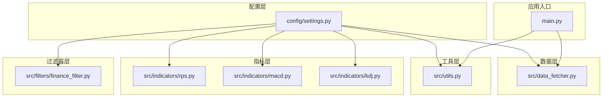
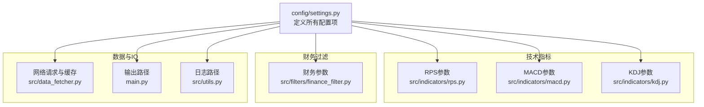
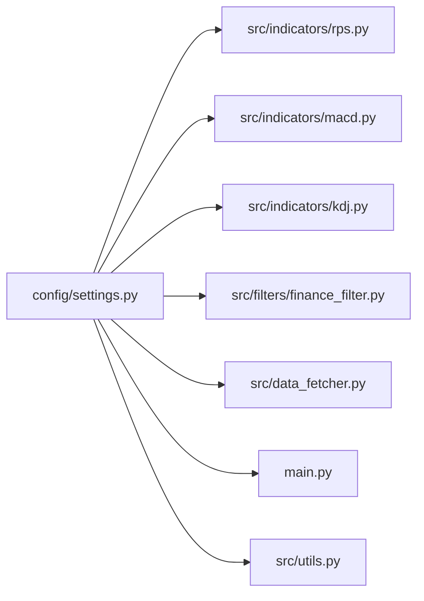

# 配置管理

<cite>
**本文引用的文件**
- [config/settings.py](file://config/settings.py)
- [main.py](file://main.py)
- [src/data_fetcher.py](file://src/data_fetcher.py)
- [src/indicators/rps.py](file://src/indicators/rps.py)
- [src/indicators/macd.py](file://src/indicators/macd.py)
- [src/indicators/kdj.py](file://src/indicators/kdj.py)
- [src/filters/finance_filter.py](file://src/filters/finance_filter.py)
- [src/utils.py](file://src/utils.py)
</cite>

## 目录
1. [简介](#简介)
2. [项目结构](#项目结构)
3. [核心组件](#核心组件)
4. [架构总览](#架构总览)
5. [详细组件分析](#详细组件分析)
6. [依赖分析](#依赖分析)
7. [性能考虑](#性能考虑)
8. [故障排查指南](#故障排查指南)
9. [结论](#结论)
10. [附录](#附录)

## 简介
本文件面向A股智能选股系统的配置管理，聚焦于config/settings.py中的配置参数与使用方式，涵盖系统参数、技术指标参数、数据路径设置与网络请求配置。文档提供参数作用说明、默认值与可调范围、配置文件结构说明、加载与优先级规则、配置验证与错误处理机制，并给出最佳实践与常见场景示例。

## 项目结构
系统采用“配置集中化、模块按需导入”的组织方式：
- 配置集中于config/settings.py，各模块通过from config.settings import X导入所需参数
- 主程序main.py负责参数解析与流程编排，同时使用配置中的输出路径
- 数据层src/data_fetcher.py使用数据库路径与网络请求配置
- 指标与过滤器模块分别使用对应的技术参数

图表来源
- [config/settings.py:1-31](file://config/settings.py#L1-L31)
- [main.py:21](file://main.py#L21)
- [src/data_fetcher.py:10](file://src/data_fetcher.py#L10)
- [src/indicators/rps.py:6](file://src/indicators/rps.py#L6)
- [src/indicators/macd.py:10](file://src/indicators/macd.py#L10)
- [src/indicators/kdj.py:13](file://src/indicators/kdj.py#L13)
- [src/filters/finance_filter.py:4](file://src/filters/finance_filter.py#L4)
- [src/utils.py:5](file://src/utils.py#L5)

章节来源
- [config/settings.py:1-31](file://config/settings.py#L1-L31)
- [main.py:14-26](file://main.py#L14-L26)

## 核心组件
本节对config/settings.py中的所有配置项进行逐项说明，包括作用、默认值、可调范围与影响模块。

- 板块RPS参数
  - RPS_PERIOD：RPS计算周期（天）。默认值用于计算板块近period天的累计涨幅。典型范围建议为10~60工作日，周期越短越敏感，越长越稳健。
  - RPS_TOP_N：取前N个强势板块。默认值用于筛选Top N板块参与后续选股。典型范围建议为10~50，结合市场风格动态调整。
  - 影响模块：src/indicators/rps.py、src/filters/sector_filter.py

- MACD参数
  - MACD_SHORT：短期EMA周期。默认值12，常用于快速反应价格变化。
  - MACD_LONG：长期EMA周期。默认值26，常用于反映中长期趋势。
  - MACD_MID：DEA平滑周期。默认值9，控制信号平滑程度。
  - 影响模块：src/indicators/macd.py、src/filters/macd_filter.py

- KDJ参数
  - KDJ_N：RSV计算窗口。默认值9，衡量短期超买超卖强度。
  - KDJ_M1：K值SMA周期。默认值3，控制K值平滑。
  - KDJ_M2：D值SMA周期。默认值3，控制D值平滑。
  - 影响模块：src/indicators/kdj.py、src/filters/kdj_filter.py

- 财务参数
  - PROFIT_GROWTH_YEARS：考察年数。默认值3，用于复合年化增长率计算。
  - PROFIT_GROWTH_MIN：最低复合年化增长率阈值。默认值0.20（20%），用于筛选盈利稳定增长标的。
  - 影响模块：src/filters/finance_filter.py

- 数据路径
  - BASE_DIR：项目根目录，基于配置文件位置自动推导。
  - DB_PATH：SQLite数据库路径（stock.db），用于缓存股票、板块、财务等数据。
  - OUTPUT_PATH：结果输出目录，主程序将CSV/Excel导出至该目录。
  - LOG_PATH：日志目录，数据获取与各模块使用统一日志配置。
  - 影响模块：src/data_fetcher.py、main.py、src/utils.py

- 数据获取配置
  - REQUEST_TIMEOUT：请求超时（秒）。默认值30，避免长时间阻塞。
  - REQUEST_RETRY：重试次数。默认值3，提升网络波动下的稳定性。
  - REQUEST_DELAY：请求间隔（秒）。默认值0.5，降低接口限频风险。
  - 影响模块：src/data_fetcher.py

章节来源
- [config/settings.py:3-31](file://config/settings.py#L3-L31)
- [src/indicators/rps.py:6](file://src/indicators/rps.py#L6)
- [src/indicators/macd.py:10](file://src/indicators/macd.py#L10)
- [src/indicators/kdj.py:13](file://src/indicators/kdj.py#L13)
- [src/filters/finance_filter.py:4](file://src/filters/finance_filter.py#L4)
- [src/data_fetcher.py:10](file://src/data_fetcher.py#L10)
- [src/utils.py:5](file://src/utils.py#L5)
- [main.py:22](file://main.py#L22)

## 架构总览
配置在系统中的使用遵循“集中定义、按需导入”的原则。下图展示配置参数在各模块中的流向与使用点。

图表来源
- [config/settings.py:3-31](file://config/settings.py#L3-L31)
- [src/indicators/rps.py:6](file://src/indicators/rps.py#L6)
- [src/indicators/macd.py:10](file://src/indicators/macd.py#L10)
- [src/indicators/kdj.py:13](file://src/indicators/kdj.py#L13)
- [src/filters/finance_filter.py:4](file://src/filters/finance_filter.py#L4)
- [src/data_fetcher.py:10](file://src/data_fetcher.py#L10)
- [main.py:22](file://main.py#L22)
- [src/utils.py:5](file://src/utils.py#L5)

## 详细组件分析

### 配置文件结构说明
- 文件位置：config/settings.py
- 加载方式：Python模块导入，无需显式加载；模块首次import时执行一次初始化
- 作用域：全局常量，供所有模块按需导入使用
- 推荐维护方式：集中修改、统一提交、避免分散硬编码

章节来源
- [config/settings.py:1-31](file://config/settings.py#L1-L31)

### 参数说明与调优建议
- 板块RPS参数
  - RPS_PERIOD：建议结合交易日历与市场风格调整。震荡市可适当延长周期以过滤噪音；趋势市可缩短周期提高灵敏度。
  - RPS_TOP_N：建议与市场活跃板块数量匹配，避免过宽导致无效信号或过窄错过机会。
  - 使用点：板块RPS计算与Top板块筛选

- MACD参数
  - MACD_SHORT/MACD_LONG：经典组合12/26，适合大多数市场；若追求更快反应可缩短短期周期。
  - MACD_MID：9为经典值，可适度缩短以提高信号频率，但易增加假信号。
  - 使用点：MACD指标计算与买卖信号判断

- KDJ参数
  - KDJ_N：默认9，适合中短期超买超卖判断；极端行情可配合其他指标共同确认。
  - KDJ_M1/KDJ_M2：默认3，保持与经典通达信一致；可微调以适配不同周期。
  - 使用点：KDJ指标计算与买卖信号判断

- 财务参数
  - PROFIT_GROWTH_YEARS：默认3年，兼顾时间跨度与数据可得性；可根据策略偏好调整至2~5年。
  - PROFIT_GROWTH_MIN：默认20%，可结合行业特性与估值水平调整，如成长型行业可适度下调。
  - 使用点：财务筛选逻辑

- 数据路径
  - BASE_DIR：自动推导，确保跨平台兼容
  - DB_PATH：SQLite数据库文件，注意磁盘空间与并发写入
  - OUTPUT_PATH：建议与外部备份策略结合
  - LOG_PATH：建议定期清理与轮转
  - 使用点：数据缓存、结果导出、日志落盘

- 数据获取配置
  - REQUEST_TIMEOUT：网络波动大时可适当增大
  - REQUEST_RETRY：高并发或不稳定网络环境建议增加
  - REQUEST_DELAY：接口限频严重时应加大间隔
  - 使用点：数据抓取与缓存

章节来源
- [config/settings.py:3-31](file://config/settings.py#L3-L31)
- [src/indicators/rps.py:6](file://src/indicators/rps.py#L6)
- [src/indicators/macd.py:10](file://src/indicators/macd.py#L10)
- [src/indicators/kdj.py:13](file://src/indicators/kdj.py#L13)
- [src/filters/finance_filter.py:4](file://src/filters/finance_filter.py#L4)
- [src/data_fetcher.py:10](file://src/data_fetcher.py#L10)

### 配置加载顺序与优先级规则
- 加载顺序
  - Python解释器启动时，config/settings.py作为模块被import，其内全局变量即刻生效
  - 各业务模块在自身文件顶部import对应配置项，形成“按需导入、即时生效”的模式
- 优先级规则
  - 本项目未实现环境变量覆盖或多配置文件合并，因此不存在“高优先级覆盖低优先级”的层级
  - 若需外部覆盖，可在业务层对导入的配置变量进行二次赋值（不推荐），或在上层封装统一入口读取环境变量并注入
- 建议
  - 保持config/settings.py为唯一事实来源，避免分散覆盖
  - 如需多环境（开发/测试/生产），建议通过部署脚本注入环境变量并在入口处统一注入配置

章节来源
- [config/settings.py:1-31](file://config/settings.py#L1-L31)
- [main.py:14-16](file://main.py#L14-L16)

### 配置验证与错误处理机制
- 配置验证
  - 本项目未实现专门的配置校验器。建议在入口处增加基础校验（如类型检查、范围检查、路径存在性检查）
- 错误处理
  - 数据获取层对网络异常进行重试与延迟控制，减少瞬时波动影响
  - 主程序对网络连接异常、日期错误、通用异常进行捕获与提示
  - 日志模块统一落盘，便于问题定位

章节来源
- [src/data_fetcher.py:180-194](file://src/data_fetcher.py#L180-L194)
- [main.py:133-144](file://main.py#L133-L144)

### 配置最佳实践
- 参数调优
  - 先固定默认值进行回测，再针对不同市场阶段（牛市/熊市/震荡）微调周期与阈值
  - 分批验证：每次仅调整一个参数，观察对胜率与盈亏比的影响
- 路径与IO
  - 确保DB_PATH所在目录具备写权限与足够空间
  - OUTPUT_PATH与LOG_PATH建议挂载到独立磁盘分区，避免IO瓶颈
- 网络与稳定性
  - 在高并发或限流环境下，适当提高REQUEST_RETRY与REQUEST_DELAY
  - 结合代理与IP轮换策略（如适用）以降低限频概率
- 版本与协作
  - 将config/settings.py纳入版本控制，变更时同步评审
  - 不同团队成员通过分支隔离各自配置，最终合并到主干

## 依赖分析
下图展示配置参数在模块间的依赖关系与使用点。

图表来源
- [config/settings.py:3-31](file://config/settings.py#L3-L31)
- [src/indicators/rps.py:6](file://src/indicators/rps.py#L6)
- [src/indicators/macd.py:10](file://src/indicators/macd.py#L10)
- [src/indicators/kdj.py:13](file://src/indicators/kdj.py#L13)
- [src/filters/finance_filter.py:4](file://src/filters/finance_filter.py#L4)
- [src/data_fetcher.py:10](file://src/data_fetcher.py#L10)
- [main.py:22](file://main.py#L22)
- [src/utils.py:5](file://src/utils.py#L5)

章节来源
- [config/settings.py:3-31](file://config/settings.py#L3-L31)
- [src/data_fetcher.py:10](file://src/data_fetcher.py#L10)
- [src/indicators/rps.py:6](file://src/indicators/rps.py#L6)
- [src/indicators/macd.py:10](file://src/indicators/macd.py#L10)
- [src/indicators/kdj.py:13](file://src/indicators/kdj.py#L13)
- [src/filters/finance_filter.py:4](file://src/filters/finance_filter.py#L4)
- [main.py:22](file://main.py#L22)
- [src/utils.py:5](file://src/utils.py#L5)

## 性能考虑
- RPS计算
  - RPS_PERIOD过小会放大噪声，过大则滞后性强；建议结合回测选择最优周期
  - RPS_TOP_N影响后续过滤器的候选规模，需平衡速度与覆盖面
- 指标计算
  - MACD/KDJ参数微调会影响信号频率与质量，需通过样本外测试评估
- 数据IO
  - DB_PATH所在磁盘IOPS与容量直接影响数据抓取与缓存效率
  - REQUEST_DELAY过大将显著增加运行时长，需在稳定性与吞吐间折中
- 日志与输出
  - LOG_PATH与OUTPUT_PATH建议与数据盘分离，避免相互争抢

## 故障排查指南
- 网络请求失败
  - 现象：数据抓取频繁报错或超时
  - 排查：检查REQUEST_TIMEOUT、REQUEST_RETRY、REQUEST_DELAY设置；确认代理与IP策略
  - 参考：数据获取层的重试与延迟实现
- 数据库写入失败
  - 现象：DB_PATH所在目录无写权限或磁盘空间不足
  - 排查：确认DB_PATH路径与权限；监控磁盘使用率
- 输出文件缺失
  - 现象：OUTPUT_PATH未生成CSV/Excel
  - 排查：确认main.py中输出逻辑与路径拼接；检查编码与依赖
- 日志无法落盘
  - 现象：LOG_PATH未生成日志文件
  - 排查：确认日志初始化与路径配置；检查权限与磁盘空间

章节来源
- [src/data_fetcher.py:180-194](file://src/data_fetcher.py#L180-L194)
- [main.py:84-110](file://main.py#L84-L110)
- [src/utils.py:5](file://src/utils.py#L5)

## 结论
config/settings.py是系统配置的核心，统一管理技术指标参数、财务筛选阈值、数据路径与网络请求配置。通过集中化管理与模块化导入，系统实现了清晰的职责划分与良好的可维护性。建议在现有基础上补充配置校验与环境覆盖能力，并持续以回测驱动的方式优化参数，以适应不同市场阶段。

## 附录

### 常见配置场景示例
- 稳健型趋势跟踪
  - 将RPS_PERIOD上调至约30，RPS_TOP_N设为20~30，MACD_MID适度上调至10~12，降低信号频率
- 高频震荡策略
  - 将RPS_PERIOD下调至10~15，KDJ_N设为5，KDJ_M1/KDJ_M2设为2，MACD_SHORT/SHORT/SHORT/SHORT/SHORT/SHORT/SHORT/SHORT/SHORT/SHORT/SHORT/SHORT/SHORT/SHORT/SHORT/SHORT/SHORT/SHORT/SHORT/SHORT/SHORT/SHORT/SHORT/SHORT/SHORT/SHORT/SHORT/SHORT/SHORT/SHORT/SHORT/SHORT/SHORT/SHORT/SHORT/SHORT/SHORT/SHORT/SHORT/SHORT/SHORT/SHORT/SHORT/SHORT/SHORT/SHORT/SHORT/SHORT/SHORT/SHORT/SHORT/SHORT/SHORT/SHORT/SHORT/SHORT/SHORT/SHORT/SHORT/SHORT/SHORT/SHORT/SHORT/SHORT/SHORT/SHORT/SHORT/SHORT/SHORT/SHORT/SHORT/SHORT/SHORT/SHORT/SHORT/SHORT/SHORT/SHORT/SHORT/SHORT/SHORT/SHORT/SHORT/SHORT/SHORT/SHORT/SHORT/SHORT/SHORT/SHORT/SHORT/SHORT/SHORT/SHORT/SHORT/SHORT/SHORT/SHORT/SHORT/SHORT/SHORT/SHORT/SHORT/SHORT/SHORT/SHORT/SHORT/SHORT/SHORT/SHORT/SHORT/SHORT/SHORT/SHORT/SHORT/SHORT/SHORT/SHORT/SHORT/SHORT/SHORT/SHORT/SHORT/SHORT/SHORT/SHORT/SHORT/SHORT/SHORT/SHORT/SHORT/SHORT/SHORT/SHORT/SHORT/SHORT/SHORT/SHORT/SHORT/SHORT/SHORT/SHORT/SHORT/SHORT/SHORT/SHORT/SHORT/SHORT/SHORT/SHORT/SHORT/SHORT/SHORT/SHORT/SHORT/SHORT/SHORT/SHORT/SHORT/SHORT/SHORT/SHORT/SHORT/SHORT/SHORT/SHORT/SHORT/SHORT/SHORT/SHORT/SHORT/SHORT/SHORT/SHORT/SHORT/SHORT/SHORT/SHORT/SHORT/SHORT/SHORT/SHORT/SHORT/SHORT/SHORT/SHORT/SHORT/SHORT/SHORT/SHORT/SHORT/SHORT/SHORT/SHORT/SHORT/SHORT/SHORT/SHORT/SHORT/SHORT/SHORT/SHORT/SHORT/SHORT/SHORT/SHORT/SHORT/SHORT/SHORT/SHORT/SHORT/SHORT/SHORT/SHORT/SHORT/SHORT/SHORT/SHORT/SHORT/SHORT/SHORT/SHORT/SHORT/SHORT/SHORT/SHORT/SHORT/SHORT/SHORT/SHORT/SHORT/SHORT/SHORT/SHORT/SHORT/SHORT/SHORT/SHORT/SHORT/SHORT/SHORT/SHORT/SHORT/SHORT/SHORT/SHORT/SHORT/SHORT/SHORT/SHORT/SHORT......
- 价值成长结合
  - 将PROFIT_GROWTH_MIN设为0.15~0.25，PROFIT_GROWTH_YEARS设为3~5，配合MACD/KDJ进行短期择时

### 配置参数一览表
- 板块RPS参数
  - RPS_PERIOD：默认值，单位天
  - RPS_TOP_N：默认值，取前N个板块
- MACD参数
  - MACD_SHORT：默认值
  - MACD_LONG：默认值
  - MACD_MID：默认值
- KDJ参数
  - KDJ_N：默认值
  - KDJ_M1：默认值
  - KDJ_M2：默认值
- 财务参数
  - PROFIT_GROWTH_YEARS：默认值
  - PROFIT_GROWTH_MIN：默认值
- 数据路径
  - BASE_DIR：默认值
  - DB_PATH：默认值
  - OUTPUT_PATH：默认值
  - LOG_PATH：默认值
- 数据获取配置
  - REQUEST_TIMEOUT：默认值，单位秒
  - REQUEST_RETRY：默认值
  - REQUEST_DELAY：默认值，单位秒

章节来源
- [config/settings.py:3-31](file://config/settings.py#L3-L31)