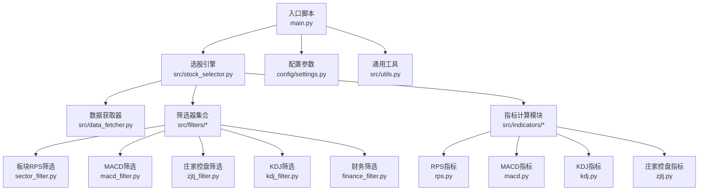
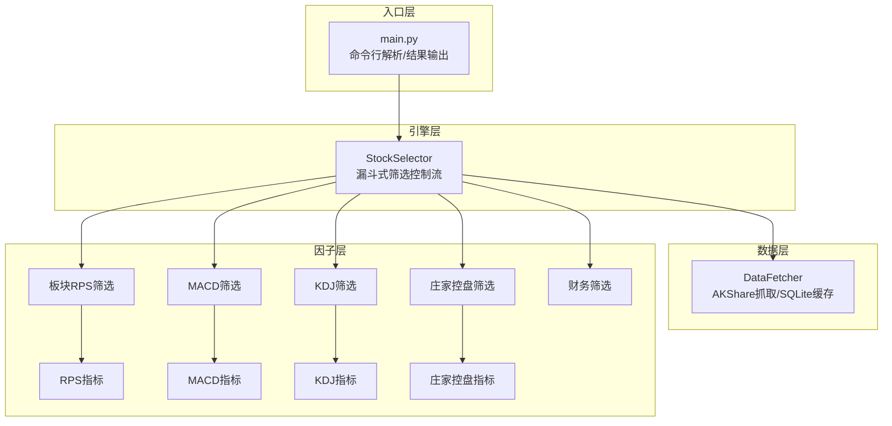
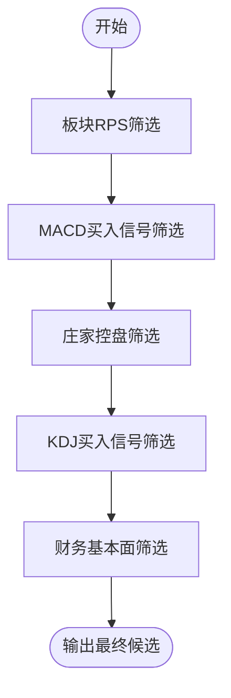
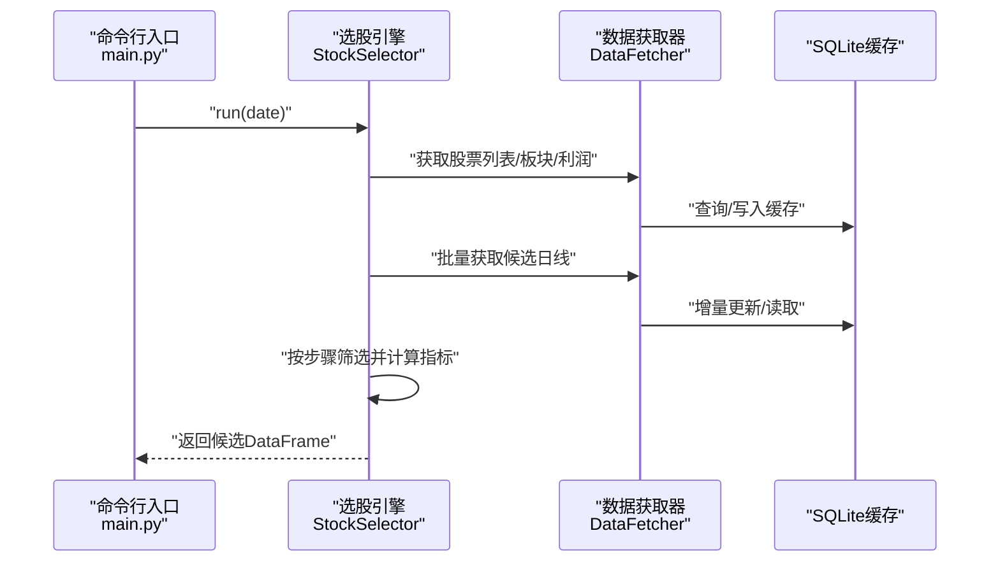
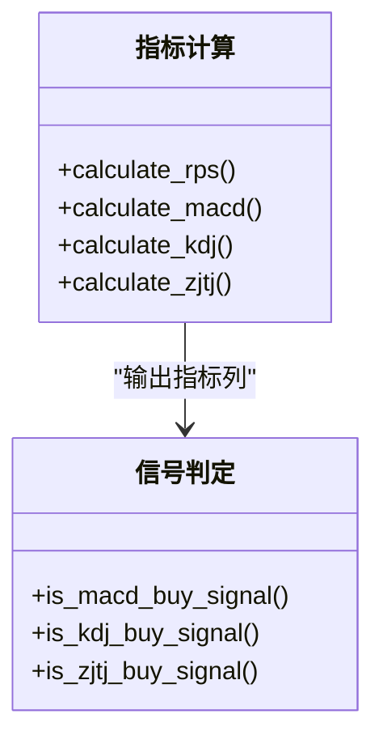
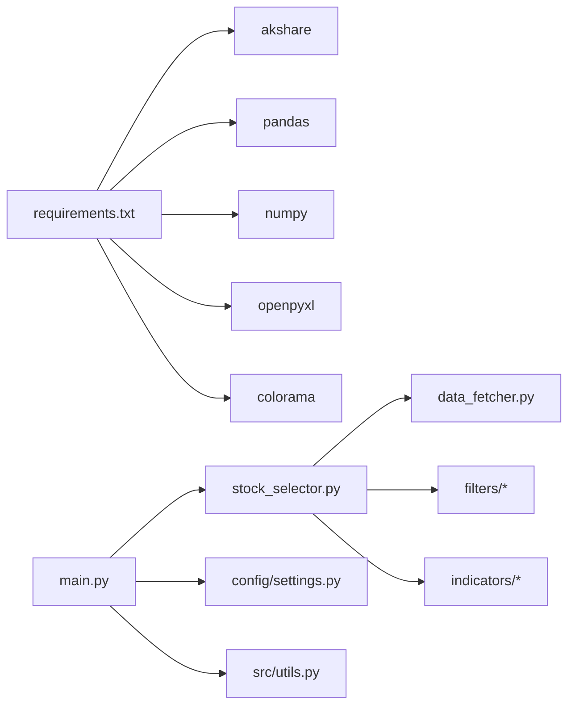

# 项目概述

<cite>
**本文引用的文件**
- [main.py](file://main.py)
- [stock_selector.py](file://src/stock_selector.py)
- [data_fetcher.py](file://src/data_fetcher.py)
- [settings.py](file://config/settings.py)
- [utils.py](file://src/utils.py)
- [sector_filter.py](file://src/filters/sector_filter.py)
- [macd_filter.py](file://src/filters/macd_filter.py)
- [zjtj_filter.py](file://src/filters/zjtj_filter.py)
- [kdj_filter.py](file://src/filters/kdj_filter.py)
- [finance_filter.py](file://src/filters/finance_filter.py)
- [rps.py](file://src/indicators/rps.py)
- [macd.py](file://src/indicators/macd.py)
- [kdj.py](file://src/indicators/kdj.py)
- [zjtj.py](file://src/indicators/zjtj.py)
- [requirements.txt](file://requirements.txt)
</cite>

## 目录
1. [简介](#简介)
2. [项目结构](#项目结构)
3. [核心组件](#核心组件)
4. [架构总览](#架构总览)
5. [详细组件分析](#详细组件分析)
6. [依赖分析](#依赖分析)
7. [性能考虑](#性能考虑)
8. [故障排查指南](#故障排查指南)
9. [结论](#结论)
10. [附录](#附录)

## 简介
本项目是一个面向A股市场的“智能选股系统”，采用“漏斗式五步筛选”策略，结合技术面指标、资金面信号与基本面分析，对海量股票进行高效过滤，最终输出具备高胜率特征的候选池。系统以可配置参数为核心，支持板块轮动、MACD/KDJ金叉、庄家控盘信号以及净利润复合增速等多维因子，既适合初学者快速上手，也为有经验的开发者提供了清晰的扩展点。

- 核心目标
  - 通过系统化的多因子筛选，降低选股噪音，提升潜在收益概率
  - 提供可复现、可追踪、可扩展的自动化选股流水线
  - 支持灵活的参数配置与输出格式，便于集成到交易体系

- 主要特性
  - 漏斗式五步筛选：板块RPS → 技术面MACD/ZJTJ → 技术面KDJ → 基本面财务筛选
  - 数据层：基于AKShare的实时抓取与SQLite本地缓存，支持增量更新与重试机制
  - 输出：终端彩色表格、CSV与Excel文件，便于二次处理与回测

- 技术优势
  - 指标实现严格遵循通达信公式，保证与市场主流软件一致
  - 模块化设计：筛选器与指标解耦，便于替换与扩展
  - 性能优化：仅对候选集计算技术指标，减少无效计算

- 适用场景与用户
  - 场景：量化打新、趋势跟踪、板块轮动、事件驱动
  - 用户：个人投资者、量化研究者、策略工程师、交易员

- 预期收益
  - 通过降低错误交易频率与提高信号质量，提升长期胜率与风险调整收益
  - 本项目旨在提供稳健的信号来源与可验证的流程，具体收益因市场环境而异

## 项目结构
项目采用“入口脚本 → 引擎 → 数据层 → 筛选器/指标”的分层组织方式，核心文件如下：

图表来源
- [main.py:112-161](file://main.py#L112-L161)
- [stock_selector.py:45-186](file://src/stock_selector.py#L45-L186)
- [data_fetcher.py:140-151](file://src/data_fetcher.py#L140-L151)
- [sector_filter.py:11-73](file://src/filters/sector_filter.py#L11-L73)
- [macd_filter.py:9-46](file://src/filters/macd_filter.py#L9-L46)
- [zjtj_filter.py:9-46](file://src/filters/zjtj_filter.py#L9-L46)
- [kdj_filter.py:9-51](file://src/filters/kdj_filter.py#L9-L51)
- [finance_filter.py:10-91](file://src/filters/finance_filter.py#L10-L91)
- [rps.py:9-61](file://src/indicators/rps.py#L9-L61)
- [macd.py:13-67](file://src/indicators/macd.py#L13-L67)
- [kdj.py:45-110](file://src/indicators/kdj.py#L45-L110)
- [zjtj.py:13-57](file://src/indicators/zjtj.py#L13-L57)
- [settings.py:1-31](file://config/settings.py#L1-L31)
- [utils.py:9-31](file://src/utils.py#L9-L31)

章节来源
- [main.py:112-161](file://main.py#L112-L161)
- [stock_selector.py:45-186](file://src/stock_selector.py#L45-L186)
- [data_fetcher.py:140-151](file://src/data_fetcher.py#L140-L151)

## 核心组件
- 入口脚本（main.py）
  - 解析命令行参数（日期、强制更新、输出路径）
  - 调用选股引擎执行流程，负责结果打印与持久化
  - 统一异常处理与用户提示

- 选股引擎（StockSelector）
  - 实现“漏斗式五步筛选”的串联控制流
  - 负责日期范围确定、候选集构建、技术指标计算与结果组装
  - 支持强制更新模式，清空日线缓存

- 数据获取器（DataFetcher）
  - 基于AKShare抓取A股股票列表、日线行情、板块列表/成分股/日线、年度利润数据
  - SQLite本地缓存，支持增量更新与重试机制
  - 提供上下文管理与事务安全

- 筛选器（filters/*）
  - 板块RPS筛选：热门板块内的股票集合
  - MACD筛选：MACD金叉/多头排列
  - 庄家控盘筛选：控盘度上升且为正值
  - KDJ筛选：K线下穿D或J转正
  - 财务筛选：净利润连续增长且复合增速达标

- 指标模块（indicators/*）
  - RPS：板块相对强度排名
  - MACD：DIF/DEA/MACD柱
  - KDJ：RSV/K/D/J
  - ZJTJ：庄家控盘度

- 配置与工具（config/settings.py, src/utils.py）
  - 参数集中管理（周期、阈值、路径、请求策略）
  - 日志、日期与表格格式化工具

章节来源
- [main.py:29-52](file://main.py#L29-L52)
- [main.py:112-161](file://main.py#L112-L161)
- [stock_selector.py:21-310](file://src/stock_selector.py#L21-L310)
- [data_fetcher.py:140-608](file://src/data_fetcher.py#L140-L608)
- [settings.py:1-31](file://config/settings.py#L1-L31)
- [utils.py:9-134](file://src/utils.py#L9-L134)

## 架构总览
系统采用“入口脚本 → 引擎 → 数据层 → 筛选器/指标”的分层架构，数据流自上而下逐层收敛，形成稳定的漏斗式筛选链路。

图表来源
- [main.py:112-161](file://main.py#L112-L161)
- [stock_selector.py:45-186](file://src/stock_selector.py#L45-L186)
- [data_fetcher.py:205-555](file://src/data_fetcher.py#L205-L555)
- [sector_filter.py:11-73](file://src/filters/sector_filter.py#L11-L73)
- [macd_filter.py:9-46](file://src/filters/macd_filter.py#L9-L46)
- [zjtj_filter.py:9-46](file://src/filters/zjtj_filter.py#L9-L46)
- [kdj_filter.py:9-51](file://src/filters/kdj_filter.py#L9-L51)
- [finance_filter.py:10-91](file://src/filters/finance_filter.py#L10-L91)
- [rps.py:9-61](file://src/indicators/rps.py#L9-L61)
- [macd.py:13-67](file://src/indicators/macd.py#L13-L67)
- [kdj.py:45-110](file://src/indicators/kdj.py#L45-L110)
- [zjtj.py:13-57](file://src/indicators/zjtj.py#L13-L57)

## 详细组件分析

### 漏斗式五步筛选策略
系统将筛选过程分为五个步骤，逐步缩小候选范围，确保每一步都基于明确的信号与阈值：

1) 板块RPS筛选
   - 目的：识别近期强势板块，锁定板块热度高的股票池
   - 关键点：计算板块近N日涨幅并排名，取前Top N板块，汇总其成分股
   - 依赖：板块列表、板块日线、RPS指标

2) MACD买入信号筛选
   - 目的：捕捉短期多头排列与金叉信号
   - 关键点：DIF/DEA同为正值且DIF向上突破DEA，或MACD柱由绿变红
   - 依赖：日线close序列、MACD指标

3) 庄家控盘筛选
   - 目的：识别庄家介入迹象，关注筹码集中度提升
   - 关键点：控盘度连续两日上升且大于零
   - 依赖：日线close序列、庄家控盘指标

4) KDJ买入信号筛选
   - 目的：捕捉短期超卖反弹与金叉信号
   - 关键点：K线下穿D（K<30且金叉）或J由负转正
   - 依赖：日线high/low/close序列、KDJ指标

5) 财务基本面筛选
   - 目的：剔除业绩不佳或增长乏力的公司
   - 关键点：净利润连续为正、同比正增长、复合年化增长率≥阈值
   - 依赖：年度净利润数据、财务筛选逻辑

图表来源
- [stock_selector.py:45-186](file://src/stock_selector.py#L45-L186)
- [sector_filter.py:11-73](file://src/filters/sector_filter.py#L11-L73)
- [macd_filter.py:9-46](file://src/filters/macd_filter.py#L9-L46)
- [zjtj_filter.py:9-46](file://src/filters/zjtj_filter.py#L9-L46)
- [kdj_filter.py:9-51](file://src/filters/kdj_filter.py#L9-L51)
- [finance_filter.py:10-91](file://src/filters/finance_filter.py#L10-L91)

章节来源
- [stock_selector.py:45-186](file://src/stock_selector.py#L45-L186)
- [sector_filter.py:11-73](file://src/filters/sector_filter.py#L11-L73)
- [macd_filter.py:9-46](file://src/filters/macd_filter.py#L9-L46)
- [zjtj_filter.py:9-46](file://src/filters/zjtj_filter.py#L9-L46)
- [kdj_filter.py:9-51](file://src/filters/kdj_filter.py#L9-L51)
- [finance_filter.py:10-91](file://src/filters/finance_filter.py#L10-L91)

### 数据流架构
- 数据来源
  - 股票列表与日线：通过AKShare抓取并写入SQLite
  - 板块列表/成分股/日线：板块维度行情与成分股映射
  - 年度利润：提取归母净利润并缓存为年序列

- 缓存策略
  - 增量更新：按股票与日期范围对比缓存，仅拉取缺失区间
  - 事务安全：上下文管理器封装游标，异常自动回滚
  - 重试与延时：统一包装请求，避免接口限频

- 引擎数据准备
  - 仅对上一步筛选后的候选股票批量获取日线，减少IO与计算
  - 指标计算在候选集内并行化（循环内逐股票）

图表来源
- [main.py:112-161](file://main.py#L112-L161)
- [stock_selector.py:45-186](file://src/stock_selector.py#L45-L186)
- [data_fetcher.py:205-555](file://src/data_fetcher.py#L205-L555)

章节来源
- [data_fetcher.py:140-608](file://src/data_fetcher.py#L140-L608)
- [stock_selector.py:100-186](file://src/stock_selector.py#L100-L186)

### 技术指标与信号判定
- RPS（板块相对强度）
  - 计算方式：取近N日收盘价涨跌幅并排名
  - 用途：筛选热门板块，作为第一步候选来源

- MACD（平滑异同移动平均）
  - 计算方式：短均线EMA减长均线EMA，再对差值求EMA
  - 信号：DIF/DEA同正且上穿，或MACD柱由绿转红

- KDJ（随机指标）
  - 计算方式：RSV=（C-L9)/(H9-L9)*100，K=SMA(RSV,M1), D=SMA(K,M2), J=3K-2D
  - 信号：K下穿D（K<30且金叉），或J由负转正

- 庄家控盘（ZJTJ）
  - 计算方式：VAR1=EMA(EMA(CLOSE,9),9)，控盘=(VAR1-REF(VAR1,1))/REF(VAR1,1)*1000
  - 信号：控盘度连续两日上升且>0

图表来源
- [rps.py:9-61](file://src/indicators/rps.py#L9-L61)
- [macd.py:13-67](file://src/indicators/macd.py#L13-L67)
- [kdj.py:45-110](file://src/indicators/kdj.py#L45-L110)
- [zjtj.py:13-57](file://src/indicators/zjtj.py#L13-L57)

章节来源
- [rps.py:9-61](file://src/indicators/rps.py#L9-L61)
- [macd.py:13-67](file://src/indicators/macd.py#L13-L67)
- [kdj.py:45-110](file://src/indicators/kdj.py#L45-L110)
- [zjtj.py:13-57](file://src/indicators/zjtj.py#L13-L57)

## 依赖分析
- 外部依赖
  - akshare：A股行情与板块数据抓取
  - pandas/numpy：数据处理与向量化计算
  - openpyxl：Excel导出（可选）
  - colorama：终端彩色输出

- 内部依赖
  - 配置参数集中于settings.py，被引擎、筛选器与指标模块共享
  - utils提供日志、日期与表格格式化等通用能力
  - data_fetcher为唯一数据源，其他模块均通过其接口访问

图表来源
- [requirements.txt:1-5](file://requirements.txt#L1-L5)
- [main.py:112-161](file://main.py#L112-L161)
- [stock_selector.py:45-186](file://src/stock_selector.py#L45-L186)
- [data_fetcher.py:140-151](file://src/data_fetcher.py#L140-L151)
- [settings.py:1-31](file://config/settings.py#L1-L31)
- [utils.py:9-31](file://src/utils.py#L9-L31)

章节来源
- [requirements.txt:1-5](file://requirements.txt#L1-L5)
- [settings.py:1-31](file://config/settings.py#L1-L31)

## 性能考虑
- 数据获取与缓存
  - 增量更新：仅拉取缺失日期区间的日线，显著减少重复IO
  - 批量读取：对候选股票进行分批获取，避免一次性全量拉取
  - 事务安全：异常自动回滚，保证缓存一致性

- 计算优化
  - 仅对候选集计算技术指标，避免对全市场重复计算
  - 向量化运算：pandas/numpy实现滚动窗口与指数平滑，提升速度

- 网络与稳定性
  - 统一重试与延迟策略，降低接口限频风险
  - 异常捕获与日志记录，便于定位问题

- 输出与兼容
  - CSV/Excel双格式输出，便于下游系统接入
  - 终端彩色输出，提升可读性

## 故障排查指南
- 常见问题与处理
  - 网络连接异常：检查网络状态与代理设置，系统会给出明确提示并退出
  - 日期格式错误：确保传入YYYYMMDD格式，否则抛出异常
  - 缺少Excel依赖：安装openpyxl后可正常导出Excel
  - 数据为空：确认AKShare接口可用与缓存表结构正确

- 日志定位
  - 日志文件位于data/logs，包含详细步骤与警告信息
  - 引擎与筛选器均输出筛选前后数量，便于核对流程

- 数据一致性
  - 强制更新模式会清空日线缓存，重新拉取全量数据
  - 增量更新模式会在缓存中查找最大日期，避免重复下载

章节来源
- [main.py:130-144](file://main.py#L130-L144)
- [data_fetcher.py:179-194](file://src/data_fetcher.py#L179-L194)
- [utils.py:9-31](file://src/utils.py#L9-L31)

## 结论
本项目以“漏斗式五步筛选”为核心，融合板块轮动、技术面与资金面信号及财务基本面，构建了可配置、可扩展、可复现的A股智能选股框架。通过严格的指标实现与稳健的数据层设计，系统在保证信号质量的同时兼顾性能与易用性。建议用户结合自身交易体系与风控策略，持续迭代参数与信号组合，以获得更优的实战效果。

## 附录

### 快速开始指南
- 安装依赖
  - 使用提供的依赖清单安装所需包
- 运行方式
  - 默认日期：python main.py
  - 指定日期：python main.py --date YYYYMMDD
  - 强制更新：python main.py --force-update
  - 自定义输出：python main.py --output result.csv
- 输出说明
  - 终端彩色表格展示候选股票与关键指标
  - CSV与Excel文件保存在data/output目录

章节来源
- [requirements.txt:1-5](file://requirements.txt#L1-L5)
- [main.py:29-52](file://main.py#L29-L52)
- [main.py:84-110](file://main.py#L84-L110)